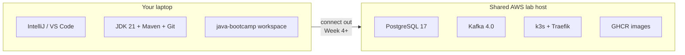

# Java Software Engineer Bootcamp

**Participant lab guides** for the **Java Software Engineer** six-week bootcamp (**no solution keys**) from [Innovation In Software](https://github.com/Innovation-In-Software).

Early-career developers build full-stack enterprise Java skills — from JVM foundations through Spring, Kafka, React, PostgreSQL, DevOps, and a production-style capstone.

| | |
| --- | --- |
| **Audience** | Early-career developers preparing for enterprise Java roles |
| **Format** | 6 weeks · theory + hands-on labs |
| **Through-line project** | Evolving **Customer Management Platform** (CRM) across Labs 1–52 |
| **Repository** | [Innovation-In-Software/bc-sw-engineer-java-participant](https://github.com/Innovation-In-Software/bc-sw-engineer-java-participant) |
| **Cohort env** | Shared AWS host `100.22.136.97` · see [FINAL-SETUP-README](labs/FINAL-SETUP-README.md) |

---

## Start here

1. Read **[Final Lab Environment Setup](labs/FINAL-SETUP-README.md)** — shared host, Postgres / Kafka / k3s / GHCR  
2. Read **[Participant Setup README](labs/PARTICIPANT-SETUP-README.md)** — what you install on the laptop vs what the instructor provides  
3. New to IDEs / Git? Read **[IntelliJ + GitHub — beginner guide](labs/INTELLIJ-AND-GITHUB-BEGINNER-README.md)** — open projects, run Java, commit and push  
4. Skim Week 1 **[IDE conventions](labs/Week%201%20-%20Java%20and%20JVM%20Foundations/_IDE-CONVENTIONS.md)** — **IntelliJ IDEA Community** (primary) and **VS Code** (optional)  
5. Complete **[Lab 0 — Development Environment Setup](labs/Week%201%20-%20Java%20and%20JVM%20Foundations/module-00/lab0/LAB-0-GUIDE.md)** on **your laptop** ([Windows](labs/Week%201%20-%20Java%20and%20JVM%20Foundations/module-00/lab0/LAB-0-WINDOWS.md) · [macOS](labs/Week%201%20-%20Java%20and%20JVM%20Foundations/module-00/lab0/LAB-0-MACOS.md))  
6. Use the **[Lab Index](labs/LABS-INDEX.md)** for Labs 1–52  

**All labs run from your laptop.** Credentials and kubeconfigs are handed out by the instructor — they are **not** stored in this Git repository.

---

## What is in this repository

```text
bc-sw-engineer-java-participant/
├── README.md                 ← You are here (synced from course README.participant.md)
├── labs/                     ← Lab guides and setup docs (no solution/ folders)
│   ├── FINAL-SETUP-README.md
│   ├── PARTICIPANT-SETUP-README.md
│   ├── SETUP-INSTRUCTIONS.md
│   ├── TECHNOLOGY-STACK-GUIDE.md
│   └── Week N - …/module-NN/
│       ├── exercises/        ← Week 1 pre-lab practice (when present)
│       └── labN/             ← Lab guide + Windows/macOS how-tos
└── slides/                   ← Student-facing module slide PDFs
```

**No `solution/` folders** are published here. Complete each lab yourself. Slide PDFs are under [`slides/`](slides/). Editable PPTX decks and instructor notes are provided separately by your instructor.

---

## Program overview

| Week | Theme | Labs | Focus |
| ---- | ----- | ---- | ----- |
| [1](labs/Week%201%20-%20Java%20and%20JVM%20Foundations/) | Java and JVM Foundations | 0–7 | JVM, syntax, OOP, memory, collections, streams, exceptions |
| [2](labs/Week%202%20-%20Backend,%20AI%20Tools%20and%20Testing/) | Backend, AI Tools and Testing | 8–21 | Maven, Copilot, SOAP, JUnit/Mockito, Selenium, logging |
| [3](labs/Week%203%20-%20Spring%20Framework%20and%20Enterprise%20Patterns/) | Spring Framework and Enterprise Patterns | 22–29 | Spring IoC/Boot/WS, layers, profiles, transactions, security |
| [4](labs/Week%204%20-%20Kafka,%20React,%20PostgreSQL%20and%20Resilience/) | Kafka, React, PostgreSQL and Resilience | 30–39 | Kafka, Resilience4j, React, PostgreSQL, JPA |
| [5](labs/Week%205%20-%20DevOps,%20CI-CD%20and%20OpenShift/) | DevOps, CI/CD and Kubernetes (k3s) | 40–47 | AppSec, Docker, kubectl/k3s, CI/CD, IaC |
| [6](labs/Week%206%20-%20Capstone%20Project/) | Capstone Project | 48–52 | Plan → build → secure/deploy → defense |

Full lab titles: **[labs/LABS-INDEX.md](labs/LABS-INDEX.md)**. Capstone: **[Week 6](labs/Week%206%20-%20Capstone%20Project/WEEK-LABS-INDEX.md)**.

---

## Technology stack

```text
Java 21           Spring Boot 3.x   Spring WS         Spring Security
Maven             JUnit / Mockito   GitHub Copilot    SOAP / REST
Apache Kafka 4.0  React             PostgreSQL 17     Spring Data JPA
Docker            Kubernetes (k3s)  Traefik           GitHub Actions
GHCR              Terraform         Ansible           Resilience4j
SLF4J / Logback   Selenium          VisualVM          Node 22
```

Details: [Technology Stack Guide](labs/TECHNOLOGY-STACK-GUIDE.md).

---

## Training environment (final for this cohort)

Everything heavy runs on **one shared AWS server** (`us-west-2`, IP **`100.22.136.97`**). Students connect **out** from IntelliJ (or optional VS Code) on their laptop. Full write-up: **[labs/FINAL-SETUP-README.md](labs/FINAL-SETUP-README.md)**.



| Shared service | Endpoint | Notes |
| -------------- | -------- | ----- |
| **PostgreSQL 17** | `100.22.136.97:5432` | DB `bootcamp`; per-student role + schema |
| **Apache Kafka 4.0** | `100.22.136.97:9092` | Single shared broker |
| **Kubernetes (k3s)** | `https://100.22.136.97:6443` | Per-student namespace; Traefik on `:80`/`:443` |
| **CI / images** | GitHub Actions + **GHCR** | — |

| You install on the laptop | Instructor provides (Google Sheet / Docs) |
| ------------------------- | ----------------------------------------- |
| **IntelliJ IDEA Community** (primary) · optional VS Code | Credentials row (`studentNN` + password) |
| JDK 21, Maven 3.9.x, Git | JDBC: `jdbc:postgresql://100.22.136.97:5432/bootcamp?currentSchema=studentNN` |
| Node 22 (before Week 4) | Kafka bootstrap `100.22.136.97:9092` |
| **kubectl** (before Week 5) | Kubeconfig `studentNN.yaml` |
| GitHub + Copilot (as assigned) | GHCR / org guidance |

**Confirmed stack:** PostgreSQL + GitHub Actions + **k3s** (kubectl + Traefik Ingress).

| Weeks | What you need from the env |
| ----- | -------------------------- |
| 0–3 | Laptop tools only |
| 4 | PostgreSQL + Kafka (+ Node 22 for React) |
| 5–6 | Above + k3s namespace + GHCR + GitHub Actions |

Deploy path (Week 5+): **build image → push GHCR → `kubectl apply` into your namespace**.

Reachability requires the **class IP allowlist** (or instructor VPN). Never commit passwords, kubeconfigs, or `.env` files.

---

## Clone and navigate

```bash
git clone https://github.com/Innovation-In-Software/bc-sw-engineer-java-participant.git
cd bc-sw-engineer-java-participant
```

1. Open [`labs/FINAL-SETUP-README.md`](labs/FINAL-SETUP-README.md)  
2. Read [`labs/_PARTICIPANT-FILE-GUIDE.md`](labs/_PARTICIPANT-FILE-GUIDE.md) once (which file when)  
3. Complete Lab 0 ([Windows](labs/Week%201%20-%20Java%20and%20JVM%20Foundations/module-00/lab0/LAB-0-WINDOWS.md) · [macOS](labs/Week%201%20-%20Java%20and%20JVM%20Foundations/module-00/lab0/LAB-0-MACOS.md)) — includes Git identity  
4. Work under `~/java-bootcamp` or `%USERPROFILE%\java-bootcamp`  
5. For each later module: open `module-NN/README.md` (Week 1) → exercises → one OS how-to → `LAB-N-GUIDE.md`. **Lab 1 Step 0** creates your private `java-bootcamp` GitHub repo.

Do not treat `labs/.../solution/` as your working project unless a lab says otherwise.

---

## Support

- Environment → [FINAL-SETUP-README](labs/FINAL-SETUP-README.md) · [Participant Setup](labs/PARTICIPANT-SETUP-README.md) · [Setup Instructions](labs/SETUP-INSTRUCTIONS.md)  
- IDE → [Week 1 IDE conventions](labs/Week%201%20-%20Java%20and%20JVM%20Foundations/_IDE-CONVENTIONS.md)  
- Course operations → your instructor / Innovation In Software classroom channel  

© 2026 Innovation In Software Corporation
