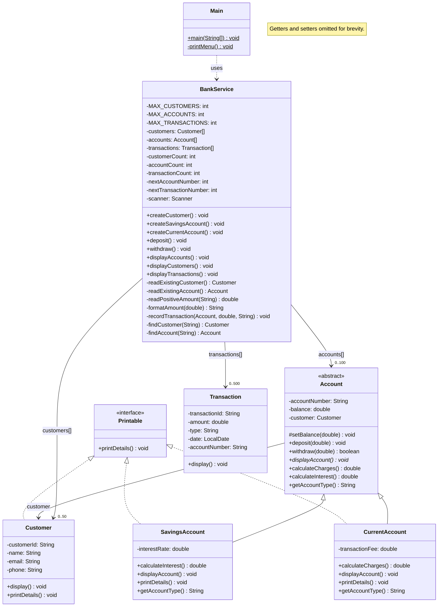

```mermaid
classDiagram
    note "Getters and setters omitted for brevity."

    class Printable {
        <<interface>>
        +printDetails() void
    }
    class Customer {
        -customerId: String
        -name: String
        -email: String
        -phone: String
        +display() void
        +printDetails() void
    }
    class Account {
        <<abstract>>
        -accountNumber: String
        -balance: double
        -customer: Customer
        #setBalance(double) void
        +deposit(double) void
        +withdraw(double) boolean
        +displayAccount()* void
        +calculateCharges() double
        +calculateInterest() double
        +getAccountType() String
    }
    class SavingsAccount {
        -interestRate: double
        +calculateInterest() double
        +displayAccount() void
        +printDetails() void
        +getAccountType() String
    }
    class CurrentAccount {
        -transactionFee: double
        +calculateCharges() double
        +displayAccount() void
        +printDetails() void
        +getAccountType() String
    }
    class Transaction {
        -transactionId: String
        -amount: double
        -type: String
        -date: LocalDate
        -accountNumber: String
        +display() void
    }
    class BankService {
        -MAX_CUSTOMERS: int
        -MAX_ACCOUNTS: int
        -MAX_TRANSACTIONS: int
        -customers: Customer[]
        -accounts: Account[]
        -transactions: Transaction[]
        -customerCount: int
        -accountCount: int
        -transactionCount: int
        -nextAccountNumber: int
        -nextTransactionNumber: int
        -scanner: Scanner
        +createCustomer() void
        +createSavingsAccount() void
        +createCurrentAccount() void
        +deposit() void
        +withdraw() void
        +displayAccounts() void
        +displayCustomers() void
        +displayTransactions() void
        -readExistingCustomer() Customer
        -readExistingAccount() Account
        -readPositiveAmount(String) double
        -formatAmount(double) String
        -recordTransaction(Account, double, String) void
        -findCustomer(String) Customer
        -findAccount(String) Account
    }
    class Main {
        +main(String[])$ void
        -printMenu()$ void
    }

    Printable <|.. Customer
    Printable <|.. SavingsAccount
    Printable <|.. CurrentAccount
    Account <|-- SavingsAccount
    Account <|-- CurrentAccount
    Account --> Customer : customer
    BankService --> "0..50" Customer : customers[]
    BankService --> "0..100" Account : accounts[]
    BankService --> "0..500" Transaction : transactions[]
    Main ..> BankService : uses
```
