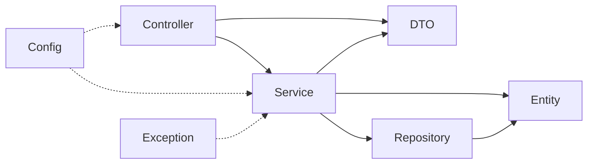

Module 8 Exercise 6 - dependency direction

Dependencies point inward. Controller knows about service, service knows about
repository, repository knows about entity. Nothing points back out. Ex 5's
sequence diagram is the same rule drawn over time instead of over packages.

Intended flow:

STEP 1 - CLASSIFY

| Dependency | Decision | Why |
| ---------- | -------- | --- |
| controller → service | Acceptable | Inward. Request handling delegates the work it doesn't own |
| service → repository | Acceptable | Inward. Business logic asks storage for what it needs |
| repository → entity | Acceptable | Inward. Storage has to speak in domain types |
| entity → controller | Problematic | Domain depends on transport. The entity would break when a URL shape changes |
| repository → controller | Problematic | Persistence depends on presentation. Can't reuse the repository off an HTTP path |
| service → DTO | Needs context | Fine for this lab's manual mapping. Watch it, transport shapes leaking inward is how services end up HTTP-flavoured |
| DTO → repository | Problematic | Boundary model performing storage. A request object should carry data, not save itself |

STEP 2 - CHECK

All seven matched the reference.

The two clear violations are entity → controller and repository → controller.
Both point outward, and both name the same smell: something inner reaching for
something outer.

service → DTO is the one that isn't binary. The service has to produce a
CustomerResponse somewhere, so the dependency exists in this lab by design. It
stops being fine when the DTO starts carrying transport concerns and the service
starts shaping its logic around them.

STEP 3 - THE CYCLE

Bad:

  controller → service → repository → controller

Why it's bad. Changes ripple both directions, so touching the controller can
break the repository and the other way round. No layer can be tested in
isolation, since loading one drags in all three. Ownership goes unclear, nobody
can say which package a rule belongs to. And you can't extract or replace one
package without taking the whole ring with it.

Repair:

  controller → service → repository → entity

The chain now terminates. entity imports nothing outward, so there's an end to
follow to and the cycle is gone.

STEP 4 - ARCHITECTURE RULE

Higher-level request handling may call inward services and repositories.
Domain/entity and repository packages must not import controller classes.

Practical test: open any file under entity/ or repository/ and read the imports.
A com.northstar.crm.controller import means the rule is broken. Cheap to check,
which is the point of writing it down before Lab 8 rather than after.

PASS CRITERIA

| # | Confirm | Notes |
| - | ------- | ----- |
| 1 | Seven dependencies classified | PASS |
| 2 | Cycle is repaired | PASS |
| 3 | Architecture rule is written | PASS |
