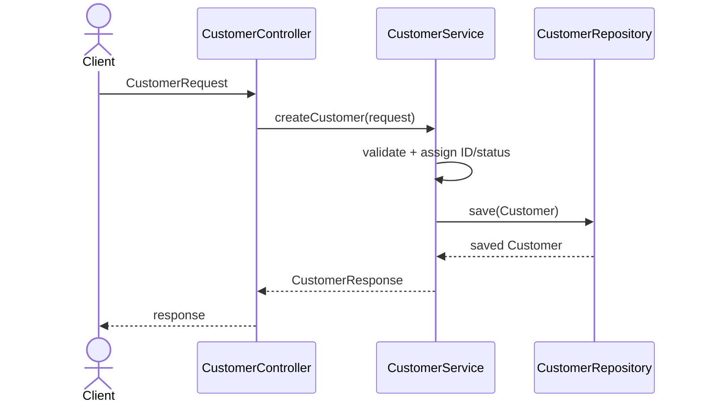
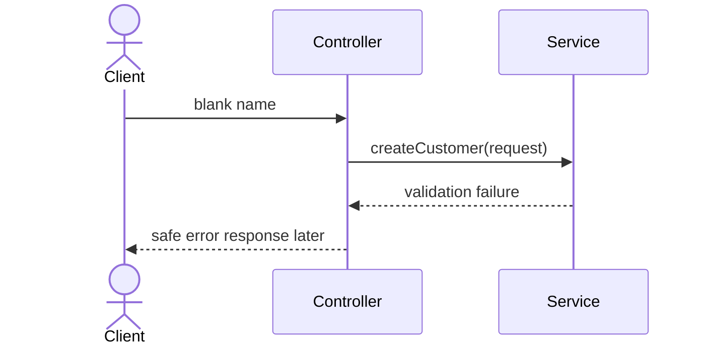

Module 8 Exercise 5 - customer request flow

Structure only. Nothing here is implemented, no HTTP, no database. The point is
knowing which class owns which step before Lab 8 builds the skeleton.

Scenario input:

  Name              Amina Khan
  Email             amina@example.test
  Requested status  ACTIVE
  Correlation ID    lab-request-001

SUCCESS FLOW

All three layers appear and the order never reverses. Controller talks to
service, service talks to repository, nothing skips a layer and nothing calls
back up.

"Requested status: ACTIVE" is input the service decides on, not input it obeys.
CustomerRequest has no status field (Ex 3), so the caller can ask and the service
still assigns.

TRANSFORMATIONS

  boundary                  in                    out
  client -> controller      transport payload     CustomerRequest
  service validation        CustomerRequest       valid domain values
  service -> repository     Customer entity       saved Customer
  service -> controller     saved entity          CustomerResponse

Three types, three shapes, one customer. The object changes at every boundary,
which is the reason the packages are split the way Ex 2 laid out.

The id is the clearest marker. It doesn't exist on the way in, the service
assigns it, and it's there on the way back out.

FAILURE FLOW

Repository never appears. Validation runs before the entity is built, so there's
nothing to save and nothing partial left behind. Same ordering as Account in Lab
7, check before you mutate.

No status codes here on purpose. Mapping failures to 400 or 404 comes later, this
module is structure.

NOW VS LATER

  now
    package names and stub responsibilities
    plain Java types that compile
    documented flow

  later
    Spring controller annotations
    validation annotations
    repository implementation / JPA
    HTTP response mapping
    correlation-ID logging

lab-request-001 is in the scenario but nothing uses it yet. It's there so the
flow has a place for it once logging arrives.

READINESS CHECK

| Readiness check | Result |
| --------------- | ------ |
| I can locate each class package | PASS |
| I can explain controller → service → repository | PASS |
| I distinguish DTO from entity | PASS |
| I have not added Spring/JPA/database code | PASS |
| I am ready to build the full Maven skeleton in Lab 8 | PASS |

PASS CRITERIA

| # | Confirm | Notes |
| - | ------- | ----- |
| 1 | Success flow includes all three layers | PASS |
| 2 | Failure stops before repository | PASS |
| 3 | Request/entity/response transformations are identified | PASS |
| 4 | No premature Spring/JPA implementation appears | PASS |
