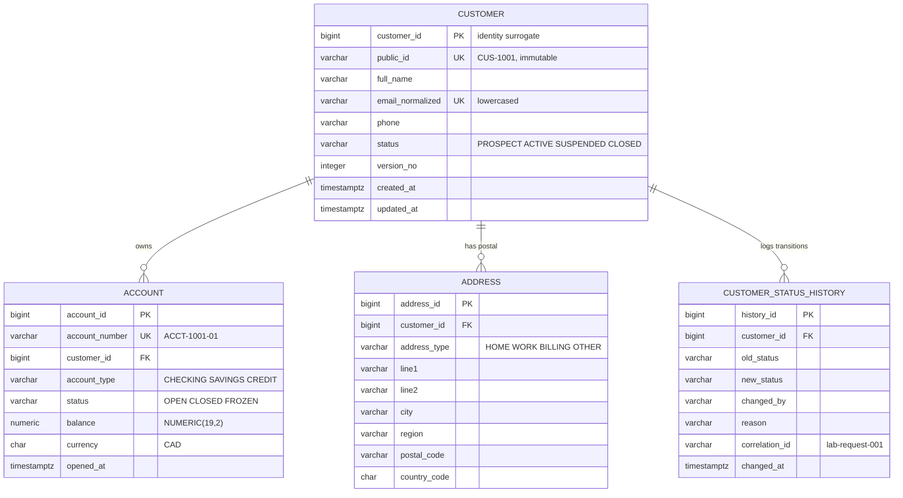

# Lab 37 — CRM ER diagram



## Cardinalities

```text
Customer 1 ---- 0..* Account
Customer 1 ---- 0..* Address
Customer 1 ---- 0..* StatusHistory
```

Zero is the part that matters. Ravi Singh (`CUS-1002`, PROSPECT) has no
account and no address, and the schema has to accept him — a PROSPECT is a
customer the business has not sold anything to yet. Drawing the account
side as mandatory would make onboarding impossible.

## Delete rules

| Child | ON DELETE | Why |
| --- | --- | --- |
| account | RESTRICT | a financial record; deleting the customer must fail loudly, not take balances with it |
| address | CASCADE | only describes its customer, worthless once the customer is gone |
| customer_status_history | CASCADE | same lifetime as the customer, kept while the customer exists |

## Identifiers

| Identifier | Role |
| --- | --- |
| customer_id | identity surrogate PK, joins and FKs only, never shown |
| public_id | immutable business id, `CUS-1001`, what the API and UI carry |
| email_normalized | lowercased unique lookup, changes over a customer's life |
| account_number | unique business account identifier |

Email is never the primary key: people change addresses, and a PK must be
stable. `public_id` is separate from `customer_id` so the surrogate can be
an integer for join performance while the outside world sees a string that
never moves.
