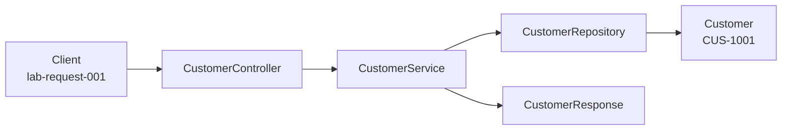

Lab 8 - layer flow for create customer (CUS-1001)

Structure only. None of this runs yet, the stubs throw on purpose. This is the
path a create request takes once Labs 10-12 fill the bodies in.

Scenario input:

  Name              Amina Khan
  Requested status  ACTIVE
  Correlation ID    lab-request-001

FLOW

1. Client sends a create request carrying lab-request-001.
2. CustomerController accepts a CustomerRequest. Input validation lands at this
   boundary later, nothing past the controller should see a malformed payload.
3. CustomerService applies the business rules. It assigns the stable id
   (CUS-1001), decides the status default (ACTIVE), and builds the Customer
   entity. The caller can request a status, the service still decides.
4. CustomerRepository saves the Customer. In-memory list first, PostgreSQL
   later, callers never find out which.
5. A CustomerResponse goes back out with CUS-1001 / ACTIVE. The entity never
   leaves the service layer, so storage shape can't leak into the API.

The id is the clearest marker of the boundaries. It doesn't exist on the way in,
the service assigns it, and it's on the response on the way out.

NOT FOUND

getCustomer("CUS-9999") later throws CustomerNotFoundException from the service
when the repository returns empty. The controller boundary maps it to a safe
error. Repository reports absence, service decides it's a failure.

NOW VS FUTURE

  now
    seven packages, stubs that compile, this document
    Main prints the skeleton banner

  future, out of scope for Lab 8
    Spring MVC mapping HTTP onto CustomerController
    JPA / PostgreSQL behind CustomerRepository
    React SPA calling the API
    Kafka consumers for notification and audit
    lab-request-001 logged on every request
