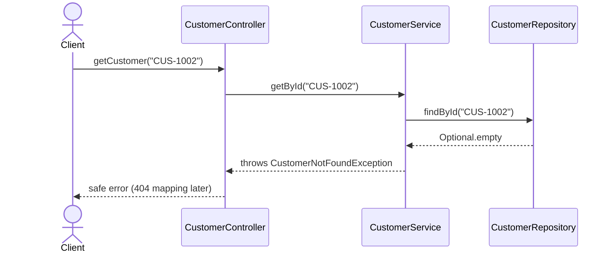

Lab 8 - get customer not found (bonus)

getCustomer("CUS-1002") when Ravi Singh doesn't exist yet. Structure only, the
sequence is the contract for Labs 10-12.

The repository reports absence with Optional.empty, it doesn't throw. Deciding
that absence is a failure is a business call, so the service turns empty into
CustomerNotFoundException("CUS-1002"), message "Customer not found: CUS-1002".
The controller boundary catches and maps to a safe response later, the entity
and repository never know HTTP exists.
