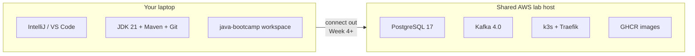

# Java Bootcamp — Final Lab Environment Setup

**Status:** Final / authoritative for this cohort  
**Shared host:** AWS `us-west-2` · IP **`100.22.136.97`**  
**Audience:** Students, instructors, and provisioning

This document is the **final setup README** for the Java Software Engineer Bootcamp lab environment. Use it whenever configuring laptops, labs, or shared connectivity.

Related guides: [PARTICIPANT-SETUP-README](PARTICIPANT-SETUP-README.md) · [SETUP-INSTRUCTIONS](SETUP-INSTRUCTIONS.md) · [Lab 0](Week%201%20-%20Java%20and%20JVM%20Foundations/module-00/lab0/LAB-0-GUIDE.md)

---

## Overview

Everything runs on **one shared server** in AWS (`us-west-2`, IP **`100.22.136.97`**).

Students work from **IntelliJ IDEA Community** (or optional VS Code) on their **laptops** and connect **out** to these services. Nothing for students to install server-side.



---

## Shared services

| Service | Endpoint | Details |
| ------- | -------- | ------- |
| **PostgreSQL 17** | `100.22.136.97:5432` | Database: **`bootcamp`**. Each user gets their own **role + schema** (default `search_path` = their schema). Users cannot see each other’s schemas. |
| **Apache Kafka 4.0** | `100.22.136.97:9092` | Single broker, shared across the cohort (**no** per-user topic isolation). |
| **Kubernetes (k3s)** | API `https://100.22.136.97:6443` | Each user gets their own **namespace** with admin rights in it. **Traefik** Ingress on **:80 / :443**. Locked to their namespace. |
| **Source / CI** | GitHub + **GitHub Actions** | Repos and pipelines |
| **Container images** | **GHCR** | Build image → push GHCR → `kubectl apply` into your namespace. |


---

## What each student receives

One row in the **credentials Google Sheet** + one kubeconfig file (shared via Google Docs / pack):

| Item | Form |
| ---- | ---- |
| **DB** | `jdbc:postgresql://100.22.136.97:5432/bootcamp?currentSchema=studentNN` · user `studentNN` + password |
| **Kafka** | `100.22.136.97:9092` |
| **K8s** | `kubeconfigs/studentNN.yaml` — `kubectl` from the laptop works out of the box |

Point `application.properties` (or local `.env`, never committed) at the endpoints above.

---

## Student laptop (Lab 0)

Install on the laptop:

| Tool | Notes |
| ---- | ----- |
| **IntelliJ IDEA Community** | Primary IDE (SDK 21) |
| Desktop **VS Code** | Optional alternate (+ Java extensions) |
| **JDK 21** | Temurin recommended |
| **Maven 3.9.x** | |
| **Node 22** | Before Week 4 React labs |
| **Git** | |
| **kubectl** | Before Week 5 deploy labs — use your kubeconfig |

**Deploy labs (Week 5+):** build image → push to **GHCR** (or build on the server if instructor directs) → **`kubectl apply`** into your namespace.

Week 1–3 labs need **laptop tools only**. Use PostgreSQL / Kafka from **Week 4+**; use k3s from **Week 5+**.

---

## Instructor / ops access

- Full **AWS account admin** (separate login from provisioning) — resize the box, open ports, restart containers, adjust anything.
- Shell into the box via **EC2 Instance Connect** from the AWS console.
- Students do **not** use SSH or EC2 Instance Connect.

Credentials and YAML packs are delivered via **Google Sheet** (logins) and **Google Docs / files** (student + instructor kubeconfigs). An **instructor account** is included so you can connect and test everything.

---

## Network and sizing notes

- Baseline sized for about **15 concurrent** users on one box (tweak as needed).
- DB and Kafka are **plaintext** on a **firewall-restricted** network (**class IPs only**). Off-network access needs allowlist / VPN updates from the instructor.
- Treat this as a living baseline you can resize and harden with the AWS admin login.

---

## Secrets policy

**Never commit** database passwords, kubeconfig files, AWS keys, or `.env` files to Git. Store them only in the instructor sheet / local untracked config.

**Local instructor pack for this cohort (SWE2) — keep on disk / Google Drive only, not in Git:**

| Local path | Contents |
| ---------- | -------- |
| `labs/Software Engineer_Java Full Stack Bootcamp SWE2 (7-20).xlsx` | Cohort credentials + instructor AWS row |
| `labs/kubeconfigs (swe2)/` | `student01.yaml` … `student16.yaml`, `instructor01.yaml` |

Distribute each student’s sheet row + matching kubeconfig privately. Do not push these folders/files to GitHub.

---

## Quick verification (students)

```bash
# Lab 0 laptop baseline
java -version      # 21.x
javac -version
mvn -version       # 3.9.x
git --version
node --version     # v22.x (before Week 4)

# Week 4+ (use your sheet password — do not commit)
# psql "host=100.22.136.97 dbname=bootcamp user=studentNN ..." -c 'select 1'
# Kafka bootstrap: 100.22.136.97:9092

# Week 5+
kubectl version --client
# KUBECONFIG=path/to/studentNN.yaml kubectl get ns
```

---

© 2026 Innovation In Software Corporation
