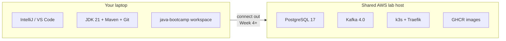

# Participant Setup README

**Program:** Java Software Engineer Bootcamp  
**Audience:** Participants (students) — before Day 1 and throughout Weeks 1–6  
**Provider:** Innovation In Software Corporation  

This README explains **the whole setup you need** to participate successfully: what runs on your laptop, what the instructor hosts centrally, what you install, when each tool is required, and how to prove your environment works.

| Related guide | Use it when you need… |
| ------------- | --------------------- |
| **[Which file do I open?](_PARTICIPANT-FILE-GUIDE.md)** | Sequence per module — GUIDE vs WINDOWS vs exercises vs solution |
| **[IntelliJ + GitHub — beginner guide](INTELLIJ-AND-GITHUB-BEGINNER-README.md)** | First time in IntelliJ: run Java, commit, and push to GitHub |
| **[Final Lab Environment Setup](FINAL-SETUP-README.md)** | **Authoritative** final setup: shared host, Postgres / Kafka / k3s / GHCR |
| **[Lab 0 — Development Environment Setup](Week%201%20-%20Java%20and%20JVM%20Foundations/module-00/lab0/LAB-0-GUIDE.md)** | Step-by-step laptop toolchain install |
| **[Labs Setup Instructions](SETUP-INSTRUCTIONS.md)** | Full version matrix, ports, and lab-by-lab requirements |
| **[Technology Stack Guide](TECHNOLOGY-STACK-GUIDE.md)** | What each tool is and why the course uses it |
| **[Lab Index](LABS-INDEX.md)** | Links to Labs 0–52 (organized by week) |
| **[Course overview](../README.md)** | Program structure and modules |

---

## 1. In one paragraph

You develop on **your laptop** with **IntelliJ IDEA Community** (primary IDE), optional **VS Code**, **JDK 21**, **Maven**, and **Node 22**. Heavy services run on **one shared AWS host** (`100.22.136.97`): **PostgreSQL 17**, **Kafka 4.0**, and **Kubernetes (k3s)** with Traefik. **GitHub** holds your code; **GitHub Actions** runs CI/CD; images go to **GHCR**. Full endpoints: **[FINAL-SETUP-README.md](FINAL-SETUP-README.md)**. Passwords and kubeconfigs come from the instructor’s credentials pack — never from Git.

---

## 2. How the training environment works



| Location | Your job there |
| -------- | -------------- |
| **Laptop** | Edit in VS Code or IntelliJ; compile; `mvn` / `npm`; run Spring Boot and Vite locally; `kubectl` with your kubeconfig; push to GitHub |
| **Shared host** | Persist CRM data (PostgreSQL), publish/consume events (Kafka), deploy Week 5+ into **your k3s namespace** |
| **GitHub / GHCR** | Source control, Copilot, Actions pipelines, container images |

**Golden rule:** Dev tools stay on the laptop. Databases, Kafka, and the cluster are **shared** on `100.22.136.97`. Students never need SSH.

---

## 3. What you receive vs what you create

### Instructor provides (ask if missing)

| Item | When |
| ---- | ---- |
| Credentials **Google Sheet** row (`studentNN` + password) | Week 4+ |
| JDBC: `jdbc:postgresql://100.22.136.97:5432/bootcamp?currentSchema=studentNN` | Week 4+ |
| Kafka bootstrap `100.22.136.97:9092` | Week 4+ |
| Kubeconfig `studentNN.yaml` for `https://100.22.136.97:6443` | Weeks 5–6 |
| GHCR / GitHub org guidance as needed | Weeks 5–6 |
| GitHub organization / repo invite (if used) | Lab 0+ |

### You create / install

| Item | When |
| ---- | ---- |
| **IntelliJ IDEA Community** (primary IDE) | Lab 0 |
| Desktop VS Code + Java extensions (optional) | Lab 0 if preferred |
| OpenJDK 21, Maven 3.9.x, Git | Lab 0 |
| GitHub account + Copilot license | Lab 0 / Week 2 |
| Node.js **22** LTS + npm | Before Week 4 Labs 33+ |
| `kubectl`, Terraform, Ansible (as assigned) | Week 5 |
| Workspace under `~/java-bootcamp` (or Windows equivalent) | Lab 0 |

---

## 4. Laptop requirements (minimum)

| Requirement | Guidance |
| ----------- | -------- |
| OS | Windows 10/11, macOS, or Linux |
| RAM | 16 GB recommended (8 GB minimum if not running local Docker) |
| Disk | ~30 GB free for JDK, Maven cache, Node, and projects |
| Network | Stable internet; outbound HTTPS to Maven Central, npm, GitHub, shared DB/Kafka/cluster |
| Accounts | Personal **GitHub** (Actions used later) |
| Permissions | Ability to install desktop VS Code and JDK/Node |

You do **not** need a personal 16 GB cloud VM just for PostgreSQL/Kafka. Docker is optional and used only when a lab explicitly asks for it.

---

## 5. Laptop baseline (Lab 0 — required for everyone)

Complete **[Lab 0](Week%201%20-%20Java%20and%20JVM%20Foundations/module-00/lab0/LAB-0-GUIDE.md)** before Lab 1. When finished you must have:

| Check | Expected |
| ----- | -------- |
| IntelliJ | IntelliJ IDEA Community (**primary** IDE) — Week 1 [`_IDE-CONVENTIONS.md`](Week%201%20-%20Java%20and%20JVM%20Foundations/_IDE-CONVENTIONS.md) |
| VS Code (optional) | Desktop VS Code with Extension Pack for Java |
| Folder open | `~/java-bootcamp` (or `C:\Users\<you>\java-bootcamp`) |
| Java | OpenJDK **21** — `java -version` / `javac -version` |
| Maven | **3.9.x** — `mvn -version` |
| Git | 2.x — `git --version` |
| `JAVA_HOME` | Points at JDK 21 |
| Smoke test | HelloWorld compiles and runs under `java-bootcamp/examples` |

**Verified Windows reference:** Temurin 21 at `C:\Program Files\Eclipse Adoptium\jdk-21`; Maven 3.9.x at `C:\Program Files\Apache\maven\current`. See [Lab 0](Week%201%20-%20Java%20and%20JVM%20Foundations/module-00/lab0/LAB-0-GUIDE.md) for install steps kept in sync with a clean run.

**Do not start Lab 1 until Lab 0 verification passes and Module 1 Exercises 1–8 are Pass.** Sequence: Lab 0 → Module 1 slides → [`module-01/exercises/`](Week%201%20-%20Java%20and%20JVM%20Foundations/module-01/exercises/EXERCISES-INDEX.md) → then Lab 1.

### Workspace layout you will use

```text
~/java-bootcamp/
├── examples/           # Hands-on projects (HelloJava, module-0N-exercises, jvm-compilation-lab, Lab2-JavaSyntax, Lab3-BankingSystem, …)
└── notes/
    └── screenshots/    # Lab 0 evidence; later labs use screenshots/lab-N/ (redact secrets)
```

**Guides vs code (do not mix):** Course lab guides live in the participant GitHub clone ([`bc-sw-engineer-java-participant`](https://github.com/Innovation-In-Software/bc-sw-engineer-java-participant)) under `labs/` — open them in a browser or second window. Open **`java-bootcamp`** in IntelliJ every lab and put **code only** under `examples/`. (Some cohorts copy guides into `java-bootcamp/labs/` for a single Project pane — that is optional; still write sources under `examples/` only.)

For Module 1: finish `examples/module-01-exercises/` before `examples/jvm-compilation-lab/` (see Module 1 [`README.md`](Week%201%20-%20Java%20and%20JVM%20Foundations/module-01/README.md) smooth path). For Module 2: finish `examples/module-02-exercises/` (Exercises 1–7) before `examples/Lab2-JavaSyntax/`. For Module 3: finish `examples/module-03-exercises/` (Exercises 1–8) before `examples/Lab3-BankingSystem/`. For Module 4: finish `examples/module-04-exercises/` (Exercises 1–7) before `examples/Lab4-MemoryManagement/`. For Module 5: finish `examples/module-05-exercises/` (Exercises 1–7) before `examples/Lab5-LibraryManagement/`. For Module 6: finish `examples/module-06-exercises/` (Exercises 1–7) before `examples/Lab6-EmployeeAnalytics/`. For Module 7: finish `examples/module-07-exercises/` (Exercises 1–8) before `examples/Lab7-ATMSystem/`.

---

## 6. Accounts pass criteria

| Account | When needed | Action |
| ------- | ----------- | ------- |
| GitHub | Week 1+ | Create account; set `git config` with your GitHub **noreply email** (Settings → Emails) so `git push` is not blocked (GH007) |
| GitHub Copilot | Week 2 (Labs 10–12+) | Active subscription on the same GitHub user VS Code uses |
| GitHub Actions | Week 5 (Labs 43–44, 51) | Enabled on your CRM repo |
| GHCR | Week 5+ | Push/pull images per instructor guidance |
| **k3s** (kubeconfig) | Week 5–6 | Use only your `studentNN.yaml` — never commit it |
| Shared PostgreSQL | Week 4+ | Sheet credentials for `100.22.136.97:5432` / DB `bootcamp` |
| Shared Kafka | Week 4+ | Bootstrap `100.22.136.97:9092` |

---

## 7. Software by week (what to have ready)

| Week | Theme | Add / confirm |
| ---- | ----- | ------------- |
| **0 / 1** | Environment + Java & JVM | Lab 0 complete; `javac` / `javap` |
| **2** | Maven, Copilot, APIs, tests | Maven verified; **Copilot signed in**; Chrome for Selenium Lab 19 |
| **3** | Spring Boot & enterprise | Spring Boot 3.x via Maven |
| **4** | Kafka, React, PostgreSQL | **Node 22 + npm**; reach `100.22.136.97:9092` and `:5432` with your sheet credentials |
| **5** | DevOps / CI/CD | **kubectl** + your kubeconfig; **GitHub Actions**; **GHCR**; Terraform 1.5+; Ansible as assigned |
| **6** | Capstone | Full stack from Weeks 1–5 still green; evidence folders ready |

Detailed install notes: [SETUP-INSTRUCTIONS.md §5](SETUP-INSTRUCTIONS.md#5-additional-software-by-week).

---

## 8. Ports and endpoints (this cohort)

Authoritative detail: **[FINAL-SETUP-README.md](FINAL-SETUP-README.md)**.

| Port / URL | Service | From week |
| ---------- | ------- | --------- |
| `100.22.136.97:5432` | PostgreSQL 17 (DB `bootcamp`) | Week 4+ |
| `100.22.136.97:9092` | Kafka 4.0 | Week 4+ |
| `https://100.22.136.97:6443` | k3s API | Week 5+ |
| `:80` / `:443` on shared host | Traefik Ingress | Week 5+ |
| `localhost:8080` | Spring Boot (local) | Week 3+ |
| `localhost:5173` | Vite React (local) | Week 4+ |

You must be on the **class network / allowlisted IP** (or instructor VPN) to reach the shared host. Do not commit secrets; put passwords only in local untracked config.

---

## 9. Day-0 quick start (do this in order)

1. **Install IntelliJ IDEA Community** (primary). Optionally install **VS Code** + Extension Pack for Java if you already prefer it.  
2. **Install** OpenJDK 21, Maven 3.9.x, and Git on your laptop.  
3. **Create** `~/java-bootcamp` (or `%USERPROFILE%\java-bootcamp` on Windows) and open it in IntelliJ (or optional VS Code).  
4. **Follow Lab 0** end-to-end: verify tools and run HelloWorld.  
5. **Create / sign in** to GitHub; enable Copilot before Week 2.  
6. **Before Week 4**, install Node 22 and confirm connection notes for PostgreSQL and Kafka.  
7. **Run the always-on verification** (section 10).  
8. **Then** open Module 1 [`README.md`](Week%201%20-%20Java%20and%20JVM%20Foundations/module-01/README.md) → complete [Exercises 1–8](Week%201%20-%20Java%20and%20JVM%20Foundations/module-01/exercises/EXERCISES-INDEX.md) → **only then** open [Lab 1](Week%201%20-%20Java%20and%20JVM%20Foundations/module-01/lab1/LAB-1-GUIDE.md).

---

## 10. Verification commands (copy/paste)

Run these in the **IntelliJ terminal** (or optional VS Code terminal) on your laptop.

### Always (after Lab 0; re-check each Monday)

```bash
java -version
javac -version
mvn -version
git --version
echo $JAVA_HOME   # Windows: echo %JAVA_HOME%
pwd
```

Expected: Java 21, Maven 3.9.x, Git working, `JAVA_HOME` set, path under `java-bootcamp` when working labs.

### Before Week 4

```bash
node --version    # v22.x
npm --version
# Example JDBC (replace studentNN + password from the sheet — do not commit):
# psql "host=100.22.136.97 dbname=bootcamp user=studentNN password=*** options=-csearch_path=studentNN" -c 'select 1'
# Kafka bootstrap: 100.22.136.97:9092
```

### Before Week 5 / Capstone

```bash
kubectl version --client
# KUBECONFIG=path/to/studentNN.yaml kubectl get ns
# kubectl get pods -n <your-namespace>
terraform version || true
ansible --version || true
```

Prefer **kubectl** with your kubeconfig. This cohort uses **k3s + Traefik**.

### Copilot

- Command Palette → Copilot status shows signed in  
- A Java file shows suggestions or Copilot Chat responds  

---

## 11. Secrets and evidence rules (non-negotiable)

**Never commit or paste into chat/screenshots:**

- Database passwords or Kafka credentials  
- **kubeconfig** files or cluster tokens  
- API tokens, `.env` files, Terraform state  
- Real customer names/emails (use synthetic data only)

**Allowed synthetic CRM fixtures (examples):**

| ID | Persona |
| -- | ------- |
| `CUS-1001` | Amina Khan |
| `CUS-1002` | Ravi Singh |
| `lab-request-001` | Correlation ID for tracing |

Screenshots for grading should show **success**, with secrets redacted.

---

## 12. Common setup failures (fast fixes)

| Problem | Likely fix |
| ------- | ---------- |
| `JAVA_HOME` empty | Set in shell profile / Windows env vars; open a new terminal |
| Maven cannot download | Outbound HTTPS blocked — check network / proxy |
| Cannot reach PostgreSQL / Kafka | Off class IP / no VPN; wrong schema password — confirm allowlist and Google Sheet; see [FINAL-SETUP-README](FINAL-SETUP-README.md) |
| Copilot inactive | Wrong GitHub account or no license |
| `kubectl` unauthorized | Wrong or expired kubeconfig — re-download `studentNN.yaml` from instructor pack |
| GitHub Actions not running | Actions disabled on repo, or missing workflow file under `.github/workflows/` |

Full table: [SETUP-INSTRUCTIONS §9](SETUP-INSTRUCTIONS.md#9-common-issues).

---

## 13. Capstone (Week 6) readiness

Before Labs 48–52, your environment should still pass:

- Lab 0 baseline (Java 21, Maven, Git)  
- Week 4: Node 22; PostgreSQL + Kafka on `100.22.136.97` reachable with your sheet credentials  
- Week 5: GitHub Actions + **kubectl**/k3s namespace + GHCR as assigned  
- Synthetic data only; no secrets in Git  

Capstone documents:

- [Capstone project brief (DOCX)](Week%206%20-%20Capstone%20Project/Java_Software_Engineer_Capstone.docx)  
- [Capstone evaluation rubric (DOCX)](Week%206%20-%20Capstone%20Project/Java_Software_Engineer_Capstone_Rubric.docx)  
- [Week 6 Capstone index](Week%206%20-%20Capstone%20Project/WEEK-LABS-INDEX.md)  
- Live env reference: [FINAL-SETUP-README.md](FINAL-SETUP-README.md)  

---

## 14. Participant readiness pass criteria

### Before Day 1

_Mark each row **Pass** or **Fail** in your lab notes (GitHub markdown files are not interactive pass criteria)._

| # | Confirm | Your notes |
| - | ------- | ---------- |
| 1 | IntelliJ IDEA Community installed (primary IDE) | Pass / Fail |
| 2 | Optional: VS Code + Java extensions if you prefer it | Pass / Fail |
| 3 | Lab 0 completed; HelloWorld runs locally | Pass / Fail |
| 4 | `java` / `javac` / `mvn` / `git` verified | Pass / Fail |
| 5 | GitHub account ready | Pass / Fail |
| 6 | Workspace is `~/java-bootcamp` (or Windows equivalent) | Pass / Fail |

### Before Week 2

_Mark each row **Pass** or **Fail** in your lab notes (GitHub markdown files are not interactive pass criteria)._

| # | Confirm | Your notes |
| - | ------- | ---------- |
| 1 | Maven verified | Pass / Fail |
| 2 | GitHub Copilot signed in | Pass / Fail |

### Before Week 4

_Mark each row **Pass** or **Fail** in your lab notes (GitHub markdown files are not interactive pass criteria)._

| # | Confirm | Your notes |
| - | ------- | ---------- |
| 1 | Node 22 + npm | Pass / Fail |
| 2 | Credentials sheet received; JDBC smoke-test to `bootcamp` / your schema on `100.22.136.97:5432` | Pass / Fail |
| 3 | Kafka bootstrap `100.22.136.97:9092` smoke-tested | Pass / Fail |

### Before Week 5 / Capstone

_Mark each row **Pass** or **Fail** in your lab notes (GitHub markdown files are not interactive pass criteria)._

| # | Confirm | Your notes |
| - | ------- | ---------- |
| 1 | GitHub Actions enabled on CRM repo | Pass / Fail |
| 2 | **kubectl** works with your `studentNN.yaml` against k3s | Pass / Fail |
| 3 | GHCR login / push path understood | Pass / Fail |
| 4 | Terraform / Ansible available for Lab 45 if in scope | Pass / Fail |
| 5 | Secrets policy understood | Pass / Fail |
| 6 | Read [FINAL-SETUP-README.md](FINAL-SETUP-README.md) | Pass / Fail |

---

## 15. Where to get help

1. Re-run the verification commands in §10  
2. Check Lab 0 troubleshooting and [SETUP-INSTRUCTIONS common issues](SETUP-INSTRUCTIONS.md#9-common-issues)  
3. Ask your instructor / TA with: OS, exact command, and full error text (redact secrets)  

---

© 2026 by Innovation In Software Corporation  
Authorized for distribution to enrolled participants of this cohort.
