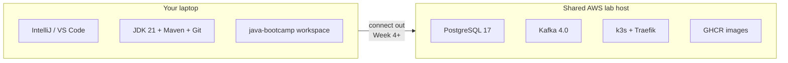

# Labs Setup Instructions

Complete this guide **before Lab 1**. It lists every tool, account, and cloud resource used across Labs 0–52, when each is needed, and how to verify it.

**Participant overview (start here):** [PARTICIPANT-SETUP-README.md](PARTICIPANT-SETUP-README.md) — whole setup explained in plain language  
**Live cohort endpoints:** [FINAL-SETUP-README.md](FINAL-SETUP-README.md) — shared host `100.22.136.97` (Postgres / Kafka / k3s / GHCR)  
**Hands-on install steps:** [Lab 0 — Development Environment Setup](Week%201%20-%20Java%20and%20JVM%20Foundations/module-00/lab0/LAB-0-GUIDE.md)  
**What each technology is for:** [Technology Stack Guide](TECHNOLOGY-STACK-GUIDE.md)  
**Lab index:** [LABS-INDEX.md](LABS-INDEX.md)

---

## Contents

1. [Training environment model](#1-training-environment-model)
2. [Complete Lab 0 first](#2-complete-lab-0-first)
3. [Accounts and cloud access](#3-accounts-and-cloud-access)
4. [Baseline software (required for all labs)](#4-baseline-software-required-for-all-labs)
5. [Additional software by week](#5-additional-software-by-week)
6. [Lab-by-lab requirements matrix](#6-lab-by-lab-requirements-matrix)
7. [Ports and shared services](#7-ports-and-shared-services)
8. [Verification checklist](#8-verification-checklist)
9. [Common issues](#9-common-issues)

---

## 1. Training environment model

You develop on your **laptop** with **IntelliJ IDEA Community** (primary) and optionally **VS Code**. Shared services for this cohort run on **one AWS host** (`100.22.136.97`): **PostgreSQL 17**, **Kafka 4.0**, and **Kubernetes (k3s)** with Traefik. Source/CI: **GitHub + GitHub Actions**; images: **GHCR**. Details: [FINAL-SETUP-README.md](FINAL-SETUP-README.md).



| Where | What runs there |
| ----- | --------------- |
| **Laptop** | IntelliJ (primary) / optional VS Code, JDK 21, Maven, Git, Node 22, Spring Boot / Vite, kubectl + personal kubeconfig |
| **Shared host** | PostgreSQL, Kafka, k3s, Traefik |
| **GitHub / GHCR** | Repos, Copilot, Actions, container images |
| **Instructor-provided** | Google Sheet credentials, kubeconfig YAML, AWS ops (instructors only) |

> Optional local Docker only when a lab explicitly requires it.

---

## 2. Complete Lab 0 first

Follow [lab0/LAB-0-GUIDE.md](Week%201%20-%20Java%20and%20JVM%20Foundations/module-00/lab0/LAB-0-GUIDE.md) end-to-end. When finished you should have:

_Mark each row **Pass** or **Fail** in your lab notes (GitHub markdown files are not interactive checklists)._

| # | Confirm | Your notes |
| - | ------- | ---------- |
| 1 | IntelliJ IDEA Community (primary IDE; SDK 21) | Pass / Fail |
| 2 | Optional: VS Code + Extension Pack for Java (see Week 1 [`_IDE-CONVENTIONS.md`](Week%201%20-%20Java%20and%20JVM%20Foundations/_IDE-CONVENTIONS.md)) | Pass / Fail |
| 3 | Workspace open at `~/java-bootcamp` (or Windows equivalent) | Pass / Fail |
| 4 | Java 21, Maven 3.9.x, and Git verified | Pass / Fail |
| 5 | `HelloWorld` compiled and run under `java-bootcamp/examples` | Pass / Fail |

Do **not** start Lab 1 until Lab 0 verification passes.

---

## 3. Accounts and cloud access

Ask your instructor for anything marked *instructor-provided*. Create personal accounts before the week that needs them.

| Account / access | When needed | Purpose |
| ---------------- | ----------- | ------- |
| **GitHub account** | Lab 0+ | Clone/push course work; Copilot; Actions |
| **GitHub Copilot** (active license) | Labs 10–12, 25, 27, 45 | AI-assisted coding in VS Code |
| **Shared PostgreSQL** (`100.22.136.97:5432`, DB `bootcamp`) | Labs 37–39, 50 | Per-student schema (*credentials sheet*) |
| **Shared Kafka** (`100.22.136.97:9092`) | Labs 30–32, 46, 49 | Messaging |
| **GHCR** | Labs 41–42, 51 | Push/pull CRM images |
| **k3s namespace + kubeconfig** | Labs 42, 51 | Deploy with `kubectl` (*YAML pack*) |
| **GitHub Actions** enabled on CRM repo | Labs 43–44, 51 | CI/CD pipelines |

**Secrets policy:** Never commit database passwords, Kafka credentials, tokens, `.env` files, kubeconfigs, or Terraform state. Store credentials only in the instructor sheet / local untracked config.

---

## 4. Baseline software (required for all labs)

Installed on the **laptop** in Lab 0 (except cloud CLIs noted later).

| Tool | Version target | Verify | Used from |
| ---- | -------------- | ------ | --------- |
| **IntelliJ IDEA Community** | Latest stable | Opens locally; SDK 21 | Lab 0+ (primary IDE) |
| **VS Code** (desktop, optional) | Latest stable | Opens locally | Lab 0+ if preferred |
| **Extension Pack for Java** | Latest | Java language support works | Lab 0+ (VS Code) |
| **Spring Boot Extension Pack** | Latest | Recommended | Week 3+ |
| **Git** | 2.x | `git --version` | Lab 0+ |
| **OpenJDK 21** | 21.x (Temurin OK) | `java -version` / `javac -version` | Lab 1+ |
| **Maven** | 3.9.x | `mvn -version` | Lab 8–9+, heavily Week 2+ |
| **Docker** (optional) | Latest Desktop/Engine | Only if a lab requires local containers | Occasional |

`JAVA_HOME` should point at JDK 21.

**Verified Windows reference (Lab 0 clean install):** Temurin **21.0.11** at `C:\Program Files\Eclipse Adoptium\jdk-21`; Maven **3.9.9** at `C:\Program Files\Apache\maven\current`; workspace `%USERPROFILE%\java-bootcamp`. Full steps: [lab0/LAB-0-GUIDE.md](Week%201%20-%20Java%20and%20JVM%20Foundations/module-00/lab0/LAB-0-GUIDE.md).

---

## 5. Additional software by week

### Week 1 — Java and JVM (Labs 1–7)

| Tool | Install where | Notes |
| ---- | ------------- | ----- |
| JDK 21 tools (`javac`, `java`, `javap`) | Laptop | Already in Lab 0 |
| **VisualVM** or `jconsole` / `jstat` | Laptop | Lab 4 memory analysis |
| IntelliJ IDEA Community | Laptop | Primary IDE; see [`_IDE-CONVENTIONS.md`](Week%201%20-%20Java%20and%20JVM%20Foundations/_IDE-CONVENTIONS.md) |
| VS Code (optional) | Laptop | Alternate IDE if preferred |

### Week 2 — Build, AI, APIs, testing (Labs 8–21)

| Tool | Install where | Notes |
| ---- | ------------- | ----- |
| **Maven** | Laptop | Lab 0; confirm before Lab 8–9 |
| **GitHub Copilot** in VS Code | Laptop | Labs 10–12; sign in with GitHub |
| Chrome / Chromium + **Selenium** (Maven deps) | Laptop | Lab 19 |

### Week 3 — Spring (Labs 22–29)

| Tool | Install where | Notes |
| ---- | ------------- | ----- |
| Spring Boot 3.x (via Maven / Spring Initializr) | Project | Labs 22–23 |
| No new OS packages beyond baseline | — | Spring WS, Security, Validation are Maven dependencies |

### Week 4 — Kafka, React, PostgreSQL, resilience (Labs 30–39)

#### Node.js 22 LTS and npm (Labs 33–36, 50)

```bash
node --version   # v22.x
npm --version
```

Install Node 22 LTS from [nodejs.org](https://nodejs.org/) or your OS package manager / nvm.

#### Shared Apache Kafka 4.0 (Labs 30–31, 46, 49)

Bootstrap: **`100.22.136.97:9092`** (single shared broker). See [FINAL-SETUP-README.md](FINAL-SETUP-README.md). Lab Compose files are optional practice only if the instructor allows a local broker.

#### Shared PostgreSQL 17 (Labs 37–39, 50)

- Host: **`100.22.136.97:5432`**
- Database: **`bootcamp`**
- Schema/user: your `studentNN` from the credentials sheet  
- JDBC example: `jdbc:postgresql://100.22.136.97:5432/bootcamp?currentSchema=studentNN`

Client tools:

| Client | Where | Use |
| ------ | ----- | --- |
| **psql** | Laptop | CLI SQL for Labs 37–38 |
| **pgAdmin** | Laptop (GUI) | Optional |

#### Resilience / test fakes (Lab 32)

Wired through Maven (`resilience4j`, WireMock) — no separate OS install.

### Week 5 — DevOps and platforms (Labs 40–47)

| Tool | Install where | Notes |
| ---- | ------------- | ----- |
| **OWASP Dependency-Check** Maven plugin | Project | Lab 40 |
| Docker image builds (as assigned) | Laptop or CI | Lab 41 → push **GHCR** |
| **`kubectl`** + your kubeconfig | Laptop | Lab 42 — k3s `https://100.22.136.97:6443`; Traefik Ingress |
| Your k3s namespace | — | *From instructor YAML pack* |
| **GitHub Actions** workflow in repo | GitHub | Labs 43–44 |
| **Terraform** 1.5+ | Laptop | Lab 45 |
| **Ansible** | Laptop | Lab 45 |

### Week 6 — Capstone (Labs 48–52)

Reuse the full stack from Weeks 1–5. Capstone expects:

- Java 21 + Maven Wrapper
- Spring Boot backend + Kafka (`100.22.136.97:9092`)
- React (Node 22) frontend
- PostgreSQL persistence (`bootcamp` / your schema)
- Container images on **GHCR** + **`kubectl apply`** into your k3s namespace (Traefik Ingress)
- GitHub Actions pipeline with SAST gates

Confirm Week 4–5 verification commands before Lab 48. Live reference: [FINAL-SETUP-README.md](FINAL-SETUP-README.md).

---

## 6. Lab-by-lab requirements matrix

| Labs | You need in place |
| ---- | ----------------- |
| **0** | Laptop IntelliJ Community (primary), optional VS Code, JDK 21, Maven, Git |
| **1–3, 5–7** | Lab 0 baseline (JDK 21, Git, terminal); IntelliJ (or optional VS Code) |
| **4** | Baseline + VisualVM / `jconsole` / `jstat` |
| **8–9** | Baseline + Maven verified |
| **10–12** | Maven + **GitHub Copilot** signed in |
| **13–18, 20–21** | Maven project tooling (JUnit on 17–18) |
| **19** | Maven + browser + Selenium WebDriver (via deps) |
| **22–29** | Maven + Spring Boot 3 project |
| **30–31, 46** | Shared Kafka `100.22.136.97:9092` |
| **32** | Spring Boot + Resilience4j / WireMock (Maven) |
| **33–36** | **Node 22 + npm** (+ Spring API for 35–36) |
| **37–38** | Shared **PostgreSQL** `100.22.136.97:5432` / DB `bootcamp` + `psql` / pgAdmin |
| **39, 50** | PostgreSQL + Spring Data JPA + (50) React |
| **40** | Maven + OWASP Dependency-Check |
| **41** | Docker (as assigned) → **GHCR** |
| **42, 51** | Docker + **kubectl** + k3s kubeconfig / namespace |
| **43–44, 51** | **GitHub Actions** |
| **45** | Terraform + Ansible (+ Copilot optional) |
| **47–48, 52** | Prior CRM work; presentation tooling |
| **49** | Spring Boot + Kafka + tests |

Each lab README includes a short **Prerequisites** / environment reminder that links back here.

---

## 7. Ports and shared services

This cohort (see [FINAL-SETUP-README.md](FINAL-SETUP-README.md)):

| Endpoint | Service | Labs |
| -------- | ------- | ---- |
| `100.22.136.97:5432` | PostgreSQL 17 (`bootcamp`) | 37+ |
| `100.22.136.97:9092` | Kafka 4.0 | 30+ |
| `https://100.22.136.97:6443` | k3s API | 42+ |
| `:80` / `:443` on shared host | Traefik Ingress | 42+ |
| `localhost:8080` | Spring Boot (local) | 23+ |
| `localhost:5173` | Vite React (local) | 33+ |
| `localhost:3000` | Alternate frontend | Optional |

Reachability requires the **class IP allowlist** (or instructor VPN).

---

## 8. Verification checklist

Run in the IntelliJ terminal on your laptop after Lab 0 and again before Weeks 4 and 5.

### Always (Weeks 1–6)

```bash
java -version
javac -version
mvn -version
git --version
echo $JAVA_HOME   # Windows: echo %JAVA_HOME%
pwd
```

### Before Week 4 (Kafka / React / PostgreSQL)

```bash
node --version    # v22.x
npm --version
# PostgreSQL: 100.22.136.97:5432  DB bootcamp  (credentials from Google Sheet)
# Kafka:      100.22.136.97:9092
# See FINAL-SETUP-README.md
```

### Before Week 5 (platform)

```bash
kubectl version --client
# KUBECONFIG=./studentNN.yaml kubectl get ns
terraform version || true
ansible --version || true
```

This cohort uses **k3s + kubectl + Traefik**.

### Copilot (laptop IDE)

- Copilot status shows signed in
- Inline suggestion or Copilot Chat responds in a Java file

---

## 9. Common issues

| Symptom | Likely cause | Fix |
| ------- | ------------ | --- |
| `JAVA_HOME` empty | Env var not set | Lab 0 JAVA_HOME steps; new terminal |
| Maven download failures | No outbound HTTPS | Check network / proxy; ask instructor |
| Cannot connect to PostgreSQL / Kafka | Off allowlist IP; wrong schema password | Class network/VPN; re-check sheet; [FINAL-SETUP-README.md](FINAL-SETUP-README.md) |
| Copilot inactive | No license / wrong GitHub account | Confirm Copilot on the signed-in account |
| `kubectl` unauthorized | Wrong or expired kubeconfig | Re-download `studentNN.yaml` |
| GitHub Actions not running | Workflow missing / Actions disabled | Add `.github/workflows/ci.yml`; enable Actions |

---

## Related documents

| Document | Role |
| -------- | ---- |
| [FINAL-SETUP-README.md](FINAL-SETUP-README.md) | **Authoritative** shared host endpoints |
| [Lab 0](Week%201%20-%20Java%20and%20JVM%20Foundations/module-00/lab0/LAB-0-GUIDE.md) | Step-by-step laptop toolchain install |
| [Technology Stack Guide](TECHNOLOGY-STACK-GUIDE.md) | Concepts and “why this technology” |
| [Lab Index](LABS-INDEX.md) | Links to every lab guide |
| [Participant Setup README](PARTICIPANT-SETUP-README.md) | Student-facing setup overview |
| Course [README](../README.md) | Program overview |

If a lab’s Prerequisites ever conflict with this file, **follow this setup guide, FINAL-SETUP-README.md, and Lab 0 for versions**, and treat lab-specific notes as task context only.
