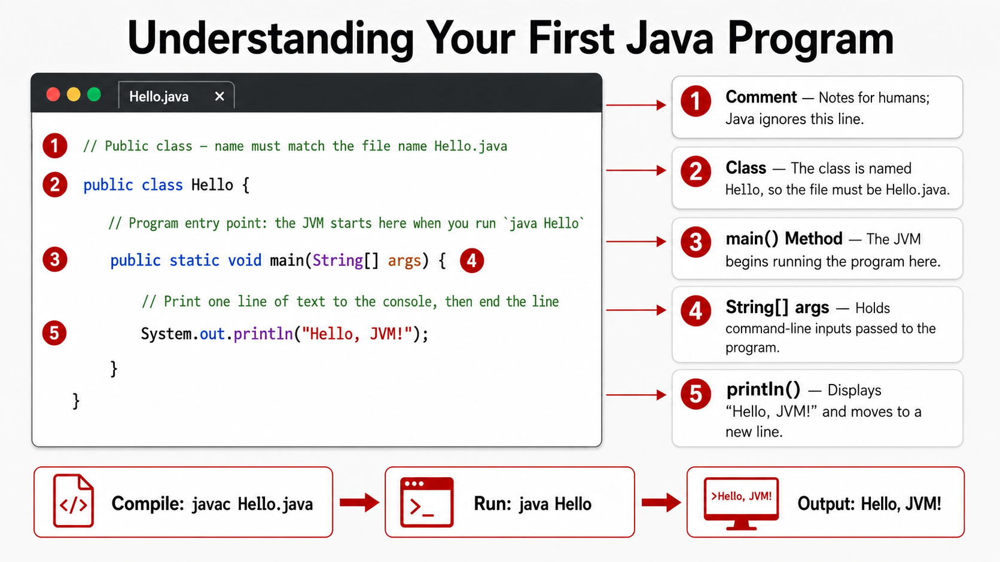

# Exercise — Hello World

**Module 1** · Pre-lab practice · finish all 8, then [`../lab1/LAB-1-GUIDE.md`](../lab1/LAB-1-GUIDE.md)  
**Folder:** `examples/module-01-exercises/` (see [EXERCISES-INDEX.md](EXERCISES-INDEX.md) setup)



## Goal

Write, compile, and run a minimal program that prints `Hello, JVM!`.

## Starter / reference (with line comments)

```java
// Public class — name must match the file name Hello.java
public class Hello {
    // Program entry point: the JVM starts here when you run `java Hello`
    public static void main(String[] args) {
        // Print one line of text to the console, then end the line
        System.out.println("Hello, JVM!");
    }
}
```

| Line idea | Why it matters |
| --------- | --------------**** |
| `public class Hello` | Defines a class the JVM can load; file must be `Hello.java` |
| `main(String[] args)` | Special method the `java` launcher looks for |
| `System.out.println(...)` | Sends text to the terminal |

## Steps

### Step 1 — Create the exercises folder

**Why:** Keep Module 1 practice separate from Lab 0’s `HelloJava` and from the graded Lab 1 folder.

Already covered in [EXERCISES-INDEX.md](EXERCISES-INDEX.md) setup.

| OS | Confirm terminal cwd |
| -- | -------------------- |
| Windows | `C:\Users\<you>\java-bootcamp\examples\module-01-exercises` |
| macOS | `/Users/<you>/java-bootcamp/examples/module-01-exercises` |

### Step 2 — Create `Hello.java`

**Why:** Source code lives in a `.java` file before the compiler can turn it into bytecode.

**Do this (IntelliJ):**

1. Right-click `module-01-exercises` → **New → File** (not **Java Class**).
2. Name it exactly `Hello.java` (include the `.java` extension).
3. Paste the starter code above. Save (Windows: **Ctrl+S** · macOS: **⌘S**).

**Or from Terminal:**

**Windows:**

```powershell
cd $env:USERPROFILE\java-bootcamp\examples\module-01-exercises
New-Item -ItemType File -Force -Path Hello.java | Out-Null
```

**macOS:**

```bash
cd ~/java-bootcamp/examples/module-01-exercises
touch Hello.java
```

Then open `Hello.java` in the editor and paste the starter code.

**Expected:** `Hello.java` under `module-01-exercises`; editor shows the `Hello` class.

**If it fails / what not to do:**

* **New → Java Class** missing → normal here; use **New → File** instead.
* **Mark Directory as** only shows **Excluded** on `module-01-exercises` → ignore; you do not need Sources Root for these exercises.
* Do not mark `examples` as Sources Root for this step (breaks the Lab 0 `HelloJava/src` layout).
* Red IDE error *package name 'module-01-exercises' … is invalid* → `examples` was marked Sources Root. Right-click `examples` → **Mark Directory as → Unmark as Sources Root**. Your `.java` file is fine; `javac` / `java` still work from Terminal.

### Step 3 — Compile and run from Terminal

**Why:** `javac` turns source into bytecode (`.class`). `java` starts a JVM and runs that bytecode.

| Command | Easy meaning |
| ------- | ------------ |
| `cd …\module-01-exercises` | Go to the folder that contains `Hello.java` |
| `javac Hello.java` | Compile → creates `Hello.class` (no output if success) |
| `java Hello` | Run the class named `Hello` (not `Hello.java` / not `Hello.class`) |

**Windows:**

```powershell
cd $env:USERPROFILE\java-bootcamp\examples\module-01-exercises
javac Hello.java
java Hello
```

**macOS:**

```bash
cd ~/java-bootcamp/examples/module-01-exercises
javac Hello.java
java Hello
```

**Expected:** Console prints `Hello, JVM!`. `Hello.class` appears next to `Hello.java` (list with `dir` / `ls`).

**Verified (Windows):** From `examples\module-01-exercises`, `javac Hello.java` then `java Hello` prints `Hello, JVM!`.

**If it fails:** Confirm `javac -version` / `java -version` are 21.x (Lab 0). Confirm you are in `module-01-exercises`, not `examples/HelloJava`.

**IntelliJ yellow banner** *Java file is located outside of the module source root* → **ignore**. Do **not** click **Move to source root** (that moves the file into `HelloJava/src`). These exercises compile with Terminal `javac`, not IntelliJ’s build. Keep `Hello.java` under `examples/module-01-exercises/`.

### Step 4 — Optional: inspect bytecode

**Why:** Prove that the JVM does not run your `.java` text — it runs compiled instructions.

```text
javap -c Hello
```

| Part of the command | Easy meaning |
| ------------------- | ------------ |
| `javap` | Java class file disassembler (reads `.class`) |
| `-c` | Show bytecode for methods |
| `Hello` | Class name to inspect |

**Expected:** Disassembly includes `main` and a `println` call.

**Verified (Windows):** `javap -c Hello` shows `main`, with bytecode including `getstatic`, `ldc` (`"Hello, JVM!"`), `invokevirtual` (`println`), and `return`.

#### Easy explanation of what you see

Your one line of Java...

```java
System.out.println("Hello, JVM!");
```

...becomes several tiny steps for the JVM. **The JVM works like a person following a recipe, placing items on a table (the "stack") one at a time, then doing an action.**

Read your `main` output top to bottom:

| Step you saw | Think of it as... |
| ------------ | ----------------- |
| `getstatic … System.out` | "Pick up the **printer** (`System.out`) and put it on the table." |
| `ldc … "Hello, JVM!"` | "Write the note **`Hello, JVM!`** and put it on the table." |
| `invokevirtual … println` | "Hand the note to the printer → it prints the line." |
| `return` | "Nothing left to do — finish." |

The first block (`aload_0`, `invokespecial Object."<init>"`, `return`) is just the **empty constructor Java added for you** — it says "set up a basic object." You never wrote it; ignore it for now.

**The one thing to remember:** `javac` turned your readable Java into these small JVM steps. The JVM runs the **steps** (bytecode), not your `.java` text.

You do **not** need to memorize opcode names.


## Expected result

Console prints `Hello, JVM!`; `Hello.class` exists.

## Pass criteria

_Mark each row **Pass** or **Fail** in your lab notes (GitHub markdown files are not interactive checklists)._

| # | Confirm | Your notes |
| - | ------- | ---------- |
| 1 | Code compiles and runs (or notes complete if analysis-only) | Pass / Fail |
| 2 | You can explain the result in one sentence | Pass / Fail |
