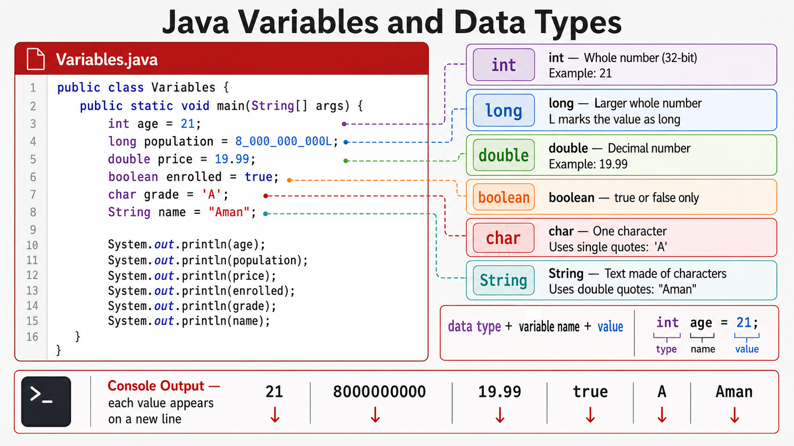

# Exercise — Variables and Data Types

**Module 1** · Pre-lab practice · then open [`../../lab1/LAB-1-GUIDE.md`](../lab1/LAB-1-GUIDE.md)  
**Folder:** `examples/module-01-exercises/` ([setup](EXERCISES-INDEX.md))



## Goal

Create `Variables.java` with local variables of several primitive types and one `String`; print each.

## Starter / reference (with line comments)

```java
// Class name must match file name Variables.java
public class Variables {
    // Entry point — JVM starts here
    public static void main(String[] args) {
        int age = 21;                       // whole number (32-bit)
        long population = 8_000_000_000L;   // bigger whole number; L means long
        double price = 19.99;               // decimal number
        boolean enrolled = true;            // true or false only
        char grade = 'A';                  // single character in single quotes
        String name = "Aman";               // text (object) in double quotes

        System.out.println(age);            // print each value on its own line
        System.out.println(population);
        System.out.println(price);
        System.out.println(enrolled);
        System.out.println(grade);
        System.out.println(name);
    }
}
```

| Type | Easy meaning | Example |
| ---- | ------------ | ------- |
| `int` | Small/medium whole numbers | `21` |
| `long` | Large whole numbers | `8_000_000_000L` |
| `double` | Decimals | `19.99` |
| `boolean` | Yes/no flag | `true` |
| `char` | One character | `'A'` |
| `String` | Text (not a primitive) | `"Aman"` |

## Steps

### Step 1 — Create `Variables.java`

**Why:** Practice storing different kinds of data in named boxes (variables).

1. Right-click `module-01-exercises` → **New → File** (not Java Class).
2. Name it exactly `Variables.java`.
3. Paste the starter code above. Save (**Ctrl+S** / **⌘S**).

Ignore any yellow *outside of the module source root* banner.

### Step 2 — Compile and run

**Why:** Confirm the types compile and print correctly.

| Command | Easy meaning |
| ------- | ------------ |
| `javac Variables.java` | Compile source → `Variables.class` |
| `java Variables` | Run `main` |

**Windows:**

```powershell
cd $env:USERPROFILE\java-bootcamp\examples\module-01-exercises
javac Variables.java
java Variables
```

**macOS:**

```bash
cd ~/java-bootcamp/examples/module-01-exercises
javac Variables.java
java Variables
```

**Expected:** Six lines print (age, population, price, enrolled, grade, name) with no errors.

**Verified (Windows):**

```text
21
8000000000
19.99
true
A
Aman
```

## Expected result

All declared values print without compile/runtime errors.

## Pass criteria

_Mark each row **Pass** or **Fail** in your lab notes (GitHub markdown files are not interactive checklists)._

| # | Confirm | Your notes |
| - | ------- | ---------- |
| 1 | Code compiles and runs (or notes complete if analysis-only) | Pass / Fail |
| 2 | You can explain the result in one sentence | Pass / Fail |
