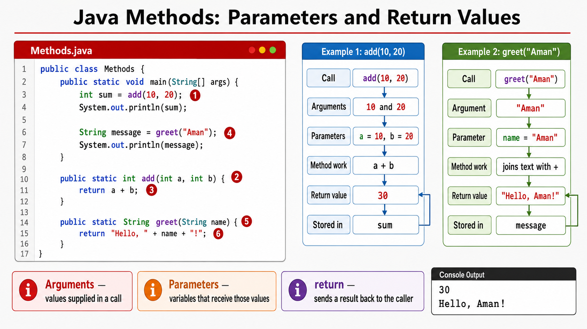

# Exercise — Methods and Parameters

**Module 1** · Pre-lab practice · then open [`../../lab1/LAB-1-GUIDE.md`](../lab1/LAB-1-GUIDE.md)  
**Folder:** `examples/module-01-exercises/` ([setup](EXERCISES-INDEX.md))



## Goal

Create `Methods.java` with at least two methods that take parameters and return a value; call them from `main`.

## Starter / reference (with line comments)

```java
public class Methods {
    // Entry point — call other methods from here
    public static void main(String[] args) {
        int sum = add(10, 20);              // call add; store returned int
        System.out.println(sum);            // expect 30

        String message = greet("Aman");     // call greet; store returned String
        System.out.println(message);        // expect Hello, Aman!
    }

    // Takes two ints (parameters a, b); returns their sum
    public static int add(int a, int b) {
        return a + b;                       // send result back to the caller
    }

    // Takes a String name; returns a greeting String
    public static String greet(String name) {
        return "Hello, " + name + "!";      // + joins text pieces
    }
}
```

| Idea | Easy meaning |
| ---- | ------------ |
| Parameter | Input value the method receives (`a`, `b`, `name`) |
| Return | Value sent back to the caller (`return …`) |
| Call from `main` | `main` pauses, runs the method, then continues with the result |

**Stack hint:** Each method call gets its own short-lived frame (locals + return address) on the **stack**.

## Steps

### Step 1 — Create `Methods.java`

**Why:** Methods let you reuse logic and pass data in/out.

1. Create `Methods.java` with **New → File** (not Java Class) under `module-01-exercises`.
2. Paste the starter code (or write your own with the same ideas).
3. Save.

### Step 2 — Compile and run

| Command | Easy meaning |
| ------- | ------------ |
| `javac Methods.java` | Compile |
| `java Methods` | Run `main` → calls `add` and `greet` |

**Windows:**

```powershell
cd $env:USERPROFILE\java-bootcamp\examples\module-01-exercises
javac Methods.java
java Methods
```

**macOS:**

```bash
cd ~/java-bootcamp/examples/module-01-exercises
javac Methods.java
java Methods
```

**Expected:** Prints `30` and `Hello, Aman!` (or your equivalent).

**Verified (Windows):**

```text
30
Hello, Aman!
```

## Expected result

Method results print; you can explain stack frames for the calls.

## Pass criteria

_Mark each row **Pass** or **Fail** in your lab notes (GitHub markdown files are not interactive checklists)._

| # | Confirm | Your notes |
| - | ------- | ---------- |
| 1 | Code compiles and runs (or notes complete if analysis-only) | Pass / Fail |
| 2 | You can explain the result in one sentence | Pass / Fail |
