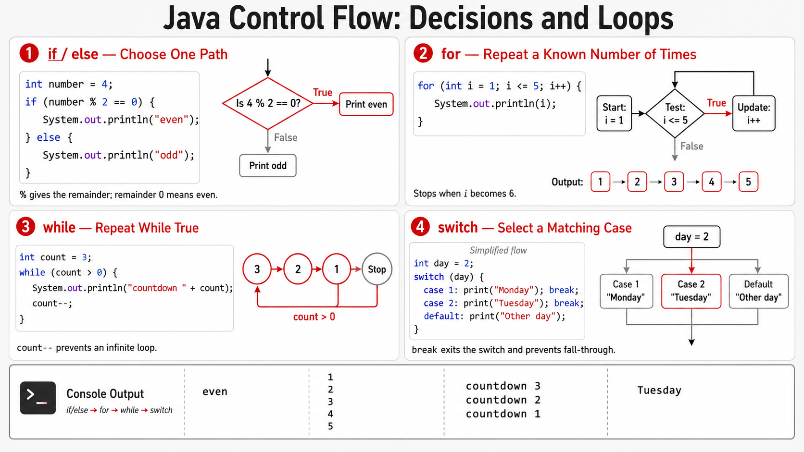

# Exercise — Control Flow

**Module 1** · Pre-lab practice · then open [`../../lab1/LAB-1-GUIDE.md`](../lab1/LAB-1-GUIDE.md)  
**Folder:** `examples/module-01-exercises/` ([setup](EXERCISES-INDEX.md))



## Goal

Create `ControlFlow.java` using `if`, `for`, `while`, and `switch` with simple examples.

## Starter / reference (with line comments)

```java
public class ControlFlow {
    public static void main(String[] args) {
        int number = 4;

        // if: choose one path based on a true/false test
        if (number % 2 == 0) {              // % is remainder; 0 means even
            System.out.println("even");
        } else {
            System.out.println("odd");
        }

        // for: repeat a known number of times (1 through 5)
        for (int i = 1; i <= 5; i++) {
            System.out.println(i);
        }

        // while: repeat while a condition stays true
        int count = 3;
        while (count > 0) {
            System.out.println("countdown " + count);
            count--;                        // decrease so the loop can end
        }

        // switch: pick a label from a fixed set of cases
        int day = 2;
        switch (day) {
            case 1:
                System.out.println("Monday");
                break;                      // leave the switch (don’t fall through)
            case 2:
                System.out.println("Tuesday");
                break;
            default:
                System.out.println("Other day");
                break;
        }
    }
}
```

| Structure | Easy meaning |
| --------- | ------------ |
| `if` / `else` | Do A or B based on a condition |
| `for` | Loop with a counter |
| `while` | Loop while condition is true |
| `switch` | Jump to a matching case |

## Steps

### Step 1 — Create `ControlFlow.java`

**Why:** Real programs branch and repeat; these four structures are the basics.

1. Create `ControlFlow.java` with **New → File** under `module-01-exercises`.
2. Paste the starter (or equivalent) and save.

### Step 2 — Compile and run

| Command | Easy meaning |
| ------- | ------------ |
| `javac ControlFlow.java` | Compile |
| `java ControlFlow` | Run all four demos |

**Windows:**

```powershell
cd $env:USERPROFILE\java-bootcamp\examples\module-01-exercises
javac ControlFlow.java
java ControlFlow
```

**macOS:**

```bash
cd ~/java-bootcamp/examples/module-01-exercises
javac ControlFlow.java
java ControlFlow
```

**Expected:** Even/odd line, numbers 1–5, a short countdown, and a day label.

**Verified (Windows):**

```text
even
1
2
3
4
5
countdown 3
countdown 2
countdown 1
Tuesday
```

## Expected result

All four control structures run and print clear output.

## Pass criteria

_Mark each row **Pass** or **Fail** in your lab notes (GitHub markdown files are not interactive checklists)._

| # | Confirm | Your notes |
| - | ------- | ---------- |
| 1 | Code compiles and runs (or notes complete if analysis-only) | Pass / Fail |
| 2 | You can explain the result in one sentence | Pass / Fail |
