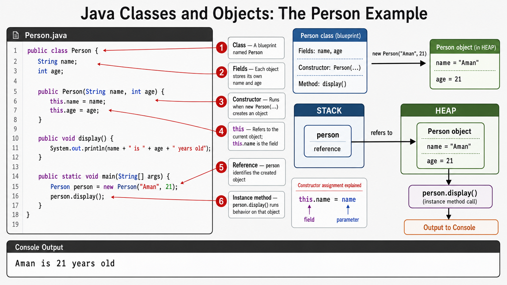

# Exercise — Objects and Classes

**Module 1** · Pre-lab practice · then open [`../../lab1/LAB-1-GUIDE.md`](../lab1/LAB-1-GUIDE.md)  
**Folder:** `examples/module-01-exercises/` ([setup](EXERCISES-INDEX.md))



## Goal

Create `Person.java` with fields, a constructor, and a method; instantiate in `main`.

## Starter / reference (with line comments)

```java
public class Person {
    // Fields (instance data) — each Person object has its own copy
    String name;
    int age;

    // Constructor — runs when you write new Person(...)
    public Person(String name, int age) {
        this.name = name;                   // this.name = field; name = parameter
        this.age = age;
    }

    // Instance method — uses this object’s fields
    public void display() {
        System.out.println(name + " is " + age + " years old");
    }

    public static void main(String[] args) {
        // Create one Person on the heap; person holds a reference (on the stack)
        Person person = new Person("Aman", 21);
        person.display();                   // call method on that object
    }
}
```

| Idea | Easy meaning |
| ---- | ------------ |
| Class | Blueprint (`Person`) |
| Object | One instance created with `new` |
| Field | Data stored in the object (`name`, `age`) — on the **heap** |
| Reference | Variable `person` points to the object — reference lives on the **stack** |

## Steps

### Step 1 — Create `Person.java`

**Why:** Objects group data + behavior; this is the core OOP starting point.

1. Create `Person.java` with **New → File** under `module-01-exercises`.
2. Paste the starter (or equivalent) and save.

### Step 2 — Compile and run

| Command | Easy meaning |
| ------- | ------------ |
| `javac Person.java` | Compile class + `main` |
| `java Person` | Run `main`, create object, print |

**Windows:**

```powershell
cd $env:USERPROFILE\java-bootcamp\examples\module-01-exercises
javac Person.java
java Person
```

**macOS:**

```bash
cd ~/java-bootcamp/examples/module-01-exercises
javac Person.java
java Person
```

**Expected:** Something like `Aman is 21 years old`.

**Verified (Windows):**

```text
Aman is 21 years old
```

## Expected result

Object prints; fields live on the heap and the reference on the stack.

## Pass criteria

_Mark each row **Pass** or **Fail** in your lab notes (GitHub markdown files are not interactive checklists)._

| # | Confirm | Your notes |
| - | ------- | ---------- |
| 1 | Code compiles and runs (or notes complete if analysis-only) | Pass / Fail |
| 2 | You can explain the result in one sentence | Pass / Fail |
