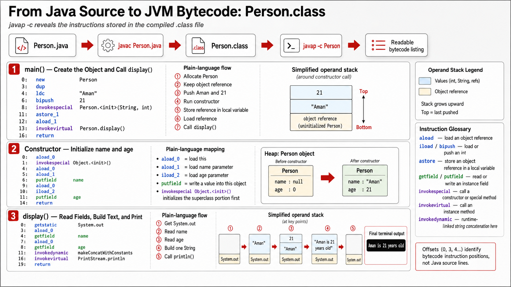
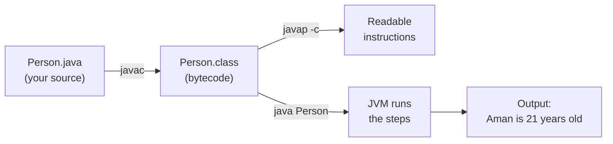
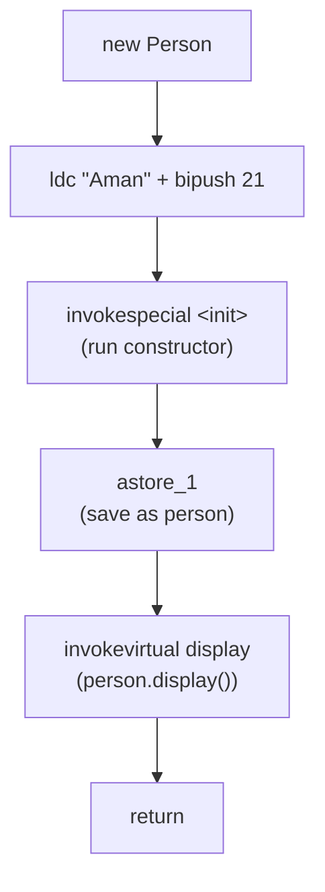
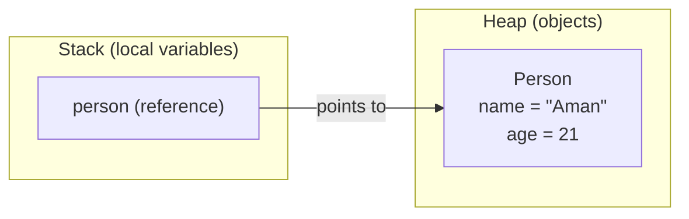

# Exercise — Inspect Bytecode

**Module 1** · Pre-lab practice · then open [`../../lab1/LAB-1-GUIDE.md`](../lab1/LAB-1-GUIDE.md)  
**Folder:** `examples/module-01-exercises/` ([setup](EXERCISES-INDEX.md))



## Goal

Disassemble `Person` (or `Hello`) with `javap` and note three bytecode instructions.

## What each command piece means

| Piece | Easy meaning |
| ----- | ------------ |
| `javap` | Read a `.class` file and show its structure |
| `-c` | Include bytecode for each method (**use this**) |
| `-v` | Optional advanced detail; skip for this beginner exercise |
| `Person` | Class name to inspect (must already be compiled) |

## Big picture (diagram)



`javac` compiles once. `javap` just *shows* the bytecode; `java` *runs* it.

## Do this

**Why:** Connect your Java source to the instructions the JVM actually runs.

From the exercises folder (after `javac` produced the `.class`):

**Windows:**

```powershell
cd $env:USERPROFILE\java-bootcamp\examples\module-01-exercises
javap -c Person
```

**macOS:**

```bash
cd ~/java-bootcamp/examples/module-01-exercises
javap -c Person
```

**Verified (Windows) — your output has three sections.** Read them like chapters of a short story.

### Chapter 1 — Constructor `Person(String, int)`

Matches your Java:

```java
public Person(String name, int age) {
    this.name = name;
    this.age = age;
}
```

| Bytecode | Plain English |
| -------- | ------------- |
| `aload_0` | Pick up **this** (the new object) |
| `invokespecial Object."<init>"` | Call Object’s empty constructor first (every class does this) |
| `aload_0` / `aload_1` / `putfield name` | Put the **name** parameter into the object’s `name` field |
| `aload_0` / `iload_2` / `putfield age` | Put the **age** number into the object’s `age` field |
| `return` | Constructor finished |

**One sentence:** The constructor stores `"Aman"` and `21` inside the new Person.

### Chapter 2 — Method `display()`

Matches your Java:

```java
public void display() {
    System.out.println(name + " is " + age + " years old");
}
```

| Bytecode | Plain English |
| -------- | ------------- |
| `getstatic System.out` | Pick up the console printer |
| `aload_0` / `getfield name` | Read this Person’s `name` |
| `aload_0` / `getfield age` | Read this Person’s `age` |
| `invokedynamic … makeConcat…` | Join them into one sentence (modern Java’s way to do `name + " is " + age + …`) |
| `invokevirtual println` | Print that sentence |
| `return` | Done |

**One sentence:** `display` reads the fields, builds the sentence, and prints it.

### Chapter 3 — Method `main` (start here if you feel lost)

Matches your Java:

```java
Person person = new Person("Aman", 21);
person.display();
```

| Bytecode | Plain English |
| -------- | ------------- |
| `new Person` | Make space for a new Person object |
| `dup` | Keep an extra copy of that object (needed for the constructor call) |
| `ldc "Aman"` | Put the text **Aman** on the table |
| `bipush 21` | Put the number **21** on the table |
| `invokespecial "<init>"` | Run the constructor with those values |
| `astore_1` | Save the finished Person in variable `person` |
| `aload_1` | Pick up `person` again |
| `invokevirtual display` | Call `person.display()` |
| `return` | Finish `main` |

**One sentence:** Create Person(Aman, 21) → save it → call display → stop.

#### `main` as a flow



#### How the object sits in memory



The variable `person` (a reference) lives on the **stack**; the actual Person object lives on the **heap**.

### What you can ignore for now

- Numbers like `#7`, `#13`, `#33` — just labels inside the class file
- Types like `Ljava/lang/String;` — “this is a String”
- `invokedynamic` details — “join text for printing”
- `javap -c -v` constant pool / checksums — advanced; not needed here

### Three opcodes to remember

| Opcode | Everyday meaning |
| ------ | ---------------- |
| `new` | Create a new object |
| `ldc` | Put a constant value (like `"Aman"`) on the table |
| `invokevirtual` | Call a method (like `display` or `println`) |
| `aload` / `aload_0` | Put an object you already have on the table |
| `return` | Done |

You do **not** need to memorize every line. The point: **`javac` turned your Java into small JVM steps, and `java` runs those steps.**

- Save text or a local screenshot under `notes/screenshots/` (keep screenshots on your laptop only)
- Explain three of: `new`, `ldc`, `invokevirtual`, `aload`, `return`

**Verified (Windows):** `javap -c Person` shows constructor, `display()`, and `main` with the opcodes above (use `-c` only; skip `-v` for beginners).

## Expected result

You can name what three instructions do from your listing.

## Pass criteria

_Mark each row **Pass** or **Fail** in your lab notes (GitHub markdown files are not interactive checklists)._

| # | Confirm | Your notes |
| - | ------- | ---------- |
| 1 | Code compiles and runs (or notes complete if analysis-only) | Pass / Fail |
| 2 | You can explain the result in one sentence | Pass / Fail |
