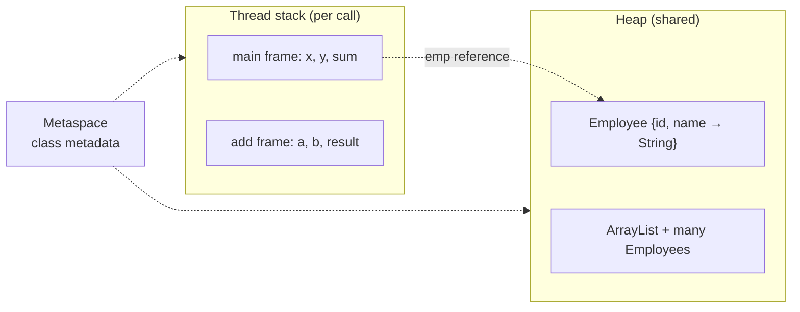

# Module 1 — Instructor Demonstration: JVM Architecture and Runtime Model

**Module:** 1 — JVM Architecture and Runtime Model
**Lab folder:** `labs/Week 1 - Java and JVM Foundations/module-01/lab1/`
**Audience:** Instructor-led, projected to the whole class **before** students start [Lab 1](LAB-1-GUIDE.md) and the [pre-lab exercises](../exercises/EXERCISES-INDEX.md)
**Duration:** 30–40 minutes total (four demos, ~8–10 minutes each)
**Source:** Expands the four demos listed under "Instructor Demonstration" in the [Week 1 Master Curriculum](../../WEEK-CURRICULUM.md) (Demo 1–4) and the "Instructor Demo" slides in the Module 1 deck, with full runnable code and step-by-step narration.

---

## Purpose

Students are about to spend 90–120 minutes compiling, running, and inspecting Java programs on their own. Before they do, the instructor runs the **same kind of programs live**, narrating what is happening at each stage — compilation, bytecode, class loading, heap allocation, and garbage collection — so students have a mental model to lean on instead of following steps blindly.

**Do not reuse the exact student files.** Lab 1 has students build `HelloWorld`, `Calculator`, `Employee`, and `MemoryDemo` themselves under `java-bootcamp/examples/jvm-compilation-lab/`. This demo uses parallel-but-different classes (`Hello`, `HelloMemory`) so the live walkthrough teaches the same concepts without pre-solving the student's own lab.

**Suggested demo workspace (instructor machine):**

```text
java-bootcamp/examples/instructor-demo-module1/
├── Hello.java
├── HelloMemory.java
└── HelloLeak.java
```

---

## Demo 1 — Compile a Java Application

**Concept being taught:** `.java` is human-authored source; `javac` transforms it into `.class` bytecode; the JVM never reads `.java` at runtime.

### Step 1.1 — Write the source live

Type this in front of the class (don't paste — typing it while narrating each line reinforces syntax):

```java
public class Hello {

    public static int add(int a, int b) {
        int result = a + b;
        return result;
    }

    public static void main(String[] args) {
        int x = 10;
        int y = 20;
        int sum = add(x, y);
        System.out.println("Sum = " + sum);
    }
}
```

**Narrate while typing:**
* `public class Hello` — the class name **must** match the filename (`Hello.java`), or `javac` rejects it.
* `add(int a, int b)` — a small helper method gives you something worth disassembling in Demo 2 (an arithmetic instruction, a method call, a return).
* `main(String[] args)` — the JVM looks for exactly this signature as the entry point.

### Step 1.2 — Compile it

**Windows PowerShell:**

```powershell
cd java-bootcamp/examples/instructor-demo-module1
javac Hello.java
Get-ChildItem Hello.*
```

**macOS / Linux:**

```bash
cd java-bootcamp/examples/instructor-demo-module1
javac Hello.java
ls -l Hello.*
```

**Expected result:**

```text
Hello.class
Hello.java
```

**Talking point:** No output from `javac` means success. Point at the new `Hello.class` file and ask: "What do you think is inside this file — is it machine code for my CPU?" (Answer, building toward Demo 2: no — it's bytecode, a JVM-specific instruction format.)

### Step 1.3 — Run it

```powershell
java Hello
```

```text
Sum = 30
```

**Talking point:** `java Hello` — no `.class` suffix. The argument is a **class name**, resolved by the class loader, not a file path. Deliberately mistype it once for the class (`java Hello.class` or `java hello`) and show the resulting `Error: Could not find or load main class` — this is the single most common early mistake in Lab 1.

### Step 1.4 — Recompile after a change (staleness demo)

Change `add` to return `a * b` **in the editor only** — do not recompile yet.

```powershell
java Hello
```

```text
Sum = 30      # still stale! java runs the OLD .class
```

Now recompile and re-run:

```powershell
javac Hello.java
java Hello
```

```text
Sum = 200
```

**Talking point:** This single demo prevents the most common confusion in the entire lab: *`java` executes `.class`, never `.java`.* Editing source and forgetting to recompile is invisible until you show it happening.

---

## Demo 2 — Inspect the Generated Bytecode

**Concept being taught:** Bytecode is a real, readable instruction set — not magic, not machine code for one CPU.

### Step 2.1 — Disassemble signatures only

```powershell
javap Hello
```

```text
Compiled from "Hello.java"
public class Hello {
  public Hello();
  public static int add(int, int);
  public static void main(java.lang.String[]);
}
```

**Talking point:** `javap` (no flags) shows only the public API — useful for checking what a `.class` file exposes without seeing implementation.

### Step 2.2 — Disassemble bytecode instructions

```powershell
javap -c Hello
```

**Expected result (`add` method — walk through every line):**

```text
public static int add(int, int);
  Code:
     0: iload_0
     1: iload_1
     2: iadd
     3: istore_2
     4: iload_2
     5: ireturn
```

**Line-by-line narration (write this table on the whiteboard as you go):**

| Offset | Instruction | Meaning |
| --- | --- | --- |
| `0: iload_0` | Load int from local slot 0 | Pushes `a` onto the operand stack |
| `1: iload_1` | Load int from local slot 1 | Pushes `b` onto the operand stack |
| `2: iadd` | Add two ints | Pops both, pushes `a + b` |
| `3: istore_2` | Store int into local slot 2 | Pops the sum into `result` |
| `4: iload_2` | Load int from local slot 2 | Pushes `result` back onto the stack |
| `5: ireturn` | Return int | Pops and returns it to the caller |

**Expected result (`main` method — walk through the call and print):**

```text
public static void main(java.lang.String[]);
  Code:
     0: bipush        10
     2: istore_1
     3: bipush        20
     5: istore_2
     6: iload_1
     7: iload_2
     8: invokestatic  #7    // Method add:(II)I
    11: istore_3
    12: getstatic     #13   // Field java/lang/System.out:Ljava/io/PrintStream;
    15: new           #19   // class java/lang/StringBuilder
    18: dup
    19: invokespecial #21   // Method java/lang/StringBuilder."<init>":()V
    22: ldc           #22   // String Sum =
    24: invokevirtual #24   // Method StringBuilder.append:(Ljava/lang/String;)Ljava/lang/StringBuilder;
    27: iload_3
    28: invokevirtual #28   // Method StringBuilder.append:(I)Ljava/lang/StringBuilder;
    31: invokevirtual #31   // Method StringBuilder.toString:()Ljava/lang/String;
    34: invokevirtual #35   // Method PrintStream.println:(Ljava/lang/String;)V
    37: return
```

**Talking points:**
* `bipush 10` / `bipush 20` — push the two literal constants.
* `invokestatic #7` — calls `add`; note it is `invokestatic` (no receiver object) versus `invokevirtual` for instance methods later.
* The `StringBuilder` chain is exactly what `"Sum = " + sum` compiles to — string concatenation is never free; it is sugar for `StringBuilder.append(...).toString()` (or, on newer `javac`/JDK versions, an `invokedynamic` call to `makeConcatWithConstants` — mention both are possible depending on JDK version, and that's fine, it's still visible in `javap -c`).

### Step 2.3 — Read the constant pool (optional, time permitting)

```powershell
javap -c -v Hello
```

Scroll to `Constant pool:` and find entry `#22` — show that the literal string `"Sum = "` lives there, and instructions reference it by index (`ldc #22`) rather than embedding the text inline.

**Talking point:** This is why bytecode is compact — literals and symbolic references are deduplicated once in the constant pool, then referenced by number everywhere they're used.

---

## Demo 3 — Create Objects and Observe Memory Usage

**Concept being taught:** `new` allocates on the **Heap**; the reference variable lives on the **Stack**; the Method Area/Metaspace holds the class's own metadata.

### Step 3.1 — Write the class live

```java
public class HelloMemory {

    private int id;
    private String name;

    public HelloMemory(int id, String name) {
        this.id = id;
        this.name = name;
    }

    public void display() {
        System.out.println(id + " - " + name);
    }

    public static void main(String[] args) {
        HelloMemory obj = new HelloMemory(101, "Alice");
        obj.display();
    }
}
```

### Step 3.2 — Compile and run

```powershell
javac HelloMemory.java
java HelloMemory
```

```text
101 - Alice
```

### Step 3.3 — Draw the memory picture on the whiteboard while narrating



**Narrate step by step, matching the bytecode from `javap -c HelloMemory`:**

```text
new           #7   // class HelloMemory      — allocate raw memory on the Heap (fields zeroed, not yet initialized)
dup                                          — duplicate the reference so both the constructor call and the store can use it
invokespecial #9   // Method "<init>"        — run the constructor; sets id and name
astore_1                                    — store the reference in local slot 1 (obj) on the Stack
```

**Talking point:** `new` and the constructor call are **two separate bytecode steps** (`new` allocates, `invokespecial <init>` initializes). This is why an object can theoretically exist in a "not yet constructed" state for a few instructions — a subtlety worth mentioning but not dwelling on.

### Step 3.4 — Observe it live in VisualVM (if available in the room)

```powershell
jvisualvm
```

1. Attach to the running `HelloMemory` process (only works if you add a `Thread.sleep(30000);` at the end of `main` first, so the JVM stays alive long enough to attach — mention this constraint to the class).
2. Open the **Monitor** tab → show the Heap graph.
3. Open **Sampler → Memory → Get Instances** or the **heap dump histogram** if VisualVM is installed with the visual-vm plugin — show that `HelloMemory`, `java.lang.String`, and `char[]` each appear as live instances.

**If VisualVM isn't available in the room**, use `jcmd` instead (works everywhere, no GUI needed):

```powershell
# In a second terminal, find the PID:
jps -l
# Then:
jcmd <pid> GC.class_histogram | Select-String "HelloMemory"
```

```text
   1:             1           24  HelloMemory
```

**Talking point:** One instance, 24 bytes (object header + two fields — an `int` and an object reference). This is small on purpose; Demo 4 makes memory pressure visible by allocating **many** of these.

---

## Demo 4 — Trigger Garbage Collection

**Concept being taught:** Objects are reclaimed only when unreachable; you cannot force GC to run at an exact moment, but you can create enough pressure (or explicitly request a cycle) to observe it happening.

### Step 4.1 — Write a class that allocates heavily, then drops references

```java
import java.util.ArrayList;
import java.util.List;

public class HelloLeak {

    public static void main(String[] args) throws InterruptedException {
        List<HelloMemory> keepAlive = new ArrayList<>();

        System.out.println("Phase 1: allocating 500,000 objects...");
        for (int i = 0; i < 500_000; i++) {
            keepAlive.add(new HelloMemory(i, "Instructor-Demo-" + i));
        }
        System.out.println("Allocated. Heap should show growth now — check jconsole/VisualVM.");
        Thread.sleep(8000);

        System.out.println("Phase 2: dropping all references...");
        keepAlive.clear();
        keepAlive = null;

        System.out.println("Phase 3: requesting garbage collection...");
        System.gc();
        Thread.sleep(3000);

        System.out.println("Done. Heap usage should have dropped — check the monitor again.");
        Thread.sleep(15000);
    }
}
```

**Talking point before running:** `System.gc()` is a **hint**, not a command — the JVM is free to ignore it. In production code you almost never call it directly; it's used here purely so the class can watch a collection happen on cue instead of waiting for one.

### Step 4.2 — Run it with GC logging turned on, in a heap small enough to force visible pressure

**Windows PowerShell:**

```powershell
javac HelloLeak.java HelloMemory.java
java -Xms64m -Xmx128m -Xlog:gc* HelloLeak
```

**macOS / Linux:**

```bash
javac HelloLeak.java HelloMemory.java
java -Xms64m -Xmx128m -Xlog:gc* HelloLeak
```

**Expected result (abridged — the exact numbers will vary by machine and JDK):**

```text
Phase 1: allocating 500,000 objects...
[0.123s][info][gc] GC(0) Pause Young (Normal) (G1 Evacuation Pause) 42M->18M(128M) 6.210ms
[0.301s][info][gc] GC(1) Pause Young (Normal) (G1 Evacuation Pause) 60M->24M(128M) 7.884ms
...
Allocated. Heap should show growth now — check jconsole/VisualVM.
Phase 2: dropping all references...
Phase 3: requesting garbage collection...
[8.512s][info][gc] GC(9) Pause Full (System.gc()) 118M->2M(128M) 41.230ms
Done. Heap usage should have dropped — check the monitor again.
```

**Narrate while it runs:**
* During Phase 1, point out the **Young GC pauses** appearing automatically — the JVM is already collecting short-lived `HelloMemory` objects that fell out of scope inside the loop's own bookkeeping, well before `keepAlive` itself is cleared.
* At Phase 2/3, point out the **`Pause Full (System.gc())`** line — this is the one GC event the demo asked for directly, and its "before → after" numbers (e.g. `118M->2M`) are dramatic proof that memory was reclaimed.

### Step 4.3 — Watch it live in a second terminal (optional, if screen space allows)

```powershell
jstat -gcutil <pid> 1000
```

```text
  S0     S1     E      O      M     CCS    YGC     YGCT    FGC    FGCT     GCT
  0.00   0.00  45.20  62.10  95.30  88.40    9      0.071    1     0.041    0.112
```

**Talking point:** `O` (Old generation occupancy) climbs steadily through Phase 1, then drops sharply the moment the `Pause Full` line appears in the GC log — the two views (log and `jstat`) are showing the same event from different angles.

### Step 4.4 — Contrast: force an `OutOfMemoryError` (only if time allows, and warn the class first)

```powershell
java -Xms32m -Xmx32m HelloLeak
```

```text
Phase 1: allocating 500,000 objects...
Exception in thread "main" java.lang.OutOfMemoryError: Java heap space
	at HelloLeak.main(HelloLeak.java:10)
```

**Talking point:** With a heap this small, there isn't enough room even after collecting everything collectible — `-Xmx` is a hard ceiling, and this is exactly what the students will read about (and may trigger themselves) in Lab 1's `MemoryDemo` exercise and Failure Experiments.

---

## Instructor Pacing Guide

| Demo | Time | Key artifact shown |
| --- | --- | --- |
| 1 — Compile | 8 min | `Hello.class` appears; stale-bytecode gotcha |
| 2 — Bytecode | 10 min | `javap -c` instruction-by-instruction walkthrough |
| 3 — Memory | 8 min | Stack/Heap whiteboard sketch; `jcmd GC.class_histogram` |
| 4 — Trigger GC | 10 min | GC log lines; before/after heap size; optional OOM |

**After the demos:** Send students to the [pre-lab exercises](../exercises/EXERCISES-INDEX.md), then [Lab 1](LAB-1-GUIDE.md). Remind them their own `HelloWorld`/`Calculator`/`Employee`/`MemoryDemo` programs are deliberately similar to `Hello`/`HelloMemory`/`HelloLeak` shown here — same ideas, their own code.

**Common questions to anticipate:**
* *"Why did the Young GC pauses happen automatically but the Full GC needed `System.gc()`?"* — Young GC runs whenever Eden fills up, which happens naturally during heavy allocation; a Full GC is more expensive and the JVM avoids it unless it's actually needed (or explicitly requested, as here).
* *"Does `System.gc()` guarantee collection?"* — No. It is only a request. Some JVM configurations and flags can even make it a no-op (`-XX:+DisableExplicitGC`) — worth a one-line mention for the curious.
* *"Why 24 bytes for one small object?"* — Object header (mark word + class pointer, typically 12–16 bytes with compressed oops) plus the two fields, then padded to an 8-byte boundary. Full detail is covered in the module's "Memory Layout of an Object in Heap" slide.

**Cleanup:** Delete `java-bootcamp/examples/instructor-demo-module1/*.class` after class; keep the three `.java` files for reuse next cohort.
