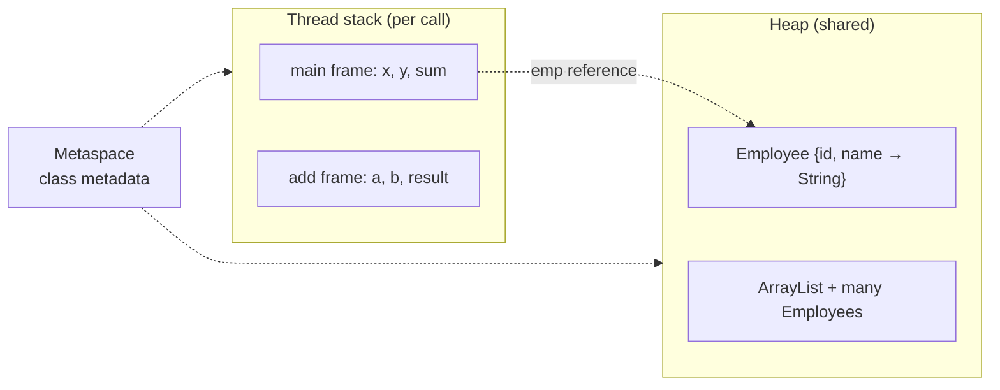
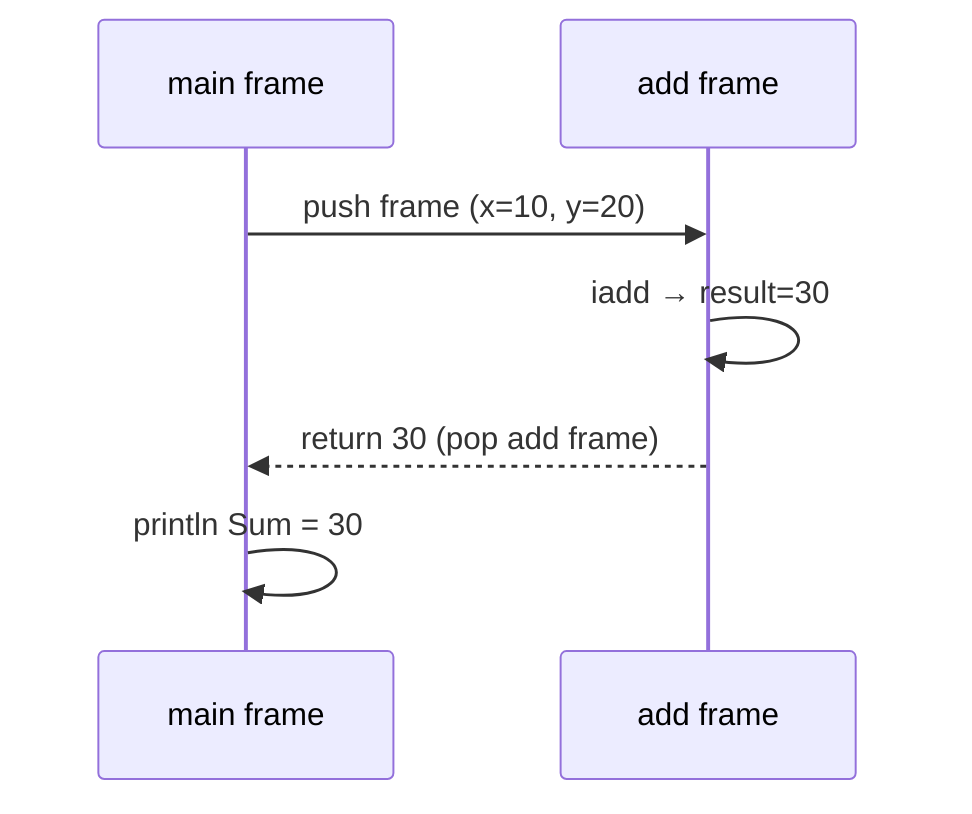
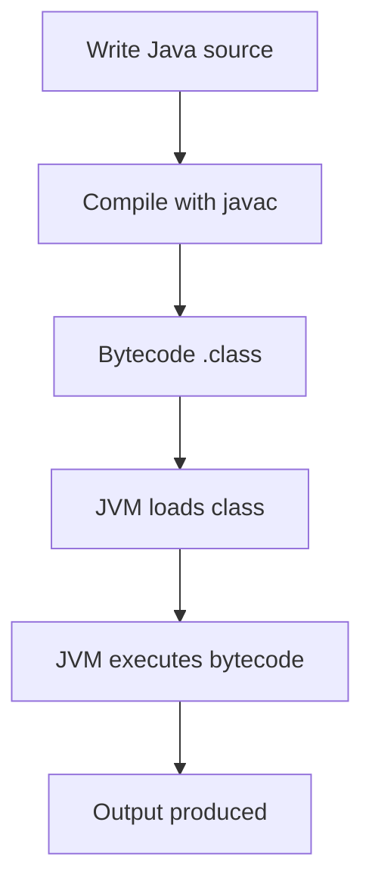

# Lab 1: JVM and Compilation

**Module:** 1 — Java Fundamentals and the JVM  
**Lab folder:** `labs/Week 1 - Java and JVM Foundations/module-01/lab1/`  
**Difficulty:** Beginner–Intermediate  
**Duration:** 90–120 minutes

**Primary IDE:** IntelliJ IDEA Community Edition · **Optional IDE:** VS Code

| OS | How-to for this lab |
| -- | ------------------- |
| Windows | [LAB-1-WINDOWS.md](LAB-1-WINDOWS.md) |
| macOS | [LAB-1-MACOS.md](LAB-1-MACOS.md) |

> **Environment reminder:** Finish [Lab 0](../../module-00/lab0/LAB-0-GUIDE.md). Use **JDK 21** and **IntelliJ IDEA Community** (primary) or **VS Code** (optional). Workspace: `java-bootcamp` (Windows: `%USERPROFILE%\java-bootcamp`).

> **Pre-lab exercises:** Complete [`../exercises/`](../exercises/) (from the Module 1 slides) before starting this lab.

---

## How to follow this lab

1. Open the **Windows** or **macOS** how-to (links above) in a second tab.
2. Create/work only under your `java-bootcamp/examples/…` folder from the steps (not inside this `labs/` git clone unless a step says otherwise).
3. For each **Step N**: read **Why** (if present) → do the actions → confirm **Expected** / **Expected result** → then continue.
4. When stuck, use **Failure Experiments** / troubleshooting in this guide before asking for help.
5. Capture evidence under `notes/screenshots/lab-1/` (workspace root under `java-bootcamp`; redact secrets). Use the **Pass criteria** tables — write **Pass** or **Fail** in your notes. GitHub file view does not support clickable checkboxes.

## Lab 0 baseline you must already have

Before any Lab 1 step, confirm this (from [Lab 0](../../module-00/lab0/LAB-0-GUIDE.md)):

```powershell
java -version          # 21.x
javac -version         # 21.x
javap -version         # 21.x
# PowerShell: echo $env:JAVA_HOME
# macOS/Linux: echo $JAVA_HOME
```

| From Lab 0 | Used in Lab 1 |
| ---------- | ------------- |
| VS Code and/or IntelliJ on **laptop** | Edit `.java` files |
| JDK 21 (`javac` / `java` / `javap`) | Compile, run, inspect bytecode |
| `java-bootcamp` workspace | `examples/jvm-compilation-lab/` |

Maven is **not** required for Lab 1 (plain `javac` / `java`). If any check fails, **stop and re-do Lab 0**.

---

## Lab Overview

This Module 1 lab builds **JVM literacy** before you touch Spring Boot, Maven multi-module builds, or the Customer Management Platform. You will write small Java programs, compile them with `javac`, run them with `java`, inspect bytecode with `javap`, watch class loading, and observe how the stack and heap relate to ordinary method calls and `new` objects.

**Purpose.** Enterprise Java teams debug production incidents in terms of heap size, GC flags, classloading, and bytecode-level surprises. Lab 1 forces the mental model: **source → bytecode → JVM load → execute**.

**What success looks like.** Under `java-bootcamp/examples/jvm-compilation-lab/` you have four source files (`HelloWorld`, `Calculator`, `Employee`, `MemoryDemo`), matching `.class` files after compile, evidence of `javap -c`, verbose class load output, heap-related flags, and short written answers about stack versus heap.

**Depends on Lab 0.** If the IDE, `java`, or `javac` fail, stop and fix Lab 0 / [SETUP-INSTRUCTIONS.md](../../../SETUP-INSTRUCTIONS.md).

**CRM connection (future only).** Later labs build the **Customer Management Platform**. This lab does **not** create CRM services. It uses pedagogical types (`Employee`, name `Aman`) so you can see object allocation clearly.

---

## Learning Objectives

After completing this lab, you will be able to:

* Create Java source files in the standard bootcamp workspace using VS Code or IntelliJ
* Compile `.java` sources to `.class` bytecode with `javac` and explain what the compiler produced
* Execute entry-point classes with `java` and state why the command takes a **class name**, not a `.java` path
* Inspect method signatures and disassembled bytecode with `javap` and `javap -c`
* Trace simple method-call flow (`main` → `add` → return) and map locals / frames to the **stack**
* Explain object creation (`new Employee(...)`) and map instance fields / `String` objects to the **heap**
* Observe JVM class loading with `-verbose:class` or `-Xlog:class+load`
* Interpret basic memory and GC-related flags (`-Xms`, `-Xmx`, `PrintFlagsFinal`, G1 mentions)
* Clean and recompile wisely (delete `*.class` without deleting sources) and re-verify all programs
* Articulate how this local JVM workflow later maps to Maven/`mvn compile` and Spring Boot packaging (conceptually)

---

## Business Scenario

Northstar Financial Services is onboarding you onto a greenfield **Customer Management Platform**. Before you open tickets for customer `CUS-1001` (Amina Khan) or write Spring controllers, the platform lead requires every engineer to demonstrate JVM fundamentals on **their laptop**.

Today’s onboarding pass list is pedagogical, not CRM:

* Prove you can compile and run a tiny `HelloWorld` that prints `Hello, JVM!`
* Prove you can read bytecode for a `Calculator` (stack-friendly primitives)
* Prove you understand heap allocation using an `Employee` object (`id=101`, `name="Aman"`)
* Prove you can stress allocation with `MemoryDemo` and talk about `-Xmx` without fear
* Capture evidence (screenshots + short answers) for the training LMS

**Why Aman / Employee instead of CUS-1001 here?** Keep mental bandwidth on memory and bytecode. Customer IDs and REST APIs appear when the architecture becomes a multi-tier CRM.

**Security note for evidence.** Do not paste GitHub credentials or tokens into lab notes. Class files and source under `examples/` are fine to submit; never ship production heap dumps that contain customer PII into public chat.

---

## Architecture Context

### Compile → load → execute


### Stack versus heap (beginner picture)



### Tools in this lab

| Tool | Role |
| ---- | ---- |
| `javac` | Compiles `.java` → `.class` |
| `java` | Starts a JVM and runs a class’s `main` |
| `javap` | Disassembles / inspects `.class` |
| VS Code or IntelliJ | Edit sources; run the same terminal commands; IntelliJ also supports green-arrow Run |
| Optional VisualVM / `jconsole` | Attach to a live JVM (bonus only) |

**Architecture NOW:** local JDK on your laptop. **Architecture LATER:** same JVM bytecode model inside Spring Boot JARs and (in later weeks) containers.

---

## Prerequisites

Complete [Lab 0](../../module-00/lab0/LAB-0-GUIDE.md) and skim [SETUP-INSTRUCTIONS](../../../SETUP-INSTRUCTIONS.md). Confirm:

* **JDK 21** with `javac`, `java`, and `javap` on `PATH`
* **VS Code** and/or **IntelliJ IDEA Community** with `java-bootcamp` open
* No secrets (keys, tokens, passwords) committed to Git

### Pre-flight

Run these in your IDE’s integrated terminal on the **laptop**:

**Windows PowerShell:**

```powershell
java -version
javac -version
javap -version
git --version
Get-Location
Get-ChildItem $env:USERPROFILE\java-bootcamp
```

**macOS / Linux:**

```bash
java -version
javac -version
javap -version
git --version
pwd
ls ~/java-bootcamp
```

**Expected result (versions may vary slightly):**

```text
openjdk version "21...."
javac 21....
javap 21....
git version 2....
... examples  notes
```

Fix environment failures before writing application code.

---

## Suggested Project Files

Create everything under the bootcamp workspace:

**Windows:** `%USERPROFILE%\java-bootcamp\examples\jvm-compilation-lab`  
**macOS / Linux:** `~/java-bootcamp/examples/jvm-compilation-lab`

```text
java-bootcamp/examples/jvm-compilation-lab/
├── HelloWorld.java
├── Calculator.java
├── Employee.java
├── MemoryDemo.java
├── (after compile)
│   HelloWorld.class
│   Calculator.class
│   Employee.class
│   MemoryDemo.class
└── notes/                    # optional short answers for deliverables
    └── lab1-answers.md
```

Ignore build artifacts in Git if you later commit this folder:

```text
*.class
*.log
hs_err_pid*
replay_pid*
```

---

## Concepts to Discuss

Before coding, write two or three sentences for each prompt. Revisit after Checkpoint C.

1. **Why bytecode?** Why does Java compile to platform-neutral bytecode instead of a native `.exe` on each OS?
2. **Class name vs file path.** Why does `java HelloWorld` omit `.class`, and what goes wrong if you type `java HelloWorld.java` or `java helloworld`?
3. **Stack frames.** What is created when `main` calls `Calculator.add`, and what happens to that frame on `return`?
4. **Heap identity.** In `Employee emp = new Employee(101, "Aman")`, what lives on the stack versus the heap?
5. **Class loading cost.** Why does `java -verbose:class Employee` print dozens of JDK classes before your `Employee` line?
6. **`-Xmx` / source of truth.** What does `-Xmx` constrain, and if `.java` and `.class` disagree after an edit without `javac`, which file does `java` execute?
7. **Forward look.** How will Maven (`mvn compile`) change *tooling* but not the javac → bytecode → JVM story for the future CRM?

---

## Implementation Steps

Complete each step in order. Prefer the **IDE integrated terminal**. Opening the folder differs slightly by IDE; compile/run commands are the same.

### Step 1 — Create the lab directory and open it

**Why:** A known path under `java-bootcamp/examples/` matches Lab 0 conventions and keeps evidence easy to grade.

**Do this:**

**Windows PowerShell:**

```powershell
$lab = Join-Path $env:USERPROFILE 'java-bootcamp\examples\jvm-compilation-lab'
New-Item -ItemType Directory -Force -Path $lab | Out-Null
Set-Location $lab
Get-Location
Get-ChildItem
```

**macOS / Linux:**

```bash
mkdir -p ~/java-bootcamp/examples/jvm-compilation-lab
cd ~/java-bootcamp/examples/jvm-compilation-lab
pwd
ls
```

**Open the folder in your IDE:**

| IDE | How |
| --- | --- |
| **VS Code** | **File → Open Folder…** → select `jvm-compilation-lab` (or keep `java-bootcamp` open and navigate in Explorer). Open **Terminal → New Terminal** and `cd` into the lab folder. |
| **IntelliJ** | **File → Open…** → select `jvm-compilation-lab`. Trust the project. Set **Project SDK = 21**. Open **View → Tool Windows → Terminal**. |

**Expected result:**

```text
.../java-bootcamp/examples/jvm-compilation-lab
```

(Empty listing is fine before sources exist.)

**If it fails:**

* `No such file or directory` / path not found for `java-bootcamp` → finish [Lab 0](../../module-00/lab0/LAB-0-GUIDE.md) workspace creation.
* IntelliJ has no SDK → add Temurin 21 under **Project Structure → Project**.

---

### Step 2 — Create and run HelloWorld

**Why:** Establishes the full write → compile → run loop with a single predictable string for evidence.

**Do this:**

Create `HelloWorld.java` in the lab folder (VS Code / IntelliJ: New File).

```java
public class HelloWorld {
    public static void main(String[] args) {
        System.out.println("Hello, JVM!");
    }
}
```

**Compile and run (terminal — both IDEs):**

```powershell
# Ensure you are in jvm-compilation-lab
javac HelloWorld.java
java HelloWorld
```

**IntelliJ green arrow (optional after `javac`, or instead for run-only if the IDE compiles for you):** click the green ▶ next to `main` → **Run ‘HelloWorld.main()’**. Still practice terminal `javac` / `java` for this lab’s grading evidence.

**Expected result:**

```text
Hello, JVM!
```

After compile, the folder should show both source and bytecode:

```text
HelloWorld.java
HelloWorld.class
```

**If it fails:**

* `javac: command not found` → JDK not on PATH; revisit Lab 0 Java install / `JAVA_HOME`.
* `error: class HelloWorld is public, should be declared in a file named...` → filename/casing mismatch (`HelloWorld.java` exact).
* `Error: Could not find or load main class HelloWorld` → wrong directory, or you never ran `javac`, or you typed `java HelloWorld.class`.

**What you should learn**

* `.java` = source; `.class` = bytecode
* `javac` compiles; `java` starts the JVM and executes bytecode
* The JVM does **not** read your `.java` file at runtime (unless you use tools that compile on the fly—out of scope here)

---

### Step 3 — Inspect generated files

**Why:** Makes the compiler’s output tangible so “bytecode file” is not abstract.

**Do this:**

**Windows PowerShell:**

```powershell
Get-ChildItem HelloWorld.*
```

**macOS / Linux:**

```bash
ls -l HelloWorld.*
file HelloWorld.class   # optional if `file` is installed
```

**Expected result:**

```text
HelloWorld.java
HelloWorld.class
```

**Question (write in notes):** What is the difference between `HelloWorld.java` and `HelloWorld.class`?

**Model answer sketch:** `.java` is human-authored source; `.class` is binary bytecode (plus metadata) for the JVM. You edit `.java`; the JVM executes `.class`.

**If it fails:**

* Only `.java` appears → `javac` did not succeed; scroll for compiler errors.
* Only `.class` appears → you may have deleted source; restore from Step 2 before continuing.

---

### Step 4 — Inspect bytecode using javap

**Why:** Shows that “compiled Java” is a sequence of JVM instructions, not machine code for one CPU.

**Do this:**

```powershell
javap HelloWorld
javap -c HelloWorld
```

**Expected result (signatures — `javap` without `-c`):**

```text
Compiled from "HelloWorld.java"
public class HelloWorld {
  public HelloWorld();
  public static void main(java.lang.String[]);
}
```

**Expected bytecode theme (`javap -c`) — instruction names and order matter; exact offsets may vary slightly by JDK:**

```text
public static void main(java.lang.String[]);
  Code:
     0: getstatic     #2  // Field java/lang/System.out:Ljava/io/PrintStream;
     3: ldc           #3  // String Hello, JVM!
     5: invokevirtual #4  // Method java/io/PrintStream.println:(Ljava/lang/String;)V
     8: return
```

Capture a screenshot of `javap -c HelloWorld` for deliverables.

**If it fails:**

* `Could not find HelloWorld` → run from the directory that contains `HelloWorld.class`.
* `javap: command not found` → full JDK required (JRE-only installs lack `javap`); fix Lab 0 JDK package.

**What you should learn**

* Bytecode is the JVM instruction format (`getstatic`, `ldc`, `invokevirtual`, `return`, …)
* The JVM executes bytecode, not Java source text
* `javap -c` is your first “X-ray” into what `javac` emitted

---

### Step 5 — Create a Calculator program

**Why:** Integer locals and `invokestatic` make stack behavior easier to see than UI apps.

**Do this:**

Create `Calculator.java`:

```java
public class Calculator {
    public static int add(int a, int b) {
        int result = a + b;
        return result;
    }

    public static void main(String[] args) {
        int x = 10;
        int y = 20;
        int sum = add(x, y);

        System.out.println("Sum = " + sum);
    }
}
```

Compile, run, and disassemble (terminal):

```powershell
javac Calculator.java
java Calculator
javap -c Calculator
```

**IntelliJ:** you may also click the green ▶ on `Calculator.main`; still capture terminal `javap` output.

**Expected result:**

```text
Sum = 30
```

In `javap -c Calculator`, look for instructions such as:

```text
iload
istore
iadd
invokestatic
invokevirtual
return
```

Example theme inside `add` (exact constant-pool indexes vary):

```text
public static int add(int, int);
  Code:
     0: iload_0
     1: iload_1
     2: iadd
     3: istore_2
     4: iload_2
     5: ireturn
```

**If it fails:**

* `Sum = 1020` or similar string concatenation bug → you printed `"" + x + y` instead of calling `add`; re-check source.
* Compiler error on missing braces → fix syntax; `javac` messages include file:line.

---

### Step 6 — Understand stack and method calls

**Why:** Connects Calculator code to the runtime memory model you will reuse for every Spring request thread later.

**Do this:**

Using `Calculator.java`, fill this table in your notes (from reading the code + bytecode, not guessing):

| Code element | Memory area |
| ------------ | ----------- |
| Locals `x`, `y`, `sum` in `main` | Stack (locals in `main` frame) |
| Parameters `a`, `b` and local `result` in `add` | Stack (`add` frame) |
| Method call `add(x, y)` | New stack frame pushed, then popped on return |
| Class metadata for `Calculator` | Metaspace (simplified course term) |
| Temporary `String` for `"Sum = " + sum` | Heap (String / builder intermediates) |

Study the call flow:



Optional deeper look:

```powershell
javap -c -p Calculator
```

**Expected result:** You can narrate, without notes, that each call pushes a frame and `return` pops it; primitives in this demo stay in frames unless boxed/stored in objects.

**If it fails (conceptual):**

* “Everything is on the heap” → revisit: method locals of `int` are stack/frame storage; objects from `new` are heap.
* Confusing Metaspace with heap → class *metadata* vs object *instances*.

---

### Step 7 — Object creation and heap memory

**Why:** Shows references on the stack pointing at objects on the heap—the pattern behind every CRM entity later.

**Do this:**

Create `Employee.java`:

```java
public class Employee {
    private int id;
    private String name;

    public Employee(int id, String name) {
        this.id = id;
        this.name = name;
    }

    public void display() {
        System.out.println(id + " - " + name);
    }

    public static void main(String[] args) {
        Employee emp = new Employee(101, "Aman");
        emp.display();
    }
}
```

Compile and run:

```powershell
javac Employee.java
java Employee
```

**Expected result:**

```text
101 - Aman
```

**Memory explanation (draw this in notes):**


Optional:

```powershell
javap -c Employee
```

Look for `new`, `dup`, `invokespecial` (constructor), and `invokevirtual` (`display`).

**If it fails:**

* Output missing hyphen or name → typo in `display` or constructor args.
* `illegal start of expression` → missing braces in the class body.

**Pedagogy reminder:** `Aman` is a lab alias for teaching allocation. Future CRM labs use `CUS-1001` / Amina Khan on service APIs—not in this folder’s required types.

---

### Step 8 — Observe class loading

**Why:** Demystifies “slow first request” and shows the JVM loads far more than your one class.

**Do this:**

```powershell
java -verbose:class Employee
```

On newer JDK logging style (also valid on JDK 21):

```powershell
java -Xlog:class+load Employee
```

Scroll for lines that mention:

```text
java.lang.Object
java.lang.String
java.lang.System
Employee
```

Redirect to a file if the terminal floods:

**Windows PowerShell:**

```powershell
java -verbose:class Employee > classload-employee.txt 2>&1
Select-String -Path classload-employee.txt -Pattern 'Employee' | Select-Object -First 5
```

**macOS / Linux:**

```bash
java -verbose:class Employee > classload-employee.txt 2>&1
wc -l classload-employee.txt
grep -n "Employee" classload-employee.txt | head
```

**Expected result:**

* Program still prints `101 - Aman`
* Log shows many JDK classes loaded **before** or around your application class
* Your `Employee` class appears in the load list

Screenshot a portion showing both bootstrap classes and `Employee`.

**If it fails:**

* Flag rejected → confirm `java -version` is 21; try the alternate flag form above.
* No `Employee` line → wrong working directory / class not found; fix run first without verbose flags.

**What you should learn**

The JVM loads (and links) a web of classes to start even a tiny main. Frameworks (Spring) add more—same mechanism, larger graph.

---

### Step 9 — Trigger more object allocation (MemoryDemo)

**Why:** Makes heap pressure visible; connects to `-Xmx` and later production memory settings.

**Do this:**

Create `MemoryDemo.java` in the same folder (it depends on `Employee`):

```java
import java.util.ArrayList;
import java.util.List;

public class MemoryDemo {
    public static void main(String[] args) {
        List<Employee> employees = new ArrayList<>();

        for (int i = 1; i <= 100000; i++) {
            employees.add(new Employee(i, "Employee-" + i));
        }

        System.out.println("Created " + employees.size() + " employees");
    }
}
```

Compile **both** classes and run:

```powershell
javac Employee.java MemoryDemo.java
java MemoryDemo
```

**Expected result:**

```text
Created 100000 employees
```

**Optional run with constrained heap:**

```powershell
java -Xms64m -Xmx64m MemoryDemo
```

Often this still succeeds at 100_000 modest objects; the point is to *practice* setting heap bounds. For a deliberate OOM exercise, see Failure Experiments.

**If it fails:**

* `cannot find symbol: class Employee` → compile `Employee.java` in the same directory first (or together as above).
* `OutOfMemoryError` on tiny `-Xmx` → raise `-Xmx` or reduce loop count for evidence; explain what failed.

---

### Step 10 — View JVM memory options

**Why:** Production tickets often cite `MaxHeapSize` / GC choice; you should know how to print flags safely.

**Do this:**

**Windows PowerShell:**

```powershell
java -XX:+PrintFlagsFinal -version 2>&1 |
  Select-String -Pattern 'InitialHeapSize|MaxHeapSize|UseG1GC'
```

**macOS / Linux:**

```bash
java -XX:+PrintFlagsFinal -version 2>&1 | grep -E "InitialHeapSize|MaxHeapSize|UseG1GC"
```

**Expected result (values vary by machine RAM and ergonomics):**

```text
... InitialHeapSize ...
... MaxHeapSize ...
... UseG1GC ...
```

Example shape (numbers **will** differ on your laptop):

```text
uintx InitialHeapSize                          := 268435456
uintx MaxHeapSize                              := 4294967296
bool UseG1GC                                   := true
```

Record the three names and your observed values in notes (not memorize for all machines).

**If it fails:**

* Huge output overwhelms the IDE terminal → filter as above or redirect to `flags.txt`.
* Flag unknown on a non-HotSpot build → stay on Lab 0 Temurin OpenJDK 21.

---

### Step 11 — Clean compiled files and recompile

**Why:** Reinforces that `.class` is rebuildable output; sources are the assets you protect.

**Do this:**

**Windows PowerShell:**

```powershell
Set-Location (Join-Path $env:USERPROFILE 'java-bootcamp\examples\jvm-compilation-lab')
Get-ChildItem *.class
Remove-Item -Force *.class
Get-ChildItem
javac HelloWorld.java Calculator.java Employee.java MemoryDemo.java
Get-ChildItem *.class
java HelloWorld
java Calculator
java Employee
java MemoryDemo
```

> **PowerShell tip:** Prefer naming the four `.java` files explicitly. `javac *.java` can behave differently than in bash.

**macOS / Linux:**

```bash
cd ~/java-bootcamp/examples/jvm-compilation-lab
ls *.class
rm -f *.class
ls
javac *.java
ls *.class
java HelloWorld
java Calculator
java Employee
java MemoryDemo
```

**Expected result:**

After delete, only `.java` (and notes) remain. After `javac`, four `.class` files return. Outputs:

```text
Hello, JVM!
Sum = 30
101 - Aman
Created 100000 employees
```

**If it fails:**

* No `.class` files to delete → already clean; proceed to `javac`.
* Accidental delete of `.java` → restore from editor local history / re-type from this guide. Prefer deleting `*.class` only; never delete the whole folder blindly.
* `javac *.java` expands oddly in PowerShell → compile files by name as shown above.

---

## Implementation Checkpoints

Each answer must cite a command, screenshot, or file from **this** lab.

### Checkpoint A — After HelloWorld + javap

* Show `Hello, JVM!` from `java HelloWorld`.
* Show a directory listing with `HelloWorld.java` **and** `HelloWorld.class`.
* Show `javap -c HelloWorld` including `getstatic` / `ldc` / `invokevirtual` / `return`.
* Force one failure: rename class in source without renaming file (or vice versa) → read `javac` error → restore.
* Explain in one sentence why `java` did not need the `.java` file after a successful compile.

### Checkpoint B — After Calculator + stack discussion

* Show `Sum = 30` and a `javap -c Calculator` snippet with `iadd` / `invokestatic`.
* Complete the stack/heap table from Step 6 in your notes.
* Narrate the `main` → `add` → return frame flow without reading the guide.
* Force one failure: change `add` to return `a - b` without recompiling, run old `.class`, observe stale `30`, then recompile and see the new result—explain source-of-truth.

### Checkpoint C — After MemoryDemo + flags

* Show `101 - Aman` and `Created 100000 employees`.
* Show a snippet of `-verbose:class` or `-Xlog:class+load` including `Employee`.
* Show filtered `PrintFlagsFinal` lines for `InitialHeapSize`, `MaxHeapSize`, `UseG1GC`.
* Optional: run once with `-Xms64m -Xmx64m` and note whether it succeeded.
* State one forward-looking sentence: how CRM services on the same JDK would still be “bytecode + heap + threads.”

### Cross-cutting

* Confirm work lives under `java-bootcamp/examples/jvm-compilation-lab/` on your laptop.
* Confirm no secrets in notes/screenshots.
* Sketch stack vs heap for `Employee emp = new Employee(101, "Aman")` from memory.

---

## Reference Commands, Configuration, and Code

### Cheat sheet — everyday flags and tools

| Command | Purpose |
| ------- | ------- |
| `javac File.java` | Compile one source |
| `javac *.java` | Compile all sources (bash; on PowerShell prefer named files) |
| `java ClassName` | Run `ClassName.main` (no `.class` suffix) |
| `javap ClassName` | Show public members |
| `javap -c ClassName` | Disassemble bytecode |
| `javap -c -p ClassName` | Include private members |
| `java -verbose:class ClassName` | Trace class loads (classic) |
| `java -Xlog:class+load ClassName` | Trace class loads (Unified JVM Logging) |
| `java -Xms64m -Xmx64m ClassName` | Set initial / max heap |
| `java -XX:+PrintFlagsFinal -version` | Dump final flag values |

### Quick classpath reminder

```powershell
# Same directory (this lab):
javac Employee.java MemoryDemo.java
java MemoryDemo

# Explicit classpath (preview of later labs):
java -cp . MemoryDemo
```

### Canonical sources (copy targets)

* `HelloWorld.java` — prints `Hello, JVM!`
* `Calculator.java` — `add(10,20)` → `Sum = 30`
* `Employee.java` — `101 - Aman`
* `MemoryDemo.java` — `Created 100000 employees`

Instructor reference solution (do not peek until asked): [`solution/`](solution/).

### Sample `javap -c` themes to recognize

```text
# println path
getstatic / ldc / invokevirtual / return

# int add
iload / iadd / istore / ireturn

# object construction
new / dup / invokespecial / astore
```

---

## Manual Verification

Capture evidence for grading from your IDE terminal and Explorer / Project view.

### Commands to re-run (full smoke)

**Windows PowerShell:**

```powershell
Set-Location (Join-Path $env:USERPROFILE 'java-bootcamp\examples\jvm-compilation-lab')
java -version
javac -version
javap -version

javac HelloWorld.java Calculator.java Employee.java MemoryDemo.java
java HelloWorld
java Calculator
java Employee
java MemoryDemo

javap -c HelloWorld
java -verbose:class Employee 2>&1 | Select-Object -Last 30
java -XX:+PrintFlagsFinal -version 2>&1 |
  Select-String -Pattern 'InitialHeapSize|MaxHeapSize|UseG1GC'
Get-ChildItem *.java, *.class
```

**macOS / Linux:**

```bash
cd ~/java-bootcamp/examples/jvm-compilation-lab
java -version
javac -version
javap -version

javac *.java
java HelloWorld
java Calculator
java Employee
java MemoryDemo

javap -c HelloWorld | head -n 40
java -verbose:class Employee 2>&1 | tail -n 30
java -XX:+PrintFlagsFinal -version 2>&1 | grep -E "InitialHeapSize|MaxHeapSize|UseG1GC"
ls -l *.java *.class
```

### Evidence capture (Pass/Fail in notes)

| # | What to capture | How | Pass criteria |
| - | --------------- | --- | ------------- |
| 1 | Java / javac versions | Terminal screenshot | OpenJDK **21** visible |
| 2 | Successful compilation | `javac` + listing of `.class` files | Four `.class` files present |
| 3 | Program outputs | Run all four mains | Exact strings from Expected results |
| 4 | Bytecode | `javap -c HelloWorld` (and ideally Calculator) | `getstatic`/`ldc`/`invokevirtual` visible |
| 5 | Class loading | `-verbose:class` or `-Xlog:class+load` | JDK classes + `Employee` |
| 6 | Sources in Explorer | IDE screenshot | Folder `jvm-compilation-lab` with four `.java` files |
| 7 | (Optional) Flags | `PrintFlagsFinal` filter | `MaxHeapSize` / `UseG1GC` lines |

Submit **your own** captures. Always redact secrets.

---

## Failure Experiments

Perform at least **three** controlled experiments on your laptop. Record symptom → root cause → fix. Restore a working PATH and working sources when finished.

### Experiment 1 — Compile without `javac` on PATH

**Windows PowerShell (temporary):**

```powershell
$old = $env:Path
$env:Path = 'C:\Windows\System32'
javac HelloWorld.java
# restore:
$env:Path = $old
```

**macOS / Linux:**

```bash
bash
export PATH="/usr/bin:/bin"
hash -r
command -v javac || echo "javac not on PATH"
javac HelloWorld.java
exit
```

**Learning point:** “command not found” is an environment problem, not a Java syntax problem.

### Experiment 2 — Run the wrong class name

```powershell
javac HelloWorld.java
java helloworld          # wrong casing (fails on case-sensitive OS; may fail on Windows too)
java HelloWorld.class    # wrong argument shape
java HelloWorld          # correct
```

**Expected symptoms:** `Error: Could not find or load main class ...`  
**Learning point:** The argument is a binary class name matching the file `HelloWorld.class`.

### Experiment 3 — Stale bytecode (edit without recompile)

1. Run `java Calculator` → `Sum = 30`.
2. Change `add` to return `a * b` in source only; save.
3. Run `java Calculator` **without** `javac` → still `Sum = 30`.
4. Run `javac Calculator.java` then `java Calculator` → `Sum = 200`.

**Learning point:** `java` executes `.class`. Always recompile after source edits (Maven will do this for you later).

### Experiment 4 — (Optional) `-Xmx` too small / OOM

Only if the instructor allows a short stress test:

```powershell
java -Xmx8m MemoryDemo
```

You may see `java.lang.OutOfMemoryError: Java heap space`. Restore normal `MemoryDemo` (100_000) afterward.

**Learning point:** `-Xmx` caps heap; allocation beyond the cap fails fast.

---

## Troubleshooting

| Symptom | Likely cause | Fix |
| ------- | ------------ | --- |
| `javac` / `java` / `javap: command not found` | JDK missing or not on PATH (or JRE-only missing `javap`) | Revisit Lab 0; confirm full JDK 21 and `JAVA_HOME`; new IDE terminal |
| `class ... should be declared in a file named` | Public class / filename mismatch | Rename file or class so they match exactly |
| `Could not find or load main class` | Wrong dir, wrong name, missing `.class`, or used `.java` suffix | `cd` to lab folder; list files; `javac`; `java ClassName` |
| Changes not reflected when running | Forgot recompile | `javac` again; see Failure Experiment 3 |
| `cannot find symbol: class Employee` | `MemoryDemo` compiled alone | `javac Employee.java MemoryDemo.java` |
| `OutOfMemoryError` | Heap too small for allocation | Raise `-Xmx` or reduce loop |
| `PrintFlagsFinal` floods terminal | Normal volume | Filter with `Select-String` / `grep` or file |
| IntelliJ “SDK not defined” | Project SDK unset | **Project Structure → Project → SDK 21** |
| PowerShell `javac *.java` oddities | Globbing differences | Name files explicitly |

---

## Security and Production Review

Answer in your notes (for example `notes/lab1-security.md`). Forward-looking—CRM is not running yet.

1. **Bytecode as artifact:** Why might an enterprise forbid copying raw `.class` files between machines without a reproducible build (Maven/CI)?
2. **Heap dumps:** If a future CRM JVM writes a heap dump on OOM, what privacy risk appears if customer PII sits in memory? Who should access dumps?
3. **Logging secrets:** Why must you never print passwords or cloud access keys—even in a tiny training `main`?
4. **Classpath trust:** What risk exists if a malicious `Employee.class` appears earlier on the classpath than your build output?
5. **Flag / container limits:** Why is casually setting `-Xmx` without matching container memory limits dangerous in production?
6. **Production delta:** Name three controls Northstar would add before real customer workloads (non-root user, memory limits, CI-signed artifacts, no secrets in logs).

---

## Cleanup

Capture grading evidence **before** aggressive cleanup.

**Keep:**

* All four `.java` sources under `java-bootcamp/examples/jvm-compilation-lab/`
* Your notes / answer file
* Screenshots stored where the LMS expects them

**Safe cleanup of rebuildable outputs:**

**Windows PowerShell:**

```powershell
Set-Location (Join-Path $env:USERPROFILE 'java-bootcamp\examples\jvm-compilation-lab')
Remove-Item -Force *.class, classload-employee.txt, flags.txt -ErrorAction SilentlyContinue
Get-ChildItem
```

**macOS / Linux:**

```bash
cd ~/java-bootcamp/examples/jvm-compilation-lab
rm -f *.class classload-employee.txt flags.txt
ls
```

**Do not:**

* Delete the entire `java-bootcamp` tree
* Uninstall Lab 0 tooling (JDK, Maven)
* Commit heap dumps, `hs_err_pid*`, or credential files

After grading, you may keep `.class` files locally; they are not sacred—sources are.

---

## Expected Deliverables

Submit according to your LMS or instructor dropbox:

### 1. Source code files

* `HelloWorld.java`
* `Calculator.java`
* `Employee.java`
* `MemoryDemo.java`

### 2. Screenshots / terminal evidence

* Java / javac version check (JDK 21)
* Successful compilation (`javac` + listing of `.class` files)
* Program execution outputs for all four entry points
* `javap -c` bytecode output (HelloWorld minimum; Calculator recommended)
* Class loading output (`-verbose:class` or `-Xlog:class+load`)
* (Recommended) filtered `PrintFlagsFinal` lines

### 3. Short lab report answers

* What does `javac` do?
* What is bytecode?
* Why is bytecode platform-independent?
* What is the role of the JVM?
* Where are objects stored?
* Where are method calls / frames stored?
* What happens when a class is loaded?

Optional: failure-experiment log (min. three); Security and Production Review answers; Checkpoint A–C notes.

---

## Evaluation Rubric (100 Marks)

| Criteria | Marks | What reviewers look for |
| -------- | ----: | ----------------------- |
| Environment readiness (IDE, JDK 21, correct folder) | 10 | Pre-flight versions; path under `examples/jvm-compilation-lab` |
| HelloWorld compile / run / file inspection | 10 | Exact `Hello, JVM!`; `.java` + `.class` evidence |
| `javap` bytecode literacy | 15 | Readable `javap -c` capture; can name key opcodes |
| Calculator + stack explanation | 15 | `Sum = 30`; coherent stack-frame narrative / table |
| Employee heap model | 10 | `101 - Aman`; correct stack-ref vs heap-object sketch |
| Class loading observation | 10 | Verbose/Xlog evidence including JDK + `Employee` |
| MemoryDemo + heap flags awareness | 10 | `Created 100000 employees`; `PrintFlagsFinal` or `-Xmx` notes |
| Clean / recompile discipline | 5 | Shows delete `*.class` then successful rebuild |
| Evidence quality + written answers | 10 | Clear screenshots; seven short answers present |
| Failure experiments / security awareness | 5 | At least one controlled failure + thoughtful security note |

Partial credit is normal if optional VisualVM/`jconsole` is skipped. Missing JDK 21, missing sources, or inability to explain `.java` vs `.class` typically blocks a pass.

---

## Reflection Questions

1. Which mental model changed most: “Java runs my `.java` file” versus “JVM runs bytecode”?
2. Why does enterprise onboarding spend time on `javap` before Spring annotations?
3. When `Calculator` printed a stale result, what process would you use in a large Maven CRM project to avoid the same bug class?
4. How does loading hundreds of classes at startup explain “JVM process up” versus “application ready”?
5. What evidence would convince a grader the bytecode screenshot is from **your** `HelloWorld`?
6. Looking forward: which Lab 1 idea will matter first when the CRM runs under Docker—heap limits, class loading, or bytecode inspection?

---

## Bonus Challenges

Complete only after core deliverables pass.

1. **VisualVM or `jconsole` attach:** Start a long-running variant (for example add `Thread.sleep` after allocating in a copy of `MemoryDemo`) and attach a local VisualVM/`jconsole` only if your laptop GUI policy allows. Capture a screenshot of heap usage. Prefer localhost-only JMX.

2. **Compare G1-related flags:** From `PrintFlagsFinal`, note `UseG1GC` and two related flags. Write five lines on what “default GC” means for a training laptop versus a latency-sensitive CRM API.

3. **StackOverflow recursion demo (careful):** Write a tiny `RecursionBomb` with an unbounded recursive method; run until `StackOverflowError`. Keep the demo separate from required files. Explain why this is a *stack* failure, not a heap OOM. Delete or quarantine the demo after evidence.

---

## Success Criteria

You have completed Lab 1 when you can:

_Mark each row **Pass** or **Fail** in your lab notes (GitHub markdown files are not interactive checklists)._

| # | Confirm | Your notes |
| - | ------- | ---------- |
| 1 | Work in `java-bootcamp/examples/jvm-compilation-lab/` on your laptop (VS Code and/or IntelliJ) | Pass / Fail |
| 2 | Compile and run `HelloWorld`, `Calculator`, `Employee`, and `MemoryDemo` with the exact expected outputs | Pass / Fail |
| 3 | Explain `.java` versus `.class` and demonstrate `javap -c` | Pass / Fail |
| 4 | Describe stack frames vs heap objects using Calculator and Employee | Pass / Fail |
| 5 | Show class-loading evidence and locate basic heap/GC flags | Pass / Fail |
| 6 | Clean `*.class`, recompile, and re-run successfully | Pass / Fail |
| 7 | Submit sources, screenshots, and short answers per the deliverables list | Pass / Fail |
| 8 | Articulate that this JVM flow underpins future CRM services (this lab does not build the CRM) | Pass / Fail |

This lab bridges Lab 0’s environment to Module 1 runtime fluency.

---

## Instructor Notes

**Before this lab:** run the full [Instructor Demonstration](INSTRUCTOR-DEMO.md) for the class (Demo 1–4: compile, inspect bytecode, create objects and observe memory, trigger garbage collection — ~30–40 minutes, complete runnable code and expected output included). Students then do their own version of these ideas below with `HelloWorld`, `Calculator`, `Employee`, and `MemoryDemo`.

**Core story to repeat (whiteboard):**



**Key takeaway line:** Java does not directly run source code. Source is compiled to bytecode; the JVM executes bytecode.

**Classroom pacing:** Pre-flight (~10) → HelloWorld+javap / Checkpoint A (~25) → Calculator+stack / Checkpoint B (~25) → Employee+verbose (~20) → MemoryDemo+flags+clean / Checkpoint C (~20) → Evidence (~10–20).

**Common misconceptions**

* “`java HelloWorld.java` is fine” — stick to classic `javac` / `java ClassName` for this lab.
* “Objects and locals both live on the heap” — force the Employee sketch.
* “`-verbose:class` means my app is broken” — normalize volume of JDK loads.
* “CRM must appear in Lab 1 code” — keep Aman/Employee; `CUS-1001` is future context only.

**Grading tips.** Prefer understanding over pretty bytecode formatting. Credit the stale-`.class` experiment. Fail closed if the student cannot produce `Hello, JVM!` or confuses `.java` / `.class` after coaching.

**Environment.** Primary: laptop + JDK 21 from Lab 0 + VS Code or IntelliJ. Reference solution: [`solution/`](solution/). Related: [SETUP-INSTRUCTIONS.md](../../../SETUP-INSTRUCTIONS.md) · [\_IDE-CONVENTIONS.md](../../_IDE-CONVENTIONS.md) · [Lab 0](../../module-00/lab0/LAB-0-GUIDE.md) · [Week 1 index](../../WEEK-LABS-INDEX.md)

Early finishers may attempt Bonus Challenges; do not skip ahead to Spring/CRM scaffolding until the module schedule says so.
