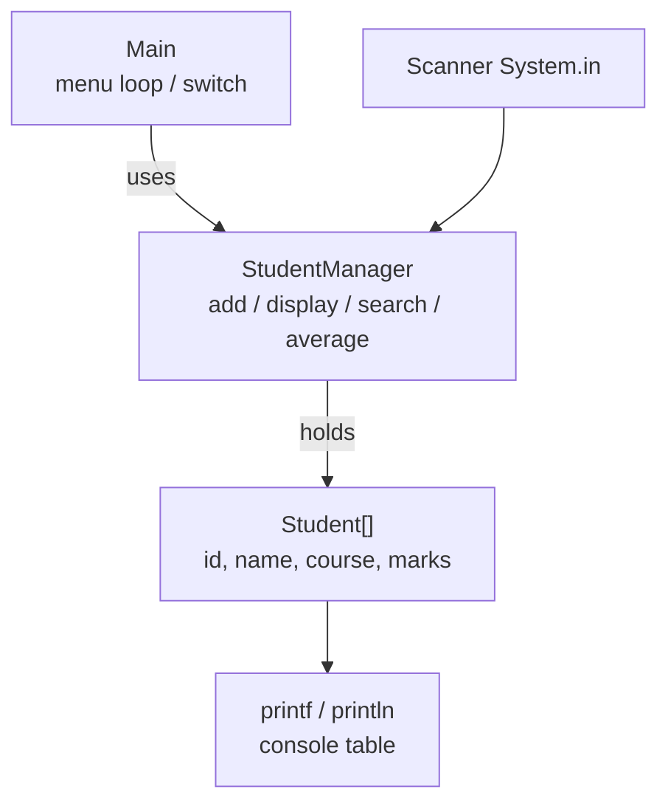
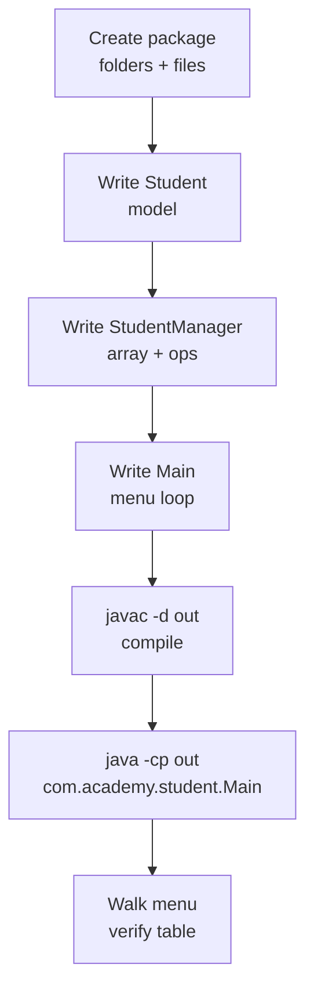
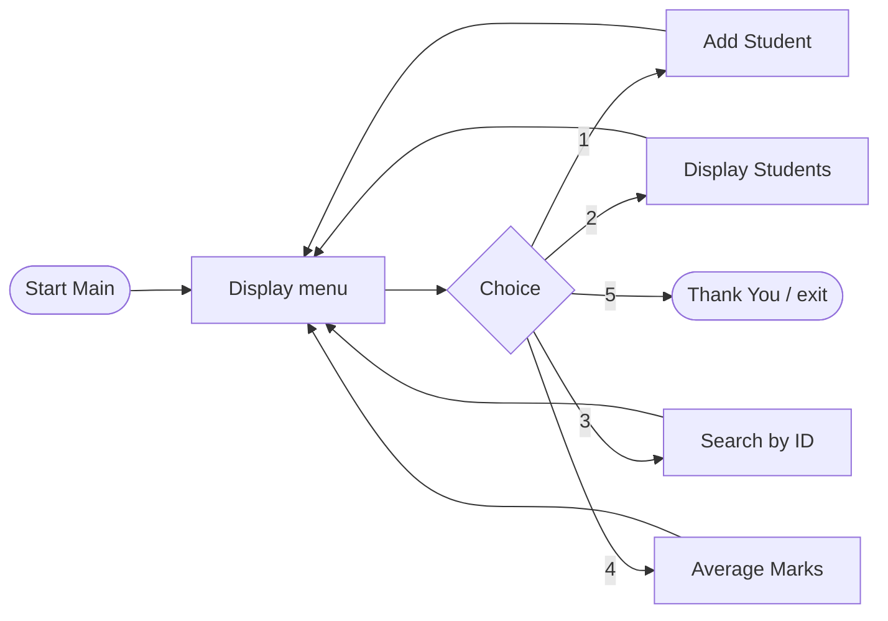
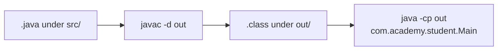

# Lab 2: Java Syntax and Input/Output

**Module:** 2 — Java Syntax and Core Constructs  
**Lab folder:** `labs/Week 1 - Java and JVM Foundations/module-02/lab2/`  
**Difficulty:** Beginner  
**Duration:** 2.5–3 hours  
**IDE conventions:** See [`../_IDE-CONVENTIONS.md`](../_IDE-CONVENTIONS.md)

**Primary IDE:** IntelliJ IDEA Community Edition · **Optional IDE:** VS Code

| OS | How-to for this lab |
| -- | ------------------- |
| Windows | [LAB-2-WINDOWS.md](LAB-2-WINDOWS.md) |
| macOS | [LAB-2-MACOS.md](LAB-2-MACOS.md) |

> **Environment reminder:** Finish [Lab 0](../../module-00/lab0/LAB-0-GUIDE.md). Use **JDK 21** and **IntelliJ IDEA Community** (primary) or **VS Code** (optional). Workspace: `java-bootcamp` (Windows: `%USERPROFILE%\java-bootcamp`).

> **Pre-lab exercises:** Complete [`../exercises/`](../exercises/) (from the Module 2 slides) before starting this lab.

---

## How to follow this lab

1. Open the **Windows** or **macOS** how-to (links above) in a second tab.
2. Create/work only under your `java-bootcamp/examples/…` folder from the steps (not inside this `labs/` git clone unless a step says otherwise).
3. For each **Step N**: read **Why** (if present) → do the actions → confirm **Expected** / **Expected result** → then continue.
4. When stuck, use **Failure Experiments** / troubleshooting in this guide before asking for help.
5. Capture evidence under `notes/screenshots/` (redact secrets). Use the **Pass criteria** tables — write **Pass** or **Fail** in your notes. GitHub file view does not support clickable checkboxes.

## Lab Overview

Build a **menu-driven Student Management console app** using packages, `Scanner`, arrays, methods, loops, validation, and `printf` formatting. No frameworks—plain JDK only.

**Purpose.** Before Spring Boot or databases, you must organize packages, read console input safely, separate model from manager logic, and produce readable output. Lab 2 builds that muscle memory.

**What you build.** Classes under package `com.academy.student`:

| Class | Role |
| ----- | ---- |
| `Student` | Model: id, name, course, marks |
| `StudentManager` | Array storage + add / display / search / average |
| `Main` | Menu loop and entry point |

**What success looks like.** Under `java-bootcamp/examples/Lab2-JavaSyntax/` you compile, run, walk the menu, and see a formatted student table.

**Project path (mirror the solution layout):**

```text
java-bootcamp/examples/Lab2-JavaSyntax/
  src/com/academy/student/
    Student.java
    StudentManager.java
    Main.java
  out/                    ← created by javac -d out
```

A reference implementation lives in [`solution/Lab2-JavaSyntax/`](solution/Lab2-JavaSyntax/). Use it only if you are stuck after trying—**do not copy blindly**; graders expect your own names, comments, and understanding.

---

## Learning Objectives

After this lab you will be able to:

* Create package folders that match `package com.academy.student`
* Open the project in **VS Code** or **IntelliJ IDEA Community** (SDK 21)
* Read console input with `Scanner` (`nextLine()` + parse)
* Store students in a fixed-size array with a counter
* Implement a `while (true)` menu loop with `switch`
* Format a table with `printf`
* Compile packages with `javac -d out` and run with `java -cp out ...`

---

## Business Scenario

A training institute needs a console app for registration week: add students, list them, search by ID, compute average marks, and exit. Mentors want plain JDK—no database, no GUI.

Demo data you should use later (matches the reference sample):

* Student ID `101`, Name `John`, Course `Java`, Marks `91`

---

## Architecture Context

### Layered console design



### Lab flow



### Menu flow



### Compile → run



---

## Prerequisites

Complete [Lab 0](../../module-00/lab0/LAB-0-GUIDE.md) and follow [`../_IDE-CONVENTIONS.md`](../_IDE-CONVENTIONS.md).

| Check | Must be true |
| ----- | ------------ |
| JDK | `java -version` and `javac -version` show **21.x** |
| Workspace | `java-bootcamp` exists on your laptop |
| IDE | Desktop **VS Code** and/or **IntelliJ IDEA Community** installed |
| Terminal | Integrated terminal works inside your IDE |

### Pre-flight

**Do this:**

**Windows PowerShell**

```powershell
java -version
javac -version
cd $env:USERPROFILE\java-bootcamp
pwd
```

**macOS / Linux**

```bash
java -version
javac -version
cd ~/java-bootcamp
pwd
```

**Expected result:** Both tools report 21.x. `pwd` (or PowerShell current path) ends under `java-bootcamp`.

**If it fails:** Re-do Lab 0. Fix `PATH` / `JAVA_HOME` before continuing. Do not invent a second JDK folder “just for this lab.”

---

## Suggested Project Files

| File | Responsibility |
| ---- | -------------- |
| `Student.java` | Fields, constructor, getters/setters, `display()` |
| `StudentManager.java` | `Student[]`, count, menu print, CRUD-ish ops, validation helpers |
| `Main.java` | Create `Scanner` + `StudentManager`, loop, `switch` choices 1–5 |

Optional bonus later: menu items 6–10 (top / lowest / pass-fail / sort / stats)—see Bonus Challenges.

---

## Concepts to Discuss (with instructor)

* Why package name must match folder path
* Why one `Scanner` on `System.in` is shared (not recreated every method)
* Why `nextLine()` + `Integer.parseInt` avoids leftover-newline bugs
* Why arrays need a separate `studentCount` (do not loop to `students.length` blindly)
* Why `Main` stays thin and `StudentManager` owns operations

---

## Implementation Steps

Every step uses **Why:** / **Do this:** / **Expected result:** / **If it fails:**  
Prefer writing code yourself. Peek at [`solution/`](solution/) only after a genuine attempt.

---

### Step 1 — Create the project folders

**Why:** Java packages map to directories. `package com.academy.student` requires folders `com/academy/student` under `src`.

**Do this:**

**Windows PowerShell**

```powershell
cd $env:USERPROFILE\java-bootcamp
New-Item -ItemType Directory -Force -Path examples\Lab2-JavaSyntax\src\com\academy\student | Out-Null
cd examples\Lab2-JavaSyntax
Get-ChildItem -Recurse src
```

**macOS / Linux**

```bash
cd ~/java-bootcamp
mkdir -p examples/Lab2-JavaSyntax/src/com/academy/student
cd examples/Lab2-JavaSyntax
find src -type d
```

**Expected result:** You see `src/com/academy/student` (empty of `.java` files for now).

**If it fails:**

* Wrong drive / home folder → confirm `java-bootcamp` exists from Lab 0
* `mkdir` permission error → create folders under your user profile, not a protected path

---

### Step 2 — Open the project in an IDE

**Why:** Editing in an IDE gives syntax highlighting, run configs, and an integrated terminal. Both VS Code and IntelliJ are supported.

#### Option A — VS Code

**Do this:**

1. **File → Open Folder…**
2. Select `java-bootcamp/examples/Lab2-JavaSyntax` (or open `java-bootcamp` and navigate into the project).
3. **Terminal → New Terminal** (or `` Ctrl+` `` / `` Cmd+` ``).
4. Confirm the shell is inside the project (or `cd` into `Lab2-JavaSyntax`).

**Expected result:** Explorer shows `src/com/academy/student`. Terminal prompt is under that project.

**If it fails:** You opened a parent folder without noticing—`cd` into `examples/Lab2-JavaSyntax` before `javac`.

#### Option B — IntelliJ IDEA Community

**Do this:**

1. **File → Open…** → select `Lab2-JavaSyntax` (the folder that will contain `src`).
2. Trust the project if prompted.
3. **File → Project Structure → Project** → **SDK = 21** (Temurin / OpenJDK 21).
4. In Project view, right-click `src` → **Mark Directory as → Sources Root**.
5. Later (after `Main` exists): green gutter arrow next to `main`, or right-click `Main` → **Run ‘Main.main()’**.

**Expected result:** `src` shows as a Sources Root (often blue). Project SDK is 21.

**If it fails:**

* SDK missing → Install JDK 21, then Assign it in Project Structure
* Package looks wrong → Mark `src` (not `src/com`) as Sources Root

---

### Step 3 — Create `Student.java` (model)

**Why:** The model holds data only. Menu logic belongs elsewhere. Encapsulation (private fields + getters/setters) is a Week 1 habit.

**Do this:** Create `src/com/academy/student/Student.java`:

```java
package com.academy.student;

public class Student {

    private int studentId;
    private String name;
    private String course;
    private double marks;

    public Student(int studentId, String name, String course, double marks) {
        this.studentId = studentId;
        this.name = name;
        this.course = course;
        this.marks = marks;
    }

    public int getStudentId() { return studentId; }
    public void setStudentId(int studentId) { this.studentId = studentId; }

    public String getName() { return name; }
    public void setName(String name) { this.name = name; }

    public String getCourse() { return course; }
    public void setCourse(String course) { this.course = course; }

    public double getMarks() { return marks; }
    public void setMarks(double marks) { this.marks = marks; }

    public void display() {
        System.out.println("ID : " + studentId);
        System.out.println("Name : " + name);
        System.out.println("Course : " + course);
        System.out.println("Marks : " + marks);
    }
}
```

You may keep getters/setters on one line or expand them—style is yours as long as fields stay `private`.

**Expected result:** File saves with no red errors for missing package. Package declaration is the first non-comment line.

**If it fails:**

* `The declared package does not match...` → folder path is not `src/com/academy/student`
* Public class name ≠ file name → rename file to `Student.java`

---

### Step 4 — Create `StudentManager` skeleton (array storage)

**Why:** A fixed-size array + `studentCount` is the beginner storage pattern before collections. The manager owns operations.

**Do this:** Create `src/com/academy/student/StudentManager.java` with at least:

```java
package com.academy.student;

import java.util.Scanner;

public class StudentManager {

    private static final int MAX_STUDENTS = 20;

    private final Student[] students = new Student[MAX_STUDENTS];
    private int studentCount = 0;
    private final Scanner scanner;

    public StudentManager(Scanner scanner) {
        this.scanner = scanner;
    }

    public void displayMenu() {
        System.out.println("====================================");
        System.out.println("Student Management System");
        System.out.println("====================================");
        System.out.println("1. Add Student");
        System.out.println("2. Display Students");
        System.out.println("3. Search Student");
        System.out.println("4. Average Marks");
        System.out.println("5. Exit");
        System.out.print("Enter Choice : ");
    }

    // Methods addStudent, displayStudents, searchStudent, calculateAverage
    // will be filled in later steps.
}
```

**Expected result:** Class compiles conceptually (empty methods can be stubs that print `"TODO"` for now, or omit until Step 6+).

**If it fails:**

* Forgot `import java.util.Scanner` → IDE underlines `Scanner`
* Reused `System.in` with many scanners → inject **one** `Scanner` from `Main`

---

### Step 5 — Create `Main` with the menu loop

**Why:** Consoles stay alive with `while (true)` until the user chooses Exit. `Main` should only display/choose and delegate.

**Do this:** Create `src/com/academy/student/Main.java`:

```java
package com.academy.student;

import java.util.Scanner;

public class Main {

    public static void main(String[] args) {
        Scanner scanner = new Scanner(System.in);
        StudentManager studentManager = new StudentManager(scanner);

        while (true) {
            studentManager.displayMenu();

            String choiceInput = scanner.nextLine().trim();
            if (choiceInput.isEmpty()) {
                System.out.println("Invalid Input");
                System.out.println("Please Try Again.");
                continue;
            }

            int choice;
            try {
                choice = Integer.parseInt(choiceInput);
            } catch (NumberFormatException ex) {
                System.out.println("Invalid Input");
                System.out.println("Please Try Again.");
                continue;
            }

            switch (choice) {
                case 1 -> studentManager.addStudent();
                case 2 -> studentManager.displayStudents();
                case 3 -> studentManager.searchStudent();
                case 4 -> studentManager.calculateAverage();
                case 5 -> {
                    System.out.println("Thank You");
                    scanner.close();
                    return;
                }
                default -> {
                    System.out.println("Invalid Input");
                    System.out.println("Please Try Again.");
                }
            }

            System.out.println();
        }
    }
}
```

Until manager methods exist, you can temporarily leave empty methods that print a short message—or implement Steps 6–9 first, then compile.

**Expected result:** Menu text matches the sample (title + options 1–5). Choice `5` prints `Thank You` and exits.

**If it fails:**

* `cannot find symbol: method addStudent` → add stubs first
* Arrow `case 1 ->` errors → ensure you use JDK 21 (not an ancient language level)

---

### Step 6 — Implement Add Student

**Why:** Creation is the first real data path. Validate ID uniqueness, non-empty strings, and marks in range.

**Do this:** In `StudentManager`, implement roughly:

1. If `studentCount >= MAX_STUDENTS`, print full and return.
2. Prompt `Student ID : ` → parse positive int.
3. If ID already exists, reject.
4. Prompt `Name : ` and `Course : ` → reject empty strings.
5. Prompt `Marks : ` → parse double; require `0`–`100`.
6. `students[studentCount] = new Student(...); studentCount++;`
7. Print `Student Added Successfully.`

Helper ideas (recommended): `readPositiveInt()`, `readNonEmptyLine(prompt)`, `readValidMarks()`, `findStudentIndex(id)`.

**Expected result:** Entering `101` / `John` / `Java` / `91` prints:

```text
Student Added Successfully.
```

**If it fails:**

* Program skips Name after ID → you mixed `nextInt()` with `nextLine()`; switch to **only** `nextLine()` + parse
* Duplicate IDs accepted → `findStudentIndex` not checked before insert

---

### Step 7 — Implement Display Students (`printf` table)

**Why:** Graders and mentors read columns faster than free-form dumps. `printf` widths keep a clean table.

**Do this:** Loop `i` from `0` to `studentCount - 1` (not to `MAX_STUDENTS`). Print:

```text
----------------------------------------------------------
ID      Name                 Course          Marks
----------------------------------------------------------
101     John                 Java            91.00
----------------------------------------------------------
```

Suggested format:

```java
System.out.printf("%-8d %-20s %-15s %-8.2f%n",
        student.getStudentId(),
        student.getName(),
        student.getCourse(),
        student.getMarks());
```

If `studentCount == 0`, print `No students to display.`

**Expected result:** After adding John once, Display shows one row with marks as `91.00`.

**If it fails:**

* NullPointerException → you looped to `students.length` past empty slots
* Columns smash together → adjust `%-8` / `%-20` widths

---

### Step 8 — Implement Search Student

**Why:** Searching by ID proves you can traverse the occupied portion of the array and call `Student.display()`.

**Do this:**

1. If no students, print `No students to search.`
2. Prompt for ID.
3. Find index; if missing, print `Student Not Found.`
4. Else call `students[index].display()`.

**Expected result:** Searching `101` after adding John shows:

```text
ID : 101
Name : John
Course : Java
Marks : 91.0
```

(Exact marks formatting may be `91` or `91.0` depending on how you print.)

**If it fails:** Wrong ID still “found” → compare with `getStudentId()` carefully; watch off-by-one on the loop.

---

### Step 9 — Implement Average Marks

**Why:** Aggregates over occupied slots only. Practice `double` totals and `printf`.

**Do this:** Sum `getMarks()` for `0 .. studentCount-1`, divide by `studentCount`, print:

```text
Average Marks : 91.00
```

**Expected result:** One student with 91 → average `91.00`. Two students → arithmetic average of their marks.

**If it fails:**

* Division by zero → guard empty list with `No students available.`
* Wrong average → you divided by `MAX_STUDENTS` or included null slots

---

### Step 10 — Harden validation

**Why:** Real users type letters for numbers and blank names. Re-prompt until valid (or reject clearly).

**Do this:** Confirm these behaviors:

| Input | Expected handling |
| ----- | ----------------- |
| Empty menu choice | Invalid Input / Please Try Again |
| `abc` as ID | Invalid / re-prompt |
| Marks `-1` or `101` | Reject |
| Blank name | Reject |
| Duplicate ID | Reject with a clear message |

**Expected result:** Bad input never corrupts the array; count stays correct.

**If it fails:** App crashes with `NumberFormatException` → wrap parse in `try/catch` and re-prompt.

---

### Step 11 — Compile and run from the terminal

**Why:** You must understand package compile/classpath even when the IDE Run button works. Both VS Code and IntelliJ terminals use the same commands.

**Do this:** From project root `Lab2-JavaSyntax`:

**Windows PowerShell / macOS / Linux** (same `javac` / `java` once `cd` is correct):

```bash
javac -d out src/com/academy/student/*.java
java -cp out com.academy.student.Main
```

**Windows PowerShell clean rebuild:**

```powershell
Remove-Item -Recurse -Force out -ErrorAction SilentlyContinue
javac -d out src/com/academy/student/*.java
java -cp out com.academy.student.Main
```

**macOS / Linux clean rebuild:**

```bash
rm -rf out
javac -d out src/com/academy/student/*.java
java -cp out com.academy.student.Main
```

**IntelliJ alternative:** After Sources Root + SDK 21, open `Main.java` → Run gutter on `main`. Then still practice the terminal once.

**Expected result:** Menu appears:

```text
====================================
Student Management System
====================================
1. Add Student
2. Display Students
3. Search Student
4. Average Marks
5. Exit
Enter Choice :
```

**If it fails:**

| Symptom | Fix |
| ------- | --- |
| `javac: file not found` | `cd` into `Lab2-JavaSyntax` first |
| `package ... does not match` | Check `src/com/academy/student` layout |
| `Error: Could not find or load main class` | Use `-cp out` and fully qualified `com.academy.student.Main` |
| Wrong Java version | `javac -version` must be 21 |

---

### Step 12 — Walk the sample session (manual verification)

**Why:** Matching the reference session proves your prompts and formatting align with course expectations.

**Do this:** Run the app and enter this sequence (values matter for screenshots):

1. Choice `1` → ID `101`, Name `John`, Course `Java`, Marks `91`
2. Choice `2` → view table
3. Choice `4` → average
4. Choice `5` → exit

**Expected result:** Console should look like the reference sample:

```text
====================================
Student Management System
====================================
1. Add Student
2. Display Students
3. Search Student
4. Average Marks
5. Exit
Enter Choice : 1
Student ID : 101
Name : John
Course : Java
Marks : 91
Student Added Successfully.

Enter Choice : 2
----------------------------------------------------------
ID      Name                 Course          Marks
----------------------------------------------------------
101     John                 Java            91.00
----------------------------------------------------------

Enter Choice : 4
Average Marks : 91.00

Enter Choice : 5
Thank You
```

Also try Search (`3`) with `101` and a bad ID before exiting.

**If it fails:** Diff your prompt strings against this sample (spacing / wording). Mentors often grade against this transcript.

---

### Step 13 — Coding standards self-check

**Why:** Readable code is part of the grade, not an afterthought.

**Do this:** Verify:

* One public class per `.java` file; file name matches class
* `package com.academy.student;` on every file
* Fields private; methods camelCase; `MAX_STUDENTS` UPPER_SNAKE
* `Main` stays thin; business logic in `StudentManager`
* No secrets in screenshots

**Expected result:** You can explain each class’s job in one sentence.

**If it fails:** Large `Main` with all logic → move methods into `StudentManager`.

---

## Implementation Checkpoints

| Checkpoint | You have… |
| ---------- | --------- |
| A — Project | `examples/Lab2-JavaSyntax/src/com/academy/student/*.java` |
| B — Compile | `javac -d out` succeeds; menu opens |
| C — Core ops | Add, Display table, Search, Average work |
| D — Quality | Validation + naming conventions checked |

---

## Reference Commands

```bash
# From Lab2-JavaSyntax/
javac -d out src/com/academy/student/*.java
java -cp out com.academy.student.Main
```

| Goal | Command theme |
| ---- | ------------- |
| Compile to `out/` | `javac -d out src/com/academy/student/*.java` |
| Run main | `java -cp out com.academy.student.Main` |
| List sources (Windows) | `Get-ChildItem -Recurse src\*.java` |
| List sources (macOS/Linux) | `find src -name '*.java'` |

### Method map (suggested)

| Class | Methods |
| ----- | ------- |
| `Student` | constructor, getters/setters, `display()` |
| `StudentManager` | `displayMenu`, `addStudent`, `displayStudents`, `searchStudent`, `calculateAverage`, helpers |
| `Main` | `main` + switch |

### `printf` cheat sheet

| Pattern | Meaning |
| ------- | ------- |
| `%-8d` | Left-aligned int, width 8 |
| `%-20s` | Left-aligned string, width 20 |
| `%-8.2f` | Float with 2 decimals |
| `%n` | Platform newline |

---

## Failure Experiments (optional learning)

1. **Mix `nextInt` + `nextLine`** — watch a prompt get skipped; then fix with all-`nextLine`.
2. **Loop to `students.length`** — hit NullPointerException; fix loop bound to `studentCount`.
3. **Compile without `-d out`** — class files land in wrong place; restore `-d out` / `-cp out`.
4. **Marks `150`** — confirm validation rejects.

---

## Troubleshooting

| Problem | Likely cause | Fix |
| ------- | ------------ | --- |
| Package mismatch | Folders wrong | Recreate `src/com/academy/student` |
| Main class not found | Bad classpath | `java -cp out com.academy.student.Main` |
| Skipped input | Mixed Scanner APIs | Use `nextLine()` only |
| NPE on display | Loop too far | Loop `i < studentCount` |
| IntelliJ cannot run | `src` not Sources Root / SDK ≠ 21 | Project Structure + mark `src` |
| VS Code cannot find `javac` | PATH from Lab 0 broken | Open new terminal; re-check Lab 0 |

---

## Cleanup

You may delete `out/` anytime; sources stay. Keep `examples/Lab2-JavaSyntax/` for portfolio evidence.

**Windows:** `Remove-Item -Recurse -Force out`  
**macOS / Linux:** `rm -rf out`

---

## Expected Deliverables

* Source under `java-bootcamp/examples/Lab2-JavaSyntax/src/com/academy/student/`
* Screenshots: menu, add success, display table, average, thank-you exit
* Short note (3–5 sentences): packages, Scanner choice, array + count
* Working compile/run commands documented

---

## Evaluation Rubric (100 marks)

| Area | Marks |
| ---- | ----- |
| Project structure & packages | 15 |
| `Student` model | 15 |
| Menu + `Main` loop | 15 |
| Add / Display / Search / Average | 30 |
| Validation & formatting | 15 |
| Code quality & evidence | 10 |

---

## Reflection Questions

1. Why must the package folder tree match `package com.academy.student`?
2. Why prefer `nextLine()` + parse over `nextInt()` in a menu app?
3. Why keep a `studentCount` instead of relying on `students.length` alone?
4. What belongs in `Main` versus `StudentManager`?
5. How does this console CRUD prepare you for later Spring/customer labs **without** implementing them here?

---

## Bonus Challenges

Try after the core menu works. Reference ideas live under [`solution/`](solution/) (menu 6–10)—attempt first.

1. **Top student** — highest marks  
2. **Lowest marks**  
3. **Pass / Fail report** (threshold 50)  
4. **Sort by marks** (copy array, then sort; do not corrupt insert order unless asked)  
5. **Class statistics** — high / low / average / count  

---

## Success Criteria

You can: create package folders; write `Student` / `StudentManager` / `Main`; validate input; print a `printf` table; compile with `javac -d out` and run `java -cp out com.academy.student.Main` from VS Code or IntelliJ; explain each layer without copying the solution.

---

## Instructor Notes

* **Reference solution:** [`solution/Lab2-JavaSyntax/`](solution/Lab2-JavaSyntax/) includes core features plus bonus menu options 6–10. Guide students toward helpers (`readValidMarks`, `findStudentIndex`) before revealing full files. **Students must not copy the solution blindly**—use it as a last resort and require them to explain their code.
* **Scanner pitfalls:** Mixing `nextInt()`/`nextDouble()` with `nextLine()` skips prompts. Enforce one shared `Scanner` injected into `StudentManager`.
* **Classpath teaching moment:** Demo compiling without `-d out` / running without `-cp out` so Step 11 sticks.
* **IDEs:** Prefer IntelliJ Community (primary); VS Code is optional (Sources Root + SDK 21 + Run `Main`). Score table screenshots and a thin `Main`.
* **Timing:** Core path fits ~2.5–3 hours; bonuses are stretch.

---

*End of Lab 2 — Java Syntax and Input/Output. Keep `Lab2-JavaSyntax` for portfolio evidence.*
