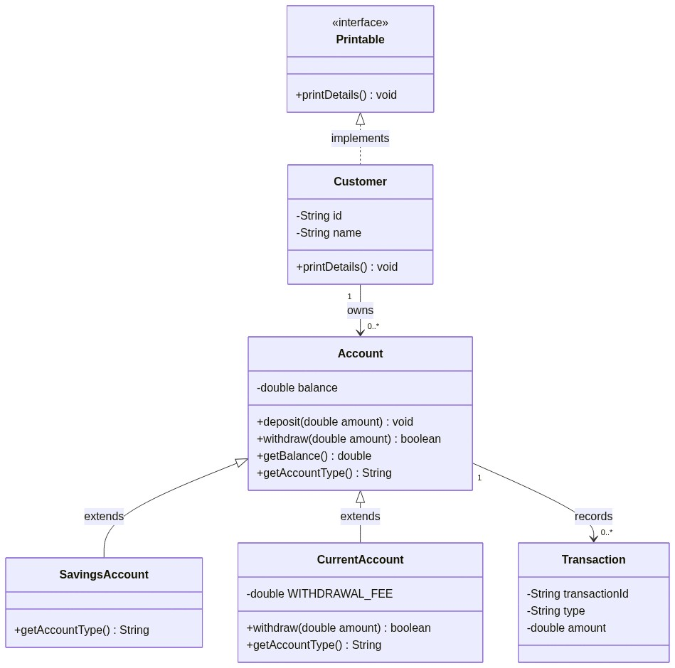
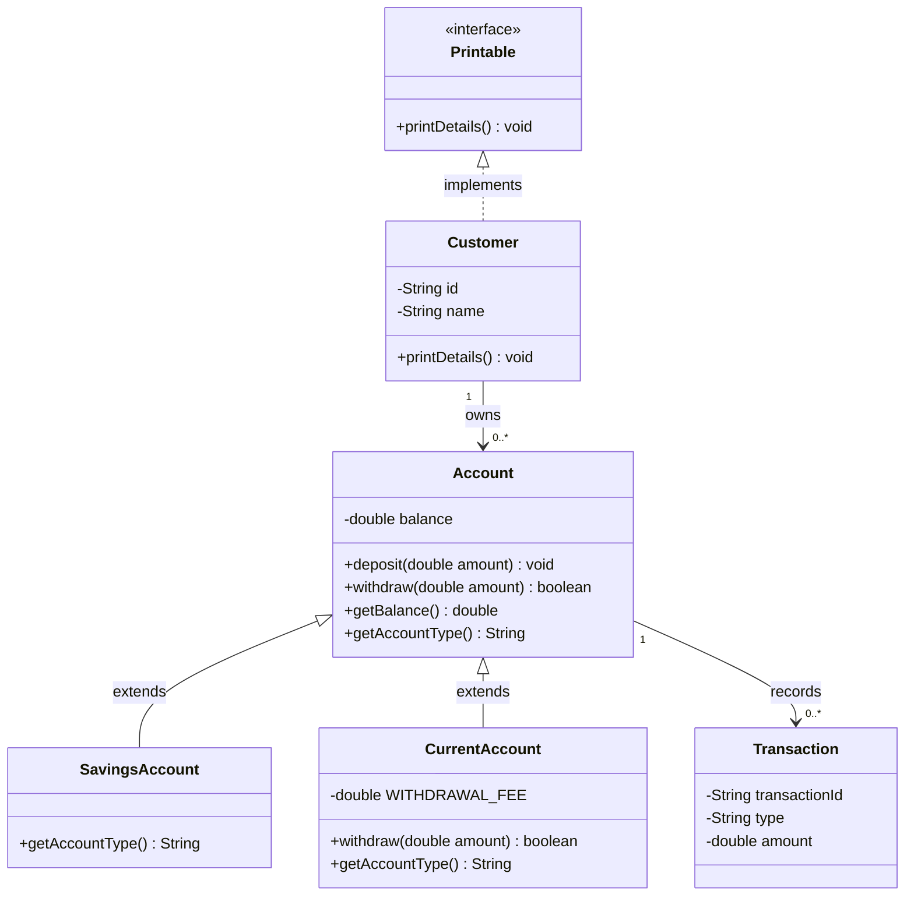

# Exercise 8 — Mini UML Class Diagram

**Module 3** · Pre-lab practice · then open [`../lab3/LAB-3-GUIDE.md`](../lab3/LAB-3-GUIDE.md)  
**Folder:** `examples/module-03-exercises/` ([setup](EXERCISES-INDEX.md))



> **No new Java code:** Convert the design from Exercises 1–5 into a visual model before Lab 3 grows to eight types.

## Goal

Create `banking-uml.md` with a Mermaid class diagram showing:

- `Printable`
- `Customer`
- `Account`
- `SavingsAccount`
- `CurrentAccount`
- `Transaction`

Include visibility, inheritance, interface realization, associations, and multiplicities.

## UML notation used here

| Notation | Meaning | Example |
| -------- | ------- | ------- |
| `+` | Public member | `+deposit(amount)` |
| `-` | Private member | `-balance` |
| `<|--` | Inheritance | Account is parent of SavingsAccount |
| `<|..` | Interface implementation | Customer implements Printable |
| `"1" --> "0..*"` | One-to-many association | Customer owns many accounts |

## Steps

### Step 1 — Create `banking-uml.md`

**Why:** Markdown keeps the diagram beside your design notes and renders on GitHub/Cursor.

Add:

````markdown
# Banking mini UML


````

### Step 2 — Compare diagram to code

**Why:** UML is useful only when it tells the truth about the model.

Check:

1. `balance` is private (`-`).
2. Public operations use `+`.
3. Both account subclasses point toward `Account`.
4. `Customer` realizes `Printable` with the dotted relationship.
5. Multiplicities agree with Exercise 1.

### Step 3 — Explain the relationships

Below the diagram, write one sentence for each:

```markdown
- Inheritance: SavingsAccount and CurrentAccount are specialized Accounts.
- Interface realization: Customer promises Printable behavior.
- Association: One Customer may own many Accounts.
- Association: One Account may record many Transactions.
```

## Expected result

The rendered diagram matches your code and clearly distinguishes inheritance, interface realization, and associations.

## If it fails

| Problem | Fix |
| ------- | --- |
| Mermaid renders as plain text | Use a fenced block beginning with ` ```mermaid ` |
| Arrow points the wrong way | Parent/interface is on the `<|` side |
| Missing cardinality | Add quoted values such as `"1"` and `"0..*"` |
| Diagram disagrees with code | Update the diagram or justify the code change |

## Pass criteria

| # | Confirm | Your notes |
| - | ------- | ---------- |
| 1 | Diagram includes all six types | Pass / Fail |
| 2 | Inheritance and interface arrows are correct | Pass / Fail |
| 3 | Customer–Account and Account–Transaction multiplicities appear | Pass / Fail |
| 4 | You can explain the three relationship types | Pass / Fail |
