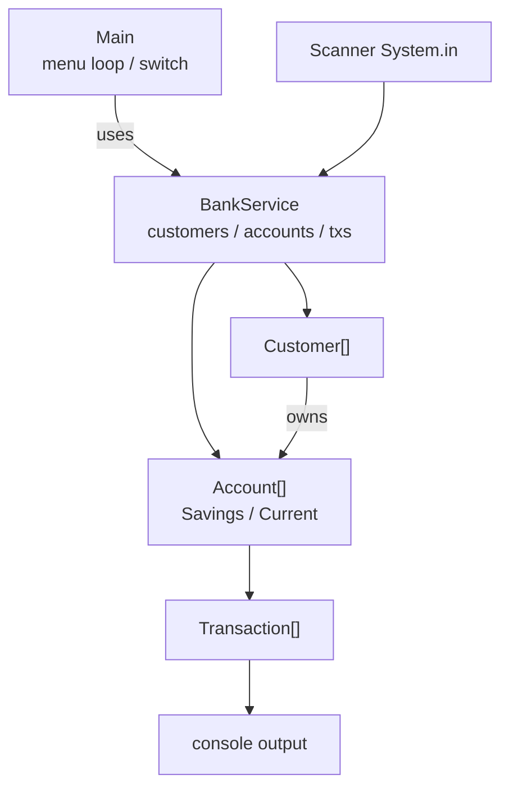
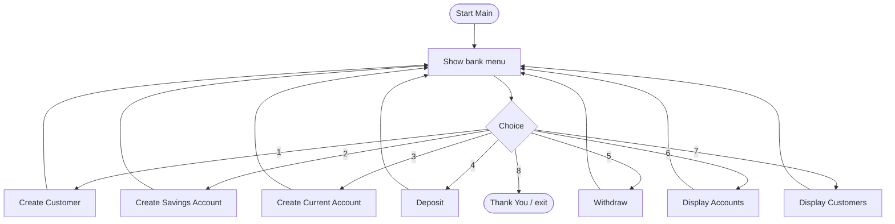
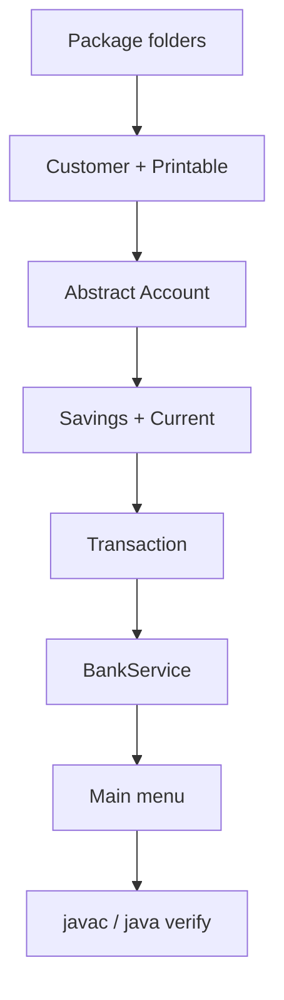
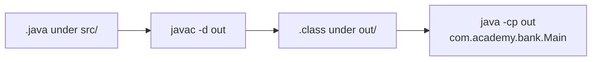

# Lab 3: Object-Oriented Design — Banking Management System

**Module:** 3 — Object-Oriented Programming in Java  
**Lab folder:** `labs/Week 1 - Java and JVM Foundations/module-03/lab3/`  
**Difficulty:** Intermediate (beginner-friendly)  
**Duration:** 3–4 hours  
**IDE conventions:** See [`../_IDE-CONVENTIONS.md`](../../_IDE-CONVENTIONS.md)

**Primary IDE:** IntelliJ IDEA Community Edition · **Optional IDE:** VS Code

| OS | How-to for this lab |
| -- | ------------------- |
| Windows | [LAB-3-WINDOWS.md](LAB-3-WINDOWS.md) |
| macOS | [LAB-3-MACOS.md](LAB-3-MACOS.md) |

> **Environment reminder:** Finish [Lab 0](../../module-00/lab0/LAB-0-GUIDE.md). Use **JDK 21** and **IntelliJ IDEA Community** (primary) or **VS Code** (optional). Workspace: `java-bootcamp` (Windows: `%USERPROFILE%\java-bootcamp`).

> **Pre-lab exercises:** Complete [`../exercises/`](../exercises/) (from the Module 3 slides) before starting this lab.

---

## How to follow this lab

1. Open the **Windows** or **macOS** how-to (links above) in a second tab.
2. Create/work only under your `java-bootcamp/examples/…` folder from the steps (not inside this `labs/` git clone unless a step says otherwise).
3. For each **Step N**: read **Why** (if present) → do the actions → confirm **Expected** / **Expected result** → then continue.
4. When stuck, use **Failure Experiments** / troubleshooting in this guide before asking for help.
5. Capture evidence under `notes/screenshots/lab-3/` (workspace root under `java-bootcamp`; redact secrets). Use the **Pass criteria** tables — write **Pass** or **Fail** in your notes. GitHub file view does not support clickable checkboxes.

## Lab Overview

Build a **menu-driven Banking Management System** that applies encapsulation, inheritance, abstraction, interfaces, polymorphism, and clear service responsibilities—still plain JDK, no Spring/database.

**Purpose.** Lab 2 taught syntax and console I/O. Lab 3 teaches **design**: type hierarchies, invariants, polymorphic arrays, and a thin `Main` over a coordinating service.

**What you build.** Classes under package `com.academy.bank`:

| Type | Role |
| ---- | ---- |
| `Customer` | Customer profile; implements `Printable` |
| `Account` | Abstract base: deposit / withdraw / shared fields |
| `SavingsAccount` | Interest + display; implements `Printable` |
| `CurrentAccount` | Withdrawal fee + display; implements `Printable` |
| `Printable` | Interface: `printDetails()` |
| `Transaction` | Records deposit / withdraw activity |
| `BankService` | Arrays + create / deposit / withdraw / display |
| `Main` | Menu loop entry point |

**What success looks like.** Under `java-bootcamp/examples/Lab3-BankingSystem/` you compile, run, create a customer and savings account, deposit/withdraw, and display accounts polymorphically.

**Project path (mirror the solution layout):**

```text
java-bootcamp/examples/Lab3-BankingSystem/
  src/com/academy/bank/
    Customer.java
    Account.java
    SavingsAccount.java
    CurrentAccount.java
    Printable.java
    Transaction.java
    BankService.java
    Main.java
  out/                    ← created by javac -d out
```

A reference implementation lives in [`solution/Lab3-BankingSystem/`](solution/Lab3-BankingSystem/). Use it only if stuck after a real attempt—**do not copy blindly**; you must explain inheritance and polymorphism.

---

## Learning Objectives

After this lab you will be able to:

* Design classes from a banking scenario (customer, accounts, transactions)
* Apply encapsulation (`private` fields; protected balance updates on `Account`)
* Model inheritance: abstract `Account` → `SavingsAccount` / `CurrentAccount`
* Define and implement an interface (`Printable`)
* Use polymorphism: `Account[]` holding both account types; runtime `displayAccount()`
* Keep `Main` thin and put operations in `BankService`
* Compile/run packages with `javac -d out` / `java -cp out` in VS Code or IntelliJ
* Sketch a UML class diagram of your design

---

## Business Scenario

Bank staff need a console tool to:

* Create customers
* Open **Savings** (interest) or **Current** (transaction fee) accounts
* Deposit and withdraw
* Display accounts and customers
* Exit cleanly

Demo data matching the reference sample:

* Customer `C101`, Name `John Smith`, Email `john@gmail.com`, Phone `1234567890`
* Savings: initial balance `10000`, interest rate `5%`
* Deposit `2000`, then withdraw `3000`

---

## Architecture Context

### Layered console design



### Inheritance and interface

```mermaid
classDiagram
    class Printable {
        <<interface>>
        +printDetails()
    }
    class Customer {
        +display()
        +printDetails()
    }
    class Account {
        <<abstract>>
        +deposit(amount)
        +withdraw(amount)
        +displayAccount()*
    }
    class SavingsAccount {
        +calculateInterest()
        +displayAccount()
    }
    class CurrentAccount {
        +calculateCharges()
        +displayAccount()
    }
    class BankService
    class Main
    class Transaction

    Printable <|.. Customer
    Printable <|.. SavingsAccount
    Printable <|.. CurrentAccount
    Account <|-- SavingsAccount
    Account <|-- CurrentAccount
    Account --> Customer : owns
    BankService --> Customer
    BankService --> Account
    BankService --> Transaction
    Main --> BankService
```



### Menu flow



### Lab build order



### Compile → run



---

## Prerequisites

Complete [Lab 0](../../module-00/lab0/LAB-0-GUIDE.md) and Lab 2 habits (packages, `Scanner`, menu loop). Follow [`../_IDE-CONVENTIONS.md`](../../_IDE-CONVENTIONS.md).

| Check | Must be true |
| ----- | ------------ |
| JDK | `java` / `javac` show **21.x** |
| Workspace | `java-bootcamp/examples/` available |
| IDE | Desktop **VS Code** and/or **IntelliJ IDEA Community** |
| Prior lab | Comfortable with `javac -d out` / `java -cp out` |

### Pre-flight

**Windows PowerShell**

```powershell
java -version
javac -version
cd $env:USERPROFILE\java-bootcamp
pwd
```

**macOS / Linux**

```bash
java -version
javac -version
cd ~/java-bootcamp
pwd
```

**Expected result:** JDK 21.x; current directory under `java-bootcamp`.

**If it fails:** Stop and fix Lab 0 (`PATH` / `JAVA_HOME`). Do not continue with a mismatched JDK.

---

## Suggested Project Files

| File | Responsibility |
| ---- | -------------- |
| `Printable.java` | Interface with `void printDetails()` |
| `Customer.java` | Id, name, email, phone; `display()` / `printDetails()` |
| `Account.java` | Abstract; number, balance, customer; deposit/withdraw |
| `SavingsAccount.java` | Interest rate; override display / interest |
| `CurrentAccount.java` | Transaction fee; override charges / display |
| `Transaction.java` | Id, amount, type, date, account number |
| `BankService.java` | Arrays, counters, all menu operations |
| `Main.java` | Menu + switch; delegates to `BankService` |

---

## Concepts to Discuss (with instructor)

* Why `Account` is abstract (no generic “account” without a product type)
* Why `setBalance` is often `protected` (subtypes / base ops update balance safely)
* Why `Account[]` can hold Savings and Current (polymorphism)
* Why `instanceof` should be rare; prefer overrides
* Why `double` is OK for teaching but production money often uses `BigDecimal`
* SOLID at console scale: thin `Main`, service owns orchestration, models stay focused

---

## Implementation Steps

Every step uses **Why:** / **Do this:** / **Expected result:** / **If it fails:**  
Prefer writing your own code. Peek at [`solution/`](solution/) only after trying.

---

### Step 1 — Create the project folders

**Why:** Package `com.academy.bank` must match folders under `src`.

**Do this:**

**Windows PowerShell**

```powershell
cd $env:USERPROFILE\java-bootcamp
New-Item -ItemType Directory -Force -Path examples\Lab3-BankingSystem\src\com\academy\bank | Out-Null
cd examples\Lab3-BankingSystem
Get-ChildItem -Recurse src
```

**macOS / Linux**

```bash
cd ~/java-bootcamp
mkdir -p examples/Lab3-BankingSystem/src/com/academy/bank
cd examples/Lab3-BankingSystem
find src -type d
```

**Expected result:** Empty package folder `src/com/academy/bank` exists.

**If it fails:** Confirm `java-bootcamp` from Lab 0; create under your user home, not a locked directory.

---

### Step 2 — Open the project in an IDE

**Why:** Dual-IDE support: VS Code (terminal-first) or IntelliJ (Sources Root + Run).

#### Option A — VS Code

**Do this:**

1. **File → Open Folder…** → `java-bootcamp/examples/Lab3-BankingSystem` (or open `java-bootcamp` and navigate).
2. **Terminal → New Terminal**.
3. `cd` into `Lab3-BankingSystem` if needed.

**Expected result:** Explorer shows `src/com/academy/bank`. Terminal is in the project root before you run `javac`.

**If it fails:** Wrong folder open → `cd` explicitly to `examples/Lab3-BankingSystem`.

#### Option B — IntelliJ IDEA Community

**Do this:**

1. **File → Open…** → select `Lab3-BankingSystem`.
2. Trust the project if asked.
3. **File → Project Structure → Project** → **SDK = 21**.
4. Right-click `src` → **Mark Directory as → Sources Root**.
5. After `Main` exists: Run gutter on `main`, or right-click `Main` → **Run ‘Main.main()’**.

**Expected result:** SDK 21; `src` marked as Sources Root; package `com.academy.bank` visible.

**If it fails:** SDK empty → install/assign JDK 21. Wrong root → mark `src`, not `src/com`.

---

### Step 3 — Create `Printable` and `Customer`

**Why:** Interfaces define a contract. Customers implement printable details for consistent display.

**Do this:** Create `Printable.java`:

```java
package com.academy.bank;

public interface Printable {
    void printDetails();
}
```

Create `Customer.java` with private fields `customerId`, `name`, `email`, `phone`; a constructor; getters/setters; `display()`; and `printDetails()` that calls `display()`.

**Expected result:** Both files declare `package com.academy.bank;`. `Customer implements Printable`.

**If it fails:** Interface methods must be public in the implementing class. File names must match type names.

---

### Step 4 — Create abstract `Account`

**Why:** Shared deposit/withdraw logic lives once. Subclasses supply product-specific display and fees/interest.

**Do this:** Create abstract class `Account` with:

* Private fields: `accountNumber` (`String`), `balance` (`double`), `customer` (`Customer`)
* Protected constructor `(accountNumber, balance, customer)`
* Getters; `setBalance` should be **protected** (not public) so balance changes stay controlled
* `deposit(double amount)` — reject non-positive; else add to balance
* `withdraw(double amount)` — return `boolean`; deduct `amount + calculateCharges()` if funds allow
* Abstract `void displayAccount()`
* Default `calculateCharges()` → `0.0`, `calculateInterest()` → `0.0`, `getAccountType()` → `"Account"`

**Expected result:** You cannot write `new Account(...)` later without a compile error (verified in Step 10).

**If it fails:**

* Forgot `abstract` on class or `displayAccount` → subclasses break
* Public `setBalance` → tighten to `protected` for better encapsulation

---

### Step 5 — Create `SavingsAccount`

**Why:** Savings earns interest. Override display and interest calculation.

**Do this:** `SavingsAccount extends Account implements Printable`:

* Extra field `interestRate`
* Constructor calls `super(...)` then sets rate
* Override `calculateInterest()` → `getBalance() * interestRate / 100.0`
* Override `displayAccount()` to print type, number, customer name, balance, rate, interest
* `printDetails()` can call `displayAccount()`
* Override `getAccountType()` → `"Savings"`

**Expected result:** Creating a savings account (later via service) can show interest like `450` for balance `9000` at `5%`.

**If it fails:** Forgot `super(...)` as first constructor statement → compile error. Calling `balance` directly → use getters or protected setters from the base.

---

### Step 6 — Create `CurrentAccount`

**Why:** Current accounts charge a fee on withdrawal via `calculateCharges()`.

**Do this:** `CurrentAccount extends Account implements Printable`:

* Field `transactionFee`
* Override `calculateCharges()` → return the fee
* Override `displayAccount()` for Current-specific fields
* `printDetails()` → `displayAccount()`
* `getAccountType()` → `"Current"`

**Expected result:** Withdraw path (in base `Account.withdraw`) automatically adds fee into the total deduction.

**If it fails:** Fee not applied → ensure `withdraw` uses `calculateCharges()`, and Current overrides it.

---

### Step 7 — Create `Transaction`

**Why:** Even without a database, recording activity teaches an audit trail mindset.

**Do this:** Fields such as `transactionId`, `amount`, `type`, `date`, `accountNumber`; constructor; getters; a `display()` line (printf is fine).

**Expected result:** `BankService` can append transactions after successful deposit/withdraw.

**If it fails:** Keep it a simple data class—no need for inheritance here.

---

### Step 8 — Build `BankService` storage skeleton

**Why:** The service owns arrays and counts—same idea as Lab 2’s manager, richer domain.

**Do this:** Create `BankService` with:

```java
private static final int MAX_CUSTOMERS = 50;
private static final int MAX_ACCOUNTS = 100;
private static final int MAX_TRANSACTIONS = 500;

private final Customer[] customers = new Customer[MAX_CUSTOMERS];
private final Account[] accounts = new Account[MAX_ACCOUNTS];
private final Transaction[] transactions = new Transaction[MAX_TRANSACTIONS];

private int customerCount = 0;
private int accountCount = 0;
private int transactionCount = 0;
private int nextAccountNumber = 10001;
private int nextTransactionNumber = 1;

private final Scanner scanner;

public BankService(Scanner scanner) {
    this.scanner = scanner;
}
```

Add empty/stub public methods matching menu actions until you implement them.

**Expected result:** One shared `Scanner` from `Main`. Account numbers will start at `10001`.

**If it fails:** Multiple `new Scanner(System.in)` across classes → inject the same scanner.

---

### Step 9 — Implement create customer & create accounts

**Why:** You need a customer before opening an account. Service looks up by ID.

**Do this:**

**Create customer:** prompt ID / name / email / phone; reject duplicate IDs; store in `customers[customerCount++]`; print `Customer Created Successfully.`

**Create savings:** find existing customer by ID; read initial balance and interest rate; allocate `String.valueOf(nextAccountNumber++)`; construct `SavingsAccount`; store in `accounts`; print confirmation including account number / balance / rate.

**Create current:** similar, with transaction fee instead of interest rate.

Helpers: `findCustomer(id)`, `readExistingCustomer()`, `readPositiveAmount(prompt)`.

**Expected result:** After creating `C101` and savings with balance `10000` / rate `5`:

```text
Customer Created Successfully.
...
Savings Account Created.
Account Number : 10001
Balance : 10000
Interest Rate : 5%
```

**If it fails:**

* Account without customer → `readExistingCustomer` returned null; stop early with a message
* Always account `10001` twice → forget to increment `nextAccountNumber`

---

### Step 10 — Implement deposit, withdraw, display

**Why:** Money movement exercises base `Account` methods; display proves polymorphism.

**Do this:**

* **Deposit:** find account by number; read amount; `account.deposit(amount)`; record transaction; print `Balance Updated : ...`
* **Withdraw:** find account; `account.withdraw(amount)`; on success record transaction; for Current you may print fee and total deducted; print updated balance
* **Display accounts:** loop `0 .. accountCount-1` and call `accounts[i].displayAccount()`—do **not** cast unless necessary
* **Display customers:** loop and call `display()` / `printDetails()`

**Expected result:** Deposit `2000` then withdraw `3000` on the sample savings path ends near balance `9000`, matching the sample walkthrough below.

**If it fails:**

* Insufficient funds message → good; verify fee logic for Current
* All accounts print as base type → overrides missing on subclasses
* NPE → looped past `accountCount`

---

### Step 11 — Prove abstraction (compile-time)

**Why:** Abstract types prevent invalid objects.

**Do this:** Temporarily add (then delete) in any method:

```java
// Account a = new Account("X", 0, someCustomer); // must NOT compile
```

**Expected result:** Compiler rejects instantiating `Account`.

**If it fails:** If it compiles, `Account` is not `abstract`—fix it.

---

### Step 12 — Create menu-driven `Main`

**Why:** Entry point owns the loop only—same pattern as Lab 2.

**Do this:** `Main` creates `Scanner` + `BankService`, loops, reads choice with `nextLine()` + parse, switches:

| Choice | Action |
| ------ | ------ |
| 1 | `createCustomer` |
| 2 | `createSavingsAccount` |
| 3 | `createCurrentAccount` |
| 4 | `deposit` |
| 5 | `withdraw` |
| 6 | `displayAccounts` |
| 7 | `displayCustomers` |
| 8 | print `Thank You`, close scanner, return |

Print the menu headers exactly (or very close) to the sample so screenshots match.

**Expected result:** Invalid choices print a friendly message and return to the menu. Choice `8` exits.

**If it fails:** Arrow syntax errors → language level / JDK must be 21. Logic bloating `Main` → move code into `BankService`.

---

### Step 13 — Apply SOLID (design checklist)

**Why:** Mentors mark design thinking, not only “it runs.”

**Do this:** Self-review:

| Principle | Lab 3 evidence |
| --------- | -------------- |
| SRP | Models vs `BankService` vs thin `Main` |
| OCP | New account type via subclass, not editing every switch in models |
| LSP | Savings/Current usable wherever `Account` is expected |
| ISP | Small `Printable` with one method |
| DIP | Menu depends on `BankService` API, not raw arrays |

**Expected result:** You can explain each row aloud in under a minute.

**If it fails:** Giant `Main` with arrays → refactor toward service + models.

---

### Step 14 — Draw a UML class diagram

**Why:** Diagrams communicate inheritance and “uses” relationships for code reviews.

**Do this:** Sketch (paper, whiteboard, or Mermaid) showing:

* `Printable` ← `Customer`, `SavingsAccount`, `CurrentAccount`
* `Account` ← `SavingsAccount`, `CurrentAccount`
* `Account` → `Customer`
* `BankService` uses arrays of those types; `Main` uses `BankService`

**Expected result:** Diagram matches your actual files (not a fantasy architecture).

**If it fails:** Missing abstract marker or interface notation → update before submit.

---

### Step 15 — Compile and run

**Why:** Terminal compile/run remains the course truth; IDE Run is optional confirmation.

**Do this:** From `Lab3-BankingSystem`:

```bash
javac -d out src/com/academy/bank/*.java
java -cp out com.academy.bank.Main
```

**Windows PowerShell clean rebuild:**

```powershell
Remove-Item -Recurse -Force out -ErrorAction SilentlyContinue
javac -d out src/com/academy/bank/*.java
java -cp out com.academy.bank.Main
```

**macOS / Linux clean rebuild:**

```bash
rm -rf out
javac -d out src/com/academy/bank/*.java
java -cp out com.academy.bank.Main
```

**IntelliJ:** Run `Main` after SDK 21 + Sources Root—then still run the terminal commands once.

**Expected result:** Menu:

```text
================================
Bank Management System
================================
1 Create Customer
2 Create Savings Account
3 Create Current Account
4 Deposit
5 Withdraw
6 Display Accounts
7 Display Customers
8 Exit
Choice :
```

**If it fails:**

| Symptom | Fix |
| ------- | --- |
| file not found | `cd` to project root containing `src` |
| cannot find symbol across classes | compile `*.java` together (wildcard), not one file alone |
| main class not found | `java -cp out com.academy.bank.Main` |
| IntelliJ red packages | Mark `src` as Sources Root |

---

### Step 16 — Walk the sample session

**Why:** Matching the reference transcript proves prompts and polymorphic display.

**Do this:** Run and enter:

1. Choice `1` → `C101`, `John Smith`, `john@gmail.com`, `1234567890`
2. Choice `2` → customer `C101`, balance `10000`, interest `5`
3. Choice `4` → account `10001`, deposit `2000`
4. Choice `5` → withdraw `3000`
5. Choice `6` → view savings display (interest on new balance)
6. Choice `8` → exit

**Expected result:** Align with the reference sample:

```text
================================
Bank Management System
================================
1 Create Customer
...
Choice : 1
Customer ID : C101
Name : John Smith
Email : john@gmail.com
Phone : 1234567890
Customer Created Successfully.
----------------------------------
Choice : 2
Customer ID : C101
Initial Balance : 10000
Interest Rate (%) : 5
Savings Account Created.
Account Number : 10001
Balance : 10000
Interest Rate : 5%
----------------------------------
Choice : 4
Account Number : 10001
Deposit Amount : 2000
Balance Updated : 12000
----------------------------------
Choice : 5
Account Number : 10001
Withdraw : 3000
Balance Updated : 9000
----------------------------------
Choice : 6
Savings Account
Account Number : 10001
Customer : John Smith
Balance : 9000
Interest Rate : 5%
Interest : 450
----------------------------------
Choice : 8
Thank You
```

Also create a Current account in a second run to show fee behavior on withdraw.

**If it fails:** Compare prompt labels and order to this sample. Interest `450` assumes `5%` of `9000`.

---

## Implementation Checkpoints

| Checkpoint | You have… |
| ---------- | --------- |
| A — Model | Customer, abstract Account, Savings, Current, Printable, Transaction |
| B — Service + menu | `BankService` + `Main` compile |
| C — Operations | Create, deposit, withdraw, polymorphic display |
| D — Design | UML + SOLID checklist done |

---

## Reference Commands

```bash
# From Lab3-BankingSystem/
javac -d out src/com/academy/bank/*.java
java -cp out com.academy.bank.Main
```

### Class / method map

| Type | Key members |
| ---- | ----------- |
| `Account` | `deposit`, `withdraw`, abstract `displayAccount`, `calculateCharges` / `calculateInterest` |
| `SavingsAccount` | interest rate, interest calc, display |
| `CurrentAccount` | fee, charges, display |
| `BankService` | create*, deposit, withdraw, display*, lookups |
| `Main` | menu + switch |

### Polymorphism reminder

```java
Account a = new SavingsAccount(...); // OK
a.displayAccount();                  // runs SavingsAccount version at runtime
```

---

## Failure Experiments (optional)

1. Withdraw more than balance (+ fee for Current) → expect insufficient message.
2. Try `new Account(...)` → must fail to compile.
3. Cast every `Account` to `SavingsAccount` blindly → crash on Current; prefer overrides.
4. Loop to `accounts.length` → NullPointerException; use `accountCount`.
5. Compile a single file alone when others are needed → missing symbols; compile the package wildcard.

---

## Troubleshooting

| Problem | Likely cause | Fix |
| ------- | ------------ | --- |
| Abstract instantiation | Design mistake | Only construct Savings/Current |
| Fee ignored | `calculateCharges` not overridden / not used | Fix Current + base withdraw |
| Wrong display text | Missing `@Override displayAccount` | Implement in both subclasses |
| Scanner skips | Mixed `nextInt` / `nextLine` | All `nextLine` + parse |
| Main class missing | Bad `-cp` | `java -cp out com.academy.bank.Main` |
| IntelliJ run fails | SDK / Sources Root | Set SDK 21; mark `src` |

---

## Cleanup

Delete `out/` anytime; keep sources under `examples/Lab3-BankingSystem/` for evidence.

**Windows:** `Remove-Item -Recurse -Force out`  
**macOS / Linux:** `rm -rf out`

---

## Expected Deliverables

* Full source under `java-bootcamp/examples/Lab3-BankingSystem/src/com/academy/bank/`
* Screenshots: customer create, savings create, deposit, withdraw, polymorphic display, exit
* UML class diagram
* Short design note (SOLID + inheritance/polymorphism in your own words)
* Working compile/run commands

---

## Evaluation Rubric (100 marks)

| Area | Marks |
| ---- | ----- |
| Class design & encapsulation | 20 |
| Inheritance / abstraction / interface | 25 |
| Polymorphism & service operations | 25 |
| Menu app + packaging / compile | 15 |
| UML + code quality + evidence | 15 |

---

## Reflection Questions

1. Why should `Account` be abstract rather than a concrete empty type?
2. Where does dynamic dispatch show up when you call `displayAccount()` on `Account[]`?
3. How does `Printable` differ from extending a base class?
4. What would break if `Main` owned all arrays instead of `BankService`?
5. How do today’s Customer/Account patterns prepare you for later CRM entity design **without** building Spring here?

---

## Bonus Challenges

Attempt after the core menu works. Ideas exist under [`solution/`](solution/) (menu 9–13)—try first.

1. **Transfer money** between accounts  
2. **Transaction history** listing  
3. **Sort accounts by balance**  
4. **Highest-balance customer**  
5. **Account summary report**  

---

## Success Criteria

You can: build the Account hierarchy with an interface; coordinate operations in `BankService`; run a clean menu from VS Code or IntelliJ; demonstrate polymorphic display; explain your design; compile with `javac -d out` and run `java -cp out com.academy.bank.Main`—without blindly pasting the solution.

---

## Instructor Notes

* **Reference solution:** [`solution/Lab3-BankingSystem/`](solution/Lab3-BankingSystem/) includes core banking plus bonus menu options 9–13. Coach helpers (`findCustomer`, `findAccount`, `readPositiveAmount`, `recordTransaction`) before releasing full sources. **Students must not copy the solution blindly**—require a walkthrough of inheritance and polymorphism.
* **API fidelity to solution (when aligning demos):** `protected Account(...)`, `protected setBalance`, `boolean withdraw`, `Printable.printDetails()`, `BankService(Scanner)`, auto account numbers from `10001`.
* **Common pitfalls:** Scanner newline bugs; instantiating abstract `Account`; looping to array capacity; blind casts; logic dumped into `Main`.
* **Classpath moment:** Show failing run without `-cp out` so Step 15 sticks.
* **IDEs:** Prefer IntelliJ Community (primary); VS Code is optional (Sources Root + SDK 21 + Run `Main`). Score UML + polymorphic display screenshots.
* **Money note:** Mention `BigDecimal` for production; keep `double` for teaching speed unless students finish early.
* **Timing:** Core path ~3–4 hours; bonuses are stretch.

---

*End of Lab 3 — Object-Oriented Design: Banking Management System. Keep `Lab3-BankingSystem` for portfolio evidence.*
