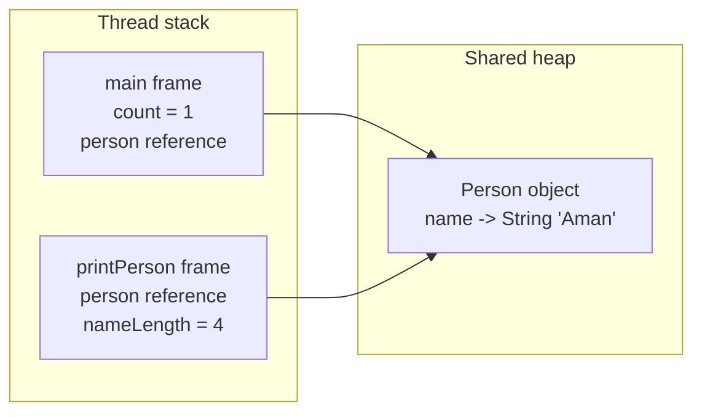

# Exercise 1 — Stack vs Heap Basics

**Module 4** · Pre-lab practice · finish all 7 Pass, then [`../lab4/LAB-4-GUIDE.md`](../lab4/LAB-4-GUIDE.md)  
**Folder:** `examples/module-04-exercises/` ([setup](EXERCISES-INDEX.md))


## Goal

Create `StackHeapDemo.java`, run it, then trace which values belong to method stack frames and which object lives on the heap.

## Starter (fill in the TODOs)

Paste this skeleton, then replace each `// TODO` with working code. Do **not** leave TODOs in your finished file.

```java
public class StackHeapDemo {
    static class Person {
        String name;

        Person(String name) {
            // TODO: assign the name parameter to this.name
        }
    }

    static void printPerson(Person person) {
        // Local primitive in the printPerson stack frame
        // TODO: int nameLength = person.name.length();
        // TODO: printf "%s has %d letters.%n" with person.name and nameLength
    }

    public static void main(String[] args) {
        // Primitive value belongs to main's frame
        // TODO: int count = 1;

        // Reference is local; new Person object is on the heap
        // TODO: Person person = new Person("Aman");

        // TODO: call printPerson(person);
        // TODO: println "Count: " + count
    }
}
```

## Mental model



| Item | Location for this exercise | Why |
| ---- | -------------------------- | --- |
| `count` | `main` stack frame | Local primitive |
| local `person` variable | `main` stack frame | Local reference |
| `printPerson` parameter | `printPerson` stack frame | Another reference |
| `nameLength` | `printPerson` stack frame | Local primitive |
| `new Person(...)` | Heap | Object allocation |
| `"Aman"` | String pool / heap-managed memory | String object |

> This is a useful teaching model. JVM optimizations may change physical storage internally, but Java reference/reachability semantics remain the same.

## Steps

### Step 1 — Create `StackHeapDemo.java`

**Why:** Lab 4 assumes you can already distinguish stack locals from heap objects.

1. **New → File** → `StackHeapDemo.java`.
2. Paste the starter.
3. Fill every `// TODO`. Save.

### Step 2 — Compile and run

**Windows:**

```powershell
cd $env:USERPROFILE\java-bootcamp\examples\module-04-exercises
javac StackHeapDemo.java
java StackHeapDemo
```

**macOS:**

```bash
cd ~/java-bootcamp/examples/module-04-exercises
javac StackHeapDemo.java
java StackHeapDemo
```

**Verified (Windows):**

```text
Aman has 4 letters.
Count: 1
```

### Step 3 — Trace method entry and return

**Why:** Each method call has its own frame.

Write in `notes.md`:

1. `main` frame is created.
2. `Person` is allocated; `main.person` refers to it.
3. Calling `printPerson` creates a second frame.
4. Both frames temporarily hold references to the same `Person`.
5. `printPerson` returns; its frame is removed.
6. `main` returns; its frame is removed.

## Expected result

Program prints two lines, and your notes distinguish a local reference from the heap object it points to.

## Common mistake

Saying “the object is in the variable.” More precisely, the local variable holds a **reference**; the `Person` object is heap-allocated.

## Pass criteria

| # | Confirm | Your notes |
| - | ------- | ---------- |
| 1 | Program compiles and prints the verified output | Pass / Fail |
| 2 | You can identify both stack frames | Pass / Fail |
| 3 | You can distinguish `person` reference from `Person` object | Pass / Fail |
