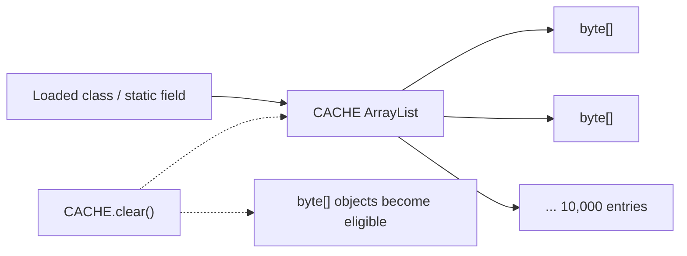

# Exercise 6 — Retained References (Safe Leak Sketch)

**Module 4** · Pre-lab practice · finish all 7 Pass, then [`../lab4/LAB-4-GUIDE.md`](../lab4/LAB-4-GUIDE.md)  
**Folder:** `examples/module-04-exercises/` ([setup](EXERCISES-INDEX.md))


> **Safety:** This bounded demo retains about 10 MB of payload, then clears it. Do not turn it into an unbounded loop and do not attempt to crash the JVM.

## Goal

Create `RetentionDemo.java`, observe a static collection retaining objects, then clear the collection and explain why those objects become GC-eligible.

## Starter (fill in the TODOs)

Paste this skeleton, then replace each `// TODO` with working code. Do **not** leave TODOs in your finished file.

```java
import java.util.ArrayList;
import java.util.List;

public class RetentionDemo {
    // Static field is reachable from the loaded class (a GC root path).
    // TODO: private static final List<byte[]> CACHE = new ArrayList<>();

    static long usedMb() {
        Runtime runtime = Runtime.getRuntime();
        // TODO: long usedBytes = runtime.totalMemory() - runtime.freeMemory();
        // TODO: return usedBytes / (1024 * 1024);
    }

    public static void main(String[] args)
            throws InterruptedException {
        System.out.println("Before: " + usedMb() + " MB");

        // Bounded: 10,000 × 1 KB ≈ 10 MB payload.
        for (int i = 0; i < 10_000; i++) {
            // TODO: CACHE.add(new byte[1024]);
        }

        System.out.println(
                "Retained objects: " + CACHE.size());
        System.out.println(
                "After allocation: " + usedMb() + " MB");

        // Remove the strong references held by the list.
        // TODO: CACHE.clear();
        // TODO: System.gc();       request, not a guarantee
        // TODO: Thread.sleep(200); observation aid, not synchronization with GC

        System.out.println(
                "After clear (approx): " + usedMb() + " MB");
    }
}
```

## Reachability sketch



## Why this resembles a memory leak

Java has automatic memory management, but GC reclaims only **unreachable** objects. A static collection that grows forever keeps its entries reachable even when the application no longer needs them.

| Before `clear()` | After `clear()` |
| ---------------- | --------------- |
| Static `CACHE` is reachable | `CACHE` itself remains reachable |
| List entries strongly reference arrays | Entry references are removed |
| Arrays are not collectible | Arrays can become GC-eligible |

## Steps

### Step 1 — Create `RetentionDemo.java`

**Why:** Lab 4 discusses retention paths — you must recognize when a static root prevents collection.

1. **New → File** → `RetentionDemo.java`.
2. Paste the starter.
3. Fill every `// TODO`. Save.

### Step 2 — Compile and run with a bounded heap

**Windows:**

```powershell
cd $env:USERPROFILE\java-bootcamp\examples\module-04-exercises
javac RetentionDemo.java
java -Xmx64m RetentionDemo
```

**macOS:**

```bash
cd ~/java-bootcamp/examples/module-04-exercises
javac RetentionDemo.java
java -Xmx64m RetentionDemo
```

**Verified on one Windows run:**

```text
Before: 2 MB
Retained objects: 10000
After allocation: 13 MB
After clear (approx): 1 MB
```

Your memory numbers can differ substantially. The guaranteed value is the bounded list size (`10000`), not a particular MB reading.

### Step 3 — Identify the retaining path

Write in `notes.md`:

```text
loaded RetentionDemo class
  → static CACHE field
  → ArrayList entries
  → byte[] objects
```

### Step 4 — Record the root cause and fix

```markdown
Root cause: a long-lived static collection retained strong references after
the data was no longer needed. GC could not reclaim reachable entries.

Fix: clear/remove entries, bound the cache, apply eviction, or use a more
appropriate lifecycle. Weak references are not a universal cache fix.
```

## Expected result

The list reaches exactly 10,000 entries, memory usage rises approximately, and clearing the list removes the retaining references. Post-GC memory is observational and nondeterministic.

## If it fails

| Problem | Fix |
| ------- | --- |
| OOM | Restore `10_000`, `1024`, and `-Xmx64m`; close other test JVMs |
| Memory does not immediately decrease | Normal: `System.gc()` and heap resizing are not guaranteed |
| `Runtime` values seem inconsistent | Treat them as approximate snapshots |
| Want to inspect a heap dump | Wait for Lab 4 guidance; never commit dumps |

## Pass criteria

| # | Confirm | Your notes |
| - | ------- | ---------- |
| 1 | Program safely retains exactly 10,000 objects | Pass / Fail |
| 2 | You trace the static-field retaining path | Pass / Fail |
| 3 | You explain why GC cannot free reachable objects | Pass / Fail |
| 4 | You name at least one bounded-cache fix | Pass / Fail |
