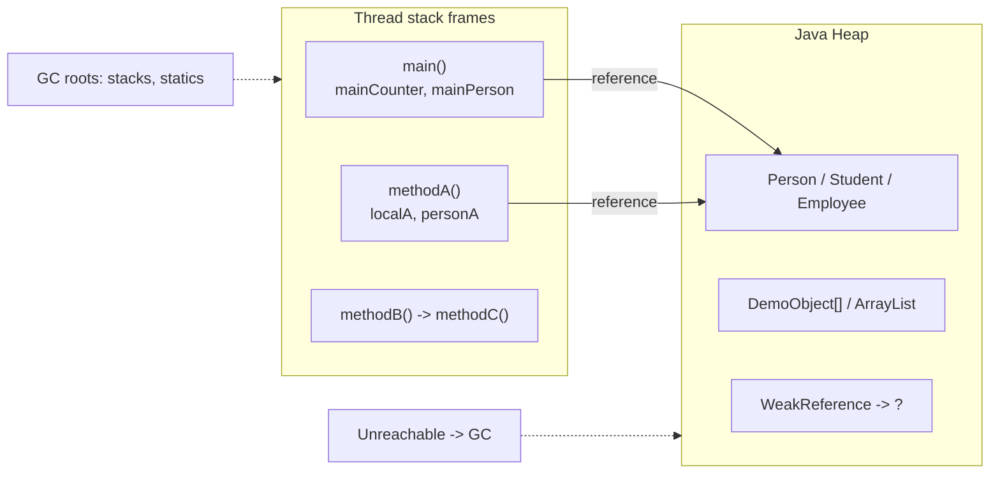
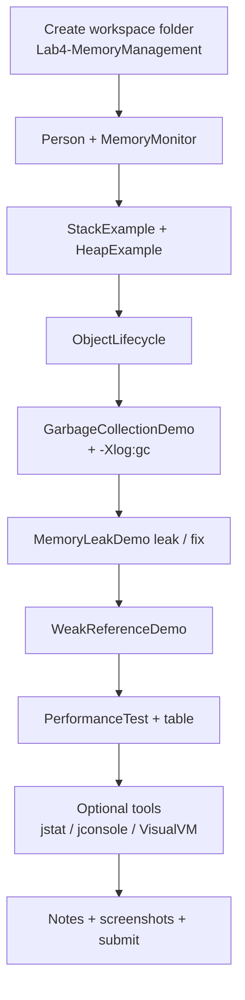
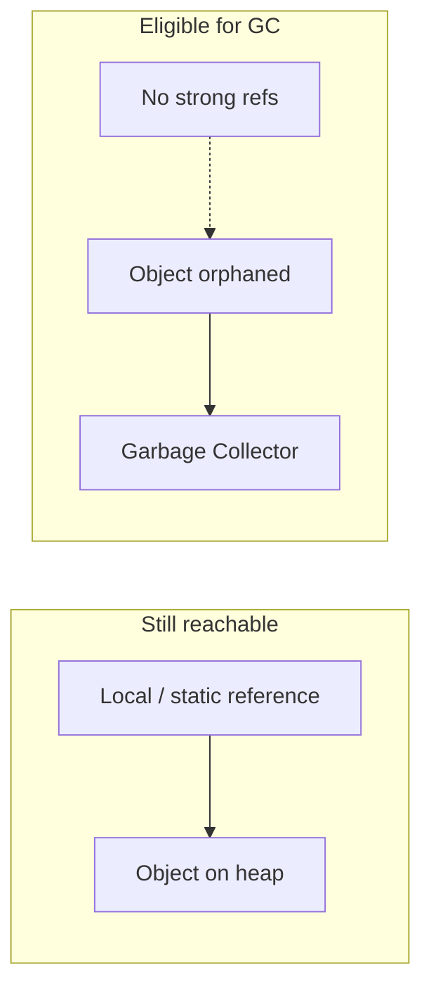

# Lab 4: Memory Management and Garbage Collection

**Module:** 4 — Memory Management and Performance  
**Lab folder:** `labs/Week 1 - Java and JVM Foundations/module-04/lab4/`  
**Difficulty:** Intermediate (Beginner-Friendly)  
**Duration:** 3–4 Hours

**Primary IDE:** IntelliJ IDEA Community Edition · **Optional IDE:** VS Code

| OS | How-to for this lab |
| -- | ------------------- |
| Windows | [LAB-4-WINDOWS.md](LAB-4-WINDOWS.md) |
| macOS | [LAB-4-MACOS.md](LAB-4-MACOS.md) |

> **Environment reminder:** Finish [Lab 0](../../module-00/lab0/LAB-0-GUIDE.md). Use **JDK 21** and **IntelliJ IDEA Community** (primary) or **VS Code** (optional). Workspace: `java-bootcamp` (Windows: `%USERPROFILE%\java-bootcamp`).

> **Pre-lab exercises:** Complete [`../exercises/`](../exercises/) (from the Module 4 slides) before starting this lab.

---

## How to follow this lab

1. Open the **Windows** or **macOS** how-to (links above) in a second tab.
2. Create/work only under your `java-bootcamp/examples/…` folder from the steps (not inside this `labs/` git clone unless a step says otherwise).
3. For each **Step N**: read **Why** (if present) → do the actions → confirm **Expected** / **Expected result** → then continue.
4. When stuck, use **Failure Experiments** / troubleshooting in this guide before asking for help.
5. Capture evidence under `notes/screenshots/lab-4/` (workspace root under `java-bootcamp`; redact secrets). Use the **Pass criteria** tables — write **Pass** or **Fail** in your notes. GitHub file view does not support clickable checkboxes.

## Lab Overview

This Module 4 lab builds **JVM memory literacy**: stack versus heap, object lifecycle, garbage collection, leak patterns, weak references, heap flags, and laptop-friendly diagnostics (`Runtime` API, GC logs, optional `jstat` / `jconsole` / VisualVM).

**Purpose.** Features without heap awareness become production `OutOfMemoryError` fire drills. Lab 4 trains you to *see* allocation, reachability, and GC recovery on your own machine before you stress a real multi-service stack.

**What you build (exercise).** Flat-package demos under `examples/Lab4-MemoryManagement/`: `Person`, `MemoryMonitor`, `StackExample`, `HeapExample`, `ObjectLifecycle`, `GarbageCollectionDemo`, `MemoryLeakDemo` (`leak` / `fix`), `WeakReferenceDemo`, `PerformanceTest`, plus optional bonuses (`StringMemoryComparison`, `ListMemoryComparison`, `OutOfMemoryDemo`).

**What success looks like.** You compile with `javac *.java`, run each demo, capture memory reports and GC log snippets, complete an allocation comparison table, explain a leak and its fix, and optionally peek at heap tools—without committing heap dumps that may contain sensitive data.

**Depends on Lab 0.** If VS Code / IntelliJ, `java`, or `javac` fail, fix [Lab 0](../../module-00/lab0/LAB-0-GUIDE.md) / [SETUP-INSTRUCTIONS.md](../../../SETUP-INSTRUCTIONS.md).

**CRM connection (future only).** From Lab 8 onward the **Customer Management Platform** will allocate customers, caches, and payloads at scale. This lab does **not** build CRM APIs. Treat it as the memory mental model you will need when a CRM service blows the heap under load.

**Reference solution:** [`solution/Lab4-MemoryManagement/`](solution/Lab4-MemoryManagement/) — flat `.java` demos matching the workspace layout.

---

## Learning Objectives

After completing this lab, you will be able to:

* Explain **stack** (per-thread frames: primitives + references) versus **heap** (shared objects)
* Trace nested method calls and sketch which locals live in which frame
* Allocate objects on the heap and use `System.identityHashCode()` as an identity hint
* Narrate the object lifecycle: create → use → share references → drop references → GC-eligible
* Allocate large batches of objects, null the root reference, and observe used memory before/after GC
* Monitor heap with `Runtime.getRuntime()` (total / free / used / max)
* Reproduce a **reachable** collection “leak” and recover memory with `clear()` / null + GC
* Compare **strong** vs `WeakReference` behavior after `System.gc()`
* Measure allocation cost with `System.nanoTime()` across object counts
* Enable GC logging (`-Xlog:gc`), tune `-Xms` / `-Xmx`, and optionally use `jstat`, `jconsole`, or VisualVM on the laptop
* Fill a results table and answer reflection questions with evidence-backed wording

---

## Business Scenario

A banking batch job is consuming excessive memory and occasionally crashes with **`OutOfMemoryError: Java heap space`**. Mentors want proof you can investigate—not restart blindly.

You need to determine:

* Where locals and objects live (stack vs heap)
* Why used memory keeps rising while GC appears “busy”
* Whether objects remain **reachable** (so GC cannot reclaim them)
* How weak references differ from strong retention
* How heap ergonomics (`-Xms` / `-Xmx`) and GC logs change what you observe
* Which tools on your **laptop** help when you need a second opinion (`jstat`, optional GUI tools)

**Pedagogical frame.** Demos use `Person`, `Employee`, `Student`, and byte payloads—not live customer PII. The skills transfer when a future CRM cache retains every customer forever.

**Security note for evidence.** **Never** paste secrets or full heap dumps into chat/Git. Heap dumps may contain passwords and personal data. Prefer screenshots of memory reports and short GC log snippets.

---

## Architecture Context

### Stack vs Heap (mental model)



### Lab flow



### Reachability (why GC did—or did not—free memory)



## Prerequisites

Complete [Labs Setup Instructions](../../../SETUP-INSTRUCTIONS.md) and [Lab 0](../../module-00/lab0/LAB-0-GUIDE.md). Confirm:

* **JDK 21** with `javac` and `java` on `PATH`
* **VS Code** and/or **IntelliJ IDEA** on the laptop — see [`_IDE-CONVENTIONS.md`](../../_IDE-CONVENTIONS.md)
* Workspace root open: `%USERPROFILE%\java-bootcamp` or `$HOME/java-bootcamp`
* Comfort with Lab 1–style `javac` / `java` on flat `.java` files
* No secrets committed to Git

### Pre-flight

In the IDE terminal (PowerShell, cmd, bash, or zsh):

```bash
java -version
javac -version
```

**Expected theme:** OpenJDK / Temurin **21.x**.

**If it fails:** Revisit Lab 0 (`JAVA_HOME`, new terminal after PATH changes).

---

## Steps from the training slides

> Paths below use `$HOME/java-bootcamp` (works in PowerShell as `$HOME`, bash/zsh as `$HOME`, or expand to `%USERPROFILE%\java-bootcamp` on classic Windows cmd). Flat demos live in **one folder**—no `src/` package tree.

### Step 1 — Create the Lab 4 workspace

**Why:** A known path under `examples/` matches Lab 0 conventions and keeps grading evidence easy to find.

**Do this:**

**VS Code:** **File → Open Folder…** → open `java-bootcamp` (or open the new lab folder after you create it). Use the integrated terminal.

**IntelliJ:** **File → Open…** → select the project folder once `.java` files exist (or open the parent and navigate). Set **Project SDK = 21**.

```bash
mkdir -p "$HOME/java-bootcamp/examples/Lab4-MemoryManagement"
mkdir -p "$HOME/java-bootcamp/notes/screenshots/lab-4"
cd "$HOME/java-bootcamp/examples/Lab4-MemoryManagement"
```

Windows cmd equivalent:

```text
mkdir %USERPROFILE%\java-bootcamp\examples\Lab4-MemoryManagement
mkdir %USERPROFILE%\java-bootcamp\notes\screenshots\lab-4
cd /d %USERPROFILE%\java-bootcamp\examples\Lab4-MemoryManagement
```

**Expected result:** Current directory is `.../examples/Lab4-MemoryManagement` (empty at first).

**If it fails:** Wrong home → print `$HOME` / `%USERPROFILE%` and recreate under that path. Confusing editor windows → open the folder again per [`_IDE-CONVENTIONS.md`](../../_IDE-CONVENTIONS.md).

---

### Step 2 — Create `Person.java` and `MemoryMonitor.java`

**Why:** Shared model + memory reporting keep every later demo readable and consistent.

**Do this:** Create both files in the Lab4 folder (default package — **no** `package` line).

`Person.java` should hold `name` / `age`, a constructor, getters, and a clear `toString()`.

`MemoryMonitor.java` should offer:

* `printMemoryReport(String label)` using `Runtime.getRuntime()` for total / free / used / max (print MB)
* `triggerGarbageCollection()` calling `System.gc()` (hint only) with a short pause
* Helpers for used bytes / MB conversion

**Expected result:** Files open in the IDE; class names match file names.

**If it fails:** `public class` name ≠ file name → rename. Accidentally adding `package com...` → remove it for this flat lab.

---

### Step 3 — `StackExample` — nested frames

**Why:** Stack frames store primitives and **references**; seeing `main → A → B → C` makes “locals die when methods return” concrete.

**Do this:** Create `StackExample.java` that:

1. Declares locals in `main` (int, String, `Person`)
2. Calls `methodA` → `methodB` → `methodC`
3. Prints frame details (primitive value, reference → object text, `identityHashCode`)

Compile and run:

```bash
cd "$HOME/java-bootcamp/examples/Lab4-MemoryManagement"
javac Person.java MemoryMonitor.java StackExample.java
java StackExample
```

**IntelliJ alternate:** Right-click `StackExample` → **Run ‘StackExample.main()’** after SDK 21 is set.

**Expected result (themes):**

```text
===== Stack Memory Demonstration =====
Call chain: main() -> methodA() -> methodB() -> methodC()

main() frame
  Primitive on stack : mainCounter = 1
  ...
methodA() frame
...
methodC() frame
...
Back in main() - methodC() frame has been removed from the stack.
```

**If it fails:** `cannot find symbol: Person` → compile `Person.java` in the same folder first (`javac *.java` is simplest).

---

### Step 4 — `HeapExample` — objects live on the heap

**Why:** Multiple object types with printed identity hashes prove references (stack) ≠ objects (heap).

**Do this:** Create `HeapExample.java` that:

1. Prints a memory report **before** allocation
2. Creates several small objects (`Student`, `Employee`, `Customer`, `Book` as nested/static classes is fine)
3. Prints each reference name, `toString()`, and `identityHashCode`
4. Prints a memory report **after** allocation

```bash
javac *.java
java HeapExample
```

**Expected result (themes):**

```text
===== Heap Memory Demonstration =====
===== JVM Memory Report: Before Allocation =====
Total Memory : ... MB
...
Objects created on the heap:
Reference (stack) : student
Object (heap)     : Student{name='John'}
Identity hash     : <number>
...
===== JVM Memory Report: After Allocation =====
Observation:
- References (...) live on the stack
- Actual objects live on the heap
```

Exact MB numbers vary by JDK and OS—that is normal.

**If it fails:** Only `Before` report prints → check that object creation and `printObjectInfo` are not inside a branch you never enter.

---

### Step 5 — `ObjectLifecycle` — create → use → null → eligible

**Why:** GC eligibility is about **reachability**, not “old objects.”

**Do this:** Create `ObjectLifecycle.java` that walks five narrative steps:

1. Create a `Person`
2. Use getters
3. Alias with a second reference (same identity hash)
4. Set both references to `null`
5. Call `MemoryMonitor.triggerGarbageCollection()` and print before/after reports

```bash
java ObjectLifecycle
```

**Expected result (themes):**

```text
===== Object Lifecycle Demonstration =====
Step 1: Create object
Created -> ...
Step 3: Hold reference
secondReference points to same object : true
Step 4: Remove references
... object is now unreachable
Step 5: Eligible for Garbage Collection
===== JVM Memory Report: Before GC =====
...
An object becomes eligible for GC when no live thread can reach it.
```

**If it fails:** Used memory “does not drop” for one tiny object → expected; the point is the reachability story, not a dramatic MB cliff.

---

### Step 6 — `GarbageCollectionDemo` — allocate, null, observe

**Why:** A large batch makes Before / After Allocation / After GC reports easier to read than one object.

**Do this:** Create `GarbageCollectionDemo.java` that:

1. Allocates an array of ~**100,000** demo objects (each may hold a small `byte[]` payload)
2. Prints object count + memory report after allocation
3. Sets the array reference to `null`
4. Triggers GC and prints an After GC report + elapsed ms tip for logging

```bash
java GarbageCollectionDemo
```

**Expected result (themes):**

```text
===== Garbage Collection Demonstration =====
===== JVM Memory Report: Before Allocation =====
...
Creating Objects...
Objects Created : 100000
===== JVM Memory Report: After Allocation =====
...
Removing strong references...
Triggering Garbage Collection...
Garbage Collection Completed
===== JVM Memory Report: After GC =====
Execution Time : ... ms
Tip: Run with GC logging using:
java -Xlog:gc GarbageCollectionDemo
```

**If it fails:** `OutOfMemoryError` during allocation → close other heavy apps; retry with a larger heap temporarily:  
`java -Xmx512m GarbageCollectionDemo`.

---

### Step 7 — GC logging (`-Xlog:gc`)

**Why:** Application prints show *your* labels; GC logs show what the **collector** did.

**Do this:**

```bash
java -Xlog:gc GarbageCollectionDemo
```

Save a short snippet into `../../notes/lab4-gc-snippet.txt` (from project; or `~/java-bootcamp/notes/lab4-gc-snippet.txt`) (a few lines are enough).

**Expected result (pattern themes — exact text varies by JDK):**

```text
[0.xxxs][info][gc] Using G1
...
[0.xxxs][info][gc] GC(0) Pause Young (Normal) ...
...
===== Garbage Collection Demonstration =====
...
```

You should see:

* A collector name line (often G1 on modern JDKs)
* One or more `GC(...)` pause / collection lines interleaved with your demo output
* Your `After GC` memory report still appearing

**If it fails:** `-Xlog:gc` unknown → confirm `java -version` is **21**, not a very old JDK 8 that uses `-XX:+PrintGC` differently. No GC lines at all → allocation may be too small for visible pauses; keep the 100k demo.

---

### Step 8 — `MemoryLeakDemo` — `leak` vs `fix`

**Why:** The classic “bug” is **reachable** retention (static/list holder), not a broken GC.

**Do this:** Create `MemoryLeakDemo.java` with two modes:

* `leak` — keep adding many `Employee`-like objects into a **static** / long-lived list; print memory every 100k adds; never clear
* `fix` — allocate into a **local** list, `clear()`, null the reference, trigger GC, show used memory drop theme

```bash
java MemoryLeakDemo leak
# stop with Ctrl+C after a few progress lines if it runs long

java MemoryLeakDemo fix
```

**Expected result — leak (themes):**

```text
===== Memory Leak Demonstration =====
Adding employees to a static list that is never cleared...
Added 100000 employees
===== JVM Memory Report: After 100000 Objects =====
...
Observation:
- Memory keeps increasing because objects remain reachable
- GC cannot collect objects that are still referenced
```

**Expected result — fix (themes):**

```text
===== Memory Leak Fix Demonstration =====
...
Clearing list to remove strong references...
Triggering Garbage Collection...
===== JVM Memory Report: After GC =====
Observation:
- Clearing the list removes references ...
- Used memory drops after GC
```

**If it fails:** Machine thrashing on leak mode → stop early; you only need **evidence of rising used memory**, not a full million objects. Forgetting CLI arg → expect a `Usage:` message for `leak` / `fix`.

---

### Step 9 — `WeakReferenceDemo`

**Why:** Caches and listeners often should not pin objects forever; weak refs teach that pattern.

**Do this:** Create `WeakReferenceDemo.java` that:

1. Keeps a strong `Person`, calls GC, shows the object still prints
2. Wraps another `Person` in `WeakReference`, nulls the strong local, triggers GC, prints `weakReference.get()` (often `null`)

```bash
java WeakReferenceDemo
```

**Expected result (themes):**

```text
===== Weak Reference Demonstration =====
--- Strong Reference ---
Before GC : ...
After GC  : ...
Object remains because a strong reference still exists.

--- Weak Reference ---
Before removing strong reference : ...
Strong reference removed.
After GC via WeakReference.get() : null   # or still present if GC did not run yet
Observation:
- WeakReference allows GC to collect the object when only weak refs remain
```

**If it fails:** Weak target still non-null after GC → `System.gc()` is a **hint**; re-run or accept “may be collected” wording in notes. Still correct conceptually if you null only the strong reference.

---

### Step 10 — `PerformanceTest` + results table

**Why:** Timing + memory deltas train evidence habits before APM tools appear.

**Do this:** Create `PerformanceTest.java` that allocates for counts such as `{10, 100, 1000, 100000, 1000000}`, prints a table of Objects / Used Memory / Execution Time, and includes a few extra micro-measurements (loop, large array, ~10 MB `byte[]`).

```bash
java -Xms128m -Xmx512m PerformanceTest
```

Copy results into `../../notes/lab4-answers.md` (from project; or `~/java-bootcamp/notes/lab4-answers.md`):

| Objects | Used Memory (approx) | Execution Time |
| ------- | -------------------- | -------------- |
| 10 | | |
| 100 | | |
| 1,000 | | |
| 100,000 | | |
| 1,000,000 | | |

**Expected result (themes):**

```text
===== Performance Measurement =====
Objects      Used Memory    Execution Time
--------------------------------------------------
10           ... MB         ... ms
100          ...
...
Additional measurements:
Loop execution (10M iterations) : ... ms | sum = ...
int[1,000,000] allocation       : ... ms
===== JVM Memory Report: Before Large byte[] =====
...
```

Numbers differ by machine—record **your** run.

**If it fails:** OOM at 1,000,000 → raise `-Xmx` modestly or skip the largest row and note it. Never leave an unbounded allocator running overnight.

---

### Step 11 — Optional laptop tools (`jstat`, `jconsole`, VisualVM)

**Why:** The `Runtime` API is enough for the rubric; CLI/GUI tools deepen intuition on **your** OS desktop.

**Do this (pick what you have time for):**

1. **`jstat` (CLI)** — in one terminal start a longish demo; in another:

```bash
jps
# note the PID of your demo
jstat -gc <PID> 1000 5
```

2. **`jconsole` (optional GUI)** — run `jconsole`, attach to a running demo, glance at Memory / Memory Pool charts.

3. **VisualVM (optional)** — if installed, attach and watch heap over time while `GarbageCollectionDemo` or `leak` mode runs briefly.

**Heap dump (optional, careful):**

```bash
# Prefer OS temp — do NOT commit .hprof files
# Windows PowerShell example:
jmap -dump:live,format=b,file="$env:TEMP/lab4-heap.hprof" <PID>

# macOS / Linux example:
jmap -dump:live,format=b,file=/tmp/lab4-heap.hprof <PID>
```

Delete dumps after a quick look. Never zip them into LMS submissions.

**Expected result:** Either tool charts / counters move while allocations run, **or** you document “skipped optional GUI; GC logs + Runtime reports used instead.”

**If it fails:** `jps` empty → run the Java demo first. Firewall / permission pop-ups on Windows → allow for local attach only. No VisualVM → skip; not required for core marks.

---

### Step 12 — Reflect and self-check

**Why:** Graders score explanations (reachability, leak cause) as much as runnable demos.

**Do this:** In `../../notes/lab4-answers.md` (from project; or `~/java-bootcamp/notes/lab4-answers.md`), answer the [Reflection Questions](#reflection-questions) briefly and attach:

* Screenshot(s) of memory reports
* Short GC log snippet
* Completed performance table
* One paragraph: how `leak` differs from `fix`

Optionally skim [`solution/Lab4-MemoryManagement/`](solution/Lab4-MemoryManagement/) *after* your attempt.

**Expected result:** Notes a grader can re-run and understand without opening a dump file.

**If it fails:** Missing evidence → re-run Steps 6–10 and capture terminal output only.

---

## Implementation Checkpoints

### Checkpoint A — Workspace + shared types

_Mark each row **Pass** or **Fail** in your lab notes (GitHub markdown files are not interactive checklists)._

| # | Confirm | Your notes |
| - | ------- | ---------- |
| 1 | Folder `$HOME/java-bootcamp/examples/Lab4-MemoryManagement` exists | Pass / Fail |
| 2 | `Person.java` and `MemoryMonitor.java` present (default package) | Pass / Fail |
| 3 | Edited with VS Code and/or IntelliJ per [`_IDE-CONVENTIONS.md`](../../_IDE-CONVENTIONS.md) | Pass / Fail |

### Checkpoint B — Stack / heap / lifecycle

_Mark each row **Pass** or **Fail** in your lab notes (GitHub markdown files are not interactive checklists)._

| # | Confirm | Your notes |
| - | ------- | ---------- |
| 1 | `StackExample`, `HeapExample`, `ObjectLifecycle` compile and run | Pass / Fail |
| 2 | Output shows nested frames, identity hashes, create/use/null narrative | Pass / Fail |

### Checkpoint C — GC + leak + weak + performance

_Mark each row **Pass** or **Fail** in your lab notes (GitHub markdown files are not interactive checklists)._

| # | Confirm | Your notes |
| - | ------- | ---------- |
| 1 | `GarbageCollectionDemo` with Before / After / After GC reports | Pass / Fail |
| 2 | `-Xlog:gc` snippet saved | Pass / Fail |
| 3 | `MemoryLeakDemo leak` and `fix` both demonstrated | Pass / Fail |
| 4 | `WeakReferenceDemo` and `PerformanceTest` run; table filled | Pass / Fail |

### Checkpoint D — Evidence hygiene

_Mark each row **Pass** or **Fail** in your lab notes (GitHub markdown files are not interactive checklists)._

| # | Confirm | Your notes |
| - | ------- | ---------- |
| 1 | No `.hprof` in Git | Pass / Fail |
| 2 | Screenshots show memory/GC themes, not secrets | Pass / Fail |
| 3 | Reflection answers in `../../notes/lab4-answers.md` (from project; or `~/java-bootcamp/notes/lab4-answers.md`) | Pass / Fail |

---

## Reference Commands, Configuration, and Code

### Primary compile / run (from project folder)

```bash
cd "$HOME/java-bootcamp/examples/Lab4-MemoryManagement"
javac *.java

java StackExample
java HeapExample
java ObjectLifecycle
java GarbageCollectionDemo
java -Xlog:gc GarbageCollectionDemo
java MemoryLeakDemo leak
java MemoryLeakDemo fix
java WeakReferenceDemo
java -Xms128m -Xmx512m PerformanceTest
```

### Programs map

| File | Purpose |
| ---- | ------- |
| `MemoryMonitor.java` | Shared heap reports + GC hint |
| `Person.java` | Simple model |
| `StackExample.java` | Nested frames |
| `HeapExample.java` | Allocation + identity hashes |
| `ObjectLifecycle.java` | Reachability narrative |
| `GarbageCollectionDemo.java` | 100k allocate → null → GC |
| `MemoryLeakDemo.java` | `leak` / `fix` modes |
| `WeakReferenceDemo.java` | Strong vs weak |
| `PerformanceTest.java` | Timing table |
| Bonus | `StringMemoryComparison`, `ListMemoryComparison`, `OutOfMemoryDemo` |

### Useful JVM flags

| Flag | Role |
| ---- | ---- |
| `-Xlog:gc` | GC event stream |
| `-Xms` / `-Xmx` | Initial / max heap |
| `-Xms32m -Xmx64m` | Tiny heap for intentional OOM bonus |

Maven is **not** required for this lab.

---

## Manual Verification

1. `javac *.java` succeeds with no errors.
2. `StackExample` shows nested frames and return to `main`.
3. `HeapExample` prints distinct identity hashes for different objects.
4. `GarbageCollectionDemo` shows After Allocation used memory ≥ Before; After GC often lower (not guaranteed for tiny leftovers).
5. `-Xlog:gc` includes collector / `GC(...)` style lines.
6. `MemoryLeakDemo leak` rises; `fix` recovers after clear + GC theme.
7. `PerformanceTest` table has five object-count rows.

Record pass/fail briefly in `../../notes/lab4-answers.md` (from project; or `~/java-bootcamp/notes/lab4-answers.md`).

---

## Failure Experiments

1. Null only one alias in `ObjectLifecycle` → object may stay reachable.  
2. Call GC without nulling the 100k array → used memory stays high (reachability beats hints).  
3. Grow forever without tiny `-Xmx` → thrash; use `-Xmx64m` + catch for OOM bonus only.  
4. Create a dump under `%TEMP%` or `/tmp` → delete it; never commit `.hprof`.

---

## Troubleshooting

| Symptom | Likely cause | Fix |
| ------- | ------------ | --- |
| `javac` / `java` not found | PATH / JAVA_HOME | Lab 0; new terminal |
| `cannot find symbol` | Missing compile of helper | `javac *.java` in lab folder |
| Identity hashes look equal | Same object aliased | Expected when two refs point to one object |
| GC log empty | Wrong flag / old JDK | Use JDK 21 `-Xlog:gc` |
| Leak does not OOM | GC + OS headroom | Rising used MB is enough evidence |
| Weak ref still non-null | GC did not run | Re-run; document “hint only” |
| IntelliJ wrong SDK | Project SDK ≠ 21 | Project Structure → SDK 21 |
| VS Code terminal wrong cwd | Opened parent only | `cd` into `Lab4-MemoryManagement` |

---

## Security, Cleanup, and Deliverables

**Security:** Never commit `.hprof` or paste dump contents (PII risk). Keep OOM runs short with tiny `-Xmx`. Prefer fixing retention over sprinkling `System.gc()` in production-style code.

**Cleanup:**

```bash
cd "$HOME/java-bootcamp/examples/Lab4-MemoryManagement"
rm -f *.class *.hprof
rm -f /tmp/lab4-heap.hprof
# PowerShell: Remove-Item *.class, *.hprof -ErrorAction SilentlyContinue
#            Remove-Item "$env:TEMP\lab4-heap.hprof" -ErrorAction SilentlyContinue
```

Keep `.java` sources and notes. Leave [`solution/`](solution/) intact.

**Deliverables:** core demos; memory/GC screenshots; `-Xlog:gc` snippet; performance table; `../../notes/lab4-answers.md` (from project; or `~/java-bootcamp/notes/lab4-answers.md`); LMS overview (tools + leak cause/fix). No dumps, secrets, or verbatim solution copies.

---

## Evaluation Rubric (100 Marks)

| Criteria | Marks |
| -------- | ----: |
| Stack vs Heap Demonstration | 15 |
| Object Lifecycle Implementation | 10 |
| Garbage Collection Demo | 15 |
| JVM Memory Monitoring | 15 |
| Memory Leak Creation & Resolution | 20 |
| Performance Measurement | 10 |
| Analysis & Reflection | 10 |
| Code Quality & Documentation | 5 |

---

## Reflection Questions

Write short answers in `../../notes/lab4-answers.md` (from project; or `~/java-bootcamp/notes/lab4-answers.md`):

1. Stack vs Heap?
2. Why locals on the Stack?
3. Why objects on the Heap?
4. When is an object GC-eligible?
5. Does `System.gc()` guarantee collection?
6. What caused the leak?
7. How did clearing the list fix it?
8. Why are WeakReferences useful?
9. What happens when the heap is exhausted?
10. Which laptop tool would you try first for rising heap—and why?
11. How could a CRM unbounded cache repeat this leak?

---

## Bonus Challenges

Align with [`solution/Lab4-MemoryManagement/`](solution/Lab4-MemoryManagement/):

1. **`StringMemoryComparison`** — `String +=` vs `StringBuilder` timing/memory  
2. **`ListMemoryComparison`** — `ArrayList` vs `LinkedList` memory  
3. **`OutOfMemoryDemo`** — `java -Xms32m -Xmx64m OutOfMemoryDemo` (catch, then stop)  
4. Optional VisualVM/MAT on a dump under `%TEMP%` or `/tmp`, then **delete** the dump  

---

## Instructor Notes

Solution demos live in [`solution/Lab4-MemoryManagement/`](solution/Lab4-MemoryManagement/). Score reachability narrative, `leak`/`fix`, GC snippet, and performance table. Dual IDE on laptop; optional `jstat` / `jconsole` / VisualVM. Pitfalls: un-nulled aliases, trusting `System.gc()` for tiny objects, committing `.hprof`.

---

*End of Lab 4 — Memory Management and Garbage Collection.*
