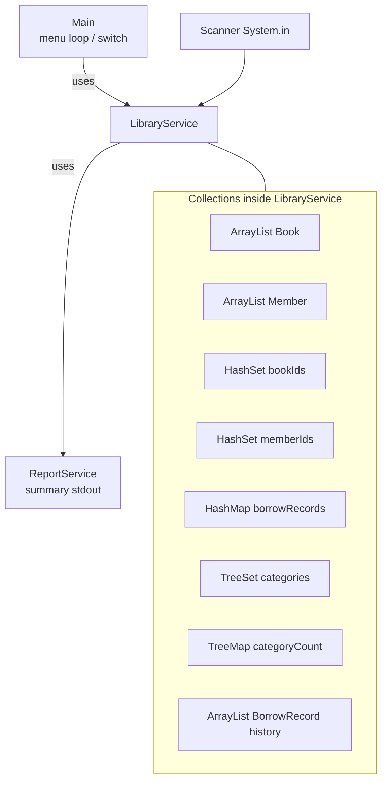
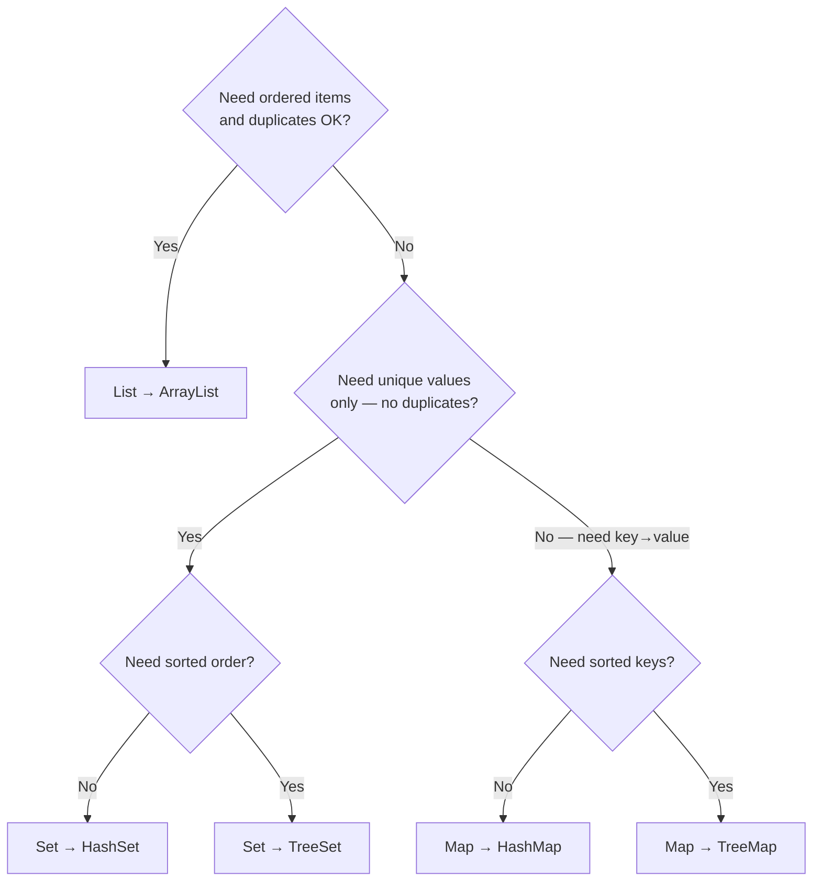
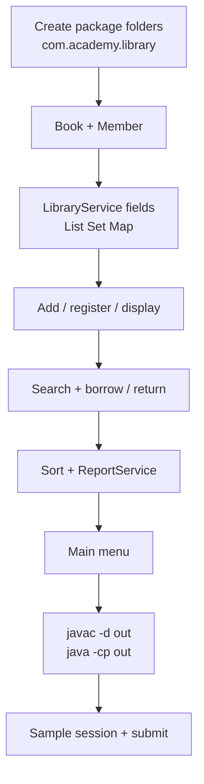

# Lab 5: Java Collections Framework — Library Management System

**Module:** 5 — Java Collections Framework  
**Lab folder:** `labs/Week 1 - Java and JVM Foundations/module-05/lab5/`  
**Difficulty:** Intermediate (Beginner-Friendly)  
**Duration:** 3–4 Hours

**Primary IDE:** IntelliJ IDEA Community Edition · **Optional IDE:** VS Code

| OS | How-to for this lab |
| -- | ------------------- |
| Windows | [LAB-5-WINDOWS.md](LAB-5-WINDOWS.md) |
| macOS | [LAB-5-MACOS.md](LAB-5-MACOS.md) |

> **Environment reminder:** Finish [Lab 0](../../module-00/lab0/LAB-0-GUIDE.md). Use **JDK 21** and **IntelliJ IDEA Community** (primary) or **VS Code** (optional). Workspace: `java-bootcamp` (Windows: `%USERPROFILE%\java-bootcamp`).

> **Pre-lab exercises:** Complete [`../exercises/`](../exercises/) (from the Module 5 slides) before starting this lab.

---

## How to follow this lab

1. Open the **Windows** or **macOS** how-to (links above) in a second tab.
2. Create/work only under your `java-bootcamp/examples/…` folder from the steps (not inside this `labs/` git clone unless a step says otherwise).
3. For each **Step N**: read **Why** (if present) → do the actions → confirm **Expected** / **Expected result** → then continue.
4. When stuck, use **Failure Experiments** / troubleshooting in this guide before asking for help.
5. Capture evidence under `notes/screenshots/lab-5/` (workspace root under `java-bootcamp`; redact secrets). Use the **Pass criteria** tables — write **Pass** or **Fail** in your notes. GitHub file view does not support clickable checkboxes.

## Lab Overview

This Module 5 lab teaches the **Java Collections Framework** by building a complete **Library Management System** console application. You will choose and use `List`, `Set`, and `Map` implementations for real domain concepts—books, members, borrow mappings, categories, and reports—then iterate, search, sort, and measure collection performance.

**Purpose.** OOP design alone (Lab 3) does not tell you *where* to store growing business data in memory. Enterprise Java apps live on collections: ordered catalogs (`ArrayList`), uniqueness (`HashSet`), key→value lookups (`HashMap`), and sorted views (`TreeSet` / `TreeMap`). Lab 5 forces those decisions on a small but complete domain.

**What you build (exercise).** A library-staff console under package `com.academy.library`: add books, register members, search and sort the catalog, borrow/return titles, display borrowed books, generate reports, and exit cleanly. Core types: `Book`, `Member`, `BorrowRecord`, `LibraryService`, `ReportService`, `BookComparator`, `Main`.

**What success looks like.** Under `examples/Lab5-LibraryManagement/` you compile with `javac -d out ...`, run `java -cp out com.academy.library.Main`, walk the menu, demonstrate Set/Map/List behavior, fill a performance table, and submit evidence graders can recompile.

**Depends on Lab 0.** If VS Code / IntelliJ, `java`, or `javac` fail, fix [Lab 0](../../module-00/lab0/LAB-0-GUIDE.md) / [SETUP-INSTRUCTIONS.md](../../../SETUP-INSTRUCTIONS.md).

**CRM connection (future only).** From Lab 8 onward the **Customer Management Platform** will use collections heavily—`List` of customers, `Map` of id→customer lookups, uniqueness rules, and sorted reporting. This lab does **not** build CRM APIs, Spring beans, or a database. Treat the library as a **skill bridge**.

**Reference solution:** [`solution/Lab5-LibraryManagement/`](solution/Lab5-LibraryManagement/) — package `com.academy.library`.

---

## Learning Objectives

After completing this lab, you will be able to:

* Use **List**, **Set**, and **Map** collections with generics (`ArrayList<Book>`, `HashSet<String>`, `HashMap<String, String>`)
* Choose an appropriate collection implementation for ordered storage, uniqueness, and key lookups
* Store custom objects in collections and print them with clear `toString()` output
* Prevent duplicate book/member IDs with `HashSet` before inserts
* Model borrow state with a `HashMap` (book ID → member ID) plus optional `ArrayList<BorrowRecord>` history
* Search collections by ID, title, author, and category
* Sort with `Comparable` (`Book` by title) and `Comparator` (`BookComparator` by price)
* Demonstrate ordered uniqueness with `TreeSet` and sorted category counts with `TreeMap`
* Iterate using traditional `for`, enhanced `for`, `Iterator`, and `forEach`
* Apply immutable IDs (`final String bookId`) as a design choice
* Compare `ArrayList` vs `LinkedList` performance with `System.nanoTime()`
* Build a menu-driven console app and compile/run with `javac -d out` / `java -cp out` on the laptop

---

## Business Scenario

A **training institute** maintains a small campus library. Staff need a console application (plain JDK—no database, no Spring, no GUI framework) to manage:

* **Books** — catalog with ID, title, author, category, price, availability
* **Members** — borrowers with ID, name, email, phone
* **Borrowing and returns** — who has which book right now
* **Searching and sorting** — find and order titles quickly
* **Reporting** — totals, available vs borrowed, popular categories

Instead of a database, **all data lives in Java Collections** for the life of the process.

**Optional forward look:** The same “pick List vs Set vs Map for each concept” thinking later helps when CRM platforms hold customer lists, id→entity maps, and unique email sets. You are not building CRM today.

**Security note for evidence.** Do not paste secrets or tokens into screenshots or notes. Demo data (`Java Fundamentals`, member `1`) is fine to submit.

---

## Architecture Context

### Which collection for which domain concept



### Beginner decision guide (List / Set / Map)



**Beginner meaning in one sentence each:**

| Type | Think of it as… | Library example |
| ---- | ---------------- | --------------- |
| **List** | Numbered shelf row — order matters; same title can appear twice unless you guard IDs | `ArrayList<Book> books` |
| **Set** | Bag of IDs — each value at most once | `HashSet<String> bookIds` |
| **Map** | Lookup table — give a key, get a value | `HashMap` bookId → memberId |

### Lab flow



## Prerequisites

Complete [Labs Setup Instructions](../../../SETUP-INSTRUCTIONS.md) and [Lab 0](../../module-00/lab0/LAB-0-GUIDE.md). Confirm:

* **JDK 21** with `javac` and `java` on `PATH`
* **VS Code** and/or **IntelliJ IDEA** — see [`_IDE-CONVENTIONS.md`](../../_IDE-CONVENTIONS.md)
* Workspace: `%USERPROFILE%\java-bootcamp` or `$HOME/java-bootcamp`
* **Lab 2–3 recommended:** packages under `src/com/academy/...`, `Scanner` + `nextLine()`, thin `Main` + service layer
* Maven is optional—plain `javac`/`java` is the primary path

### Pre-flight

```bash
java -version
javac -version
```

**Expected theme:** OpenJDK / Temurin **21.x**.

**If it fails:** Revisit Lab 0; open a new IDE terminal after changing `JAVA_HOME`.

---

## Steps from the training slides

> Paths use `$HOME/java-bootcamp` (PowerShell/bash/zsh). On classic cmd use `%USERPROFILE%\java-bootcamp\...`.

### Step 1 — Create the Lab 5 project tree

**Why:** Folder path must match `package com.academy.library;` or `javac` / `java` fail confusingly.

**Do this:**

**VS Code:** **File → Open Folder…** → `Lab5-LibraryManagement` (or parent `java-bootcamp`). Terminal: `` Ctrl+` ``.

**IntelliJ:** **File → Open…** → select `Lab5-LibraryManagement`. **Project Structure → Project → SDK = 21**. Later, run `Main` via the green gutter arrow.

```bash
mkdir -p "$HOME/java-bootcamp/examples/Lab5-LibraryManagement/src/com/academy/library"
mkdir -p "$HOME/java-bootcamp/notes/screenshots/lab-5"
cd "$HOME/java-bootcamp/examples/Lab5-LibraryManagement"
```

Windows cmd:

```text
mkdir %USERPROFILE%\java-bootcamp\examples\Lab5-LibraryManagement\src\com\academy\library
mkdir %USERPROFILE%\java-bootcamp\notes\screenshots\lab-5
cd /d %USERPROFILE%\java-bootcamp\examples\Lab5-LibraryManagement
```

**Expected result:**

```text
Lab5-LibraryManagement/
  src/com/academy/library/   ← empty, ready for .java files
```

**If it fails:** Nested `com/academy` missing → recreate the three folders. IntelliJ marks sources wrong → mark `src` as Sources Root (right-click → Mark Directory as → Sources Root).

---

### Step 2 — Create `Book.java`

**Why:** The catalog is a **List** of books; IDs stay `final` so identity does not mutate after insert into a `Set`/`Map`.

**Do this:** Create `src/com/academy/library/Book.java` with:

* Package `com.academy.library`
* Fields: `final String bookId`, `title`, `author`, `category`, `price`, `boolean available`
* Constructor initializing fields (`available = true`)
* Getters / setters (no setter for `bookId`)
* `implements Comparable<Book>` — compare titles case-insensitive
* `toString()` similar to:  
  `ID: %s | %s | %s | %s | $%.2f | Available|Borrowed`

**Expected result:** File compiles in isolation once you have a `main` later; `compareTo` returns negative/zero/positive for title order.

**If it fails:** Forgot `package` line → add it. Mutable `bookId` → make it `final`.

---

### Step 3 — Create `Member.java`

**Why:** Members are stored in an `ArrayList` like books; uniqueness will be enforced with a `HashSet` of IDs.

**Do this:** Create `Member.java` with `memberId` (prefer `final`), `name`, `email`, `phone`, constructor, getters/setters as needed, and a readable `toString()`.

**Expected result:** Clear one-line display for roster printouts.

**If it fails:** Public class / file name mismatch → rename carefully (case-sensitive on macOS/Linux).

---

### Step 4 — Create `BorrowRecord.java` (history helper)

**Why:** A **Map** answers “who has this book *now*”; a **List** of records answers “what happened over time.”

**Do this:** Create `BorrowRecord.java` holding book ID, member ID, and a borrow date (e.g. `LocalDate`). Include a simple `toString()`.

**Expected result:** Type ready for an `ArrayList<BorrowRecord> borrowHistory` field.

**If it fails:** Skipping this file is OK for a minimal core if you omit history bonuses—but keep it if you plan menu options 15–16.

---

### Step 5 — Start `LibraryService` with the right collections

**Why:** Picking collection types is the heart of Module 5. Wrong type = wrong operations (e.g. using only a List to check duplicates is O(n) and error-prone).

**Do this:** Create `LibraryService.java` with a `Scanner` field and:

```java
private final ArrayList<Book> books = new ArrayList<>();
private final ArrayList<Member> members = new ArrayList<>();
private final HashSet<String> bookIds = new HashSet<>();
private final HashSet<String> memberIds = new HashSet<>();
private final HashMap<String, String> borrowRecords = new HashMap<>();
private final TreeSet<String> categories = new TreeSet<>();
private final TreeMap<String, Integer> categoryBookCount = new TreeMap<>();
private final ArrayList<BorrowRecord> borrowHistory = new ArrayList<>();
```

Constructor: `LibraryService(Scanner scanner)` storing the scanner (and later a `ReportService`).

**Expected result:** Empty collections compile; service is ready for methods.

**If it fails:** Raw types (`ArrayList` without `<Book>`) → add generics. Missing imports for `HashMap` etc. → `import java.util.*;` or specific imports.

---

### Step 6 — Add book and register member

**Why:** Every insert should update **List** (data) + **Set** (ID guard) + category structures.

**Do this:** Implement `addBook()`:

1. Prompt for Book ID; if `bookIds.contains(id)` print `Book already exists.` and return
2. Prompt title, author, category, price (parse a positive double)
3. Create `Book`, `books.add`, `bookIds.add`, `categories.add`, update `categoryBookCount`
4. Print `Book Added Successfully`

Implement `registerMember()` similarly with `memberIds` / `members` and message `Member Registered Successfully`.

**Expected result:** Duplicate IDs rejected; first insert succeeds.

**If it fails:** Using `==` for String IDs → use `contains` / `equals`. Price parse crash → wrap `Double.parseDouble` and re-prompt.

---

### Step 7 — Display books with four iteration styles

**Why:** Interviewers and graders look for comfort with classic `for`, enhanced `for`, `Iterator`, and `forEach`.

**Do this:** Implement `displayBooks()`:

* If empty → `No books available.`
* Otherwise print sections:
  * Traditional indexed `for`
  * Enhanced `for`
  * `Iterator`
  * `books.forEach(...)`

Also implement `displayMembers()` similarly (at least one clear loop style).

**Expected result:** Each book line appears (optionally multiple times across styles—that is intentional for learning).

**If it fails:** Concurrent modification during display → do not add/remove while iterating unless using the iterator’s `remove` carefully (not needed here).

---

### Step 8 — Search books

**Why:** Searching a **List** by field teaches linear scan before databases appear.

**Do this:** Implement `searchBook()` with a submenu, for example:

1. By ID  
2. By title  
3. By author  
4. By category  
5. Partial title (bonus-friendly)

Print matches via `toString()`; if none, print a clear not-found message.

**Expected result:** Exact ID hit prints one book; bad ID prints not found.

**If it fails:** Case sensitivity surprises → use `equalsIgnoreCase` / `toLowerCase` for titles when appropriate.

---

### Step 9 — Borrow and return with `HashMap`

**Why:** A **Map** is the natural “book → current borrower” structure. Availability flags stay in sync with map entries.

**Do this:**

**`borrowBook()`:**

1. Prompt Book ID and Member ID  
2. Validate book exists, member exists, book not already in `borrowRecords`, book available  
3. `borrowRecords.put(bookId, memberId)`; set `available = false`  
4. Optionally append `BorrowRecord` and bump a borrow-frequency map  
5. Print `Book Borrowed Successfully`

**`returnBook()`:**

1. Prompt Book ID  
2. If not borrowed → error  
3. `borrowRecords.remove(bookId)`; set available true  
4. Print success

Also implement `displayBorrowedBooks()` by iterating `borrowRecords.entrySet()`.

**Expected result:** After borrow, book shows Borrowed; after return, Available again.

**If it fails:** Borrow succeeds twice → check `borrowRecords.containsKey` before put. Returning without remove → Map still blocks next borrow.

---

### Step 10 — Sort with `Comparable` and `Comparator`

**Why:** `Comparable` = natural order on the type; `Comparator` = alternate sort strategies (price, author, …).

**Do this:**

1. Ensure `Book.compareTo` sorts by title  
2. Create `BookComparator.java` implementing `Comparator<Book>` by **price**  
3. Implement `sortBooks()` menu: title (`Collections.sort(books)`), price (`books.sort(new BookComparator())`), and optionally author/category

**Expected result:** After title sort, alphabetically earlier titles appear first; after price sort, cheaper books rise.

**If it fails:** `ClassCastException` → forgot `implements Comparable<Book>`. Wrong import → `java.util.Comparator`.

---

### Step 11 — `ReportService` and category insights

**Why:** Reporting should not clutter `Main`. Sorted category views showcase `TreeSet` / `TreeMap`.

**Do this:** Create `ReportService.java` that reads collections from `LibraryService` and prints:

```text
Reports
Books : ...
Borrowed : ...
Available : ...
Members : ...
Most Popular Category : ...
```

Wire `displayReports()` on the service to call the report. Implement `displayCategoryInsights()` to print sorted category names (`TreeSet`) and sorted counts (`TreeMap`).

**Expected result:** After adding one Programming book and borrowing it, popular category is `Programming`, Borrowed `1`, Available `0`.

**If it fails:** Most popular `N/A` with empty map → handle empty with a default string.

---

### Step 12 — Build `Main` menu

**Why:** Thin entry point keeps SRP: `Main` owns the loop; `LibraryService` owns operations.

**Do this:** Create `Main.java`:

```text
=====================================
Library Management System
=====================================
1 Add Book
2 Register Member
3 Display Books
4 Display Members
5 Search Book
6 Borrow Book
7 Return Book
8 Display Borrowed Books
9 Sort Books
10 Reports
11 Exit
12 Display Available Books
13 Category Insights (TreeSet/TreeMap)
14 Performance Comparison (Bonus)
15 Borrow History (Bonus)
16 Top 5 Borrowed Books (Bonus)
17 Export Report (Bonus)
Choice :
```

Use `Scanner.nextLine()`, parse `int`, `switch` to service methods. Choice `11` prints `Thank You` and exits.

**Expected result:** Invalid letters reprint menu safely; `11` exits cleanly.

**If it fails:** Menu “skips” inputs → avoid mixing `nextInt()` with `nextLine()`; parse with `Integer.parseInt` on `nextLine()`.

---

### Step 13 — Compile and run (primary path)

**Why:** `-d out` mirrors real package layout under classpath—same idea as Lab 2–3.

**Do this:** From project root `Lab5-LibraryManagement`:

```bash
cd "$HOME/java-bootcamp/examples/Lab5-LibraryManagement"
javac -d out src/com/academy/library/*.java
java -cp out com.academy.library.Main
```

**IntelliJ:** Run `Main` from the gutter, **or** use the same terminal commands above for grading fidelity.

**Expected result:** Menu appears; process waits at `Choice :`.

**If it fails:**

* `package does not exist` → folders under `src/com/academy/library` must exist  
* `Could not find or load main class` → use `-cp out` and fully qualified name  
* Stale code → delete `out` and recompile

Windows PowerShell cleanup:

```powershell
Remove-Item -Recurse -Force out -ErrorAction SilentlyContinue
javac -d out src/com/academy/library/*.java
```

---

### Step 14 — Scripted sample session (match solution themes)

**Why:** Graders compare your session output to the known success themes from the reference solution.

**Do this:** Run the app and enter approximately:

| Step | Input theme |
| ---- | ----------- |
| Choice | `1` |
| Book ID | `101` |
| Title | `Java Fundamentals` |
| Author | `James Gosling` |
| Category | `Programming` |
| Price | `55` |
| Choice | `2` |
| Member ID | `1` |
| Name | `John` |
| Email | `john@example.com` |
| Phone | `1234567890` |
| Choice | `6` |
| Book ID | `101` |
| Member ID | `1` |
| Choice | `10` |
| Choice | `11` |

**Expected result (themes — from solution README):**

```text
Choice : 1
Book ID : 101
Title : Java Fundamentals
Author : James Gosling
Category : Programming
Price : 55
Book Added Successfully

Choice : 2
Member ID : 1
Name : John
Email : john@example.com
Phone : 1234567890
Member Registered Successfully

Choice : 6
Book ID : 101
Member ID : 1
Book Borrowed Successfully

Choice : 10
Reports
Books : 1
Borrowed : 1
Available : 0
Members : 1
Most Popular Category : Programming

Choice : 11
Thank You
```

Screenshot this path for evidence.

**If it fails:** Borrow rejected → register member first; ensure book ID matches exactly (`101`). Reports show Available `1` → borrow map not updated / availability flag not flipped.

---

### Step 15 — Performance comparison (bonus-friendly, recommended)

**Why:** Feeling `ArrayList` vs `LinkedList` once beats memorizing Big-O posters.

**Do this:** Implement `runPerformanceComparison()` (menu 14): insert many integers into `ArrayList` and `LinkedList`, time with `System.nanoTime()`, print ms. Record results in `../../notes/lab5-answers.md` (from project; or `~/java-bootcamp/notes/lab5-answers.md`).

**Expected result:** ArrayList often wins for indexed / end-oriented insert patterns you code; LinkedList shows overhead—document **your** numbers.

**If it fails:** Unfair test (different sizes) → use the same `N` for both lists.

---

### Step 16 — Self-review and optional solution peek

**Why:** Rubric scores collection *choice* + working menu, not clever one-liners.

**Do this:** Checklist:

* Every source file has `package com.academy.library;`
* IDs guarded by `HashSet`
* Borrow state in `HashMap`
* Reports match sample themes
* Naming is clear; `Main` stays thin

Optionally skim [`solution/Lab5-LibraryManagement/`](solution/Lab5-LibraryManagement/) *after* your attempt.

**Expected result:** Instructor can skim and map List/Set/Map usage without guessing.

**If it fails:** Logic piled in `Main` → move prompts into `LibraryService`.

---

## Implementation Checkpoints

### Checkpoint A — Packages + models

_Mark each row **Pass** or **Fail** in your lab notes (GitHub markdown files are not interactive checklists)._

| # | Confirm | Your notes |
| - | ------- | ---------- |
| 1 | `src/com/academy/library/` contains `Book`, `Member`, (`BorrowRecord`), service types, `Main` | Pass / Fail |
| 2 | All files declare `package com.academy.library;` | Pass / Fail |
| 3 | Edited with VS Code and/or IntelliJ per [`_IDE-CONVENTIONS.md`](../../_IDE-CONVENTIONS.md) | Pass / Fail |

### Checkpoint B — Collections wired

_Mark each row **Pass** or **Fail** in your lab notes (GitHub markdown files are not interactive checklists)._

| # | Confirm | Your notes |
| - | ------- | ---------- |
| 1 | List / Set / Map / TreeSet / TreeMap fields present as designed | Pass / Fail |
| 2 | Duplicate book/member IDs rejected | Pass / Fail |
| 3 | Borrow uses `HashMap`; return clears the entry | Pass / Fail |

### Checkpoint C — Compile / menu / sample session

_Mark each row **Pass** or **Fail** in your lab notes (GitHub markdown files are not interactive checklists)._

| # | Confirm | Your notes |
| - | ------- | ---------- |
| 1 | `javac -d out src/com/academy/library/*.java` succeeds | Pass / Fail |
| 2 | `java -cp out com.academy.library.Main` shows the menu | Pass / Fail |
| 3 | Sample session produces Add / Register / Borrow / Reports themes | Pass / Fail |
| 4 | Exit prints `Thank You` | Pass / Fail |

### Checkpoint D — Evidence

_Mark each row **Pass** or **Fail** in your lab notes (GitHub markdown files are not interactive checklists)._

| # | Confirm | Your notes |
| - | ------- | ---------- |
| 1 | Screenshots under `notes/` (or LMS) | Pass / Fail |
| 2 | Short note explaining why List vs Set vs Map for each field | Pass / Fail |
| 3 | Optional performance table filled | Pass / Fail |

---

## Reference Commands, Configuration, and Code

### Primary compile / run

```bash
cd "$HOME/java-bootcamp/examples/Lab5-LibraryManagement"
javac -d out src/com/academy/library/*.java
java -cp out com.academy.library.Main
```

### Clean rebuild

```bash
cd "$HOME/java-bootcamp/examples/Lab5-LibraryManagement"
rm -rf out
javac -d out src/com/academy/library/*.java
# PowerShell: Remove-Item -Recurse -Force out
```

### Collection types used (solution map)

| Collection | Purpose | Why |
| ---------- | ------- | --- |
| `ArrayList<Book>` | Store books | Fast random access / iteration |
| `ArrayList<Member>` | Store members | Same for roster |
| `HashSet<String>` | Track IDs | O(1) duplicate detection |
| `HashMap<String, String>` | Borrow records | Fast book → member lookup |
| `TreeSet<String>` | Categories | Sorted unique names |
| `TreeMap<String, Integer>` | Category counts | Sorted reporting |
| `ArrayList<BorrowRecord>` | Borrow history | Ordered audit trail |

### Class responsibilities

| Class | Responsibility |
| ----- | ---------------- |
| `Main` | Menu loop + switch |
| `LibraryService` | Collections + operations |
| `ReportService` | Summary (+ optional export) |
| `Book` / `Member` / `BorrowRecord` | Domain models |
| `BookComparator` | Price ordering |

Maven is **not** required for this lab.

---

## Manual Verification

1. Menu shows options; invalid `abc` → invalid message → menu returns.
2. Add book `101` / member `1` / borrow / reports match the sample themes above.
3. Duplicate book ID `101` → `Book already exists.`
4. Display books shows at least one iteration style with your title.
5. Sort by title changes order when multiple books exist.
6. Category insights list `Programming` after the sample add.
7. Exit `11` → `Thank You` and process ends.

Record pass/fail in `../../notes/lab5-answers.md` (from project; or `~/java-bootcamp/notes/lab5-answers.md`).

---

## Failure Experiments

1. Skip `HashSet` and insert two books with ID `101` → confusing catalog; restore Set guard.  
2. Toggle only `available` without Map → cannot answer “who has it?”; restore `HashMap`.  
3. Compile without `-d out` / wrong `-cp` → cannot load main; use the Step 13 commands.  
4. Mix `nextInt()` + `nextLine()` → skipped prompts; parse all input via `nextLine()`.

---

## Troubleshooting

| Symptom | Likely cause | Fix |
| ------- | ------------ | --- |
| `javac` not found | PATH / JAVA_HOME | Lab 0 |
| Package does not exist | Folder ≠ package | Recreate `src/com/academy/library` |
| Cannot load main class | Wrong `-cp` | `java -cp out com.academy.library.Main` |
| Duplicate still inserted | No Set check | `bookIds.contains` before add |
| Borrow always fails | Member not registered / already borrowed | Follow sample order |
| Reports Available wrong | Map / flag out of sync | Update both on borrow/return |
| IntelliJ cannot run Main | SDK / sources root | SDK 21; mark `src` as Sources |
| VS Code terminal wrong folder | cwd | `cd` to `Lab5-LibraryManagement` |

---

## Security, Cleanup, and Deliverables

**Security:** Training console only—no auth; data is in-memory. Do not paste real PII or secrets into notes/screenshots.

**Cleanup:**

```bash
cd "$HOME/java-bootcamp/examples/Lab5-LibraryManagement"
rm -rf out
rm -f library-report.txt
# PowerShell: Remove-Item -Recurse -Force out -ErrorAction SilentlyContinue
```

Keep sources and evidence. Leave [`solution/`](solution/) intact.

**Deliverables:** `src/com/academy/library/*`; menu + sample-session screenshots; notes mapping each field to List/Set/Map; LMS write-up with compile/run commands. Optional bonuses (history, top borrowed, export, multi-sort). No verbatim solution copies.

---

## Evaluation Rubric (100 Marks)

| Criteria | Marks |
| -------- | ----: |
| Correct List / Set / Map usage | 20 |
| Domain models + encapsulation | 10 |
| Add / register / display / search | 15 |
| Borrow / return with Map | 15 |
| Sort (`Comparable` / `Comparator`) | 10 |
| Reports + TreeSet / TreeMap insights | 10 |
| Menu app + compile/run evidence | 10 |
| Analysis & code quality | 10 |

---

## Reflection Questions

Write short answers in `../../notes/lab5-answers.md` (from project; or `~/java-bootcamp/notes/lab5-answers.md`):

1. When choose `List` over `Set`?
2. Why `HashSet` before inserting a book ID?
3. Why a `Map` for “currently borrowed” vs only a boolean?
4. `HashMap` vs `TreeMap` in this lab?
5. `Comparable` vs `Comparator` for books?
6. Which iteration style would you use most in production—and why?
7. CRM: which collection for customer list / unique emails / id→customer lookup?

---

## Bonus Challenges

Align with [`solution/Lab5-LibraryManagement/`](solution/Lab5-LibraryManagement/): borrow history + top 5 (15–16); partial title search; multi-field sort; export `library-report.txt`; menu 14 ArrayList vs LinkedList timings.

---

## Instructor Notes

Solution under [`solution/Lab5-LibraryManagement/`](solution/Lab5-LibraryManagement/) (`com.academy.library`). Score collection choice + sample Add/Register/Borrow/Reports. Dual IDE on laptop. Pitfalls: missing `-d out`, `nextInt` newline bugs, List-only duplicates, Map/flag drift.

---

*End of Lab 5 — Java Collections Framework / Library Management System.*
