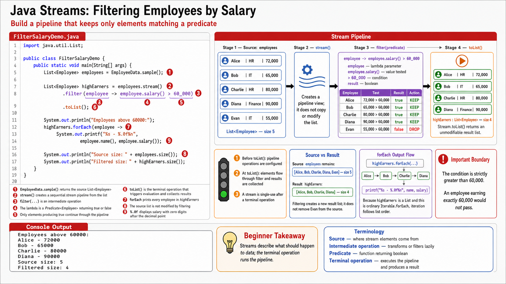

# Exercise 2 — Filter Employees by Salary

**Module 6** · Pre-lab practice · finish Exercises 1–7 Pass, then OS how-to → [`../lab6/LAB-6-GUIDE.md`](../lab6/LAB-6-GUIDE.md)
**Folder:** `examples/module-06-exercises/` ([setup](EXERCISES-INDEX.md))



> **Builds on Exercise 1:** Reuse `Employee.java` and `EmployeeData.java`.

## Goal

Create `FilterSalaryDemo.java` and use `filter` to select employees whose
salary is greater than 60,000 without changing the source list.

## Starter / reference (with line comments)

```java
import java.util.List;

public class FilterSalaryDemo {
    public static void main(String[] args) {
        List<Employee> employees = EmployeeData.sample();

        // stream() reads the collection as a pipeline source.
        // filter keeps only employees for which the predicate returns true.
        // toList is the terminal operation that executes the pipeline.
        List<Employee> highEarners = employees.stream()
                .filter(employee -> employee.salary() > 60_000)
                .toList();

        System.out.println("Employees above 60000:");
        highEarners.forEach(employee ->
                System.out.printf("%s - %.0f%n",
                        employee.name(), employee.salary()));

        // The original source still contains all five employees.
        System.out.println("Source size: " + employees.size());
        System.out.println("Filtered size: " + highEarners.size());
    }
}
```

## Steps

### Step 1 — Predict the result

**Why:** A predicate is easier to debug when you evaluate the condition for
each input before running the code.

Write `keep` or `discard` beside:

- Alice — 72,000
- Bob — 65,000
- Charlie — 80,000
- Diana — 90,000
- Evan — 55,000

### Step 2 — Create `FilterSalaryDemo.java`

Paste the starter code. Identify the source, intermediate operation, and
terminal operation in comments.

### Step 3 — Compile and run

**Windows:**

```powershell
cd $env:USERPROFILE\java-bootcamp\examples\module-06-exercises
javac Employee.java EmployeeData.java FilterSalaryDemo.java
java FilterSalaryDemo
```

**macOS:**

```bash
cd ~/java-bootcamp/examples/module-06-exercises
javac Employee.java EmployeeData.java FilterSalaryDemo.java
java FilterSalaryDemo
```

**Expected output:**

```text
Employees above 60000:
Alice - 72000
Bob - 65000
Charlie - 80000
Diana - 90000
Source size: 5
Filtered size: 4
```

### Step 4 — Test the boundary

Change the threshold to `65_000`.

- With `> 65_000`, Bob is excluded.
- With `>= 65_000`, Bob is included.

Restore `> 60_000` when finished.

## Expected result

The filtered list contains Alice, Bob, Charlie, and Diana. Evan is excluded,
and the original source list still contains five employees.

## If it fails

| Problem | Fix |
| ------- | --- |
| All five employees print | Confirm the condition is inside `.filter(...)` and uses `> 60_000` |
| Nothing happens | Add a terminal operation such as `.toList()`; intermediate operations are lazy |
| `toList()` is unknown | Confirm `java -version` and `javac -version` report JDK 21 |
| `EmployeeData` is missing | Complete Exercise 1 in the same folder |

## Pass criteria

| # | Confirm | Your notes |
| - | ------- | ---------- |
| 1 | Exactly four employees print at the 60,000 threshold | Pass / Fail |
| 2 | Evan does not appear in the filtered output | Pass / Fail |
| 3 | Source size remains 5 and filtered size is 4 | Pass / Fail |
| 4 | You can explain why `filter` is an intermediate operation | Pass / Fail |
