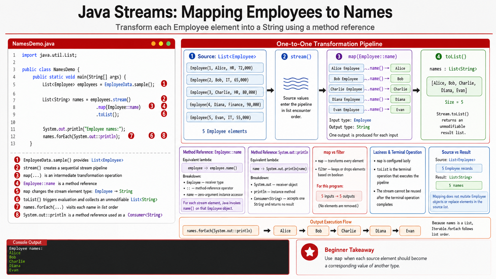

# Exercise 3 — Map Employees to Names

**Module 6** · Pre-lab practice · finish Exercises 1–7 Pass, then OS how-to → [`../lab6/LAB-6-GUIDE.md`](../lab6/LAB-6-GUIDE.md)
**Folder:** `examples/module-06-exercises/` ([setup](EXERCISES-INDEX.md))



> **Builds on Exercise 1:** Reuse the shared employee model and dataset.

## Goal

Create `NamesDemo.java`. Transform each `Employee` into a `String` name with
`map`, collect the names, and print them with a method reference.

## Starter / reference (with line comments)

```java
import java.util.List;

public class NamesDemo {
    public static void main(String[] args) {
        List<Employee> employees = EmployeeData.sample();

        // map changes the element type: Employee -> String.
        // Employee::name is equivalent to employee -> employee.name().
        List<String> names = employees.stream()
                .map(Employee::name)
                .toList();

        System.out.println("Employee names:");
        names.forEach(System.out::println);
    }
}
```

## Steps

### Step 1 — Trace the type change

**Why:** `map` does not filter records. It produces one output value for each
input value.

Complete this note:

```text
Before map: Stream<Employee>
Mapping function: Employee::name
After map: Stream<String>
Final result: List<String>
```

### Step 2 — Create, compile, and run

**Windows:**

```powershell
cd $env:USERPROFILE\java-bootcamp\examples\module-06-exercises
javac Employee.java EmployeeData.java NamesDemo.java
java NamesDemo
```

**macOS:**

```bash
cd ~/java-bootcamp/examples/module-06-exercises
javac Employee.java EmployeeData.java NamesDemo.java
java NamesDemo
```

**Expected output:**

```text
Employee names:
Alice
Bob
Charlie
Diana
Evan
```

### Step 3 — Replace the method reference

Temporarily replace:

```java
.map(Employee::name)
```

with:

```java
.map(employee -> employee.name())
```

Recompile and confirm the output is identical.

### Step 4 — Transform formatting

Change the mapper to:

```java
.map(employee -> employee.name().toUpperCase())
```

Confirm all five names print in uppercase, then restore `Employee::name`.

## Expected result

All five employees produce exactly five names. The method-reference and lambda
versions give the same result.

## If it fails

| Problem | Fix |
| ------- | --- |
| Record details print instead of names | Map with `Employee::name` before collecting |
| `invalid method reference` | Confirm the record accessor is `name()` and the type is `Employee` |
| Only some names print | Remove any leftover `filter` from Exercise 2 |
| Attempting to assign to `List<Employee>` fails | After mapping names, the result type is `List<String>` |

## Pass criteria

| # | Confirm | Your notes |
| - | ------- | ---------- |
| 1 | All five names print in source order | Pass / Fail |
| 2 | Lambda and method-reference versions match | Pass / Fail |
| 3 | Uppercase transformation works | Pass / Fail |
| 4 | You can explain the `Employee` → `String` type change | Pass / Fail |
