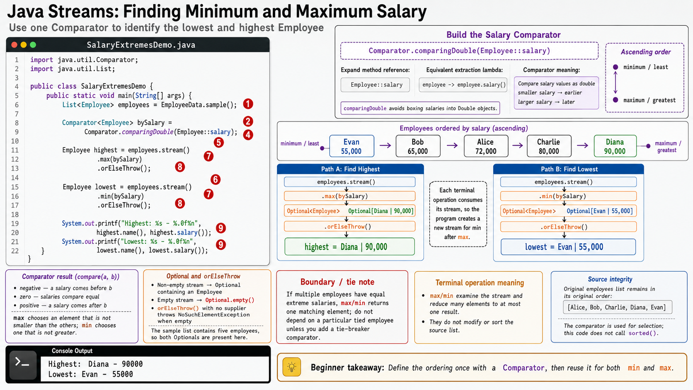

# Exercise 4 — Find the Highest and Lowest Salary

**Module 6** · Pre-lab practice · finish Exercises 1–7 Pass, then OS how-to → [`../lab6/LAB-6-GUIDE.md`](../lab6/LAB-6-GUIDE.md)
**Folder:** `examples/module-06-exercises/` ([setup](EXERCISES-INDEX.md))



## Goal

Create `SalaryExtremesDemo.java`. Use one salary comparator with `max` and
`min`, then handle each potentially empty result explicitly.

## Starter (fill in the TODOs)

Paste this skeleton, then replace each `_____` and `// TODO` with working code. Do **not** leave TODOs in your finished file.

```java
import java.util.Comparator;
import java.util.List;

public class SalaryExtremesDemo {
    public static void main(String[] args) {
        List<Employee> employees = EmployeeData.sample();

        // TODO: Comparator ascending by salary (hint: Comparator.comparingDouble(Employee::salary))
        Comparator<Employee> bySalary = _____;

        // TODO: stream + max(bySalary) + orElseThrow()
        Employee highest = employees.stream()
                // TODO: .max(bySalary)
                // TODO: .orElseThrow()
                ;

        // TODO: stream + min(bySalary) + orElseThrow()
        Employee lowest = employees.stream()
                // TODO: .min(bySalary)
                // TODO: .orElseThrow()
                ;

        System.out.printf("Highest: %s - %.0f%n",
                highest.name(), highest.salary());
        System.out.printf("Lowest: %s - %.0f%n",
                lowest.name(), lowest.salary());
    }
}
```

| Idea | Easy meaning |
| ---- | ------------ |
| `max` / `min` | Terminal reductions that pick one element using a comparator |
| `Optional<Employee>` | Result may be empty when the source list has no elements |
| `orElseThrow()` | Safe here because the sample list is non-empty |

## Steps

### Step 1 — Predict using the comparator

**Why:** A comparator is easier to trust when you can state the expected order
before the code runs.

List the employees in ascending salary order. The first should be the `min`
result and the last should be the `max` result.

### Step 2 — Create, compile, and run

**Why:** One shared comparator proves `min` and `max` are opposite ends of the
same ordering.

1. **New → File** → `SalaryExtremesDemo.java`.
2. Paste the starter and fill every `_____` / `// TODO`. Save.

**Windows:**

```powershell
cd $env:USERPROFILE\java-bootcamp\examples\module-06-exercises
javac Employee.java EmployeeData.java SalaryExtremesDemo.java
java SalaryExtremesDemo
```

**macOS:**

```bash
cd ~/java-bootcamp/examples/module-06-exercises
javac Employee.java EmployeeData.java SalaryExtremesDemo.java
java SalaryExtremesDemo
```

**Expected output:**

```text
Highest: Diana - 90000
Lowest: Evan - 55000
```

### Step 3 — Observe the empty-input contract

**Why:** `Optional` exists because an empty source has no highest or lowest
employee.

Create an empty list temporarily:

```java
List<Employee> empty = List.of();
System.out.println(empty.stream().max(bySalary));
```

Expected:

```text
Optional.empty
```

Do not call `orElseThrow()` on that intentionally empty stream unless you also
catch the expected `NoSuchElementException`. Remove the temporary check after
you understand the result.

## Expected result

Diana is the maximum-salary employee and Evan is the minimum-salary employee.
You can explain why the terminal operations return `Optional<Employee>`.

## If it fails

| Problem | Fix |
| ------- | --- |
| Highest and lowest are reversed | Use `.max(bySalary)` for highest and `.min(bySalary)` for lowest |
| `Comparator` is unknown | Add `import java.util.Comparator;` |
| `NoSuchElementException` | Do not use `orElseThrow()` on an empty list |
| Salary compares as text | Use `comparingDouble(Employee::salary)`, not a formatted salary string |

## Pass criteria

| # | Confirm | Your notes |
| - | ------- | ---------- |
| 1 | Highest output is Diana — 90000 | Pass / Fail |
| 2 | Lowest output is Evan — 55000 | Pass / Fail |
| 3 | The same comparator is reused for both reductions | Pass / Fail |
| 4 | You can explain the purpose of `Optional` here | Pass / Fail |
