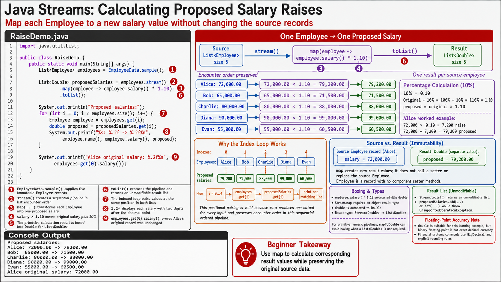

# Exercise 5 — Map a 10% Salary Raise

**Module 6** · Pre-lab practice · finish Exercises 1–7 Pass, then OS how-to → [`../lab6/LAB-6-GUIDE.md`](../lab6/LAB-6-GUIDE.md)
**Folder:** `examples/module-06-exercises/` ([setup](EXERCISES-INDEX.md))



## Goal

Create `RaiseDemo.java`. Transform every salary into a proposed value that is
10% higher while proving that the immutable source employees are unchanged.

## Starter (fill in the TODOs)

Paste this skeleton, then replace each `// TODO` with working code. Do **not** leave TODOs in your finished file.

```java
import java.util.List;

public class RaiseDemo {
    public static void main(String[] args) {
        List<Employee> employees = EmployeeData.sample();

        // TODO: stream pipeline — map each salary to salary * 1.10, collect to List<Double>
        List<Double> proposedSalaries = employees.stream()
                // TODO: .map(employee -> employee.salary() * 1.10)
                // TODO: .toList()
                ;

        System.out.println("Proposed salaries:");
        for (int i = 0; i < employees.size(); i++) {
            Employee employee = employees.get(i);
            double proposed = proposedSalaries.get(i);
            System.out.printf("%s: %.2f -> %.2f%n",
                    employee.name(), employee.salary(), proposed);
        }

        System.out.printf("Alice original salary: %.2f%n",
                employees.get(0).salary());
    }
}
```

| Idea | Easy meaning |
| ---- | ------------ |
| `map` | Transforms each element — here `Employee` → proposed `Double` salary |
| Non-mutation | `map` produces a new list; immutable `Employee` records stay unchanged |
| `1.10` | Multiply by 1.10 for a 10% raise (not `10`) |

## Steps

### Step 1 — Calculate one expected value

**Why:** A known example makes a transformation easy to verify.

Calculate Alice's proposed salary:

```text
72000 × 1.10 = 79200
```

### Step 2 — Create, compile, and run

**Why:** This exercise proves `map` transforms values without mutating source objects.

1. **New → File** → `RaiseDemo.java`.
2. Paste the starter and fill the stream chain `// TODO`s. Save.

**Windows:**

```powershell
cd $env:USERPROFILE\java-bootcamp\examples\module-06-exercises
javac Employee.java EmployeeData.java RaiseDemo.java
java RaiseDemo
```

**macOS:**

```bash
cd ~/java-bootcamp/examples/module-06-exercises
javac Employee.java EmployeeData.java RaiseDemo.java
java RaiseDemo
```

**Expected output:**

```text
Proposed salaries:
Alice: 72000.00 -> 79200.00
Bob: 65000.00 -> 71500.00
Charlie: 80000.00 -> 88000.00
Diana: 90000.00 -> 99000.00
Evan: 55000.00 -> 60500.00
Alice original salary: 72000.00
```

### Step 3 — Explain non-mutation

Add one sentence to `notes.md`:

> `map` produced a new list of proposed values; it did not modify the immutable
> `Employee` records in the source list.

### Step 4 — Change the business rule

Temporarily change `1.10` to `1.05`. Confirm Alice's proposal becomes
`75600.00`, then restore the 10% rule.

## Expected result

Five proposed salaries print in employee order, every proposal is exactly 10%
higher, and Alice's original salary remains 72,000.

## If it fails

| Problem | Fix |
| ------- | --- |
| Values are 10 times larger | Use `1.10`, not `10` |
| Integer-looking or rounded output | Store `Double` values and format with `%.2f` |
| Name and salary do not match | Keep encounter order and use the same index in both lists |
| Tried to call a salary setter | The record is immutable; map to a new value instead |

## Pass criteria

| # | Confirm | Your notes |
| - | ------- | ---------- |
| 1 | Alice's proposed salary is 79200.00 | Pass / Fail |
| 2 | All five proposals are correct | Pass / Fail |
| 3 | Alice's original salary remains 72000.00 | Pass / Fail |
| 4 | You can explain why this is a transformation, not mutation | Pass / Fail |
