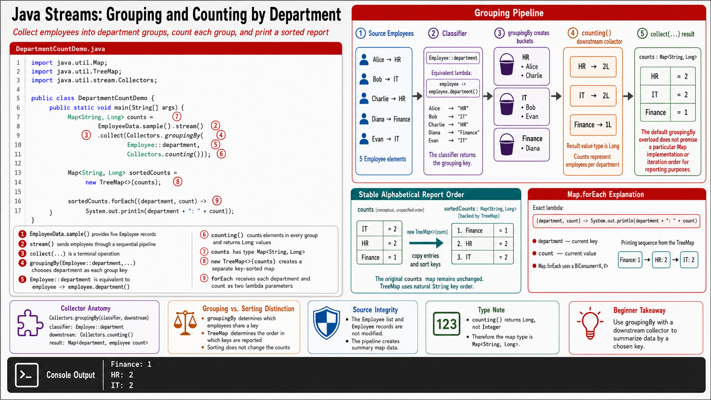

# Exercise 6 — Count Employees by Department

**Module 6** · Pre-lab practice · finish Exercises 1–7 Pass, then OS how-to → [`../lab6/LAB-6-GUIDE.md`](../lab6/LAB-6-GUIDE.md)
**Folder:** `examples/module-06-exercises/` ([setup](EXERCISES-INDEX.md))



## Goal

Create `DepartmentCountDemo.java`. Group employees by department, count each
group, and print the report in deterministic alphabetical key order.

## Starter (fill in the TODOs)

Paste this skeleton, then replace each `_____` and `// TODO` with working code. Do **not** leave TODOs in your finished file.

```java
import java.util.Map;
import java.util.TreeMap;
import java.util.stream.Collectors;

public class DepartmentCountDemo {
    public static void main(String[] args) {
        // TODO: stream + collect groupingBy(Employee::department, Collectors.counting())
        Map<String, Long> counts = EmployeeData.sample().stream()
                .collect(_____);

        // TreeMap gives the report a stable alphabetical order.
        Map<String, Long> sortedCounts = new TreeMap<>(counts);

        sortedCounts.forEach((department, count) ->
                System.out.println(department + ": " + count));
    }
}
```

| Idea | Easy meaning |
| ---- | ------------ |
| `groupingBy` | Chooses the group key — here `Employee::department` |
| `Collectors.counting()` | Downstream collector that stores a `Long` count per group |
| `TreeMap` | Sorts keys alphabetically for deterministic output |

## Steps

### Step 1 — Predict the groups

**Why:** Grouping mistakes are easier to catch when you already know which
employees belong in each department.

From the shared dataset, write the expected members:

```text
Finance -> Diana
HR      -> Alice, Charlie
IT      -> Bob, Evan
```

### Step 2 — Create, compile, and run

**Why:** The collector chooses the group key and the count result type.

1. **New → File** → `DepartmentCountDemo.java`.
2. Paste the starter and fill the `collect(...)` `// TODO`. Save.

**Windows:**

```powershell
cd $env:USERPROFILE\java-bootcamp\examples\module-06-exercises
javac Employee.java EmployeeData.java DepartmentCountDemo.java
java DepartmentCountDemo
```

**macOS:**

```bash
cd ~/java-bootcamp/examples/module-06-exercises
javac Employee.java EmployeeData.java DepartmentCountDemo.java
java DepartmentCountDemo
```

**Expected output:**

```text
Finance: 1
HR: 2
IT: 2
```

### Step 3 — Inspect the result type

**Why:** Downstream collectors change what each group stores.

Answer in `notes.md`:

1. Why is the value type `Long`, not `Integer`?
2. What would the values contain if you removed `Collectors.counting()`?
3. Why is a `TreeMap` used only for presentation here?

Suggested direction: collector counts use `Long`; plain `groupingBy` produces
lists; the original aggregation does not require sorted keys.

### Step 4 — Add one employee

Temporarily add:

```java
new Employee(6, "Fatima", "Finance", 70_000)
```

to the dataset in `EmployeeData.sample()`. Recompile all three files and verify
Finance becomes 2. Remove Fatima afterward so later expected results remain
stable.

## Expected result

The report prints Finance 1, HR 2, and IT 2 in alphabetical department order.

## If it fails

| Problem | Fix |
| ------- | --- |
| `Collectors` is unknown | Add `import java.util.stream.Collectors;` |
| Type mismatch with `Integer` | `counting()` produces `Long`; use `Map<String, Long>` |
| Order changes when printing `counts` directly | Print `new TreeMap<>(counts)` for deterministic order |
| Each value is an employee list | Add `Collectors.counting()` as the downstream collector |

## Pass criteria

| # | Confirm | Your notes |
| - | ------- | ---------- |
| 1 | Finance, HR, and IT counts are 1, 2, and 2 | Pass / Fail |
| 2 | Output is deterministic and alphabetical | Pass / Fail |
| 3 | Adding Fatima changes only Finance to 2 | Pass / Fail |
| 4 | You can explain grouping key versus downstream collector | Pass / Fail |
