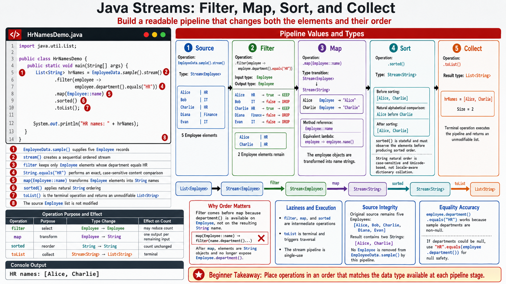

# Exercise 7 — Compose a Pipeline for HR Names

**Module 6** · Pre-lab practice · finish Exercises 1–7 Pass, then OS how-to → [`../lab6/LAB-6-GUIDE.md`](../lab6/LAB-6-GUIDE.md)
**Folder:** `examples/module-06-exercises/` ([setup](EXERCISES-INDEX.md))



## Goal

Create `HrNamesDemo.java`. Compose `filter`, `map`, `sorted`, and `toList` to
produce an alphabetized list of names for employees in HR.

## Starter (fill in the TODOs)

Paste this skeleton, then replace each `// TODO` with working code. Do **not** leave TODOs in your finished file.

```java
import java.util.List;

public class HrNamesDemo {
    public static void main(String[] args) {
        // TODO: compose filter → map → sorted → toList
        List<String> hrNames = EmployeeData.sample().stream()
                // TODO: .filter(employee -> employee.department().equals("HR"))
                // TODO: .map(Employee::name)
                // TODO: .sorted()
                // TODO: .toList()
                ;

        System.out.println("HR names: " + hrNames);
    }
}
```

| Idea | Easy meaning |
| ---- | ------------ |
| Operation order | Filter while elements are still `Employee`; map to `String` afterward |
| `filter` | Keeps only HR employees |
| `sorted` | Alphabetizes the `String` names after mapping |
| `toList` | Terminal operation that executes the pipeline |

## Steps

### Step 1 — Explain the operation order

**Why:** Stream operations are type-sensitive. After `map(Employee::name)`,
each element is a `String`, so `employee.department()` is no longer available.

Write:

```text
filter: Stream<Employee> -> Stream<Employee>
map:    Stream<Employee> -> Stream<String>
sorted: Stream<String>   -> Stream<String>
toList: Stream<String>   -> List<String>
```

### Step 2 — Create, compile, and run

**Why:** This exercise combines every intermediate operation from Exercises 2–6.

1. **New → File** → `HrNamesDemo.java`.
2. Paste the starter and fill every pipeline `// TODO`. Save.

**Windows:**

```powershell
cd $env:USERPROFILE\java-bootcamp\examples\module-06-exercises
javac Employee.java EmployeeData.java HrNamesDemo.java
java HrNamesDemo
```

**macOS:**

```bash
cd ~/java-bootcamp/examples/module-06-exercises
javac Employee.java EmployeeData.java HrNamesDemo.java
java HrNamesDemo
```

**Expected output:**

```text
HR names: [Alice, Charlie]
```

### Step 3 — Test case-insensitive matching

Temporarily change Alice's department in `EmployeeData` from `"HR"` to `"hr"`.
The current equality check excludes Alice.

Change the predicate to:

```java
.filter(employee -> employee.department().equalsIgnoreCase("HR"))
```

Confirm Alice returns, then restore the original dataset. You may keep
`equalsIgnoreCase` as the more tolerant comparison.

### Step 4 — Answer a composition question

Why should department filtering happen before mapping to names?

Expected idea: the `Employee` contains the department; a mapped `String` name
does not.

## Expected result

The final list contains only Alice and Charlie in alphabetical order.

## If it fails

| Problem | Fix |
| ------- | --- |
| Cannot call `department()` | Filter before mapping employees to strings |
| No employees match | Check exact department spelling/case or use `equalsIgnoreCase` |
| Bob or Evan appears | Confirm the predicate compares department with `"HR"` |
| Order differs | Keep `.sorted()` after `.map(Employee::name)` |

## Pass criteria

| # | Confirm | Your notes |
| - | ------- | ---------- |
| 1 | Output is exactly `[Alice, Charlie]` | Pass / Fail |
| 2 | The pipeline contains filter, map, sorted, and toList | Pass / Fail |
| 3 | Case-insensitive test works | Pass / Fail |
| 4 | You can trace the element type after each operation | Pass / Fail |

---

## Next

Exercises **1–7** complete (core gate) → open **one** OS how-to → [`../lab6/LAB-6-WINDOWS.md`](../lab6/LAB-6-WINDOWS.md) or [`../lab6/LAB-6-MACOS.md`](../lab6/LAB-6-MACOS.md) → then graded [`../lab6/LAB-6-GUIDE.md`](../lab6/LAB-6-GUIDE.md) (builds on these seven; separate folder `examples/Lab6-EmployeeAnalytics/` with `src/com/academy/analytics/`).

Exercise 8 (parallel bonus) is recommended stretch — complete it before or after the lab core as your instructor directs.
