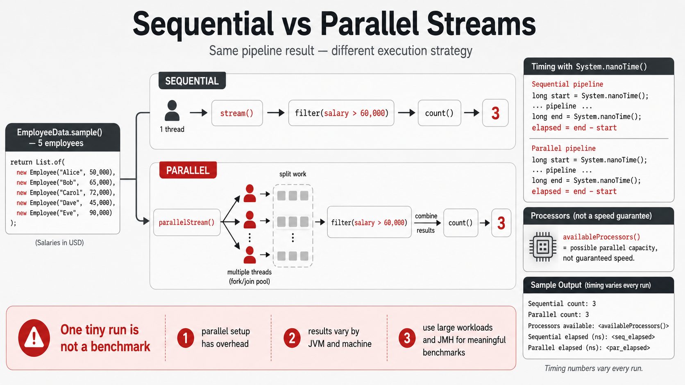

# Exercise 8 — `parallelStream` Correctness Bonus

**Module 6** · Optional parallel bonus · finish Exercises 1–7 Pass first, then OS how-to → [`../lab6/LAB-6-GUIDE.md`](../lab6/LAB-6-GUIDE.md)
**Folder:** `examples/module-06-exercises/` ([setup](EXERCISES-INDEX.md))



> **Correctness first:** Parallel streams are not automatically faster. The
> five-row dataset is intentionally too small for a meaningful performance
> conclusion.

## Goal

Create `ParallelStreamDemo.java`. Run the same stateless count with `stream`
and `parallelStream`, verify identical results, and explain why one small timing
run is not a benchmark.

## Starter (fill in the TODOs)

Paste this skeleton, then replace each `// TODO` with working code. Do **not** leave TODOs in your finished file.

```java
import java.util.List;

public class ParallelStreamDemo {
    public static void main(String[] args) {
        List<Employee> employees = EmployeeData.sample();

        long sequentialStart = System.nanoTime();
        // TODO: employees.stream() + filter salary > 60_000 + count()
        long sequentialCount = _____;
        long sequentialNanos = System.nanoTime() - sequentialStart;

        long parallelStart = System.nanoTime();
        // TODO: employees.parallelStream() + same filter + count()
        long parallelCount = _____;
        long parallelNanos = System.nanoTime() - parallelStart;

        System.out.println("Sequential count: " + sequentialCount);
        System.out.println("Parallel count: " + parallelCount);
        System.out.println("Available processors: "
                + Runtime.getRuntime().availableProcessors());
        System.out.println("Sequential ns: " + sequentialNanos);
        System.out.println("Parallel ns: " + parallelNanos);
        System.out.println("Timing conclusion: none from one tiny run");
    }
}
```

| Idea | Easy meaning |
| ---- | ------------ |
| Stateless predicate | Reads one immutable `Employee`; safe for parallel processing |
| `count()` | Built-in reduction — do not use a shared mutable counter |
| Timing | One tiny run is not a benchmark; counts must match first |

## Safe-use checklist

Parallel stream operations should be:

- stateless;
- free of shared mutable counters or lists;
- independent between elements;
- associative when reducing;
- large or expensive enough to justify splitting work.

## Steps

### Step 1 — Confirm the operation is safe

**Why:** Parallel pipelines are only trustworthy when each element can be
processed independently.

The predicate reads one immutable `Employee` and returns a boolean. It does not
write shared state, so processing order cannot change the count.

### Step 2 — Create, compile, and run

**Why:** Matching counts prove correctness before anyone discusses speed.

1. **New → File** → `ParallelStreamDemo.java`.
2. Paste the starter and fill both stream pipeline `// TODO`s. Save.

**Windows:**

```powershell
cd $env:USERPROFILE\java-bootcamp\examples\module-06-exercises
javac Employee.java EmployeeData.java ParallelStreamDemo.java
java ParallelStreamDemo
```

**macOS:**

```bash
cd ~/java-bootcamp/examples/module-06-exercises
javac Employee.java EmployeeData.java ParallelStreamDemo.java
java ParallelStreamDemo
```

**Verified stable lines:**

```text
Sequential count: 4
Parallel count: 4
Timing conclusion: none from one tiny run
```

Processor count and nanosecond timings vary by machine and run.

### Step 3 — Repeat without drawing a speed conclusion

**Why:** One tiny timing run is not a benchmark.

Run the program five times. Record whether sequential or parallel was faster
each time.

Your result may change between runs because of JVM warm-up, thread-pool setup,
operating-system scheduling, and the tiny workload.

### Step 4 — Identify an unsafe alternative

**Why:** Shared mutable counters lose updates under concurrent workers.

Do **not** write:

```java
int[] count = {0};
employees.parallelStream().forEach(employee -> count[0]++);
```

Explain in `notes.md`: multiple worker threads can update the same mutable
value concurrently and lose updates. Use the built-in `count()` reduction.

## Expected result

Sequential and parallel pipelines both return 4. Timings vary, and your notes
state that the exercise demonstrates correctness—not a performance win.

## If it fails

| Problem | Fix |
| ------- | --- |
| Counts differ | Use the identical stateless predicate and built-in `count()` in both pipelines |
| Parallel looks slower | Expected for tiny data; splitting and scheduling add overhead |
| Processor count is 1 | Parallel execution cannot gain CPU parallelism on one available processor |
| Timings change dramatically | Expected; this is not a controlled benchmark such as JMH |

## Pass criteria

| # | Confirm | Your notes |
| - | ------- | ---------- |
| 1 | Sequential and parallel counts both equal 4 | Pass / Fail |
| 2 | You ran the comparison five times | Pass / Fail |
| 3 | You did not claim one tiny run proves performance | Pass / Fail |
| 4 | You can explain why a shared mutable counter is unsafe | Pass / Fail |

---

## Next

Exercise 8 complete → if Exercises 1–7 are already Pass, open **one** OS how-to → [`../lab6/LAB-6-WINDOWS.md`](../lab6/LAB-6-WINDOWS.md) or [`../lab6/LAB-6-MACOS.md`](../lab6/LAB-6-MACOS.md) → then graded [`../lab6/LAB-6-GUIDE.md`](../lab6/LAB-6-GUIDE.md).

Bring your parallel-vs-sequential notes to Lab 6 bonus menu options — do not skip the CORE path (menu 1–9) for parallel experiments.
