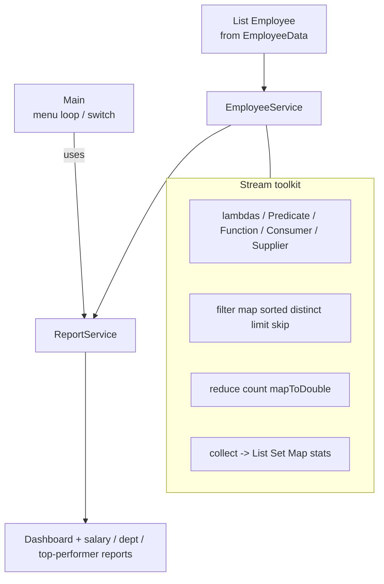
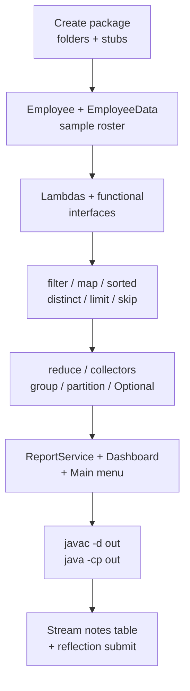

# Lab 6: Streams and Lambda Expressions — Employee Analytics System

**Module:** 6 — Streams and Functional Programming  
**Lab folder:** `labs/Week 1 - Java and JVM Foundations/module-06/lab6/`  
**Difficulty:** Intermediate  
**Duration:** 3–4 Hours

**Primary IDE:** IntelliJ IDEA Community Edition · **Optional IDE:** VS Code

| OS | How-to for this lab |
| -- | ------------------- |
| Windows | [LAB-6-WINDOWS.md](LAB-6-WINDOWS.md) |
| macOS | [LAB-6-MACOS.md](LAB-6-MACOS.md) |

> **Environment reminder:** Finish [Lab 0](../../module-00/lab0/LAB-0-GUIDE.md). Use **JDK 21** and **IntelliJ IDEA Community** (primary) or **VS Code** (optional). Workspace: `java-bootcamp` (Windows: `%USERPROFILE%\java-bootcamp`).

> **Pre-lab exercises:** Complete [`../exercises/`](../exercises/) (from the Module 6 slides) before starting this lab.

---

## How to follow this lab

1. Open the **Windows** or **macOS** how-to (links above) in a second tab.
2. Create/work only under your `java-bootcamp/examples/…` folder from the steps (not inside this `labs/` git clone unless a step says otherwise).
3. For each **Step N**: read **Why** (if present) → do the actions → confirm **Expected** / **Expected result** → then continue.
4. When stuck, use **Failure Experiments** / troubleshooting in this guide before asking for help.
5. Capture evidence under `notes/screenshots/lab-6/` (workspace root under `java-bootcamp`; redact secrets). Use the **Pass criteria** tables — write **Pass** or **Fail** in your notes. GitHub file view does not support clickable checkboxes.

## Core path first (menu options 1–9)

**Complete options 1–9 before any bonuses.** That is the graded CORE path:

| Option | Feature |
| ------ | ------- |
| 1 | Display Employees |
| 2 | Employees By Department |
| 3 | Salary Report |
| 4 | Top Performers |
| 5 | Highest Salary |
| 6 | Department Statistics |
| 7 | Active Employees |
| 8 | **Dashboard** (expected numbers below) |
| 9 | Exit |

Teaching demos and stretch features (menu 10+) come **after** CORE works. See [Bonus Challenges](#bonus-challenges).

---

## Lab Overview

This Module 6 lab teaches the **Java Streams API** and **lambda expressions** by building a complete **Employee Analytics System** console application. You will replace imperative loops with declarative stream pipelines—`filter`, `map`, `sorted`, `collect`, `reduce`, collectors, and `Optional`—to turn a fixed employee dataset into management reports.

**Purpose.** Lab 5 taught *where* to store data (List / Set / Map). Lab 6 teaches *how to query and transform* that data without nested `for` / `if` soup. Enterprise Java services use Streams for reporting, ETL-style transforms, and readable multi-criteria filters. This lab makes those patterns concrete on payroll-style employee records.

**What you build (exercise).** An analytics console under package `com.academy.analytics`: load **25** sample employees, run lambda/functional-interface demos, filter and map pipelines, sort / distinct / limit / skip, reduce and summarizing statistics, `groupingBy` / `partitioningBy`, safe `Optional` lookups, a dashboard, and a menu-driven app. Core types: `Employee`, `EmployeeData`, `EmployeeService`, `ReportService`, `Main`.

**What success looks like.** Under `java-bootcamp/examples/Lab6-EmployeeAnalytics/` you compile with `javac -d out ...`, run `java -cp out com.academy.analytics.Main`, exercise **CORE menu options 1–9** (especially Dashboard option **8**), fill stream-operation notes, and submit evidence graders can recompile.

**Depends on Lab 0 + Lab 5 skills.** If your IDE, `java`, or `javac` fail, stop and fix [Lab 0](../../module-00/lab0/LAB-0-GUIDE.md) / [SETUP-INSTRUCTIONS.md](../../../SETUP-INSTRUCTIONS.md). Comfort with `List`, packages, and a service layer (Lab 5) will make this lab much faster. IDE paths: [`_IDE-CONVENTIONS.md`](../../_IDE-CONVENTIONS.md).

**CRM connection (future only).** From Lab 8 onward the **Customer Management Platform** will filter, map, and group customer collections the same way—active customers, department→agents maps, top-N lists. This lab does **not** build CRM APIs, Spring beans, or a database. Treat employee analytics as a **skill bridge**: today’s stream pipelines reappear when you report on CRM customers at scale.

---

## Learning Objectives

After completing this lab, you will be able to:

* Write **lambda expressions** that replace anonymous classes for simple behaviors
* Use core **functional interfaces**: `Predicate`, `Function`, `Consumer`, `Supplier`
* Create streams from `List`, arrays, and `Set`
* Build **stream pipelines** with intermediate and terminal operations
* Filter collections with single and chained `filter()` predicates
* Transform data with `map()` and **method references** (`Employee::getName`)
* Sort with `Comparator` + `sorted()`, including ascending and descending salary
* Apply `distinct()`, `limit()`, and `skip()` for unique values and top-N / next-N views
* Aggregate with `count()`, `reduce()`, `sum()`, `average()`, and `Collectors.summarizingDouble()`
* Collect results into `List`, `Set`, and `Map` with `groupingBy()` and `partitioningBy()`
* Handle missing values safely with **`Optional`** (`ifPresent` / `ifPresentOrElse` / `orElse`)
* Design a menu-driven analytics console following package conventions
* Compile and run with `javac -d out` / `java -cp out` on your laptop (VS Code or IntelliJ)

---

## Business Scenario

A **training institute’s corporate partner** maintains an in-memory employee roster for classroom demos. You build and run the app on your **laptop** with plain JDK—no database, no Spring, no GUI framework.

Management wants reporting that answers:

* Who are the high earners and top performers?
* What does IT (or Finance) look like after multi-criteria filters?
* What are unique departments, salary totals, averages, and ranges?
* How do employees group by department or partition around a salary threshold?
* Can one **dashboard** summarize headcount, pay, and active vs inactive staff?

Instead of nested loops, **all analytics must use the Java Streams API** (and lambdas / method references where appropriate).

**Optional forward look:** The same “filter → map → collect → report” thinking later helps when CRM platforms answer “active customers in region X ordered by lifetime value.” You are not building CRM today; you are learning stream judgment that makes Lab 8+ less painful.

**Security note for evidence.** Do not paste GitHub credentialss, AWS secrets, or tokens into screenshots or notes. Demo employee names and salaries are fine to submit.

---

## Architecture Context

### Stream pipeline shape (NOW)



### Intermediate vs terminal (ASCII)

```text
  Source          Intermediate (lazy)              Terminal (eager)
  -----------     ---------------------------      ---------------------
  list.stream() → filter → map → sorted → ...  →   forEach / collect /
                                                   count / reduce /
                                                   findFirst / max / …

  Nothing runs until a terminal operation is invoked.
  A stream is typically usable once—rebuild .stream() for each query.
```

### Lab flow (mermaid)



### Architecture NOW vs LATER

| Aspect | Lab 6 (NOW) | CRM later (Lab 8+) |
| ------ | ----------- | ------------------ |
| Domain | Employees, departments, salaries | Customers, agents, tickets |
| UI | Console menu | REST / React / agents |
| Data | In-memory `List<Employee>` | DB + Spring repositories |
| Query style | Streams pipelines | Streams / JPQL / Specs—same *thinking* |
| Aggregations | `groupingBy`, summarizing | Report services / analytics APIs |
| Framework | Plain JDK Streams | Spring Boot + persistence |
| Skills reused | Filter/map/collect, Optional, method refs | Same—applied to CRM scale |

---

## Prerequisites

Complete the [Labs Setup Instructions](../../../SETUP-INSTRUCTIONS.md) and [Lab 0](../../module-00/lab0/LAB-0-GUIDE.md) before this lab. Confirm:

* **JDK 21** with `javac` and `java` on `PATH` (Lab 0)
* **Laptop IDE:** **IntelliJ IDEA Community** (primary) or **VS Code** (optional) — see [`_IDE-CONVENTIONS.md`](../../_IDE-CONVENTIONS.md)
* Workspace open at `~/java-bootcamp` (Windows: `%USERPROFILE%\java-bootcamp`)
* Working integrated terminal in your IDE
* **Lab 5 Collections recommended:** `List`, generics, packages under `src/com/academy/...`, menu → service layering
* **Maven is optional**—plain `javac`/`java` is the primary path
* No secrets (keys, tokens, passwords) committed to Git

### Pre-flight

Run in your IDE terminal on the laptop:

```bash
java -version
javac -version
git --version
pwd   # Windows PowerShell: pwd  or  echo $PWD
```

Expected theme (versions may vary):

```text
openjdk version "21....
javac 21....
git version 2....
```

Confirm `java-bootcamp` exists and contains (or will contain) `examples/`. Fix environment failures before writing application code.

---

## Suggested Project Files

Create everything under the bootcamp workspace on your laptop:

```text
java-bootcamp/examples/Lab6-EmployeeAnalytics/
├── src/
│   └── com/
│       └── academy/
│           └── analytics/
│               ├── Main.java
│               ├── Employee.java
│               ├── EmployeeData.java
│               ├── EmployeeService.java
│               └── ReportService.java
├── out/                         # created by javac -d out
│   └── com/academy/analytics/*.class
└── (answers/tables → ~/java-bootcamp/notes/; screenshots → notes/screenshots/lab-6/)
```

Ignore build artifacts if committed later: `out/`, `*.class`, `*.log`.

**IDE tip:** In VS Code use **File → Open Folder…** on the project (or `java-bootcamp`). In IntelliJ use **File → Open…**, set Project SDK to **21**, then run `Main` or use the terminal — details in [`_IDE-CONVENTIONS.md`](../../_IDE-CONVENTIONS.md).

**Instructor reference:** Complete solution (including bonuses) in [`solution/`](solution/) → `Lab6-EmployeeAnalytics/` (`com.academy.analytics`).

---

## Concepts to Discuss

Write 2–3 sentences each in `../../notes/lab6-answers.md` (from project; or `~/java-bootcamp/notes/lab6-answers.md`) before or during the steps; revisit after Checkpoint C.

1. Why do stream pipelines postpone work until a **terminal** operation runs?
2. When is a lambda clearer than a named method—and when should you extract a method instead?
3. What is the difference between `filter()` (same type, fewer elements) and `map()` (possibly different type, same count)?
4. Why prefer `Comparator.comparingDouble(Employee::getSalary).reversed()` over a hand-written `compare` for salary descending?
5. What does `Collectors.groupingBy(Employee::getDepartment)` give you that a single `List` does not?
6. Why return `Optional<Employee>` from “highest paid” instead of a nullable `Employee`?
7. When should you use a method reference (`Employee::getName`) vs a lambda (`e -> e.getName()`)?
8. How will CRM later reuse filter/map/group thinking for customers (without claiming CRM is done today)?

---

## Implementation Steps

Complete each step in order. Commands assume `java-bootcamp/examples/Lab6-EmployeeAnalytics` on your laptop. Use the integrated terminal in **VS Code** or **IntelliJ** ([`_IDE-CONVENTIONS.md`](../../_IDE-CONVENTIONS.md)).

Parts 1–20 from the Module 6 exercise map into the steps below (models → lambdas → filters → maps → collectors → dashboard → menu). **Ship CORE menu 1–9 first; bonuses later.**

---

### Step 1 — Create the project and package folders

**Why:** Folder path must match `package com.academy.analytics;` or `javac`/`java` fail confusingly. A known path under `examples/` matches Lab 0 / Lab 5 conventions.

**Do this:**

```bash
# macOS / Linux (Git Bash on Windows also works)
mkdir -p ~/java-bootcamp/examples/Lab6-EmployeeAnalytics/src/com/academy/analytics
mkdir -p ~/java-bootcamp/notes/screenshots/lab-6
cd ~/java-bootcamp/examples/Lab6-EmployeeAnalytics
pwd
```

```powershell
# Windows PowerShell alternative
New-Item -ItemType Directory -Force -Path "$env:USERPROFILE\java-bootcamp\examples\Lab6-EmployeeAnalytics\src\com\academy\analytics" | Out-Null
New-Item -ItemType Directory -Force -Path "$env:USERPROFILE\java-bootcamp\notes\screenshots\lab-6" | Out-Null
cd "$env:USERPROFILE\java-bootcamp\examples\Lab6-EmployeeAnalytics"
pwd
```

Open that folder in VS Code (**File → Open Folder…**) or IntelliJ (**File → Open…**). Create empty stubs (or create files as each step names them):

`Employee.java`, `EmployeeData.java`, `EmployeeService.java`, `ReportService.java`, `Main.java`.

**Expected result:** `java-bootcamp/examples/Lab6-EmployeeAnalytics` exists; `src/com/academy/analytics/` is ready; `notes/` is ready for answers and screenshots.

**If it fails:** Confirm you are in the IDE terminal (not a random unrelated folder). Recreate directories with `mkdir -p` or `New-Item`. See [`_IDE-CONVENTIONS.md`](../../_IDE-CONVENTIONS.md).

---

### Step 2 — Create the `Employee` class (Part 1 foundation)

**Why:** Every stream later operates on `Employee` instances. Clear getters enable method references (`Employee::getSalary`, `Employee::isActive`).

**Do this:** Create `src/com/academy/analytics/Employee.java`:

```java
package com.academy.analytics;

public class Employee {

    private String employeeId;
    private String name;
    private String department;
    private double salary;
    private int experience;
    private int rating;
    private boolean active;

    public Employee(String employeeId, String name, String department, double salary,
                    int experience, int rating, boolean active) {
        this.employeeId = employeeId;
        this.name = name;
        this.department = department;
        this.salary = salary;
        this.experience = experience;
        this.rating = rating;
        this.active = active;
    }

    // getters + setters for all fields
    // boolean getter must be isActive() for method-reference style filters

    @Override
    public String toString() {
        return String.format("%s | %s | %s | $%.0f | %d yrs | Rating %d | %s",
                employeeId, name, department, salary, experience, rating,
                active ? "Active" : "Inactive");
    }
}
```

**Attributes checklist:**

| Attribute    | Type      | Notes                          |
| ------------ | --------- | ------------------------------ |
| `employeeId` | `String`  | primary demo key               |
| `name`       | `String`  | display / mapping target        |
| `department` | `String`  | IT, HR, Finance, Sales, Marketing |
| `salary`     | `double`  | 45,000–180,000 range in sample |
| `experience` | `int`     | years                          |
| `rating`     | `int`     | 1–5 performance                |
| `active`     | `boolean` | employment status              |

Requirements: constructor, getters, setters, `toString()`. Match [`solution/`](solution/) field names. Prefer `isActive()` for the boolean getter.

**Expected result:** `Employee` prints as one readable line; salaries format without excessive decimals.

**If it fails:** Filename must match public class (`Employee.java`). Ensure `package com.academy.analytics;` is the first line.

---

### Step 3 — Create sample data with `EmployeeData` (Part 1)

**Why:** Analytics needs enough rows for filters and groups to be interesting. A dedicated factory keeps `Main` clean and matches the instructor solution (25 employees).

**Do this:** Create `src/com/academy/analytics/EmployeeData.java` as a final utility with a private constructor:

```java
package com.academy.analytics;

import java.util.ArrayList;
import java.util.List;

public final class EmployeeData {

    private EmployeeData() {
    }

    public static List<Employee> createSampleEmployees() {
        List<Employee> employees = new ArrayList<>();
        employees.add(new Employee("E001", "John Smith", "IT", 165000, 12, 5, true));
        employees.add(new Employee("E002", "Alice Johnson", "Finance", 152000, 10, 5, true));
        // ... add 20–30 total across IT, HR, Finance, Sales, Marketing
        // Include at least one inactive (active = false)
        return employees;
    }
}
```

**Sample data guidance:**

| Field        | Range / Values                         |
| ------------ | -------------------------------------- |
| Departments  | IT, HR, Finance, Sales, Marketing      |
| Salary       | 45,000 – 180,000                       |
| Experience   | 1 – 20 years                           |
| Rating       | 1 – 5                                  |
| Active mix   | Most `true`; at least 1–2 `false`      |

You may seed all 25 rows from the instructor [`solution/`](solution/) `EmployeeData` for grading parity (dashboard numbers will match).

**Expected result:** `createSampleEmployees()` returns a non-empty `List` with multiple departments and salary bands.

**If it fails:** Keep the class `final` with a private constructor if you follow the solution style. Do not put sample seeds only inside `Main`.

---

### Step 4 — Skeleton `EmployeeService` + display all (Part 1)

**Why:** Services—not `Main`—own stream queries. Holding a defensive copy of the list prevents accidental mutation of the seed data from call sites.

**Do this:** Start `src/com/academy/analytics/EmployeeService.java`:

```java
package com.academy.analytics;

import java.util.ArrayList;
import java.util.List;

public class EmployeeService {

    private final List<Employee> employees;

    public EmployeeService(List<Employee> employees) {
        this.employees = new ArrayList<>(employees);
    }

    public List<Employee> getEmployees() {
        return employees;
    }

    public void displayAllEmployees() {
        System.out.println("Total Employees : " + employees.size());
        System.out.println("Employee List");
        employees.stream().forEach(System.out::println);
    }
}
```

**Expected result:** Constructing `new EmployeeService(EmployeeData.createSampleEmployees())` and calling `displayAllEmployees()` will later print the roster via a stream.

**If it fails:** Import `java.util.List` / `ArrayList`. Do not put stream demos in `Main`—keep growing this service.

---

### Step 5 — Lambda expressions demo (Part 2)

**Why:** Lambdas are the vocabulary Streams expect. Printing names/salaries/departments with `forEach` is the smallest useful practice before filters and collectors.

**Do this:** Add to `EmployeeService`:

```java
public void demonstrateLambdas() {
    System.out.println("--- Lambda Expressions ---");
    System.out.println("Names:");
    employees.forEach(employee -> System.out.println(employee.getName()));

    System.out.println("Salaries:");
    employees.forEach(employee -> System.out.printf("$%.0f%n", employee.getSalary()));

    System.out.println("Departments:");
    employees.forEach(employee -> System.out.println(employee.getDepartment()));
}
```

Contrast (conceptually) with pre-Java-8 anonymous classes—your notes should mention that `(employee) -> employee.getSalary()` replaces verbose `new Function<>() { ... }` style where applicable.

**Expected result:** Three labeled blocks print names, salaries, and departments.

**If it fails:** Ensure parentheses/parameter naming compile under JDK 21. Use `System.out.printf` carefully with `%n` for newlines.

---

### Step 6 — Functional interfaces (Part 3)

**Why:** Streams are built on these four primitives. Naming them (`highEarner`, `employeeSummary`) documents intent better than inline-only lambdas everywhere.

**Do this:**

```java
import java.util.Comparator;
import java.util.function.Consumer;
import java.util.function.Function;
import java.util.function.Predicate;
import java.util.function.Supplier;

public void demonstrateFunctionalInterfaces() {
    Predicate<Employee> highEarner = employee -> employee.getSalary() > 100_000;
    Function<Employee, String> employeeSummary = employee ->
            employee.getName() + " (" + employee.getDepartment() + ")";
    Consumer<Employee> printRating = employee ->
            System.out.println(employee.getName() + " - Rating " + employee.getRating());
    Supplier<Employee> topSample = () -> employees.stream()
            .max(Comparator.comparingDouble(Employee::getSalary))
            .orElse(null);

    System.out.println("--- Functional Interfaces ---");
    employees.stream().filter(highEarner).map(Employee::getName).forEach(System.out::println);
    employees.stream().map(employeeSummary).limit(5).forEach(System.out::println);
    employees.stream().limit(5).forEach(printRating);
    System.out.println("Supplier sample (highest paid): " + topSample.get());
}
```

| Interface | Role in this demo |
| --------- | ----------------- |
| `Predicate<Employee>` | test salary > 100k |
| `Function<Employee, String>` | map to summary string |
| `Consumer<Employee>` | side-effect print rating |
| `Supplier<Employee>` | produce highest-paid sample |

**Expected result:** High earners listed; five summaries; five ratings; one supplier sample line.

**If it fails:** Add the `java.util.function.*` imports. Prefer `orElse(null)` only inside this teaching demo—later steps use `Optional` properly for production-style APIs.

---

### Step 7 — Stream sources from List, Array, Set (Part 4)

**Why:** Sources differ; the downstream pipeline API stays the same. Teams often forget `Arrays.stream(...)` vs `list.stream()`.

**Do this:**

```java
import java.util.HashSet;
import java.util.Set;

public void demonstrateStreamSources() {
    System.out.println("--- Stream Sources ---");
    System.out.println("From List:");
    employees.stream().map(Employee::getName).limit(5).forEach(System.out::println);

    Employee[] employeeArray = employees.toArray(new Employee[0]);
    System.out.println("From Array:");
    java.util.Arrays.stream(employeeArray).map(Employee::getName).limit(5).forEach(System.out::println);

    Set<Employee> employeeSet = new HashSet<>(employees);
    System.out.println("From Set:");
    employeeSet.stream().map(Employee::getName).limit(5).forEach(System.out::println);
}
```

**Note:** `HashSet` iteration order is not insertion order—that is expected. For stable demos prefer List sources.

**Expected result:** Three labeled blocks each print up to five names.

**If it fails:** Import `Arrays` if you prefer a static import-free style (`java.util.Arrays.stream`).

---

### Step 8 — Single filters (Part 5)

**Why:** `filter` is the primary “report where …” building block. Keep one predicate per call for readability; chain later in Step 9.

**Do this:**

```java
public void displayHighSalaryEmployees() {
    System.out.println("Employees with salary > 80000:");
    employees.stream()
            .filter(employee -> employee.getSalary() > 80_000)
            .forEach(System.out::println);
}

public void displayItEmployees() {
    System.out.println("IT Department:");
    employees.stream()
            .filter(employee -> "IT".equalsIgnoreCase(employee.getDepartment()))
            .forEach(System.out::println);
}

public void displayActiveEmployees() {
    System.out.println("Active Employees:");
    employees.stream()
            .filter(Employee::isActive)
            .forEach(System.out::println);
}
```

**Expected result:** Three queries return different subsets; inactive employees appear only in the full list / inactive reports, not in active filter.

**If it fails:** Use `"IT".equalsIgnoreCase(...)` so a null department does not NPE. Ensure `isActive()` exists on `Employee`.

---

### Step 9 — Chained filters (Part 6)

**Why:** Business questions stack criteria. Multiple `.filter(...)` calls are clearer than one giant boolean expression—and short-circuit mentally like SQL `AND`.

**Do this:**

```java
public void displayFilteredItTopPerformers() {
    System.out.println("IT employees with salary > 90000 and rating >= 4:");
    employees.stream()
            .filter(employee -> "IT".equalsIgnoreCase(employee.getDepartment()))
            .filter(employee -> employee.getSalary() > 90_000)
            .filter(employee -> employee.getRating() >= 4)
            .forEach(System.out::println);
}
```

Target criteria:

```text
Department = IT
Salary > 90,000
Rating >= 4
```

**Expected result:** Only IT employees who clear both salary and rating gates print (solution seed includes several, e.g. John Smith, Sarah Brown, Sophia Jackson, …).

**If it fails:** Confirm sample data actually contains matches; if your custom seed is sparse, add one IT row that satisfies all three.

---

### Step 10 — Mapping and method references (Parts 7 + 18)

**Why:** `map` projects employee objects into simpler views (names, salaries). Method references remove noise when the lambda only delegates to a getter or `println`.

**Do this:**

```java
public void demonstrateMapping() {
    System.out.println("Mapped Names:");
    employees.stream().map(Employee::getName).limit(8).forEach(System.out::println);

    System.out.println("Mapped Salaries:");
    employees.stream().map(Employee::getSalary).limit(8).forEach(System.out::println);

    System.out.println("Mapped Departments:");
    employees.stream().map(Employee::getDepartment).limit(8).forEach(System.out::println);
}
```

Replace forms:

| Prefer method reference | Instead of lambda |
| ----------------------- | ----------------- |
| `Employee::getName` | `e -> e.getName()` |
| `System.out::println` | `e -> System.out.println(e)` |

**Expected result:** Three projected columns print (names / salaries / departments), not full `toString()` lines.

**If it fails:** Method references need matching getter names. `map(Employee::getSalary)` yields `Stream<Double>` (boxed)—fine for printing; prefer `mapToDouble` for numeric reduction later.

---

### Step 11 — Sorting (Part 8)

**Why:** Reports need ordered views. `sorted` with `Comparator.comparing…` keeps intent in one line.

**Do this:**

```java
public void demonstrateSorting() {
    System.out.println("Salary Ascending:");
    employees.stream()
            .sorted(Comparator.comparingDouble(Employee::getSalary))
            .limit(5)
            .forEach(System.out::println);

    System.out.println("Salary Descending:");
    employees.stream()
            .sorted(Comparator.comparingDouble(Employee::getSalary).reversed())
            .limit(5)
            .forEach(System.out::println);

    System.out.println("Name Ascending:");
    employees.stream()
            .sorted(Comparator.comparing(Employee::getName))
            .limit(5)
            .forEach(System.out::println);

    System.out.println("Experience Descending:");
    employees.stream()
            .sorted(Comparator.comparingInt(Employee::getExperience).reversed())
            .limit(5)
            .forEach(System.out::println);
}
```

**Expected result:** Ascending salary starts near lowest pay; descending starts near John Smith ($165000) with solution data.

**If it fails:** Remember `reversed()` returns a new comparator—chain it on the comparing call. Sorting does **not** mutate `employees` when you stream a sorted view.

---

### Step 12 — Distinct, limit, and skip (Parts 9–10)

**Why:** Unique departments are a classic `map` + `distinct`. Top-N and pagination-style “next N” use `limit` / `skip` after a sort.

**Do this:**

```java
public void displayDistinctDepartments() {
    System.out.println("Unique Departments:");
    employees.stream()
            .map(Employee::getDepartment)
            .distinct()
            .sorted()
            .forEach(System.out::println);
}

public void displayTopAndNextSalaries() {
    Comparator<Employee> bySalaryDesc =
            Comparator.comparingDouble(Employee::getSalary).reversed();

    System.out.println("Top 5 Highest Salaries:");
    employees.stream().sorted(bySalaryDesc).limit(5)
            .forEach(e -> System.out.printf("%s - $%.0f%n", e.getName(), e.getSalary()));

    System.out.println("Next 5 Highest Salaries:");
    employees.stream().sorted(bySalaryDesc).skip(5).limit(5)
            .forEach(e -> System.out.printf("%s - $%.0f%n", e.getName(), e.getSalary()));
}
```

**Expected result:** Five unique department names (sorted). Top 5 and next 5 do not overlap for a roster of 25 distinct people.

**If it fails:** Apply `skip` **after** the same sort criteria as top-N. Skipping before sorting gives nonsense pages.

---

### Step 13 — Counts (Part 11)

**Why:** `count()` is the simplest terminal aggregation and pairs naturally with filters.

**Do this:**

```java
public void displayCounts() {
    long total = employees.size();
    long itCount = employees.stream()
            .filter(e -> "IT".equalsIgnoreCase(e.getDepartment()))
            .count();
    long activeCount = employees.stream().filter(Employee::isActive).count();
    long highSalaryCount = employees.stream()
            .filter(e -> e.getSalary() > 100_000)
            .count();

    System.out.println("Total Employees : " + total);
    System.out.println("IT Employees : " + itCount);
    System.out.println("Active Employees : " + activeCount);
    System.out.println("Employees with Salary > 100000 : " + highSalaryCount);
}
```

**Expected result:** Four labeled counts; with solution seed, total is `25`.

**If it fails:** Use `long` for `count()` results. Do not confuse `employees.size()` (List API) with a stream `count()` of a filtered pipeline.

---

### Step 14 — Reduction and numeric streams (Part 12)

**Why:** `reduce` teaches the general fold; `mapToDouble` + `sum` / `average` is idiomatic for salaries.

**Do this:**

```java
import java.util.Optional;

public void displayReductions() {
    Optional<Double> highest = employees.stream().map(Employee::getSalary).reduce(Double::max);
    Optional<Double> lowest = employees.stream().map(Employee::getSalary).reduce(Double::min);
    double total = employees.stream().mapToDouble(Employee::getSalary).sum();
    double average = employees.stream().mapToDouble(Employee::getSalary).average().orElse(0);

    System.out.println("Highest Salary : " + highest.orElse(0.0));
    System.out.println("Lowest Salary : " + lowest.orElse(0.0));
    System.out.printf("Total Salary : %.0f%n", total);
    System.out.printf("Average Salary : %.0f%n", average);
}
```

**Expected result:** Highest/lowest/total/average print; empty list would safely fall back via `orElse` / `orElse(0)`.

**If it fails:** `average()` on `DoubleStream` returns `OptionalDouble`—call `.orElse(0)`. Do not leave unhandled empty optionals in notes demos.

---

### Step 15 — Collectors, grouping, partitioning, summarizing (Parts 13–16)

**Why:** Collectors turn pipelines into structures reports need—lists, sets, department maps, boolean partitions, and one-shot salary statistics.

**Do this:**

```java
import java.util.Map;
import java.util.Set;
import java.util.DoubleSummaryStatistics;
import java.util.stream.Collectors;

public void demonstrateCollectors() {
    List<Employee> active = employees.stream()
            .filter(Employee::isActive)
            .collect(Collectors.toList());
    Set<String> departments = employees.stream()
            .map(Employee::getDepartment)
            .collect(Collectors.toSet());
    Map<String, List<Employee>> byDepartment = employees.stream()
            .collect(Collectors.groupingBy(Employee::getDepartment));

    System.out.println("Collected active employees : " + active.size());
    System.out.println("Collected departments : " + departments);
    System.out.println("Grouped by department keys : " + byDepartment.keySet());
}

public void displayGroupedEmployees() {
    Map<String, List<Employee>> grouped = employees.stream()
            .collect(Collectors.groupingBy(Employee::getDepartment));
    grouped.forEach((department, list) -> {
        System.out.println(department);
        list.forEach(e -> System.out.println("  " + e.getName()));
    });
}

public void displayPartitionedEmployees() {
    Map<Boolean, List<Employee>> partitioned = employees.stream()
            .collect(Collectors.partitioningBy(e -> e.getSalary() > 100_000));
    System.out.println("Salary > 100000 (True):");
    partitioned.get(true).forEach(e -> System.out.println("  " + e.getName()));
    System.out.println("Salary <= 100000 (False):");
    partitioned.get(false).forEach(e -> System.out.println("  " + e.getName()));
}

public void displaySummaryStatistics() {
    DoubleSummaryStatistics stats = employees.stream()
            .collect(Collectors.summarizingDouble(Employee::getSalary));
    System.out.println("Highest Salary : " + stats.getMax());
    System.out.println("Lowest Salary : " + stats.getMin());
    System.out.println("Average Salary : " + stats.getAverage());
    System.out.println("Total Salary : " + stats.getSum());
    System.out.println("Employee Count : " + stats.getCount());
}
```

**Naming note:** The exercise wording `Map<Department, List<Employee>>` means group by department **string** (or enum). Using `String` keys matches the solution.

**Expected result:** Group keys show all five departments; partition splits above/below 100k; summarizing prints five stats in one pass.

**If it fails:** Import `Collectors`. On JDK 21, `toList()` unmodifiable shortcut also works on the stream itself (`stream.toList()`)—either style is fine if consistent.

---

### Step 16 — Optional for highest-paid employee (Part 17)

**Why:** “Find one” queries may find nothing. `Optional` forces callers to decide—print a message, throw (later labs), or skip—without silent NPEs.

**Do this:**

```java
public void displayHighestPaidEmployeeOptional() {
    Optional<Employee> highestPaid = employees.stream()
            .max(Comparator.comparingDouble(Employee::getSalary));

    highestPaid.ifPresentOrElse(
            e -> System.out.println("Highest Paid Employee : " + e.getName()
                    + " ($" + (int) e.getSalary() + ")"),
            () -> System.out.println("No Employee Found")
    );
}

public Optional<Employee> findHighestPaidEmployee() {
    return employees.stream().max(Comparator.comparingDouble(Employee::getSalary));
}

public Optional<Employee> findTopPerformer() {
    return employees.stream()
            .max(Comparator.comparingInt(Employee::getRating)
                    .thenComparingDouble(Employee::getSalary));
}

public List<Employee> getTopSalaries(int count) {
    return employees.stream()
            .sorted(Comparator.comparingDouble(Employee::getSalary).reversed())
            .limit(count)
            .toList();
}

public List<Employee> getTopPerformers(int minimumRating) {
    return employees.stream()
            .filter(e -> e.getRating() >= minimumRating)
            .sorted(Comparator.comparingInt(Employee::getRating).reversed()
                    .thenComparing(Comparator.comparingDouble(Employee::getSalary).reversed()))
            .toList();
}

public Map<String, DoubleSummaryStatistics> getDepartmentStatistics() {
    return employees.stream()
            .collect(Collectors.groupingBy(
                    Employee::getDepartment,
                    Collectors.summarizingDouble(Employee::getSalary)));
}

public Optional<String> findDepartmentWithHighestAverageSalary() {
    return employees.stream()
            .collect(Collectors.groupingBy(
                    Employee::getDepartment,
                    Collectors.averagingDouble(Employee::getSalary)))
            .entrySet().stream()
            .max(Map.Entry.comparingByValue())
            .map(Map.Entry::getKey);
}
```

**Expected result:** With solution data, highest paid is John Smith at $165000; empty roster would print `No Employee Found`.

**If it fails:** Do not call `.get()` on Optional without a check. Prefer `ifPresent` / `ifPresentOrElse` / `orElse`.

---

### Step 17 — Build `ReportService` + dashboard (Part 19)

**Why:** Reports compose service queries into a single executive view. Keep formatting out of raw stream helpers where practical.

**Do this:** Create `src/com/academy/analytics/ReportService.java`:

```java
package com.academy.analytics;

import java.util.DoubleSummaryStatistics;
import java.util.List;
import java.util.Map;
import java.util.Optional;
import java.util.stream.Collectors;

public class ReportService {

    private final EmployeeService employeeService;

    public ReportService(EmployeeService employeeService) {
        this.employeeService = employeeService;
    }

    public void displayDashboard() {
        List<Employee> employees = employeeService.getEmployees();
        DoubleSummaryStatistics stats = employees.stream()
                .collect(Collectors.summarizingDouble(Employee::getSalary));

        long departmentCount = employees.stream()
                .map(Employee::getDepartment).distinct().count();
        long activeCount = employees.stream().filter(Employee::isActive).count();
        long inactiveCount = employees.size() - activeCount;

        Optional<Employee> topPerformer = employeeService.findTopPerformer();
        Optional<String> highestPaidDepartment =
                employeeService.findDepartmentWithHighestAverageSalary();
        List<Employee> topSalaries = employeeService.getTopSalaries(5);

        System.out.println("=============================");
        System.out.println("Employee Analytics Dashboard");
        System.out.println("=============================");
        System.out.println("Employees : " + employees.size());
        System.out.printf("Average Salary : %.0f%n", stats.getAverage());
        System.out.printf("Highest Salary : %.0f%n", stats.getMax());
        System.out.printf("Lowest Salary : %.0f%n", stats.getMin());
        System.out.println("Departments : " + departmentCount);

        topPerformer.ifPresent(e ->
                System.out.println("Top Performer : " + e.getName()
                        + " (Rating " + e.getRating() + ")"));
        highestPaidDepartment.ifPresent(d ->
                System.out.println("Highest Paid Department : " + d));

        System.out.println("Top 5 Highest Salaries");
        for (int i = 0; i < topSalaries.size(); i++) {
            Employee e = topSalaries.get(i);
            System.out.printf("%d %s - %.0f%n", i + 1, e.getName(), e.getSalary());
        }

        System.out.println("Active Employees : " + activeCount);
        System.out.println("Inactive Employees : " + inactiveCount);
    }

    public void displayEmployeesByDepartment() { employeeService.displayGroupedEmployees(); }
    public void displaySalaryReport() {
        employeeService.displayReductions();
        System.out.println();
        employeeService.displaySummaryStatistics();
        System.out.println();
        employeeService.displayPartitionedEmployees();
    }
    public void displayTopPerformers() {
        System.out.println("Top Performers (Rating >= 4):");
        employeeService.getTopPerformers(4).forEach(System.out::println);
    }
    public void displayHighestSalary() { employeeService.displayHighestPaidEmployeeOptional(); }
    public void displayDepartmentStatistics() {
        Map<String, DoubleSummaryStatistics> stats = employeeService.getDepartmentStatistics();
        stats.forEach((department, departmentStats) -> {
            System.out.println(department);
            System.out.printf("  Count   : %d%n", departmentStats.getCount());
            System.out.printf("  Average : %.0f%n", departmentStats.getAverage());
            System.out.printf("  Max     : %.0f%n", departmentStats.getMax());
            System.out.printf("  Min     : %.0f%n", departmentStats.getMin());
        });
    }
    public void displayActiveEmployees() { employeeService.displayActiveEmployees(); }
}
```

**Dashboard fields (Part 19 checklist):** Total employees, highest/average/lowest salary, department count, top performer, highest paid department, top 5 salaries, active / inactive counts.

**Expected result:** Option later prints a compact executive summary matching the sample shape below.

**If it fails:** Construct `ReportService` with a fully populated `EmployeeService`. Null top performer only happens on empty data—guard with `ifPresent`.

---

### Step 18 — Menu-driven `Main` (Part 20)

**Why:** A single switch turns every pipeline into a demo graders can click through. Prefer `nextLine()` + `parseInt` to avoid Scanner newline traps from Lab 5.

**Do this:** Create `src/com/academy/analytics/Main.java`:

```java
package com.academy.analytics;

import java.util.Scanner;

public class Main {

    public static void main(String[] args) {
        EmployeeService employeeService =
                new EmployeeService(EmployeeData.createSampleEmployees());
        ReportService reportService = new ReportService(employeeService);
        Scanner scanner = new Scanner(System.in);

        while (true) {
            displayMenu();
            String choiceInput = scanner.nextLine().trim();
            if (choiceInput.isEmpty()) {
                System.out.println("Invalid choice. Please try again.");
                continue;
            }

            int choice;
            try {
                choice = Integer.parseInt(choiceInput);
            } catch (NumberFormatException ex) {
                System.out.println("Invalid choice. Please try again.");
                continue;
            }

            System.out.println("----------------------------------");
            switch (choice) {
                case 1 -> employeeService.displayAllEmployees();
                case 2 -> reportService.displayEmployeesByDepartment();
                case 3 -> reportService.displaySalaryReport();
                case 4 -> reportService.displayTopPerformers();
                case 5 -> reportService.displayHighestSalary();
                case 6 -> reportService.displayDepartmentStatistics();
                case 7 -> reportService.displayActiveEmployees();
                case 8 -> reportService.displayDashboard();
                case 9 -> {
                    System.out.println("Thank You");
                    scanner.close();
                    return;
                }
                // Optional teaching extras (align with solution menu 10–20):
                // lambdas, functional interfaces, sources, filters, map, sort, …
                default -> System.out.println("Invalid choice. Please try again.");
            }
            System.out.println();
        }
    }

    private static void displayMenu() {
        System.out.println("=====================================");
        System.out.println("Employee Analytics");
        System.out.println("=====================================");
        System.out.println("1 Display Employees");
        System.out.println("2 Employees By Department");
        System.out.println("3 Salary Report");
        System.out.println("4 Top Performers");
        System.out.println("5 Highest Salary");
        System.out.println("6 Department Statistics");
        System.out.println("7 Active Employees");
        System.out.println("8 Dashboard");
        System.out.println("9 Exit");
        System.out.print("Choice : ");
    }
}
```

**Core menu (required):**

```text
=====================================
Employee Analytics
=====================================
1 Display Employees
2 Employees By Department
3 Salary Report
4 Top Performers
5 Highest Salary
6 Department Statistics
7 Active Employees
8 Dashboard
9 Exit
```

You may add options 10–21 for demos/bonuses as in [`solution/`](solution/) — **only after CORE options 1–9 work.**

**Expected result:** Invalid `abc` prints a soft error and redisplays; `9` prints `Thank You` and exits.

**If it fails:** Keep `Scanner` lifecycle in `Main` only. Close the scanner on exit.

---

### Step 19 — Compile, run, and walk the CORE sample path

**Why:** Graders recompile from your sources. Capturing Dashboard (option **8**) output proves collectors and Optional paths worked. Use the instructor seed (25 employees) so numbers match.

**Do this:**

```bash
cd ~/java-bootcamp/examples/Lab6-EmployeeAnalytics   # or %USERPROFILE%\java-bootcamp\examples\Lab6-EmployeeAnalytics
javac -d out src/com/academy/analytics/*.java
java -cp out com.academy.analytics.Main
```

Or in IntelliJ: open the project, set SDK 21, run `com.academy.analytics.Main` (see [`_IDE-CONVENTIONS.md`](../../_IDE-CONVENTIONS.md)).

**CORE walkthrough (do these first):**

1. Choice `1` — confirm **25** employees.
2. Choice `2` — departments with indented names.
3. Choice `3` — salary reductions + summarizing + partition.
4. Choice `8` — full dashboard (screenshot this — numbers below).
5. Choice `9` — exit.

**Dashboard option 8 — expected numbers** (from [`solution/`](solution/) README with the 25-employee seed):

```text
=============================
Employee Analytics Dashboard
=============================
Employees : 25
Average Salary : 99720
Highest Salary : 165000
Lowest Salary : 48000
Departments : 5
Top Performer : John Smith (Rating 5)
Highest Paid Department : IT
Top 5 Highest Salaries
1 John Smith - 165000
2 Alice Johnson - 152000
3 David Lee - 149000
4 Sarah Brown - 141000
5 Michael Chen - 138000
Active Employees : 23
Inactive Employees : 2
```

Capture screenshots under `notes/screenshots/lab-6/` (no secrets).

**Expected result:** Clean compile; CORE menu 1–9 works; dashboard matches the numbers above when you use the solution seed.

**If it fails:** See Troubleshooting—most issues are wrong directory, missing `-cp out`, package/folder mismatch, or a custom seed that changes totals.

---

### Step 20 — Fill stream-operations table + reflection draft

**Why:** Rubric marks analysis, not only green compiles.

**Do this:**

1. Copy the Stream Operations Table into `notes/stream-operations-table.md` and mark each operation you implemented.
2. List functional interfaces and example lambdas used.
3. Draft answers to Reflection Questions (finalize after Manual Verification).

**Expected result:** Table mostly checked; reflection bullets started; dashboard screenshot path noted.

**If it fails:** Re-run only the demos you skipped (menu extras 10–20 if you added them) before finalizing notes.

---

## Implementation Checkpoints

### Checkpoint A — Project + domain model

_Mark each row **Pass** or **Fail** in your lab notes (GitHub markdown files are not interactive checklists)._

| # | Confirm | Your notes |
| - | ------- | ---------- |
| 1 | `java-bootcamp/examples/Lab6-EmployeeAnalytics/src/com/academy/analytics/` exists | Pass / Fail |
| 2 | `Employee`, `EmployeeData` present with **25** sample rows (solution seed recommended) | Pass / Fail |
| 3 | Edited via IntelliJ (or optional VS Code) on your laptop | Pass / Fail |

### Checkpoint B — Service + reports compile

_Mark each row **Pass** or **Fail** in your lab notes (GitHub markdown files are not interactive checklists)._

| # | Confirm | Your notes |
| - | ------- | ---------- |
| 1 | `EmployeeService`, `ReportService`, `Main` present | Pass / Fail |
| 2 | `javac -d out src/com/academy/analytics/*.java` succeeds | Pass / Fail |
| 3 | `java -cp out com.academy.analytics.Main` shows **CORE options 1–9** | Pass / Fail |
| 4 | Exit prints `Thank You` and terminates | Pass / Fail |

### Checkpoint C — Stream features

_Mark each row **Pass** or **Fail** in your lab notes (GitHub markdown files are not interactive checklists)._

| # | Confirm | Your notes |
| - | ------- | ---------- |
| 1 | Lambdas + at least one each of Predicate / Function / Consumer / Supplier demonstrated | Pass / Fail |
| 2 | Filters (single + chained), map, sort, distinct, limit/skip work | Pass / Fail |
| 3 | Counts, reduce/summarizing, grouping, partitioning visible | Pass / Fail |
| 4 | Optional highest-paid path works without NPE on empty conceptual case | Pass / Fail |

### Checkpoint D — Dashboard + evidence

_Mark each row **Pass** or **Fail** in your lab notes (GitHub markdown files are not interactive checklists)._

| # | Confirm | Your notes |
| - | ------- | ---------- |
| 1 | Menu option **8** dashboard matches solution numbers (25 employees, etc.) | Pass / Fail |
| 2 | Stream-operations table filled; reflection answers drafted | Pass / Fail |
| 3 | Screenshots saved (no secrets); notes explain intermediate vs terminal ops | Pass / Fail |
| 4 | Bonuses (menu 10+) attempted only after CORE 1–9 pass | Pass / Fail |

---

## Reference Commands, Configuration, and Code

### Primary compile / run (from project root)

```bash
cd ~/java-bootcamp/examples/Lab6-EmployeeAnalytics
javac -d out src/com/academy/analytics/*.java
java -cp out com.academy.analytics.Main
```

### Clean and rebuild

```bash
cd ~/java-bootcamp/examples/Lab6-EmployeeAnalytics
rm -rf out
javac -d out src/com/academy/analytics/*.java
find out -type f
```

### Show sources

```bash
find src -name '*.java' | sort
wc -l src/com/academy/analytics/*.java
```

### Class / method map

| Class | Responsibility |
| ----- | -------------- |
| `Main` | Scanner lifecycle, menu loop, switch dispatch |
| `Employee` | Domain model (id, name, dept, salary, …) |
| `EmployeeData` | Static sample roster factory |
| `EmployeeService` | All stream pipelines and analytics helpers |
| `ReportService` | Dashboard and composed business reports |

### Stream operations map

| Operation | Kind | Typical use here |
| --------- | ---- | ---------------- |
| `filter` | intermediate | salary / dept / active / rating gates |
| `map` | intermediate | project to name / salary / department |
| `sorted` | intermediate | salary, name, experience order |
| `distinct` | intermediate | unique departments |
| `limit` / `skip` | intermediate | top 5 / next 5 |
| `forEach` | terminal | print results |
| `count` | terminal | headcount queries |
| `reduce` | terminal | max/min salary fold |
| `collect` | terminal | List / Set / Map / summarizing |
| `max` / `findFirst` | terminal | Optional lookups |

Maven is **not** required for this lab.

---

## Manual Verification

1. Menu 1–9 appears; invalid `abc` → invalid message → menu returns.
2. Choice `1` lists all employees; total matches seed size (25 in solution data).
3. Choice `2` prints each department with employee names indented.
4. Choice `3` shows reductions, summarizing stats, and true/false salary partition.
5. Choice `4` lists performers with rating ≥ 4.
6. Choice `5` prints highest paid via Optional path (John Smith with solution seed).
7. Choice `6` prints per-department count / avg / max / min.
8. Choice `7` lists only active employees.
9. Choice `8` dashboard matches sample shape (employees, salaries, top 5, active/inactive).
10. Choice `9` prints `Thank You`; recompile after edits to avoid stale `.class` files.

Record pass/fail briefly in `../../notes/lab6-answers.md` (from project; or `~/java-bootcamp/notes/lab6-answers.md`).

---

## Failure Experiments

Perform deliberately, then restore working code (copy files or use git).

| # | Experiment | Observe | Restore |
| - | ---------- | ------- | ------- |
| 1 | Call a second terminal op on the same `Stream` variable | `IllegalStateException: stream has already been operated upon or closed` | Always start a **new** `employees.stream()` per query |
| 2 | Empty the list temporarily before `max(...)` Optional demo | `No Employee Found` (or empty Optional) | Restore sample data; keep `ifPresentOrElse` |
| 3 | Use `filter` when you meant `map` (filter salaries wrongly) | Wrong types / logic / empty output | Remembers: filter = keep/drop; map = transform |
| 4 | `javac src/.../*.java` then `java com.academy.analytics.Main` (no `-d`/`-cp`) | Classpath failure | `javac -d out ...` / `java -cp out ...` |
| 5 | Sort **then** forget `.reversed()` on “highest salaries” | Ascending (lowest first) shown as “top” | Chain `.reversed()` on salary comparator |

---

## Troubleshooting

| Symptom | Likely cause | Fix |
| ------- | ------------ | --- |
| `javac: command not found` | JDK not on PATH | [Lab 0](../../module-00/lab0/LAB-0-GUIDE.md) / [SETUP](../../../SETUP-INSTRUCTIONS.md) |
| Files missing / wrong project | Wrong folder open | Open `java-bootcamp` or the lab project; see [`_IDE-CONVENTIONS.md`](../../_IDE-CONVENTIONS.md) |
| Public class / filename error | Name mismatch | `EmployeeService.java` ↔ class name |
| `package does not exist` | Folder ≠ package | Recreate `src/com/academy/analytics` |
| Cannot load main class | Wrong `-cp` / package | `java -cp out com.academy.analytics.Main` |
| Stream already closed | Reused Stream instance | New `.stream()` each time |
| Method reference will not compile | Wrong getter name | Use `isActive` for boolean; match method signatures |
| `groupingBy` keys surprise you | Inconsistent dept strings | Normalize `"IT"` vs `"it"` with `equalsIgnoreCase` in filters; keep seed consistent |
| Average / dashboard numbers differ | Custom seed or incomplete data | Use the 25-employee [`solution/`](solution/) seed for grading parity |
| Dashboard NPE | Called `.get()` on empty Optional | Use `ifPresent` / `orElse` |
| Changes not visible | Stale `.class` | Re-run `javac -d out ...` |
| Menu skips / weird input | Mixed Scanner APIs | Prefer all `nextLine()` parsing |

---

## Security and Production Review

Training console only—gaps are intentional:

* **In-memory is not durable.** Closing the JVM drops the roster. Do not invent ad-hoc files of secrets “to save analytics.” Production HR systems use databases with access control.
* **No authentication.** Anyone at the keyboard can view salary data. Never ship real compensation dashboards this way.
* **Salary data is sensitive.** Even demo figures teach a habit: minimize screenshots of real pay bands; scrub exports later in CRM/HR integrations.
* **Side effects in streams.** Heavy `forEach` with remote calls inside a pipeline is hard to test and retry. Prefer pure transforms + explicit terminal I/O at the edges (as this lab’s `System.out` demos do).
* **No secrets** in source, screenshots, or `notes/` (no private keys, API tokens, DB passwords, real employee PII).
* Future CRM work: customer lists filtered by Streams inherit the same privacy rules—do not log full PII payloads.

---

## Cleanup

```bash
cd ~/java-bootcamp/examples/Lab6-EmployeeAnalytics
rm -rf out
```

Keep `.java` sources, stream notes, and evidence screenshots. Do not delete GitHub credentialss or Lab 0 tooling. Leave [`solution/`](solution/) intact—do not submit it as your own work.

---

## Expected Deliverables

Students should submit:

* Complete Java project with all source files under `src/com/academy/analytics/`
* Source code for: `Employee`, `EmployeeData`, `EmployeeService`, `ReportService`, `Main`
* Screenshots of the running application (menu, filters/groups, **Dashboard**)
* Completed **stream operations table**
* README / LMS notes containing:
  * Project overview
  * Stream operations implemented
  * Functional interfaces used
  * Example lambda expressions / method references
  * How to compile and run (`javac -d out ...` / `java -cp out com.academy.analytics.Main`)
  * Sample dashboard output
  * Observations and learnings
* Answers to reflection questions in `../../notes/lab6-answers.md` (from project; or `~/java-bootcamp/notes/lab6-answers.md`)
* Optional: labeled bonuses
* Git repository (optional)

Do not submit secrets or a verbatim instructor [`solution/`](solution/) as your own work.

---

## Evaluation Rubric (100 Marks)

| Criteria                       | Marks |
| ------------------------------ | ----: |
| Project Structure              |    10 |
| Lambda Expressions             |    10 |
| Functional Interfaces          |    10 |
| Stream Pipeline Implementation |    15 |
| Filtering, Mapping & Sorting   |    15 |
| Collectors & Grouping          |    15 |
| Reduction & Statistics         |    10 |
| Dashboard & Reports            |    10 |
| Code Quality & Documentation   |     5 |

**Notes:** Package `com.academy.analytics` + `-d out` compile; lambdas for print/filter behaviors; Predicate/Function/Consumer/Supplier shown; pipelines use intermediate + terminal ops correctly; filter/map/sorted/distinct/limit/skip work; `groupingBy` + `partitioningBy` + summarizing present; reduce/counts/Optional highest-paid; menu 1–9 + dashboard; clear naming and notes. Bonuses are stretch—not required for the core 100.

---

## Reflection Questions

Write short answers (3–6 sentences) in `../../notes/lab6-answers.md` (from project; or `~/java-bootcamp/notes/lab6-answers.md`):

1. What are the advantages of Streams over loops?
2. When should Streams be preferred?
3. What is the difference between `filter()` and `map()`?
4. Why is `reduce()` useful?
5. What does `Collectors.groupingBy()` do?
6. What is the benefit of using `Optional`?
7. Why are Lambda Expressions more readable?
8. When should method references be used?
9. Which stream operation is terminal? Give three examples from your lab.
10. How do Streams improve enterprise Java applications?
11. (Forward look) How would a future CRM use `filter` / `map` / `groupingBy` on customers the same way this lab uses them on employees—without claiming the CRM is implemented today?

---

## Bonus Challenges

Attempt **only after CORE menu options 1–9** (including Dashboard) are solid. Extend the menu (options 10+) if you wish—see [`solution/`](solution/) for a full set including option **21**.

### Challenge 1 — Second Highest Salary

Find the second highest salary using streams (`distinct`, descending sort, `skip(1)`, `findFirst`).

### Challenge 2 — Longest Name

Find the employee with the longest name (`max` by `name.length()`).

### Challenge 3 — Highest Average Salary Department

Find the department with the highest average salary (`groupingBy` + `averagingDouble`, then max entry).

### Challenge 4 — Salary Histogram

Generate buckets:

```text
40K-60K
60K-80K
80K-100K
100K+
```

Use `Collectors.groupingBy(bucketFn, Collectors.counting())`.

### Challenge 5 — Custom Collector

Create a custom collector (e.g. `Collector.of(...)`) that builds a summary string of `Name(Department)` pairs—see `EmployeeService.collectEmployeeSummary()` in the solution.

---

## Stream Operations Table

Copy into `notes/stream-operations-table.md` and check what you implemented:

| Operation / API | Used? | Where (method / menu) | Notes |
| --------------- | :---: | --------------------- | ----- |
| Lambda `forEach` |  |  |  |
| `Predicate` |  |  |  |
| `Function` |  |  |  |
| `Consumer` |  |  |  |
| `Supplier` |  |  |  |
| `filter` |  |  |  |
| `map` |  |  |  |
| `sorted` |  |  |  |
| `distinct` |  |  |  |
| `limit` / `skip` |  |  |  |
| `count` |  |  |  |
| `reduce` |  |  |  |
| `collect(toList/toSet)` |  |  |  |
| `groupingBy` |  |  |  |
| `partitioningBy` |  |  |  |
| `summarizingDouble` |  |  |  |
| `Optional` (`max` / `ifPresent`) |  |  |  |
| Method references |  |  |  |
| Dashboard composed report |  | menu 8 |  |

Optional: add a second table comparing one report written with a classic `for` loop vs Streams (LOC, readability, mutability).

---

## Success Criteria

By the end of this lab, you should be able to:

* Write concise and expressive Java code using Lambda Expressions
* Build complete Stream pipelines for querying and transforming collections
* Apply filtering, mapping, sorting, reduction, grouping, and partitioning effectively
* Use `Optional` to safely handle missing values
* Generate business reports using `Collectors` and summary statistics
* Replace imperative loops with declarative functional programming constructs
* Design an enterprise-style analytics console under `com.academy.analytics` with `javac -d out` / `java -cp out`
* Explain how Lab 6’s stream pipelines prepare (but do not implement) later CRM reporting

---

## Instructor Notes

* **Reference solution:** Full implementation including demo menu options 10–20 and bonus option 21 is in [`solution/`](solution/) under `Lab6-EmployeeAnalytics/` (`com.academy.analytics`). Guide learners to finish **CORE menu 1–9 + dashboard** before revealing bonus collectors. Dashboard expected: 25 employees, avg 99720, max 165000, min 48000, 5 departments, John Smith top performer, IT highest-paid dept, 23 active / 2 inactive.
* **API fidelity:** Align teaching with solution signatures—`EmployeeService(List<Employee>)` defensive copy; `ReportService(EmployeeService)`; `EmployeeData.createSampleEmployees()` with 25 rows; messages and dashboard field names as above; `isActive()` boolean getter for method references.
* **Common pitfalls:** Reusing a Stream instance; calling `.get()` on empty Optional; confusing `filter` vs `map`; sorting without `.reversed()` for “top” lists; putting all pipelines in `Main`; forgetting `-d out`/`-cp out`; inconsistent department string casing in seeds.
* **Classpath / IDE:** Demo wrong compile without `-d out` so Step 19 sticks. Dual IDE on laptop: IntelliJ Community primary, VS Code optional — [`_IDE-CONVENTIONS.md`](../../_IDE-CONVENTIONS.md). Keep streams pedagogy; CRM endpoints start Lab 8+. Score screenshots + operations table + intermediate-vs-terminal explanation. Core path fits 3–4 hours; bonuses are stretch.
* **Teaching emphasis:** Declarative *what* over imperative *how*. Failure experiments (reuse stream; empty Optional) make laziness and null-safety stick. Mention that production systems often stream from DB result sets or reactive APIs—Lab 6 stays in-memory on purpose.

---

*End of Lab 6 — Streams and Lambda Expressions: Employee Analytics System. Keep `Lab6-EmployeeAnalytics` for portfolio evidence.*
