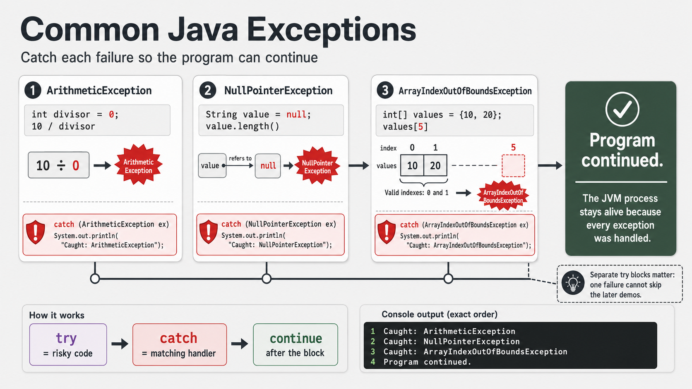

# Exercise 1 — Recognize Common Unchecked Exceptions

**Module 7** · Pre-lab practice · finish all 8 Pass, then OS how-to → [`../lab7/LAB-7-GUIDE.md`](../lab7/LAB-7-GUIDE.md)
**Folder:** `examples/module-07-exercises/` ([setup](EXERCISES-INDEX.md))



## Goal

Create `CommonExceptionsDemo.java`. Trigger three common runtime exceptions in
isolated blocks, catch each specifically, and prove `main` continues.

## Starter / reference (with line comments)

```java
public class CommonExceptionsDemo {
    public static void main(String[] args) {
        // Isolate each failure so one catch cannot skip later demos.
        try {
            int divisor = 0; // variable form avoids some constant-expression warnings
            int result = 10 / divisor;
            System.out.println(result);
        } catch (ArithmeticException ex) {
            System.out.println(
                    "Caught: " + ex.getClass().getSimpleName());
        }

        try {
            String value = null;
            // Dereferencing null throws NullPointerException.
            System.out.println(value.length());
        } catch (NullPointerException ex) {
            System.out.println(
                    "Caught: " + ex.getClass().getSimpleName());
        }

        try {
            int[] values = {10, 20};
            // Valid indexes are only 0 and 1.
            System.out.println(values[5]);
        } catch (ArrayIndexOutOfBoundsException ex) {
            System.out.println(
                    "Caught: " + ex.getClass().getSimpleName());
        }

        // Reaching this line proves recovery kept the process alive.
        System.out.println("Program continued.");
    }
}
```

| Exception | Trigger | Prevention |
| --------- | ------- | ---------- |
| `ArithmeticException` | Integer divide by zero | Validate divisor |
| `NullPointerException` | Dereference `null` | Validate references |
| `ArrayIndexOutOfBoundsException` | Invalid array index | Check `0 <= index < length` |

## Steps

### Step 1 — Create the file

**Why:** Lab 7 will intentionally create failure paths. Learning the common
unchecked exceptions first makes later ATM catches easier to recognize.

1. **New → File** → `CommonExceptionsDemo.java`.
2. Paste the starter and save.

### Step 2 — Compile and run

**Why:** Seeing three recovered failures in one run proves isolation works.

**Windows:**

```powershell
cd $env:USERPROFILE\java-bootcamp\examples\module-07-exercises
javac CommonExceptionsDemo.java
java CommonExceptionsDemo
```

**macOS:**

```bash
cd ~/java-bootcamp/examples/module-07-exercises
javac CommonExceptionsDemo.java
java CommonExceptionsDemo
```

**Verified (Windows):**

```text
Caught: ArithmeticException
Caught: NullPointerException
Caught: ArrayIndexOutOfBoundsException
Program continued.
```

### Step 3 — Explain isolation

**Why:** A single large `try` would stop after the first exception and skip
later demos.

Each risky statement has its own `try`. After one catch finishes, execution
continues into the next block.

### Step 4 — Remove one catch temporarily

**Why:** An uncaught exception proves the cost of skipping recovery.

Remove the array catch, compile, and run. Observe the raw stack trace and that
`Program continued.` does not print. Restore the catch afterward.

## Expected result

All three exception types print, followed by `Program continued.`

## If it fails

| Problem | Fix |
| ------- | --- |
| Compiler complains about division by zero | Keep the divisor in a variable, as in the starter |
| Later demos do not run | Keep each trigger in its own `try-catch` |
| Catch never matches | Catch the exact listed exception type |

## Pass criteria

| # | Confirm | Your notes |
| - | ------- | ---------- |
| 1 | All three specific exception names print | Pass / Fail |
| 2 | Final continuation line prints | Pass / Fail |
| 3 | You can name the prevention for each failure | Pass / Fail |
