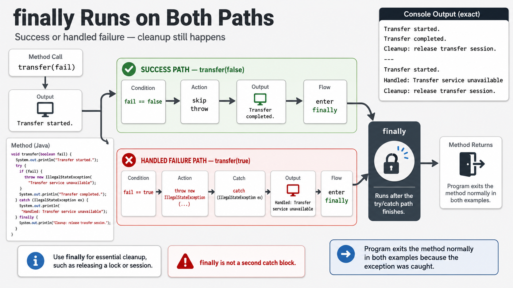
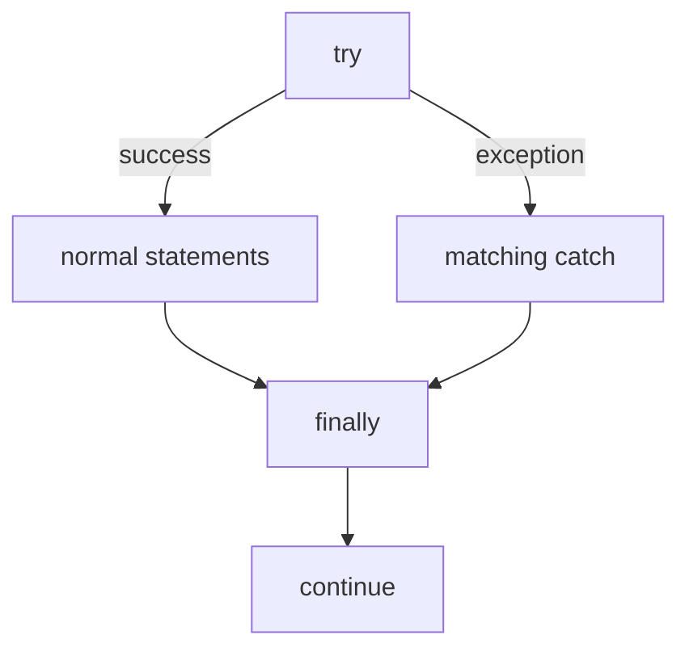

# Exercise 2 — `try-catch-finally`

**Module 7** · Pre-lab practice · finish all 8 Pass, then OS how-to → [`../lab7/LAB-7-GUIDE.md`](../lab7/LAB-7-GUIDE.md)
**Folder:** `examples/module-07-exercises/` ([setup](EXERCISES-INDEX.md))



## Goal

Create `FinallyDemo.java` and compare successful and failed transfer paths.
Confirm cleanup runs after both.

## Starter (fill in the TODOs)

Paste this skeleton, then replace each `_____` and `// TODO` with working code. Do **not** leave TODOs in your finished file.

The `throw` that simulates failure is already in the `try` block — your job is the **catch** and **finally** cleanup.

```java
public class FinallyDemo {
    static void transfer(boolean fail) {
        System.out.println("Transfer started.");

        try {
            if (fail) {
                // Simulate a recoverable service failure.
                throw new IllegalStateException(
                        "Transfer service unavailable");
            }
            System.out.println("Transfer completed.");
        } catch (_____ ex) { // TODO: catch IllegalStateException
            // TODO: print "Handled: " + ex.getMessage()
        } finally {
            // TODO: print "Cleanup: release transfer session."
        }
    }

    public static void main(String[] args) {
        transfer(false); // success path
        System.out.println("---");
        transfer(true);  // failure path
    }
}
```

## Control flow



`finally` normally runs whether the `try` succeeds or a matching catch handles
an exception. It is not an absolute guarantee if the JVM or process is forcibly
terminated.

## Steps

### Step 1 — Create the file

**Why:** ATM menu operations need cleanup and recovery after both success and
failure.

1. **New → File** → `FinallyDemo.java`.
2. Paste the starter.
3. Fill every `_____` / `// TODO`. Save.

### Step 2 — Compile and run

**Why:** Two consecutive transfer calls make the cleanup guarantee visible.

**Windows:**

```powershell
cd $env:USERPROFILE\java-bootcamp\examples\module-07-exercises
javac FinallyDemo.java
java FinallyDemo
```

**macOS:**

```bash
cd ~/java-bootcamp/examples/module-07-exercises
javac FinallyDemo.java
java FinallyDemo
```

**Verified:**

```text
Transfer started.
Transfer completed.
Cleanup: release transfer session.
---
Transfer started.
Handled: Transfer service unavailable
Cleanup: release transfer session.
```

### Step 3 — Trace both paths

**Why:** Writing the paths prevents confusing `finally` with “runs only on
error.”

Add to `notes.md`:

```text
Success: try → finally → return
Failure: try throws → catch → finally → return
```

### Step 4 — Know when not to use `finally`

**Why:** Files, readers, and streams close more safely with try-with-resources.

For AutoCloseable resources, prefer Exercise 3. It closes the resource and
preserves suppressed exceptions.

## Expected result

The cleanup line appears exactly twice—once after each path.

## If it fails

| Problem | Fix |
| ------- | --- |
| Cleanup appears only on success | Put it in `finally`, not at the end of `try` |
| Program terminates on failure | Catch `IllegalStateException` |
| Empty catch block | Print or recover with meaningful context |

## Pass criteria

| # | Confirm | Your notes |
| - | ------- | ---------- |
| 1 | Success and failure paths both execute | Pass / Fail |
| 2 | Cleanup prints twice | Pass / Fail |
| 3 | You can explain the normal finally guarantee and limitation | Pass / Fail |
