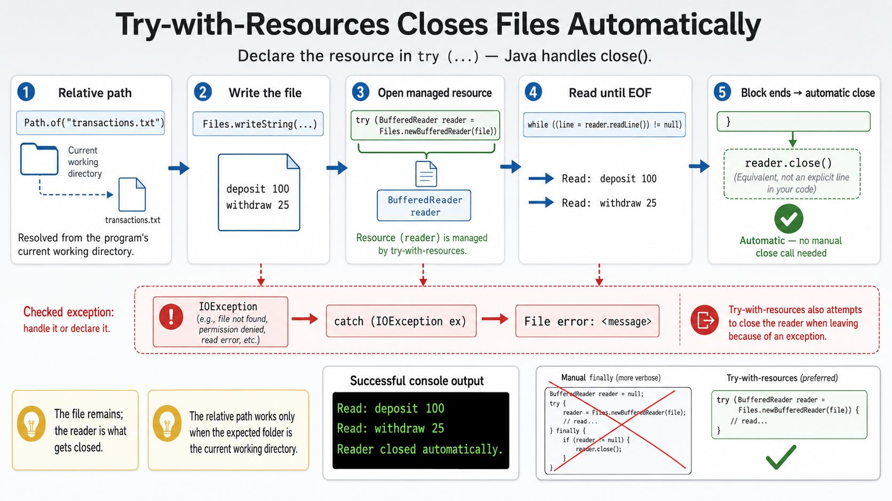

# Exercise 3 — Try-With-Resources

**Module 7** · Pre-lab practice · finish all 8 Pass, then OS how-to → [`../lab7/LAB-7-GUIDE.md`](../lab7/LAB-7-GUIDE.md)
**Folder:** `examples/module-07-exercises/` ([setup](EXERCISES-INDEX.md))



## Goal

Create and read a small `transactions.txt` file using `BufferedReader` in
try-with-resources—without calling `close()` manually.

## Starter (fill in the TODOs)

Paste this skeleton, then replace each `_____` and `// TODO` with working code. Do **not** leave TODOs in your finished file.

File write and the read loop are scaffolded — your job is the **try-with-resources header** and the **IOException catch**.

```java
import java.io.BufferedReader;
import java.io.IOException;
import java.nio.file.Files;
import java.nio.file.Path;

public class TryWithResourcesDemo {
    public static void main(String[] args) {
        // Relative path: current working directory must be the exercises folder.
        Path file = Path.of("transactions.txt");

        try {
            Files.writeString(
                    file, "deposit 100\nwithdraw 25\n");

            // TODO: try-with-resources — BufferedReader from Files.newBufferedReader(file)
            try (_____ reader = _____) {
                String line;
                while ((line = reader.readLine()) != null) {
                    System.out.println("Read: " + line);
                }
            } // reader.close() happens here automatically

            System.out.println(
                    "Reader closed automatically.");
        } catch (_____ ex) { // TODO: catch IOException
            // TODO: print "File error: " + ex.getMessage()
        }
    }
}
```

Any resource implementing `AutoCloseable` can appear in the resource header.

## Steps

### Step 1 — Create the file

**Why:** Lab 7 reads transaction history from a file. Automatic closure prevents
leaked readers after success or failure.

1. **New → File** → `TryWithResourcesDemo.java`.
2. Paste the starter.
3. Fill every `_____` / `// TODO`. Save.

### Step 2 — Compile and run

**Why:** The verified session proves both lines were read and the resource
scope ended cleanly.

**Windows:**

```powershell
cd $env:USERPROFILE\java-bootcamp\examples\module-07-exercises
javac TryWithResourcesDemo.java
java TryWithResourcesDemo
```

**macOS:**

```bash
cd ~/java-bootcamp/examples/module-07-exercises
javac TryWithResourcesDemo.java
java TryWithResourcesDemo
```

**Verified:**

```text
Read: deposit 100
Read: withdraw 25
Reader closed automatically.
```

The program also creates `transactions.txt` in the current exercises folder.

### Step 3 — Confirm no manual close exists

**Why:** Manual `close()` is easy to forget on exceptional exits.

Search your code: there should be no `reader.close()`. Closure occurs when
execution leaves the resource block.

### Step 4 — Trigger a file failure

**Why:** Recovery matters as much as the happy path.

Temporarily comment out `Files.writeString(...)`, delete `transactions.txt`,
and run. The catch should print a file error without crashing. Restore the code
afterward.

## Expected result

Both transaction lines print, and the resource scope clearly controls reader
lifetime.

## If it fails

| Problem | Fix |
| ------- | --- |
| File appears elsewhere | Run from `module-07-exercises`; relative paths use the current directory |
| Unhandled `IOException` | Keep file operations inside the `try` with an `IOException` catch |
| Reader used after block | The resource is closed outside its try-with-resources scope |

## Pass criteria

| # | Confirm | Your notes |
| - | ------- | ---------- |
| 1 | Both file lines print | Pass / Fail |
| 2 | No explicit `close()` appears | Pass / Fail |
| 3 | Missing-file path is handled | Pass / Fail |
