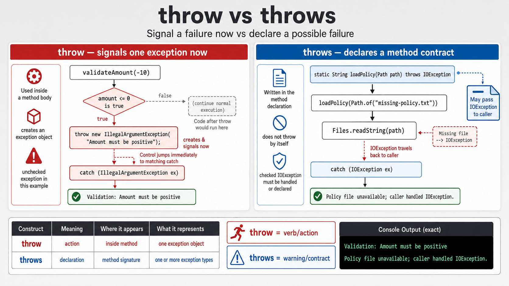

# Exercise 4 — `throw` vs `throws`

**Module 7** · Pre-lab practice · finish all 8 Pass, then OS how-to → [`../lab7/LAB-7-GUIDE.md`](../lab7/LAB-7-GUIDE.md)
**Folder:** `examples/module-07-exercises/` ([setup](EXERCISES-INDEX.md))



## Goal

Create `ThrowThrowsDemo.java` to distinguish actively throwing an exception
from declaring that a method may propagate one.

## Starter (fill in the TODOs)

Paste this skeleton, then replace each `_____` and `// TODO` with working code. Do **not** leave TODOs in your finished file.

The validation guard and file read call are scaffolded — your job is **`throw`**, **`throws`**, and the **catch blocks** in `main`.

```java
import java.io.IOException;
import java.nio.file.Files;
import java.nio.file.Path;

public class ThrowThrowsDemo {
    static void validateAmount(double amount) {
        if (amount <= 0) {
            // TODO: throw new IllegalArgumentException("Amount must be positive")
        }
    }

    // TODO: declare throws IOException on this method
    static String loadPolicy(Path path)
            _____ {
        return Files.readString(path);
    }

    public static void main(String[] args) {
        try {
            validateAmount(-10);
        } catch (_____ ex) { // TODO: catch IllegalArgumentException
            // TODO: print "Validation: " + ex.getMessage()
        }

        try {
            // Missing file forces the declared IOException path.
            loadPolicy(Path.of("missing-policy.txt"));
        } catch (_____ ex) { // TODO: catch IOException
            // TODO: print "Policy file unavailable; caller handled IOException."
        }
    }
}
```

| Keyword | Location | Meaning |
| ------- | -------- | ------- |
| `throw` | Method body | Signal one exception object |
| `throws` | Method signature | Declare possible propagation |

Unchecked exceptions may be declared but do not need to be. Checked
`IOException` must be caught or declared.

## Steps

### Step 1 — Create the file

**Why:** Lab 7 account methods throw domain failures, while service methods
often declare them for the menu boundary to handle.

1. **New → File** → `ThrowThrowsDemo.java`.
2. Paste the starter.
3. Fill every `_____` / `// TODO`. Save.

### Step 2 — Compile and run

**Why:** One run shows both keywords in action.

**Windows:**

```powershell
cd $env:USERPROFILE\java-bootcamp\examples\module-07-exercises
javac ThrowThrowsDemo.java
java ThrowThrowsDemo
```

**macOS:**

```bash
cd ~/java-bootcamp/examples/module-07-exercises
javac ThrowThrowsDemo.java
java ThrowThrowsDemo
```

**Verified:**

```text
Validation: Amount must be positive
Policy file unavailable; caller handled IOException.
```

### Step 3 — Run a compiler experiment

**Why:** Checked exceptions are a compiler contract, not only a runtime idea.

Remove `throws IOException` from `loadPolicy` without adding a catch there.
Compilation should fail with an “unreported exception IOException” message.
Restore it.

### Step 4 — Connect to Lab 7

**Why:** The ATM menu becomes the recovery boundary for domain failures.

In the ATM lab, account methods will `throw` domain exceptions; service methods
may declare `throws`; the menu boundary will catch, log, and recover.

## Expected result

Both failures are handled, and you can point to `throw` in a body versus
`throws` in a signature.

## If it fails

| Problem | Fix |
| ------- | --- |
| Program finds a policy file unexpectedly | Use the exact missing filename or remove that test file |
| `IOException` compile error | Declare it on `loadPolicy` and catch at the caller |
| Invalid amount not rejected | Check `amount <= 0` before any mutation |

## Pass criteria

| # | Confirm | Your notes |
| - | ------- | ---------- |
| 1 | Both verified messages print | Pass / Fail |
| 2 | Compiler experiment proves checked handling | Pass / Fail |
| 3 | You can explain `throw` vs `throws` | Pass / Fail |
