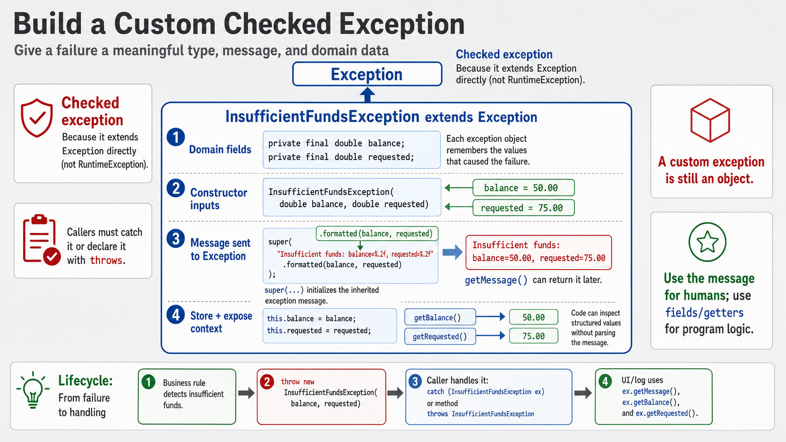

# Exercise 5 — Custom Checked Exception

**Module 7** · Pre-lab practice · finish all 8 Pass, then OS how-to → [`../lab7/LAB-7-GUIDE.md`](../lab7/LAB-7-GUIDE.md)
**Folder:** `examples/module-07-exercises/` ([setup](EXERCISES-INDEX.md))



## Goal

Model insufficient balance as a meaningful checked domain exception. Preserve
balance and requested amount as structured context.

## Starter (fill in the TODOs)

Paste each skeleton, then replace every `_____` and `// TODO` with working code. Do **not** leave TODOs in your finished files.

Create **three** files. The demo's `withdraw(150.00)` call is scaffolded — your job is the **exception class**, the **throw** in `Account`, and the **catch** in the demo.

### `InsufficientFundsException.java`

```java
public class InsufficientFundsException
        extends _____ { // TODO: extend Exception (checked)
    private final double balance;
    private final double requested;

    public InsufficientFundsException(
            double balance, double requested) {
        // TODO: call super with formatted message:
        //   "Insufficient funds: balance=%.2f, requested=%.2f"
        super(_____);
        this.balance = balance;
        this.requested = requested;
    }

    public double getBalance() {
        return balance;
    }

    public double getRequested() {
        return requested;
    }
}
```

### `Account.java`

```java
public class Account {
    private double balance;

    public Account(double balance) {
        this.balance = balance;
    }

    public void withdraw(double amount)
            throws InsufficientFundsException {
        // Validate before mutating state.
        if (amount > balance) {
            // TODO: throw new InsufficientFundsException(balance, amount)
        }
        balance -= amount;
    }

    public double getBalance() {
        return balance;
    }
}
```

### `CustomExceptionDemo.java`

```java
public class CustomExceptionDemo {
    public static void main(String[] args) {
        Account account = new Account(100.00);

        try {
            account.withdraw(150.00);
        } catch (_____ ex) { // TODO: catch InsufficientFundsException
            // TODO: print ex.getMessage()
            // TODO: print shortfall with printf — ex.getRequested() - ex.getBalance()
        }

        // Failed withdrawal must leave the original balance unchanged.
        System.out.printf("Balance unchanged: %.2f%n",
                account.getBalance());
    }
}
```

## Steps

### Step 1 — Create the three files

**Why:** Lab 7 uses custom checked exceptions for domain rules such as
insufficient funds and invalid PIN.

1. **New → File** → `InsufficientFundsException.java`, `Account.java`, `CustomExceptionDemo.java`.
2. Paste each starter.
3. Fill every `_____` / `// TODO`. Save.

### Step 2 — Compile and run

**Why:** The verified session proves both messaging and unchanged state.

**Windows:**

```powershell
cd $env:USERPROFILE\java-bootcamp\examples\module-07-exercises
javac InsufficientFundsException.java Account.java CustomExceptionDemo.java
java CustomExceptionDemo
```

**macOS:**

```bash
cd ~/java-bootcamp/examples/module-07-exercises
javac InsufficientFundsException.java Account.java CustomExceptionDemo.java
java CustomExceptionDemo
```

**Verified:**

```text
Insufficient funds: balance=100.00, requested=150.00
Short by: 50.00
Balance unchanged: 100.00
```

### Step 3 — Prove the checked contract

**Why:** Extending `Exception` forces callers to catch or declare.

Temporarily remove the `try-catch` in the demo. Compilation should fail.
Restore it.

### Step 4 — Explain mutation order

**Why:** Domain methods must reject invalid work before changing state.

Validation happens before `balance -= amount`; therefore failure leaves state
unchanged.

## Expected result

The exception carries useful domain context, caller recovery is enforced, and
failed withdrawal does not mutate balance.

## If it fails

| Problem | Fix |
| ------- | --- |
| Caller not forced to handle | Extend `Exception`, not `RuntimeException` |
| Balance becomes negative | Throw before subtracting |
| Message lacks useful context | Include balance and requested amount |

## Pass criteria

| # | Confirm | Your notes |
| - | ------- | ---------- |
| 1 | Output reports shortfall `50.00` | Pass / Fail |
| 2 | Balance remains `100.00` | Pass / Fail |
| 3 | Caller enforces catch-or-declare | Pass / Fail |
