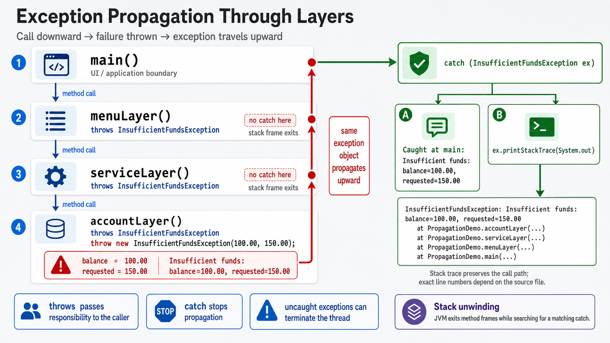
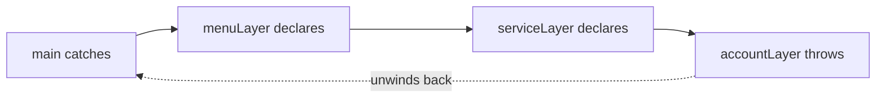

# Exercise 6 — Exception Propagation

**Module 7** · Pre-lab practice · finish all 8 Pass, then OS how-to → [`../lab7/LAB-7-GUIDE.md`](../lab7/LAB-7-GUIDE.md)
**Folder:** `examples/module-07-exercises/` ([setup](EXERCISES-INDEX.md))



> **Builds on Exercise 5:** Keep `InsufficientFundsException.java`.

## Goal

Trace a checked exception from account layer → service layer → menu layer →
`main`, catching it only at the recovery boundary.

## Starter (fill in the TODOs)

Paste this skeleton, then replace each `_____` and `// TODO` with working code. Do **not** leave TODOs in your finished file.

Each layer's call chain is scaffolded — your job is the **`throw`** at the bottom, **`throws`** on intermediate methods, and the **catch** only in `main`.

```java
public class PropagationDemo {
    static void accountLayer()
            _____ { // TODO: throws InsufficientFundsException
        // Deepest layer creates the domain failure.
        // TODO: throw new InsufficientFundsException(100.00, 150.00)
    }

    static void serviceLayer()
            _____ { // TODO: throws InsufficientFundsException
        // No recovery here, so declare and let it propagate.
        accountLayer();
    }

    static void menuLayer()
            _____ { // TODO: throws InsufficientFundsException
        // Still no recovery action; keep the contract.
        serviceLayer();
    }

    public static void main(String[] args) {
        try {
            menuLayer();
        } catch (_____ ex) { // TODO: catch InsufficientFundsException
            // TODO: print "Caught at main: " + ex.getMessage()
            // TODO: ex.printStackTrace(System.out)
        }
    }
}
```

## Propagation flow



## Steps

### Step 1 — Create the file

**Why:** Lab 7 catches ATM failures at the menu boundary, not in every helper
method.

1. **New → File** → `PropagationDemo.java` next to `InsufficientFundsException.java`.
2. Paste the starter.
3. Fill every `_____` / `// TODO`. Save.

### Step 2 — Compile and run

**Why:** The stack trace shows throw location and call path.

**Windows:**

```powershell
cd $env:USERPROFILE\java-bootcamp\examples\module-07-exercises
javac InsufficientFundsException.java PropagationDemo.java
java PropagationDemo
```

**macOS:**

```bash
cd ~/java-bootcamp/examples/module-07-exercises
javac InsufficientFundsException.java PropagationDemo.java
java PropagationDemo
```

**Verified excerpt:**

```text
Caught at main: Insufficient funds: balance=100.00, requested=150.00
InsufficientFundsException: Insufficient funds: ...
    at PropagationDemo.accountLayer(...)
    at PropagationDemo.serviceLayer(...)
    at PropagationDemo.menuLayer(...)
    at PropagationDemo.main(...)
```

Line numbers vary. Read stack frames from top (throw location) downward through
callers.

### Step 3 — Explain the boundary

**Why:** Intermediate methods should not catch unless they can recover or add
useful context.

Intermediate methods declare propagation. `main` represents the UI boundary
that can show a safe message, log details, and continue.

### Step 4 — Avoid catch-and-rethrow noise

**Why:** Empty catches hide failures; noisy rethrows add no value.

Do not add empty catches at every layer. Catch only to recover, translate, add
useful context, or perform required handling.

## Expected result

Stack trace order shows where the exception was thrown and the call path back
to the catching boundary.

## If it fails

| Problem | Fix |
| ------- | --- |
| Unreported checked exception | Add `throws InsufficientFundsException` to intermediate methods |
| No stack trace | Call `printStackTrace(System.out)` in the catch |
| Trace order misunderstood | First `at` line is the throw location; following lines are callers |

## Pass criteria

| # | Confirm | Your notes |
| - | ------- | ---------- |
| 1 | Catch occurs only in `main` | Pass / Fail |
| 2 | Trace includes all four methods | Pass / Fail |
| 3 | You can explain stack unwinding and catch boundaries | Pass / Fail |
