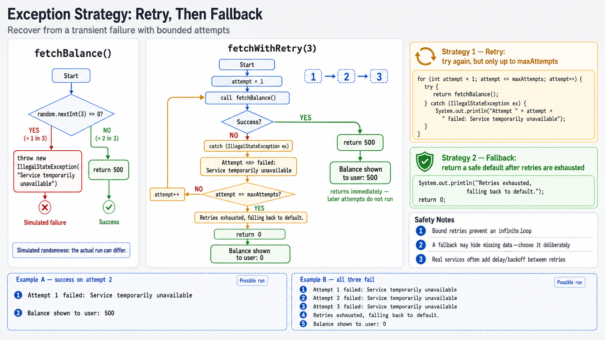

# Exercise 7 — Error Handling Strategies

**Module 7** · Pre-lab practice · finish all 8 Pass, then OS how-to → [`../lab7/LAB-7-GUIDE.md`](../lab7/LAB-7-GUIDE.md)
**Folder:** `examples/module-07-exercises/` ([setup](EXERCISES-INDEX.md))



> **Independent of Exercise 6:** a different flaky failure this time — the focus
> is choosing a strategy after you catch, not only where you catch.

## Goal

Implement two of the six error-handling strategies — **Retry** and
**Fallback / Default** — around a flaky operation, and explain when you would
reach for the other four.

## Starter (fill in the TODOs)

Paste this skeleton, then replace each `_____` and `// TODO` with working code. Do **not** leave TODOs in your finished file.

The flaky `fetchBalance()` method is complete — your job is the **retry catch** and the **fallback return**.

```java
import java.util.Random;

public class StrategyDemo {
    static final Random random = new Random();

    // Simulates a transient failure, like a flaky network call.
    static int fetchBalance() {
        if (random.nextInt(3) == 0) {
            throw new IllegalStateException(
                    "Service temporarily unavailable");
        }
        return 500;
    }

    // Strategy 1: Retry — try again a bounded number of times.
    static int fetchWithRetry(int maxAttempts) {
        for (int attempt = 1; attempt <= maxAttempts; attempt++) {
            try {
                return fetchBalance();
            } catch (_____ ex) { // TODO: catch IllegalStateException
                // TODO: print "Attempt " + attempt + " failed: " + ex.getMessage()
                // TODO: if attempt == maxAttempts, print "Retries exhausted, falling back to default."
            }
        }
        // Strategy 2: Fallback / Default — safe value after retries fail.
        return _____; // TODO: return 0
    }

    public static void main(String[] args) {
        int balance = fetchWithRetry(3);
        System.out.println("Balance shown to user: " + balance);
    }
}
```

## The six strategies (know all six; you implement two)

| Strategy | One-line idea | Used here? |
| -------- | ------------- | :---: |
| Retry | Try again with a bound for transient failures | Yes |
| Fallback / Default | Return a safe value when an operation fails | Yes |
| Skip & Continue | Isolate a bad record and keep the pipeline moving | No |
| Fail Fast | Stop immediately for unrecoverable conditions | No |
| Graceful Degradation | Reduce functionality but stay available | No |
| Circuit Breaker | Stop calling a failing dependency until it recovers | No |

## Steps

### Step 1 — Create the file

**Why:** Catching alone is not a strategy. Lab 7 and later services need clear
recovery choices.

1. **New → File** → `StrategyDemo.java`.
2. Paste the starter.
3. Fill every `_____` / `// TODO`. Save.

### Step 2 — Compile and run

**Why:** Random transient failures make retry visible without external systems.

**Windows:**

```powershell
cd $env:USERPROFILE\java-bootcamp\examples\module-07-exercises
javac StrategyDemo.java
java StrategyDemo
```

**macOS:**

```bash
cd ~/java-bootcamp/examples/module-07-exercises
javac StrategyDemo.java
java StrategyDemo
```

Run it 4–5 times. Because `fetchBalance` fails roughly one call in three, most
runs succeed within the retry loop; occasionally all three attempts fail and
you see the fallback value.

**Verified (typical run):**

```text
Attempt 1 failed: Service temporarily unavailable
Balance shown to user: 500
```

### Step 3 — Force the fallback path

**Why:** You must observe both recovery and exhaustion.

Temporarily change `random.nextInt(3) == 0` to `true` so every attempt fails,
rerun, and confirm you see all three attempt failures followed by
`Balance shown to user: 0`. Then change it back.

### Step 4 — Match the other four strategies to real scenarios

**Why:** Knowing when not to retry is as important as knowing how to retry.

Add to `notes.md`, one sentence each:

```markdown
- Skip & Continue: importing 10,000 CSV rows — one bad row should not stop the other 9,999.
- Fail Fast: a required config value is missing at startup — do not limp along with a null.
- Graceful Degradation: a recommendations service is down — show the page without recommendations instead of a 500 error.
- Circuit Breaker: a downstream payment API is timing out repeatedly — stop hammering it and fail fast for a cooldown period.
```

## Expected result

`fetchWithRetry` recovers on most runs after 1–2 attempts, falls back to `0`
when all attempts fail, and you have one real-world sentence for each of the
four unimplemented strategies.

## If it fails

| Problem | Fix |
| ------- | --- |
| Always succeeds on attempt 1 | Expected sometimes — `nextInt(3) == 0` is only about 33% likely |
| Infinite loop | Confirm the `for` loop has a fixed `maxAttempts` bound |
| Fallback never reached | Rerun a few more times, or force it via Step 3 |

## Pass criteria

| # | Confirm | Your notes |
| - | ------- | ---------- |
| 1 | `fetchWithRetry` shows retry attempts and eventually a result | Pass / Fail |
| 2 | You forced and observed the fallback path | Pass / Fail |
| 3 | You wrote one real scenario each for Skip & Continue, Fail Fast, Graceful Degradation, and Circuit Breaker | Pass / Fail |
