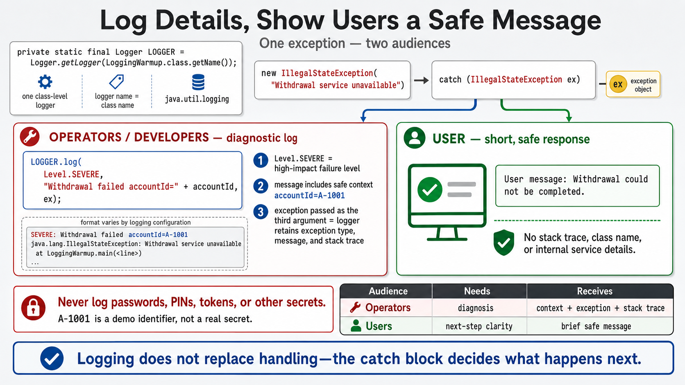

# Exercise 8 — Contextual Logging Warm-up

**Module 7** · Pre-lab practice · finish all 8 Pass, then OS how-to → [`../lab7/LAB-7-GUIDE.md`](../lab7/LAB-7-GUIDE.md)
**Folder:** `examples/module-07-exercises/` ([setup](EXERCISES-INDEX.md))



> This exercise uses JDK `java.util.logging` so no dependency is required.
> Later modules introduce SLF4J and structured production logging.

## Goal

Log operational context and the exception stack trace while showing the user a
short, safe message.

## Starter (fill in the TODOs)

Paste this skeleton, then replace each `_____` and `// TODO` with working code. Do **not** leave TODOs in your finished file.

The `throw` inside the `try` is scaffolded — your job is the **LOGGER.log** call and the **user-safe message** in the catch.

```java
import java.util.logging.Level;
import java.util.logging.Logger;

public class LoggingWarmup {
    private static final Logger LOGGER =
            Logger.getLogger(
                    LoggingWarmup.class.getName());

    public static void main(String[] args) {
        // Demo identifier only — never log real PINs or secrets.
        String accountId = "A-1001";

        try {
            throw new IllegalStateException(
                    "Withdrawal service unavailable");
        } catch (IllegalStateException ex) {
            // TODO: LOGGER.log(Level.SEVERE, "Withdrawal failed accountId=" + accountId, ex)
            //   pass ex as the third argument to keep the stack trace

            // TODO: print user-safe message:
            //   "User message: Withdrawal could not be completed."
        }
    }
}
```

## Two audiences

| Audience | Needs |
| -------- | ----- |
| User | Short actionable message, no internal stack trace |
| Developer/operations | Severity, operation context, exception type/message, stack trace |

Never use an empty catch. Also avoid logging passwords, PINs, tokens, full card
numbers, or personal data.

## Steps

### Step 1 — Create the file

**Why:** Lab 7 must keep diagnostic evidence without exposing internals to the
ATM user.

1. **New → File** → `LoggingWarmup.java`.
2. Paste the starter.
3. Fill every `_____` / `// TODO`. Save.

### Step 2 — Compile and run

**Why:** One run shows both audiences in the same failure path.

**Windows:**

```powershell
cd $env:USERPROFILE\java-bootcamp\examples\module-07-exercises
javac LoggingWarmup.java
java LoggingWarmup
```

**macOS:**

```bash
cd ~/java-bootcamp/examples/module-07-exercises
javac LoggingWarmup.java
java LoggingWarmup
```

**Verified content** (timestamp and ordering vary because logs use stderr):

```text
SEVERE: Withdrawal failed accountId=A-1001
java.lang.IllegalStateException: Withdrawal service unavailable
    at LoggingWarmup.main(...)
User message: Withdrawal could not be completed.
```

### Step 3 — Identify useful context

**Why:** Good logs answer “what failed, for whom, and where.”

Confirm the log contains:

- severity (`SEVERE`);
- failed operation (`Withdrawal`);
- demo account ID;
- exception type and message;
- stack trace.

### Step 4 — Compare bad handling

**Why:** Empty catches and user-facing stack traces both create operational
pain.

Bad:

```java
catch (IllegalStateException ex) {
}
```

Also bad:

```java
System.out.println(ex.getMessage());
```

The first destroys evidence; the second gives users internal detail but no
durable diagnostic context.

## Expected result

Diagnostic output includes account context and the exception; user output
remains concise.

## If it fails

| Problem | Fix |
| ------- | --- |
| Log appears after user message | stdout/stderr ordering can differ; this is normal |
| No stack trace | Pass `ex` as the third argument to `LOGGER.log` |
| Sensitive values in log | Remove or redact them immediately |

## Pass criteria

| # | Confirm | Your notes |
| - | ------- | ---------- |
| 1 | Log includes severity, operation, demo account ID, and exception | Pass / Fail |
| 2 | User message contains no stack trace | Pass / Fail |
| 3 | Catch block is not empty | Pass / Fail |
| 4 | You can name data that must never be logged | Pass / Fail |

---

## Next

Exercises 1–8 complete → open **one** OS how-to → [`../lab7/LAB-7-WINDOWS.md`](../lab7/LAB-7-WINDOWS.md) or [`../lab7/LAB-7-MACOS.md`](../lab7/LAB-7-MACOS.md) → then graded [`../lab7/LAB-7-GUIDE.md`](../lab7/LAB-7-GUIDE.md) (builds on these eight; separate folder `examples/Lab7-ATMSystem/` with `src/com/academy/atm/`).

Bring your logging warm-up notes and propagation sketch to the Lab 7 core checkpoint. Never log real PINs or secrets.
