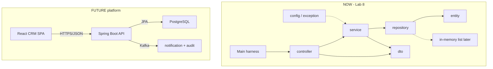
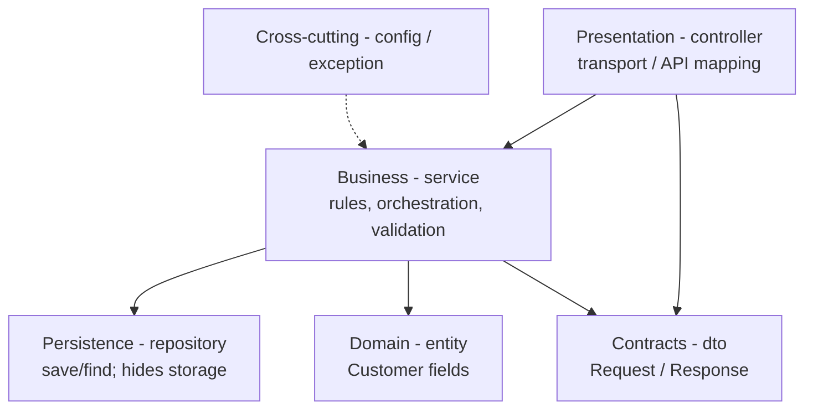
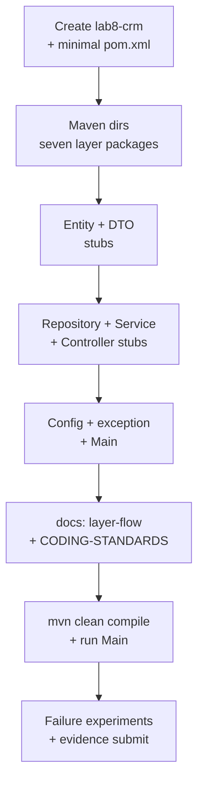
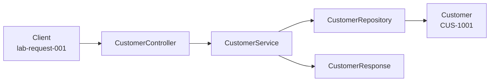

# Lab 8: Project Structure and Organization — Northstar CRM Skeleton

**Module:** 8 — Java Project Structure and Modularization  
**Lab folder:** `labs/Week 2 - Backend, AI Tools and Testing/module-08/lab8/`  
**Difficulty:** Intermediate  
**Duration:** ~45 minutes (timed path with starter) · Full path: 3–4 Hours

**Primary IDE:** IntelliJ IDEA Community Edition · **Optional IDE:** VS Code

| OS | How-to for this lab |
| -- | ------------------- |
| Windows | [LAB-8-WINDOWS.md](LAB-8-WINDOWS.md) |
| macOS | [LAB-8-MACOS.md](LAB-8-MACOS.md) |

> **Environment reminder:** Finish [Lab 0](../../../Week%201%20-%20Java%20and%20JVM%20Foundations/module-00/lab0/LAB-0-GUIDE.md). Use **IntelliJ IDEA Community** (primary; optional VS Code) on your laptop with **JDK 21** and **Maven 3.9+**. Work under `~/java-bootcamp` (Windows: `%USERPROFILE%\java-bootcamp`).

> **Pre-lab exercises:** Complete [`../exercises/EXERCISES-INDEX.md`](../exercises/EXERCISES-INDEX.md) before starting the full CRM skeleton.

**Verified participant layout (Windows IntelliJ + PowerShell; Temurin JDK 21.0.11; Maven 3.9.9):**

| Role | Path |
| ---- | ---- |
| IntelliJ opens | `%USERPROFILE%\java-bootcamp` (SDK / language level **21**) |
| This lab project | `examples\lab8-crm\` (`pom.xml` + `src/main/java/com/northstar/crm/…`) |
| Compile / run | `mvn -q clean compile` → `java -cp target\classes com.northstar.crm.Main` |
| Smoke-test output | `Northstar CRM skeleton — Lab 8` + seven packages + `CUS-1001` / `CUS-1002` |

**If it fails (Windows PowerShell):** Confirm `cd` is `examples\lab8-crm` before Maven. Open the `pom.xml` so IntelliJ imports Maven. Do not add Spring/JPA imports in Lab 8 stubs.

---

## 45-minute timed path (use starter)

In class, use the starter templates so the **core** objectives fit **~45 minutes**. The full Steps below remain for homework / extended depth.

1. Open [`starter/README.md`](starter/README.md).
2. Copy `starter/` into your `java-bootcamp/examples/lab8-crm/` target (see starter README).
3. Fill every `// TODO` — do **not** wait on a perfect prior lab; the starter includes a baseline.
4. Run the starter smoke test; evidence under `notes/screenshots/lab-8/`.
5. Mark timed-path Pass criteria in the starter README. Continue remaining GUIDE steps as homework if needed.

| Path | Time | Scope |
| ---- | ---- | ----- |
| **Timed (default)** | ~45 min | Starter TODOs + smoke test |
| **Full (extended)** | see Duration | Every Step in this GUIDE |


## How to follow this lab

1. **In class (timed path):** prefer [`starter/README.md`](starter/README.md) — copy starter → `java-bootcamp/examples/lab8-crm`, fill `// TODO`, run smoke test (~45 min).
2. Open the **Windows** or **macOS** how-to (links above) in a second tab for OS-specific commands.
3. Create/work only under your `java-bootcamp/examples/…` folder from the steps (not inside this `labs/` git clone unless a step says otherwise).
4. For each **Step N** (full path / homework): read **Why** (if present) → do the actions → confirm **Expected** / **Expected result** → then continue.
5. When stuck, use **Failure Experiments** / troubleshooting in this guide before asking for help.
6. Capture evidence under `notes/screenshots/lab-8/` (workspace root under `java-bootcamp`; redact secrets). Use the **Pass criteria** tables — write **Pass** or **Fail** in your notes. GitHub file view does not support clickable checkboxes.


## What you'll submit (read this first)

Keep this checklist visible while you work. Full detail is under [Expected Deliverables](#expected-deliverables) at the end.

| # | Deliverable |
| - | ----------- |
| 1 | Completed Lab 8 Maven skeleton (`lab8-crm` or `customer-management-platform`) |
| 2 | All layer packages with stub classes plus `Main` |
| 3 | `docs/CODING-STANDARDS.md` and `docs/layer-flow.md` |
| 4 | Project `LAB-8-GUIDE.md` with compile/run and design decisions |
| 5 | Successful `mvn clean compile` evidence (+ `Main` output) |
| 6 | Controlled-failure evidence (broken layer import and/or missing POM experiment) |
| 7 | Architecture / data-flow diagram showing NOW vs LATER |
| 8 | Answers to reflection / concepts in `notes/lab8-answers.md` |


## Lab Overview

This Module 8 lab starts the **Customer Management Platform (CRM)** for **Northstar** by creating a clean **Maven Java skeleton**: standard directory layout, layered packages, compile-ready stub classes, and a short coding-standards document the rest of the bootcamp will follow.

**Purpose.** Week 1 taught language fundamentals (OOP, collections, streams, exceptions). Week 2 needs a **shared project shape** before anyone wires Spring, SOAP, or a database. Without agreed packages and layer rules, every later lab reshuffles folders. Lab 8 makes the structure real—and intentionally boring on purpose.

**What you build (exercise).** A Maven project (`lab8-crm`, also acceptable name: `customer-management-platform`) under package `com.northstar.crm` with layers `controller`, `service`, `repository`, `entity`, `dto`, `config`, and `exception`; stub types such as `CustomerController`, `CustomerService`, `CustomerRepository`, `Customer`, `CustomerRequest` / `CustomerResponse`, `AppConfig`, `CustomerNotFoundException`, and `Main`; plus `docs/CODING-STANDARDS.md` and `docs/layer-flow.md`. Prove `mvn clean compile` and run `Main`.

**What success looks like.** Under `~/java-bootcamp/examples/lab8-crm/` (or equivalent) you can list seven layer packages, compile without Spring/JPA/Kafka imports, print the skeleton banner from `Main`, and hand a teammate docs that explain how creating **Amina Khan (`CUS-1001`)** would move through layers once implemented.

**Depends on Lab 0.** If IntelliJ, `java`, `javac`, or `mvn` fail, stop and fix [Lab 0](../../../Week%201%20-%20Java%20and%20JVM%20Foundations/module-00/lab0/LAB-0-GUIDE.md) / [SETUP-INSTRUCTIONS.md](../../../SETUP-INSTRUCTIONS.md). Week 1 exception design (Lab 7) informs the `exception` package mindset—but you do **not** port the ATM code into CRM.

**CRM connection (THIS lab starts it).** From Lab 8 onward you build the Northstar CRM platform incrementally. Lab 8 is **structure only**: no real create-customer logic, no HTTP, no PostgreSQL, no React, no Kafka. Treat stubs as contracts teammates will fill in Labs 9–12 (Maven deepen + domain), 13+ (SOAP/contracts), and 22+ (Spring Boot).

---

## Learning Objectives

After completing this lab, you will be able to:

* Create a **Maven standard project layout** (`src/main/java`, `src/main/resources`, `src/test/java`)
* Organize packages into `controller`, `service`, `repository`, `entity`, `dto`, `config`, and `exception`
* Explain **layered architecture** and which concerns belong in each layer (presentation, business, persistence, cross-cutting)
* Separate **DTO** (API/contracts) from **entity** (domain/persistence model)
* Add stub/empty classes that **compile** and show intended responsibilities
* Write a short **coding-standards** document for naming, packages, and layer boundaries
* Distinguish **skeleton structure** from runtime behavior (no Spring/JPA/Kafka yet)
* Trace a future “create customer” request for `CUS-1001` through the layers on paper
* Produce evidence that another developer can navigate and extend the project
* Compile with `mvn clean compile` and run `java -cp target/classes com.northstar.crm.Main` on your laptop

---

## Business Scenario

Northstar is building a **Customer Management Platform**. Product wants engineers to create customers such as **Amina Khan**, look up prospects such as **Ravi Singh**, and later expose REST and partner SOAP APIs.

Before any of that runtime behavior lands, the team needs a **shared project shape** so:

* Lab 9 can attach a richer `pom.xml` (dependencies, plugins, profiles)
* Labs 10–12 can fill domain and service code without renaming packages weekly
* Later labs can add Spring, PostgreSQL, React, and Kafka **into** this layout

Your job this lab: create the folder and package skeleton, stub the main types, document coding standards, and prove `mvn -q compile` succeeds on an almost-empty but correctly organized tree.

Use these examples consistently:

| ID | Name | Status |
| -- | ---- | ------ |
| `CUS-1001` | Amina Khan | `ACTIVE` |
| `CUS-1002` | Ravi Singh | `PROSPECT` |

* Correlation ID: `lab-request-001` (for future logging; record in notes)
* ISO-8601 UTC timestamps (record in notes; no persistence yet)

**Security note for evidence.** Do not paste GitHub credentialss, AWS secrets, or tokens into screenshots. Demo customer names above are fine; do not invent “production” passwords in `application.properties`.

---

## Architecture Context

### NOW vs LATER

**NOW (this lab):** Maven Java skeleton + layered packages + stubs + standards docs. In-memory lists and real service methods arrive when later labs fill behavior — not required for Lab 8 compile success.

**LATER (Labs 22+ / 30+):** Spring Boot API, JPA/PostgreSQL, React SPA, Kafka consumers.



### Layer map



### Lab flow (mermaid)



### Architecture NOW vs LATER (table)

| Aspect | Lab 8 (NOW) | Later CRM labs |
| ------ | ----------- | -------------- |
| Goal | Packages + stubs that compile | Working create/get customer APIs |
| UI | `Main` console banner | React SPA / HTTP clients |
| Storage | None (stubs throw) | In-memory → JPA/PostgreSQL |
| Framework | Plain JDK + Maven | Spring Boot + messaging |
| Customer IDs | Documented (`CUS-1001`) | Implemented and persisted |
| Correlation | Noted (`lab-request-001`) | Logged on every request |

**Lab focus:** Maven standard layout, package organization, layered architecture workflow, and a coding-standards document — not business logic or HTTP yet.

---

## Prerequisites

Complete the [Labs Setup Instructions](../../../SETUP-INSTRUCTIONS.md) and [Lab 0](../../../Week%201%20-%20Java%20and%20JVM%20Foundations/module-00/lab0/LAB-0-GUIDE.md) before this lab. Confirm:

* **JDK 21** with `java` / `javac` on `PATH`
* **Maven 3.9+** (`mvn -version`)
* **Git** available; know how to ignore `target/`
* **IntelliJ IDEA Community (primary; optional VS Code)** to your laptop with `~/java-bootcamp` open
* Working terminal **inside** the Remote window
* No secrets (keys, tokens, passwords) committed to Git

### Pre-flight

Run on the **VS Code** terminal (Linux/laptop):

```bash
java -version
mvn -version
git --version
git status
pwd
ls ~/java-bootcamp
```

Expected theme (versions may vary by AMI):

```text
openjdk version "21....
Apache Maven 3....
git version 2....
/home/ubuntu
examples  notes
```

Fix environment failures before creating files. Record tool versions in your evidence if the lab asks for screenshots.

---

## Suggested Project Files

Create everything under the bootcamp workspace:

```text
~/java-bootcamp/examples/lab8-crm/
├── src/
│   ├── main/
│   │   ├── java/
│   │   │   └── com/
│   │   │       └── northstar/
│   │   │           └── crm/
│   │   │               ├── Main.java
│   │   │               ├── controller/
│   │   │               │   └── CustomerController.java
│   │   │               ├── service/
│   │   │               │   └── CustomerService.java
│   │   │               ├── repository/
│   │   │               │   └── CustomerRepository.java
│   │   │               ├── entity/
│   │   │               │   └── Customer.java
│   │   │               ├── dto/
│   │   │               │   ├── CustomerRequest.java
│   │   │               │   └── CustomerResponse.java
│   │   │               ├── config/
│   │   │               │   └── AppConfig.java
│   │   │               └── exception/
│   │   │                   └── CustomerNotFoundException.java
│   │   └── resources/
│   │       └── application.properties   # placeholder only — no secrets
│   └── test/
│       └── java/
│           └── com/northstar/crm/
│               └── .gitkeep
├── docs/
│   ├── CODING-STANDARDS.md
│   ├── layer-flow.md
│   └── (optional) observability-notes.md
├── notes/
│   ├── lab8-answers.md
│   └── screenshots/
├── pom.xml
├── .gitignore
└── README.md
```

Ignore `target/`, IDE metadata (`.idea/`, `*.iml`), `.env`, tokens, and passwords.

**Alternate root name:** `customer-management-platform` is acceptable if your instructor prefers it — packages and layers must still match `com.northstar.crm.*`.

**Windows local mode (instructor-approved only):** Mirror the same tree under your local `java-bootcamp/examples/`. Prefer laptop for grading parity.

---

## Concepts to Discuss

Write 2–3 sentences each in `notes/lab8-answers.md` before or during the steps; revisit after Checkpoint C.

1. The main data or request flow once create-customer is implemented (even though stubs only today)
2. The trust boundary and which layer will own input validation later
3. The success and failure contract for “create customer” (happy path vs `CustomerNotFoundException` later)
4. Stable identity (`CUS-1001`) versus display name (`Amina Khan`)
5. Retry and idempotency implications at the repository boundary
6. Local development shortcut versus production design (in-memory vs PostgreSQL)
7. Logs, metrics, or UI evidence support will need once APIs exist (`lab-request-001`)
8. Behavior with two application instances sharing the same customer IDs
9. Why entity must not import controller (layer direction)
10. What belongs in `dto` vs `entity` for the same Amina Khan create request

---

## Implementation Steps

Complete each step in order. Commands assume `~/java-bootcamp/examples/lab8-crm` (Windows: `%USERPROFILE%\java-bootcamp\examples\lab8-crm`) on your laptop unless a step says otherwise. Prefer the **IntelliJ IDEA Community (primary; optional VS Code)** terminal.

Module 8 topics (Maven layout, packages, layered architecture, DTO/entity/repository/service/controller/config/exception, request flow) map into the steps below.

---

### Step 1 — Create the Maven project root and minimal `pom.xml`

**Why:** Maven only understands a project that has a `pom.xml` and sources under `src/main/java`. Lab 9 will expand dependencies; Lab 8 only needs coordinates + JDK 21 compile settings.

**Do this:**

```bash
mkdir -p ~/java-bootcamp/examples/lab8-crm
cd ~/java-bootcamp/examples/lab8-crm
pwd
```

Create `pom.xml`:

```xml
<?xml version="1.0" encoding="UTF-8"?>
<project xmlns="http://maven.apache.org/POM/4.0.0"
         xmlns:xsi="http://www.w3.org/2001/XMLSchema-instance"
         xsi:schemaLocation="http://maven.apache.org/POM/4.0.0 https://maven.apache.org/xsd/maven-4.0.0.xsd">
  <modelVersion>4.0.0</modelVersion>

  <groupId>com.northstar</groupId>
  <artifactId>customer-service</artifactId>
  <version>0.1.0-SNAPSHOT</version>
  <name>Northstar Customer Service</name>
  <description>Customer Management Platform skeleton — Lab 8</description>

  <properties>
    <project.build.sourceEncoding>UTF-8</project.build.sourceEncoding>
    <maven.compiler.release>21</maven.compiler.release>
  </properties>

  <build>
    <plugins>
      <plugin>
        <groupId>org.apache.maven.plugins</groupId>
        <artifactId>maven-compiler-plugin</artifactId>
        <version>3.13.0</version>
      </plugin>
    </plugins>
  </build>
</project>
```

Add `.gitignore`:

```gitignore
target/
.idea/
*.iml
.env
*.log
.DS_Store
```

Validate:

```bash
mvn -q validate
ls pom.xml .gitignore
```

**Expected result:** `pom.xml` and `.gitignore` exist; `mvn validate` succeeds (Maven can parse the POM).

**If it fails:** Confirm you are inside `lab8-crm` (`pwd`). XML must be well-formed (no missing `</project>`). Network issues downloading the compiler plugin → check proxy/setup from SETUP guide. Fix environment before writing Java.

---

### Step 2 — Create the standard Maven directory tree

**Why:** Maven’s default layout is a contract with every teammate and CI job. Custom random folders force every plugin configuration to change.

**Do this:**

```bash
cd ~/java-bootcamp/examples/lab8-crm
mkdir -p src/main/java/com/northstar/crm/{controller,service,repository,entity,dto,config,exception}
mkdir -p src/main/resources
mkdir -p src/test/java/com/northstar/crm
mkdir -p docs
mkdir -p ~/java-bootcamp/notes/screenshots/lab-8
touch src/main/resources/application.properties
touch src/test/java/com/northstar/crm/.gitkeep
```

On Windows PowerShell (local mode only):

```powershell
New-Item -ItemType Directory -Force -Path `
  src/main/java/com/northstar/crm/controller,
  src/main/java/com/northstar/crm/service,
  src/main/java/com/northstar/crm/repository,
  src/main/java/com/northstar/crm/entity,
  src/main/java/com/northstar/crm/dto,
  src/main/java/com/northstar/crm/config,
  src/main/java/com/northstar/crm/exception,
  src/main/resources,
  src/test/java/com/northstar/crm,
  docs,
  notes/screenshots | Out-Null
```

Verify:

```bash
find src -type d | sort
```

**Expected result:**

```text
src
src/main
src/main/java
src/main/java/com/northstar/crm
src/main/java/com/northstar/crm/config
src/main/java/com/northstar/crm/controller
src/main/java/com/northstar/crm/dto
src/main/java/com/northstar/crm/entity
src/main/java/com/northstar/crm/exception
src/main/java/com/northstar/crm/repository
src/main/java/com/northstar/crm/service
src/main/resources
src/test
src/test/java
src/test/java/com/northstar/crm
```

**If it fails:** Recreate with `mkdir -p`. Do not put sources under `src/java` (missing `main`). Package folders must match `com.northstar.crm` exactly (lowercase).

---

### Step 3 — Understand layers before writing stubs (study step)

**Why:** Creating empty folders without knowing *why* leads to dumping business logic in controllers later. Spend five minutes mapping Module 8 vocabulary to package names.

**Do this:** In `notes/lab8-answers.md`, fill a short table:

| Layer concept | Package folder | Owns | Must NOT own |
| ------------- | -------------- | ---- | ------------ |
| Presentation | `controller` | Accept/return DTOs; map calls | SQL, business rules |
| Business | `service` | Rules, orchestration | HTTP headers, JDBC details |
| Persistence | `repository` | Save/find | REST mapping |
| Domain | `entity` | Customer fields | Request JSON shapes |
| Contracts | `dto` | Request/response | Persistence annotations (later JPA stays on entity) |
| Cross-cutting | `config`, `exception` | Wiring, failure types | Happy-path create logic |

Dependency direction (hard rule):

```text
controller -> service -> repository -> entity
controller -> dto
service    -> dto, entity, exception
repository -> entity
entity     -> (nothing in other CRM layers)
config     -> (wiring only; later may reference beans)
```

**Expected result:** Notes table completed; you can say out loud where validation and persistence will live later.

**If it fails:** Re-read Module 8 slides on presentation / business / persistence / cross-cutting before Step 4.

---

### Step 4 — Add stub entity and DTOs

**Why:** Separating `Customer` (domain) from `CustomerRequest`/`CustomerResponse` (contracts) prevents API fields from leaking into storage models—and vice versa. Lab 8 only needs empty shells that compile.

**Do this:** Create:

`src/main/java/com/northstar/crm/entity/Customer.java`

```java
package com.northstar.crm.entity;

/**
 * Domain customer — persistence details arrive in later labs.
 * Future fields: customerId (e.g. CUS-1001), fullName (Amina Khan),
 * email, status (ACTIVE/PROSPECT), createdAt.
 */
public class Customer {
    // Fields filled in Labs 10+: customerId, fullName, email, status, createdAt
}
```

`src/main/java/com/northstar/crm/dto/CustomerRequest.java`

```java
package com.northstar.crm.dto;

/** Inbound create/update payload — not the entity. */
public class CustomerRequest {
    // Stubs only in Lab 8 — later: fullName, email, etc.
}
```

`src/main/java/com/northstar/crm/dto/CustomerResponse.java`

```java
package com.northstar.crm.dto;

/** Outbound API/service response shape — not the entity. */
public class CustomerResponse {
    // Stubs only in Lab 8 — later: customerId, status, ...
}
```

**Expected result:** Three files exist; **no** `jakarta.persistence`, Spring, or Kafka imports appear.

**If it fails:** Public class name must match filename. Package line must match folder path. Do not put Request/Response inside `entity`.

---

### Step 5 — Add repository stub (persistence boundary)

**Why:** Repository hides *how* customers are stored. Today it throws; later it uses `List`, then JPA/PostgreSQL—callers should not care.

**Do this:** Create `src/main/java/com/northstar/crm/repository/CustomerRepository.java`:

```java
package com.northstar.crm.repository;

import com.northstar.crm.entity.Customer;
import java.util.Optional;

/**
 * Persistence boundary. Lab 8: stub only.
 * Later: in-memory List, then JPA/PostgreSQL.
 */
public class CustomerRepository {

    public Optional<Customer> findById(String customerId) {
        throw new UnsupportedOperationException("Lab 8 stub — implement later");
    }

    public Customer save(Customer customer) {
        throw new UnsupportedOperationException("Lab 8 stub — implement later");
    }
}
```

**Expected result:** Repository compiles conceptually; methods document find/save intent for `CUS-1001`.

**If it fails:** Do **not** import `controller` or `dto` into repository. Only `entity` (and JDK types).

---

### Step 6 — Add service stub (business layer)

**Why:** Business rules live here. Controllers must not bypass this layer to call repositories directly (that shortcut becomes untestable chaos).

**Do this:** Create `src/main/java/com/northstar/crm/service/CustomerService.java`:

```java
package com.northstar.crm.service;

import com.northstar.crm.dto.CustomerRequest;
import com.northstar.crm.dto.CustomerResponse;
import com.northstar.crm.repository.CustomerRepository;

/**
 * Business rules live here. Controllers must not bypass this layer.
 */
public class CustomerService {

    private final CustomerRepository repository;

    public CustomerService(CustomerRepository repository) {
        this.repository = repository;
    }

    public CustomerResponse create(CustomerRequest request) {
        throw new UnsupportedOperationException("Lab 8 stub — implement later");
    }

    public CustomerResponse getById(String customerId) {
        throw new UnsupportedOperationException("Lab 8 stub — implement later");
    }
}
```

**Expected result:** Constructor injection of repository is visible; create/get methods exist but throw on purpose.

**If it fails:** Keep the `repository` field—even unused—so the dependency graph is obvious. Do not add Spring `@Service` yet.

---

### Step 7 — Add controller stub (presentation layer)

**Why:** Presentation maps transport onto service methods. Lab 8 has no HTTP framework; method names foreshadow REST/SOAP adapters in later labs.

**Do this:** Create `src/main/java/com/northstar/crm/controller/CustomerController.java`:

```java
package com.northstar.crm.controller;

import com.northstar.crm.dto.CustomerRequest;
import com.northstar.crm.dto.CustomerResponse;
import com.northstar.crm.service.CustomerService;

/**
 * Presentation/API boundary. Lab 8: stub only (no HTTP framework yet).
 * Later: Spring MVC / Spring-WS map HTTP/SOAP onto these methods.
 */
public class CustomerController {

    private final CustomerService customerService;

    public CustomerController(CustomerService customerService) {
        this.customerService = customerService;
    }

    public CustomerResponse createCustomer(CustomerRequest request) {
        return customerService.create(request);
    }

    public CustomerResponse getCustomer(String customerId) {
        return customerService.getById(customerId);
    }
}
```

**Expected result:** Controller depends on Service; Service depends on Repository. No upward imports.

**If it fails:** Controller should not construct SQL or touch files. If `create` throws when invoked, that is correct for Lab 8 stubs.

---

### Step 8 — Add config and exception stubs

**Why:** Cross-cutting packages reserve space for wiring and domain failures before Spring arrives. `CustomerNotFoundException` connects Lab 7 thinking to CRM language.

**Do this:**

`src/main/java/com/northstar/crm/config/AppConfig.java`

```java
package com.northstar.crm.config;

/** Application wiring placeholders — Spring @Configuration arrives later. */
public class AppConfig {
    // Lab 8: document future bean wiring; no framework code yet.
}
```

`src/main/java/com/northstar/crm/exception/CustomerNotFoundException.java`

```java
package com.northstar.crm.exception;

public class CustomerNotFoundException extends RuntimeException {

    public CustomerNotFoundException(String customerId) {
        super("Customer not found: " + customerId);
    }
}
```

Leave `src/main/resources/application.properties` as comments only:

```properties
# Placeholder for later Spring/Kafka/PostgreSQL settings. No secrets here.
# app.name=customer-service
# Example customer IDs for notes: CUS-1001, CUS-1002
# Example correlation ID: lab-request-001
```

**Expected result:** Exception constructs message `Customer not found: CUS-1002`; properties file has no passwords.

**If it fails:** Prefer `RuntimeException` here so stubs stay simple without `throws` clauses yet—SOAP/REST mapping labs can refine later. Never put JDBC URLs with credentials in properties for this lab.

---

### Step 9 — Add `Main` and prove compile + run

**Why:** A runnable entry point proves the classpath and packages are correct before Lab 9 expands the POM.

**Do this:** Create `src/main/java/com/northstar/crm/Main.java`:

```java
package com.northstar.crm;

/**
 * Manual entry point for early labs.
 * Example IDs: CUS-1001 Amina Khan ACTIVE; CUS-1002 Ravi Singh PROSPECT.
 * Correlation ID (for logging later): lab-request-001
 */
public class Main {

    public static void main(String[] args) {
        System.out.println("Northstar CRM skeleton — Lab 8");
        System.out.println("Packages: controller, service, repository, entity, dto, config, exception");
        System.out.println("Examples: CUS-1001 Amina Khan ACTIVE | CUS-1002 Ravi Singh PROSPECT");
    }
}
```

Compile and run:

```bash
cd ~/java-bootcamp/examples/lab8-crm
mvn -q clean compile
java -cp target/classes com.northstar.crm.Main
```

**Windows PowerShell (verified):**

```powershell
cd $env:USERPROFILE\java-bootcamp\examples\lab8-crm
mvn -q clean compile
java -cp target\classes com.northstar.crm.Main
```

**Expected result:**

```text
Northstar CRM skeleton — Lab 8
Packages: controller, service, repository, entity, dto, config, exception
Examples: CUS-1001 Amina Khan ACTIVE | CUS-1002 Ravi Singh PROSPECT
```

`BUILD SUCCESS` from Maven; `target/classes/com/northstar/crm/...` contains `.class` files.

**If it fails:** Wrong main class → check package `com.northstar.crm`. Empty `target/classes` → compile failed; scroll Maven errors (often bad package path). Do not add `exec-maven-plugin` yet unless you want to—plain `java -cp` is enough.

---

### Step 10 — Document the layered workflow for `CUS-1001`

**Why:** Graders need proof you understand *flow*, not only folders. This doc is the bridge to Labs 10–12.

**Do this:** Create `docs/layer-flow.md` describing create Amina Khan:

1. Client sends create request (correlation ID `lab-request-001`)
2. `CustomerController` accepts `CustomerRequest` (validation at this boundary later)
3. `CustomerService` applies business rules (unique ID, status defaults → `ACTIVE`)
4. `CustomerRepository` stores `Customer` entity (in-memory list first; PostgreSQL later)
5. Response DTO returns `CUS-1001` / `ACTIVE` without leaking internal storage type

Include a text or Mermaid diagram. Explicitly mark React, Kafka, and PostgreSQL as **FUTURE / out of scope for Lab 8**.

Example Mermaid for the doc:



**Expected result:** `docs/layer-flow.md` names every package layer; `CUS-1001` and `lab-request-001` appear; FUTURE boundaries labeled separately from NOW.

**If it fails:** Keep it to one page. Do not pretend Spring MVC is already wired.

---

### Step 11 — Author the coding standards document

**Why:** Standards stop argument churn (“where does validation go?”) before the team grows. Lab 8 is the moment to write them down.

**Do this:** Create `docs/CODING-STANDARDS.md` with at least:

* Package and layer rules (no upward dependencies)
* Naming (`CustomerService`, `findById`, `CUS-####` IDs)
* DTO vs entity separation
* Exception handling expectations
* What not to commit (secrets, `target/`, production PII)
* Tooling: JDK 21, Maven, format-on-save encouraged

Example excerpt:

```markdown
# Northstar CRM Coding Standards (Lab 8)

## Layers
- controller: transport / API mapping only
- service: business rules
- repository: persistence
- entity: domain model
- dto: request/response contracts
- config: wiring
- exception: domain and API failures

## Hard rules
- Services must not depend on controllers.
- Entities must not carry HTTP or SOAP types.
- Repositories must not import controllers.
- No production passwords or API keys in source.
- Prefer CUS-#### for stable customer identities in examples.
```

Also write a short project `LAB-8-GUIDE.md` at the root with: overview, how to compile/run, link to docs, design decision (why layers / why stubs).

**Expected result:** A new teammate can read `CODING-STANDARDS.md` in under five minutes and see the packages from this lab named explicitly.

**If it fails:** Avoid copying corporate 40-page standards—short and enforceable beats encyclopedic.

---

### Step 12 — Verify structure, compile, and capture evidence

**Why:** Rubric marks evidence that structure is real—listings, compile logs, screenshots—not only “I created folders.”

**Do this:**

```bash
cd ~/java-bootcamp/examples/lab8-crm
mvn -q clean compile
find src/main/java -name '*.java' | sort
git status
```

Confirm:

* Every layer package (except empty test package) contains at least one `.java` file
* Still **no** Spring/JPA/Kafka imports (`rg -n 'springframework|jakarta.persistence|kafka' src || true`)
* `target/` is ignored by Git

Screenshot or paste compile success and the `find` listing into `notes/screenshots/lab-8/` / `notes/lab8-answers.md`.

**Expected result:** `BUILD SUCCESS`; seven packages + `Main.java`; docs present; clean `git status` regarding secrets.

**If it fails:** See Troubleshooting. Most issues are wrong directory, broken POM XML, or package/folder mismatch.

---

### Step 13 — Run failure experiments (required)

**Why:** Understanding failure modes of *structure* (wrong dependency direction, missing POM) is part of Lab 8, not an afterthought.

**Do this:** Perform the experiments in [Failure Experiments](#failure-experiments) and record outcomes in notes. Restore working state after each.

**Expected result:** At least three experiments documented with observed error text and restore steps.

**If it fails:** Do not leave a broken upward import in committed code.

---

## Implementation Checkpoints

### Checkpoint A — Project root + Maven layout

_Mark each row **Pass** or **Fail** in your lab notes (GitHub markdown files are not interactive checklists)._

| # | Confirm | Your notes |
| - | ------- | ---------- |
| 1 | `~/java-bootcamp/examples/lab8-crm/pom.xml` with `com.northstar:customer-service:0.1.0-SNAPSHOT` | Pass / Fail |
| 2 | Standard `src/main/java`, `src/main/resources`, `src/test/java` exist | Pass / Fail |
| 3 | Seven packages under `com.northstar.crm` | Pass / Fail |
| 4 | Edited via IntelliJ (or optional VS Code) | Pass / Fail |

### Checkpoint B — Stubs compile and Main runs

_Mark each row **Pass** or **Fail** in your lab notes (GitHub markdown files are not interactive checklists)._

| # | Confirm | Your notes |
| - | ------- | ---------- |
| 1 | Entity, DTOs, repository, service, controller, config, exception, Main present | Pass / Fail |
| 2 | `mvn clean compile` → `BUILD SUCCESS` | Pass / Fail |
| 3 | `java -cp target/classes com.northstar.crm.Main` prints skeleton banner + example IDs | Pass / Fail |
| 4 | No Spring/JPA/Kafka imports in source | Pass / Fail |

### Checkpoint C — Documentation

_Mark each row **Pass** or **Fail** in your lab notes (GitHub markdown files are not interactive checklists)._

| # | Confirm | Your notes |
| - | ------- | ---------- |
| 1 | `docs/layer-flow.md` narrates `CUS-1001` / `lab-request-001` through layers | Pass / Fail |
| 2 | `docs/CODING-STANDARDS.md` states hard layer rules | Pass / Fail |
| 3 | Project `LAB-8-GUIDE.md` explains compile/run | Pass / Fail |

### Checkpoint D — Failure evidence + security

_Mark each row **Pass** or **Fail** in your lab notes (GitHub markdown files are not interactive checklists)._

| # | Confirm | Your notes |
| - | ------- | ---------- |
| 1 | At least three failure experiments recorded | Pass / Fail |
| 2 | Layer-direction violation experiment understood and reverted | Pass / Fail |
| 3 | No secrets / `target/` committed; concepts answers drafted | Pass / Fail |

---

## Layers (reference card)

| Package | Role | Lab 8 content |
| ------- | ---- | ------------- |
| `controller` | Presentation / API mapping | `CustomerController` stubs |
| `service` | Business rules | `CustomerService` stubs |
| `repository` | Persistence boundary | `CustomerRepository` stubs |
| `entity` | Domain model | `Customer` empty shell |
| `dto` | Request/response contracts | `CustomerRequest`, `CustomerResponse` |
| `config` | Wiring / cross-cutting setup | `AppConfig` placeholder |
| `exception` | Domain failures | `CustomerNotFoundException` |

## Hard rules

* Services must **not** depend on controllers.
* Entities must **not** carry HTTP or SOAP types.
* Repositories must **not** import controllers or (ideally) DTOs.
* No production passwords or API keys in source or properties.
* Stubs may throw `UnsupportedOperationException` — that is success for Lab 8, not a bug.

---

## Reference Commands, Configuration, and Code

### Primary compile / run

```bash
cd ~/java-bootcamp/examples/lab8-crm
mvn -q clean compile
java -cp target/classes com.northstar.crm.Main
find src/main/java -name '*.java' | sort
```

### Create layout (bash one-liner)

```bash
mkdir -p src/main/java/com/northstar/crm/{controller,service,repository,entity,dto,config,exception}
mkdir -p src/main/resources src/test/java/com/northstar/crm docs ~/java-bootcamp/notes/screenshots/lab-8
```

### Package dependency rule

```text
controller -> service -> repository -> entity
controller -> dto
service    -> dto, entity, exception
config     -> (wiring only)
```

### Coordinates

```xml
<groupId>com.northstar</groupId>
<artifactId>customer-service</artifactId>
<version>0.1.0-SNAPSHOT</version>
```

### Class map

| Class | Package | Responsibility (Lab 8) |
| ----- | ------- | ---------------------- |
| `Main` | `com.northstar.crm` | Prove classpath; print skeleton banner |
| `CustomerController` | `controller` | Delegate to service |
| `CustomerService` | `service` | Stub business API |
| `CustomerRepository` | `repository` | Stub persistence API |
| `Customer` | `entity` | Domain placeholder |
| `CustomerRequest` / `CustomerResponse` | `dto` | Contract placeholders |
| `AppConfig` | `config` | Future wiring placeholder |
| `CustomerNotFoundException` | `exception` | Domain not-found type |

---

## Manual Verification

1. `pwd` is `.../lab8-crm` (or agreed alternate name).
2. `mvn clean compile` prints `BUILD SUCCESS`.
3. `find src/main/java -name '*.java' | sort` lists all expected stubs + `Main`.
4. `java -cp target/classes com.northstar.crm.Main` prints packages + `CUS-1001` / `CUS-1002`.
5. `docs/CODING-STANDARDS.md` and `docs/layer-flow.md` exist and mention layers.
6. `rg springframework src` (or equivalent search) finds nothing required.
7. `git check-ignore -v target` (or `git status`) shows `target/` untracked/ignored.
8. Stub call intentional failure: repository `findById("CUS-1001")` throws `UnsupportedOperationException` if you exercise it from a temporary harness.
9. Re-run compile twice—second run still succeeds.
10. Notes include correlation ID `lab-request-001` and NOW vs FUTURE boundaries.

Record pass/fail in `notes/lab8-answers.md`.

---

## Failure Experiments

Perform deliberately, then restore working code.

| # | Experiment | Observe | Restore |
| - | ---------- | ------- | ------- |
| 1 | Rename `pom.xml` temporarily; run `mvn compile` | Maven cannot find POM / build failure | Restore filename |
| 2 | Call `new CustomerRepository().findById("CUS-1001")` from a throwaway main | `UnsupportedOperationException` | Remove throwaway; stubs stay |
| 3 | Run `mvn clean compile` twice | Second run still `BUILD SUCCESS` | Keep both outputs in notes |
| 4 | Temporarily `import com.northstar.crm.controller.CustomerController` inside `CustomerRepository` | Compiles technically but **layer rule violated**—document why reviewers reject it | Remove bad import immediately |
| 5 | Put a `.java` file under `src/java/...` (wrong path) | Maven ignores it; class missing from `target` | Move under `src/main/java` |

---

## Troubleshooting

| Symptom | Likely cause | Fix |
| ------- | ------------ | --- |
| `mvn: command not found` | Maven not installed / not on PATH | [SETUP-INSTRUCTIONS](../../../SETUP-INSTRUCTIONS.md) / Lab 0 |
| `javac`/`java` wrong version | Not JDK 21 | Fix `JAVA_HOME` / PATH |
| Editing locally; laptop empty | Wrong window | Open `~/java-bootcamp` in VS Code |
| Package does not match directory | Folder typo (`Northstar` vs `northstar`) | Recreate lowercase path |
| Compile cannot find symbol | File not under `src/main/java` | Move sources to Maven layout |
| `Could not find or load main class` | Wrong `-cp` or package | `java -cp target/classes com.northstar.crm.Main` |
| Plugin download failures | Network/proxy | Align with SETUP proxy notes; retry |
| IDE shows red but `mvn compile` works | IDE not imported as Maven project | Re-import Maven project |
| Accidental Spring imports | Copilot/template overreach | Delete framework imports—Lab 8 is plain Java |
| Secrets worry | Pasted credentials into properties | Delete; use comments only |

---

## Security and Production Review

Training skeleton only—gaps are intentional. Answer briefly in project `LAB-8-GUIDE.md` or `notes/lab8-answers.md`:

1. Which browser, network, event, or database inputs are untrusted? *(Design: future API inputs)*
2. Where are authentication, authorization, and validation enforced? *(Which layer will own them?)*
3. Which values are sensitive, and where are they stored? *(None in Lab 8—keep it that way)*
4. What can be retried safely? *(`mvn compile`; not “create customer” yet)*
5. What happens after a partial failure? *(Stub methods throw before storing)*
6. What would an operator monitor later? *(API latency, DB health—note the gap)*
7. Which local default is unacceptable in production? *(Empty stubs / no auth / later in-memory without hardening)*
8. How are schema/event/API contracts versioned later? *(Packages + future WSDL/OpenAPI labs)*

Never commit production customer PII, passwords, or cloud keys with this skeleton.

---

## Cleanup

Capture evidence first. There is no Docker stack for this lab.

```bash
cd ~/java-bootcamp/examples/lab8-crm
mvn clean
git status
```

Remove any temporary secrets from the environment where practical. Keep `docs/`, sources, and notes. Do not delete Lab 0 tooling.

**Keep this project**—Lab 9 typically copies or continues from `lab8-crm` into `lab9-crm`.

---

## Expected Deliverables

Same checklist as [What you'll submit](#what-youll-submit-read-this-first) above.

Students should submit:

* Completed Lab 8 Maven skeleton (`lab8-crm` or `customer-management-platform`)
* All layer packages with stub classes plus `Main`
* `docs/CODING-STANDARDS.md` and `docs/layer-flow.md`
* Project `LAB-8-GUIDE.md` with compile/run and design decisions
* Successful `mvn clean compile` evidence (+ `Main` output)
* Controlled-failure evidence (broken layer import and/or missing POM experiment)
* Architecture / data-flow diagram showing NOW vs LATER
* Answers to reflection / concepts in `notes/lab8-answers.md`
* No secrets or generated `target/` directories committed

---

## Evaluation Rubric (100 Marks)

| Criteria | Marks |
| -------- | ----: |
| Environment and project structure | 10 |
| Core implementation (packages, stubs, standards) | 30 |
| Integration/configuration correctness (Maven layout, compile) | 15 |
| Failure handling (intentional stub failures / layer-rule experiment) | 15 |
| Automated verification (`mvn compile`, Main run) | 10 |
| Security and production awareness | 10 |
| Documentation and evidence | 10 |

**Notes:** JDK 21 + Maven layout; seven packages under `com.northstar.crm`; stubs show correct dependency direction; `Main` runs; docs name `CUS-1001` / `lab-request-001` and hard layer rules; failure experiments recorded; no Spring/JPA/Kafka required. Bonuses are stretch—not required for the core 100.

---

## Reflection Questions

Write short answers (3–6 sentences) in `notes/lab8-answers.md`:

1. Which design decision most affected correctness of the skeleton?
2. Which failure was hardest to diagnose (pathing, packages, POM)?
3. What evidence proves the layered structure is real, not only aspirational?
4. What breaks first at ten times the team size if packages are messy?
5. Which concern should move to shared infrastructure later?
6. What must change before real customer data is used?
7. How does this lab connect to Labs 9–12 and later CRM platform pieces?
8. What metric, log field, query plan, or UI state matters most once APIs exist?
9. Why keep DTOs separate from entities for creating Amina Khan (`CUS-1001`)?
10. (Forward look) When Spring Boot arrives, which packages stay stable vs which files change first?

---

## Bonus Challenges

Attempt after core rubric items are solid.

1. Add structured correlation and customer IDs in `docs/observability-notes.md` without sensitive fields (`lab-request-001`, `CUS-1001`).
2. Add a one-line `package-info.java` description per layer package.
3. Add a simple check script that fails if `controller` is imported from `repository` (grep/CI idea).
4. Sketch package modules for a future `notification` and `audit` consumer (text only).
5. Document rollback and recovery for deleting a bad package rename.
6. Add a `docs/request-flow-sequence.md` sequence diagram for get `CUS-1002` not-found → `CustomerNotFoundException`.

---

## Success Criteria

You are finished when:

* You can demonstrate Maven layout, seven layer packages, stubs, and coding standards
* Happy path (`mvn compile` + `Main`) and at least one failure path are repeatable
* Another student can follow your run instructions from the project README
* Build passes on your laptop JDK 21
* No production secret is hard-coded
* You can explain local skeleton versus future Spring/PostgreSQL/React/Kafka trade-offs
* You can point at each package and state what must **not** live there

---

## Instructor Notes

* **Timing:** Timed path ~45 minutes with starter; full path remains 3–4 hours. Keep starter TODOs as the in-class core; remaining GUIDE steps are homework/extended depth.

* **Pedagogy:** Lab 8 is intentionally short on runtime behavior. Punish premature Spring/JPA/Kafka. Reward correct dependency direction and clear docs. Ask the student to point at each package and state what must **not** live there.
* **Naming flexibility:** Equivalent folder name `customer-management-platform` is acceptable only when packages remain `com.northstar.crm.*` and the student documents differences. Prefer `~/java-bootcamp/examples/lab8-crm` for grading parity with Lab 9’s copy step.
* **CRM continuity:** Enforce sample IDs `CUS-1001` / `CUS-1002` and correlation `lab-request-001` in docs so later labs reconnect instantly.
* **Common pitfalls:** Sources outside `src/main/java`; uppercase package folders on Linux; adding `@RestController` “to get ready”; putting business rules in `Main`; committing `target/`; secrets in `application.properties`.
* **Assessment tip:** Have learners temporarily break the layer rule (Step 13 / experiment 4) and explain the review rejection—then restore. Score evidence listings, not vibes.
* **Next lab:** Lab 9 expands the POM (dependencies, plugins, profiles, lifecycle). Do not steal Lab 9 content here; keep the skeleton boring so Lab 9 has a clean diff.
* **Week 1 bridge:** Students who completed Labs 0–7 already know packages, services, and custom exceptions—translate ATM `exception` instincts into `CustomerNotFoundException` language without porting ATM classes.

---

*End of Lab 8 — Project Structure and Organization: Northstar CRM Skeleton. Keep `lab8-crm` for Lab 9 and portfolio evidence.*
