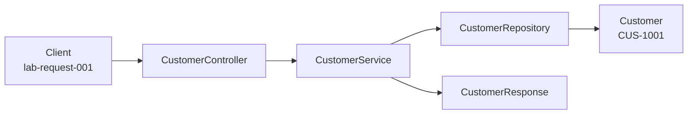

# Lab 8 — Complete reference solution

> **Finished project** — every source file below is the completed answer (not a smoke checklist).
>
> Attempt [`../starter/`](../starter/) first. Guide: [`../LAB-8-GUIDE.md`](../LAB-8-GUIDE.md)

## Goal

**Maven/Java package skeleton (controller → service → repository)**

## Run the finished project

```powershell
New-Item -ItemType Directory -Force -Path "$env:USERPROFILE\java-bootcamp\examples\lab8-crm" | Out-Null
Copy-Item -Recurse -Force ".\*" "$env:USERPROFILE\java-bootcamp\examples\lab8-crm\"
cd $env:USERPROFILE\java-bootcamp\examples\lab8-crm
mvn -B clean compile; java -cp target/classes com.northstar.crm.Main
```

**Expected:** BUILD SUCCESS + Main banner (service stubs intentional until Lab 10)

## File index (12 files)

| # | Path |
|---|------|
| 1 | `src/main/java/com/northstar/crm/config/AppConfig.java` |
| 2 | `src/main/java/com/northstar/crm/controller/CustomerController.java` |
| 3 | `src/main/java/com/northstar/crm/dto/CustomerRequest.java` |
| 4 | `src/main/java/com/northstar/crm/dto/CustomerResponse.java` |
| 5 | `src/main/java/com/northstar/crm/entity/Customer.java` |
| 6 | `src/main/java/com/northstar/crm/exception/CustomerNotFoundException.java` |
| 7 | `src/main/java/com/northstar/crm/Main.java` |
| 8 | `src/main/java/com/northstar/crm/repository/CustomerRepository.java` |
| 9 | `src/main/java/com/northstar/crm/service/CustomerService.java` |
| 10 | `pom.xml` |
| 11 | `docs/CODING-STANDARDS.md` |
| 12 | `docs/layer-flow.md` |

## Full source

### `src/main/java/com/northstar/crm/config/AppConfig.java`

```java
package com.northstar.crm.config;

/** Application wiring placeholders — Spring @Configuration arrives later. */
public class AppConfig {
    // Lab 8: document future bean wiring; no framework code yet.
}
```

### `src/main/java/com/northstar/crm/controller/CustomerController.java`

```java
package com.northstar.crm.controller;

import com.northstar.crm.dto.CustomerRequest;
import com.northstar.crm.dto.CustomerResponse;
import com.northstar.crm.service.CustomerService;

/**
 * Presentation/API boundary. Lab 8: stub only (no HTTP framework yet).
 * Later: Spring MVC / Spring-WS map HTTP/SOAP onto these methods.
 */
public class CustomerController {

    private final CustomerService customerService;

    public CustomerController(CustomerService customerService) {
        this.customerService = customerService;
    }

    public CustomerResponse createCustomer(CustomerRequest request) {
        return customerService.create(request);
    }

    public CustomerResponse getCustomer(String customerId) {
        return customerService.getById(customerId);
    }
}
```

### `src/main/java/com/northstar/crm/dto/CustomerRequest.java`

```java
package com.northstar.crm.dto;

/** Inbound create/update payload — not the entity. */
public class CustomerRequest {
    // Stubs only in Lab 8 — later: fullName, email, etc.
}
```

### `src/main/java/com/northstar/crm/dto/CustomerResponse.java`

```java
package com.northstar.crm.dto;

/** Outbound API/service response shape — not the entity. */
public class CustomerResponse {
    // Stubs only in Lab 8 — later: customerId, status, ...
}
```

### `src/main/java/com/northstar/crm/entity/Customer.java`

```java
package com.northstar.crm.entity;

/**
 * Domain customer — persistence details arrive in later labs.
 * Future fields: customerId (e.g. CUS-1001), fullName (Amina Khan),
 * email, status (ACTIVE/PROSPECT), createdAt.
 * Keep this class free of Spring / JPA / Kafka imports (Lab 8 rule).
 */
public class Customer {
    // Fields filled in Labs 10+: customerId, fullName, email, status, createdAt
}
```

### `src/main/java/com/northstar/crm/exception/CustomerNotFoundException.java`

```java
package com.northstar.crm.exception;

public class CustomerNotFoundException extends RuntimeException {

    public CustomerNotFoundException(String customerId) {
        super("Customer not found: " + customerId);
    }
}
```

### `src/main/java/com/northstar/crm/Main.java`

```java
package com.northstar.crm;

/**
 * Manual entry point for early labs.
 * Example IDs: CUS-1001 Amina Khan ACTIVE; CUS-1002 Ravi Singh PROSPECT.
 * Correlation ID (for logging later): lab-request-001
 */
public class Main {

    public static void main(String[] args) {
        System.out.println("Northstar CRM skeleton — Lab 8");
        System.out.println("Packages: controller, service, repository, entity, dto, config, exception");
        System.out.println("Examples: CUS-1001 Amina Khan ACTIVE | CUS-1002 Ravi Singh PROSPECT");
    }
}
```

### `src/main/java/com/northstar/crm/repository/CustomerRepository.java`

```java
package com.northstar.crm.repository;

import com.northstar.crm.entity.Customer;
import java.util.Optional;

/**
 * Persistence boundary. Lab 8: stub only.
 * Later: in-memory List, then JPA/PostgreSQL.
 * Do NOT import controller or dto — only entity (+ JDK).
 */
public class CustomerRepository {

    public Optional<Customer> findById(String customerId) {
        throw new UnsupportedOperationException("Lab 8 stub — implement later");
    }

    public Customer save(Customer customer) {
        throw new UnsupportedOperationException("Lab 8 stub — implement later");
    }
}
```

### `src/main/java/com/northstar/crm/service/CustomerService.java`

```java
package com.northstar.crm.service;

import com.northstar.crm.dto.CustomerRequest;
import com.northstar.crm.dto.CustomerResponse;
import com.northstar.crm.repository.CustomerRepository;

/**
 * Business rules live here. Controllers must not bypass this layer.
 */
public class CustomerService {

    private final CustomerRepository repository;

    public CustomerService(CustomerRepository repository) {
        this.repository = repository;
    }

    public CustomerResponse create(CustomerRequest request) {
        throw new UnsupportedOperationException("Lab 8 stub — implement later");
    }

    public CustomerResponse getById(String customerId) {
        throw new UnsupportedOperationException("Lab 8 stub — implement later");
    }
}
```

### `pom.xml`

```xml
<?xml version="1.0" encoding="UTF-8"?>
<project xmlns="http://maven.apache.org/POM/4.0.0"
         xmlns:xsi="http://www.w3.org/2001/XMLSchema-instance"
         xsi:schemaLocation="http://maven.apache.org/POM/4.0.0 https://maven.apache.org/xsd/maven-4.0.0.xsd">
  <modelVersion>4.0.0</modelVersion>

  <groupId>com.northstar</groupId>
  <artifactId>customer-service</artifactId>
  <version>0.1.0-SNAPSHOT</version>
  <name>Northstar Customer Service</name>
  <description>Customer Management Platform skeleton — Lab 8</description>

  <properties>
    <project.build.sourceEncoding>UTF-8</project.build.sourceEncoding>
    <maven.compiler.release>21</maven.compiler.release>
  </properties>

  <build>
    <plugins>
      <plugin>
        <groupId>org.apache.maven.plugins</groupId>
        <artifactId>maven-compiler-plugin</artifactId>
        <version>3.13.0</version>
      </plugin>
    </plugins>
  </build>
</project>
```

### `docs/CODING-STANDARDS.md`

```markdown
# Northstar CRM Coding Standards (Lab 8)

## Layers

- controller: transport / API mapping only
- service: business rules
- repository: persistence
- entity: domain model
- dto: request/response contracts
- config: wiring
- exception: domain and API failures

## Dependency direction (hard rule)

```text
controller -> service -> repository -> entity
controller -> dto
service    -> dto, entity, exception
repository -> entity
entity     -> (nothing in other CRM layers)
```

## Naming

- Types: `CustomerService`, `CustomerRepository`, `CustomerController`
- Methods: `findById`, `create`, `getById`
- Stable example IDs: `CUS-####` (e.g. `CUS-1001`, `CUS-1002`)

## What must NOT live where

- Services must not depend on controllers.
- Entities must not carry HTTP or SOAP types.
- Repositories must not import controllers or DTOs.
- No production passwords or API keys in source or properties.
- Prefer JDK 21 + Maven; do not commit `target/` or secrets.
```

### `docs/layer-flow.md`

```markdown
# Layer flow — create CUS-1001 (Amina Khan)

Correlation ID: `lab-request-001`

## Create path (NOW)

1. Client sends create request with correlation ID `lab-request-001`.
2. `CustomerController` accepts `CustomerRequest` — presentation owns transport mapping only (no SQL / files).
3. `CustomerService` applies business rules — unique customer ID; default status `ACTIVE` when omitted.
4. `CustomerRepository` stores `Customer` entity — in-memory list now; PostgreSQL later.
5. Response DTO returns `CUS-1001` / `ACTIVE` — must NOT leak internal storage type or entity methods.



## FUTURE / out of scope for Lab 8

- React CRM SPA
- Kafka consumers
- JPA / PostgreSQL persistence
```

## Instructor notes

# Lab 8 — Instructor solution notes

## What was implemented

- Seven-layer Maven skeleton under `com.northstar.crm` with compile-ready stubs.
- `Main` prints banner, package list, and fixtures `CUS-1001` / `CUS-1002`.
- Repository/service methods intentionally throw `UnsupportedOperationException` (Lab 8 scope).
- Controller delegates to service; `CustomerNotFoundException` message matches guide.
- `docs/layer-flow.md` and `docs/CODING-STANDARDS.md` filled.

## Key files

- `src/main/java/com/northstar/crm/Main.java`
- Layer stubs under `controller`, `service`, `repository`, `entity`, `dto`, `config`, `exception`
- `docs/layer-flow.md`, `docs/CODING-STANDARDS.md`

## How to verify (Windows PowerShell)

```powershell
cd "labs\Week 2 - Backend, AI Tools and Testing\module-08\lab8\solution"
mvn -q clean compile
java -cp target\classes com.northstar.crm.Main
```

Expected: banner + seven packages + `CUS-1001` / `CUS-1002`.

## Pitfalls vs starter TODOs

- Lab 8 success is stubs that throw — do not implement persistence yet.
- Do not add Spring/JPA/Kafka imports.
- Controller must delegate; exception message must be `Customer not found: {id}`.


