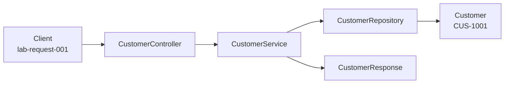

# Layer flow — create CUS-1001 (Amina Khan)

Correlation ID: `lab-request-001`

## Create path (NOW)

1. Client sends create request with correlation ID `lab-request-001`.
2. `CustomerController` accepts `CustomerRequest` — presentation owns transport mapping only (no SQL / files).
3. `CustomerService` applies business rules — unique customer ID; default status `ACTIVE` when omitted.
4. `CustomerRepository` stores `Customer` entity — in-memory list now; PostgreSQL later.
5. Response DTO returns `CUS-1001` / `ACTIVE` — must NOT leak internal storage type or entity methods.

## FUTURE / out of scope for Lab 8

- React CRM SPA
- Kafka consumers
- JPA / PostgreSQL persistence
