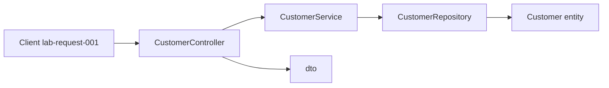

# Layer flow — create Amina Khan (`CUS-1001`)

Correlation ID: `lab-request-001`

## TODO — fill each hop

1. Client sends create request (correlation ID `lab-request-001`)
2. `CustomerController` accepts `CustomerRequest` — TODO: what does presentation own?
3. `CustomerService` applies business rules — TODO: list 1–2 rules (unique ID, status default)
4. `CustomerRepository` stores `Customer` entity — TODO: in-memory now vs PostgreSQL later
5. Response DTO returns `CUS-1001` / `ACTIVE` — TODO: what must NOT leak?

## NOW vs FUTURE

- **NOW (Lab 8):** skeleton + stubs only
- **FUTURE:** React SPA, Kafka, PostgreSQL / Spring Boot — out of scope for Lab 8

## Optional Mermaid

