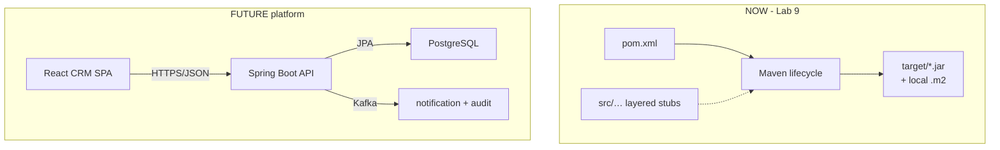
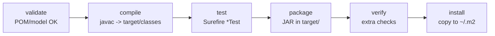
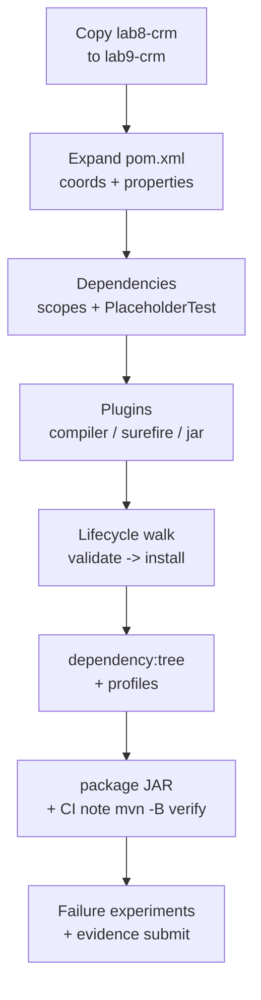

# Lab 9: Maven Build and Dependencies — Northstar CRM Build Lab

**Module:** 9 — Build and Dependency Management with Maven  
**Lab folder:** `labs/Week 2 - Backend, AI Tools and Testing/module-09/lab9/`  
**Difficulty:** Intermediate  
**Duration:** 3–4 Hours

**Primary IDE:** IntelliJ IDEA Community Edition · **Optional IDE:** VS Code

| OS | How-to for this lab |
| -- | ------------------- |
| Windows | [LAB-9-WINDOWS.md](LAB-9-WINDOWS.md) |
| macOS | [LAB-9-MACOS.md](LAB-9-MACOS.md) |

> **Environment reminder:** Finish [Lab 0](../../../Week%201%20-%20Java%20and%20JVM%20Foundations/module-00/lab0/LAB-0-GUIDE.md). Use **IntelliJ IDEA Community** (primary; optional VS Code) on your laptop with **JDK 21** and **Maven 3.9+**. Work under `~/java-bootcamp` (Windows: `%USERPROFILE%\java-bootcamp`).

**Verified participant layout (Windows IntelliJ + PowerShell; Temurin JDK 21.0.11; Maven 3.9.9):**

| Role | Path |
| ---- | ---- |
| IntelliJ opens | `%USERPROFILE%\java-bootcamp` (SDK / language level **21**) |
| Prerequisite | `examples\lab8-crm\` must already compile |
| This lab project | `examples\lab9-crm\` (copy of Lab 8 + expanded `pom.xml`) |
| Compile / test / package | `mvn -q test` · `mvn -q clean package` · `java -jar target\customer-service.jar` |
| CI preview | `mvn -B verify` |
| Smoke-test output | JAR Main banner + Surefire `Tests run: 1` + default profile `dev` |

**If it fails (Windows PowerShell):** Copy with `Copy-Item -Recurse lab8-crm lab9-crm` from `examples\`. Open `lab9-crm\pom.xml` in IntelliJ for Maven import. First dependency download can be slow — wait for Central.

---

## How to follow this lab

1. Open the **Windows** or **macOS** how-to (links above) in a second tab.
2. Create/work only under your `java-bootcamp/examples/…` folder from the steps (not inside this `labs/` git clone unless a step says otherwise).
3. For each **Step N**: read **Why** (if present) → do the actions → confirm **Expected** / **Expected result** → then continue.
4. When stuck, use **Failure Experiments** / troubleshooting in this guide before asking for help.
5. Capture evidence under `notes/screenshots/lab-9/` (workspace root under `java-bootcamp`; redact secrets). Use the **Pass criteria** tables — write **Pass** or **Fail** in your notes. GitHub file view does not support clickable checkboxes.

## Lab Overview

This Module 9 lab turns the Lab 8 CRM skeleton into a **build-managed** Maven project: full `pom.xml` coordinates, Spring and JUnit **placeholders**, dependency scopes, plugins, profiles (`dev` / `test` / `prod`), and a disciplined walk through every major lifecycle phase from `validate` to `install`.

**Purpose.** Lab 8 gave you *where* code lives. Lab 9 teaches Maven to *build* that code into a repeatable artifact. Enterprise teams do not email JARs around; they share `groupId:artifactId:version`, run the same lifecycle locally and in CI, and refuse silent dependency sprawl. This lab makes that contract concrete for Northstar CRM.

**What you build (exercise).** Copy `lab8-crm` → `lab9-crm`, expand `pom.xml` (properties, dependencies with scopes, compiler/Surefire/jar plugins, profiles), add `PlaceholderTest`, capture each lifecycle phase in `docs/lifecycle-evidence.md`, save `docs/dependency-tree.txt`, package `target/customer-service.jar`, run `Main` via `java -jar`, and document `mvn -B verify` for CI. Application behavior stays mostly stubs—the deliverable is a **trustworthy build**, not new CRM features.

**What success looks like.** Under `~/java-bootcamp/examples/lab9-crm/` you can prove phase-by-phase evidence (not one rushed `package`), explain scopes from the dependency tree, activate profiles intentionally, and hand a teammate a README that reproduces `mvn -B verify`.

**Depends on Lab 8.** If packages or Lab 8 compile failed, stop and fix [Lab 8](../../module-08/lab8/LAB-8-GUIDE.md). If `java` / `mvn` fail, fix [Lab 0](../../../Week%201%20-%20Java%20and%20JVM%20Foundations/module-00/lab0/LAB-0-GUIDE.md) / [SETUP-INSTRUCTIONS.md](../../../SETUP-INSTRUCTIONS.md).

**CRM connection (build, not CRUD).** Samples remain `CUS-1001` / `CUS-1002` / `lab-request-001` in docs and `application-dev.properties`. Building the JAR does **not** create Amina Khan in a database. React, Kafka, and PostgreSQL remain **future** boundaries. Spring on the classpath is a **learning placeholder**—do not write `@SpringBootApplication` yet (Lab 22+).

---

## Learning Objectives

After completing this lab, you will be able to:

* Author a complete `pom.xml` with `groupId`, `artifactId`, `version`, properties, and `packaging`
* Declare Spring and JUnit dependencies with correct **scopes** (`compile`, `test`; notes for `runtime` / `provided`)
* Walk the Maven lifecycle: `validate` → `compile` → `test` → `package` → `verify` → `install`
* Configure **compiler**, **Surefire**, and **jar** plugins for JDK 21 and `Main`
* Define `dev`, `test`, and `prod` profiles and activate them intentionally (`-P`, activeByDefault)
* Interpret `mvn dependency:tree` (direct vs transitive; scope columns)
* Produce a JAR under `target/` and explain what `install` places in `~/.m2`
* Describe why CI prefers `mvn -B verify` over casual laptop `mvn install` / deploy
* Record evidence so another engineer can trust the build without watching you type

---

## Business Scenario

Northstar’s CRM (`CUS-1001` Amina Khan, `CUS-1002` Ravi Singh) will eventually pull Spring Boot, JUnit, Kafka clients, and an PostgreSQL driver. Managing JARs by hand is impossible.

Your lead wants every engineer on the same Maven coordinates:

```text
com.northstar:customer-service:0.1.0-SNAPSHOT
```

so Lab 10 can add domain code, labs can share the same `mvn test` habit, and later CI pipelines can run one reliable verify command.

In this lab you teach the **build** to tell the truth: dependencies resolve, tests can run (even a placeholder), the JAR packs, and profiles do not silently mix production settings into laptop runs. Correlation ID `lab-request-001` is recorded in notes for future logging; Maven itself does not need it at build time.

Use these examples consistently:

| Item | Value |
| ---- | ----- |
| Customer examples | `CUS-1001` Amina Khan `ACTIVE`; `CUS-1002` Ravi Singh `PROSPECT` |
| Correlation ID | `lab-request-001` |
| Artifact | `com.northstar:customer-service:0.1.0-SNAPSHOT` |
| Final JAR name | `customer-service.jar` (via `<finalName>`) |

**Security note for evidence.** Do not paste GitHub credentialss, AWS secrets, or repository passwords into `pom.xml` or screenshots. Never put production DB credentials in `dev` profile properties.

---

## Architecture Context

### NOW vs LATER

**NOW:** Maven build defines how source becomes a JAR. Still layered plain-Java stubs from Lab 8. Spring libraries may appear on the classpath as **learning placeholders**; do not write Spring Boot application code yet.

**LATER:** Spring Boot API, JPA/PostgreSQL, React SPA, Kafka.



### Lifecycle (ASCII)



### Lab flow (mermaid)



### Architecture NOW vs LATER (table)

| Aspect | Lab 9 (NOW) | Later CRM labs |
| ------ | ----------- | -------------- |
| Focus | Build truth (POM, lifecycle, JAR) | Runtime features (APIs, DB) |
| Spring | Placeholder dependency only | Spring Boot apps (Lab 22+) |
| Tests | `PlaceholderTest` | Real unit/integration tests |
| Config | `dev` profile defaults | Secrets stores / prod config |
| Artifact | Local `target/` + optional `~/.m2` | CI + artifact repository |

**Lab focus:** coordinates, dependency scopes, lifecycle phases, plugins, profiles, dependency tree, JAR packaging, and CI notes (`mvn -B verify`).

---

## Prerequisites

Complete the [Labs Setup Instructions](../../../SETUP-INSTRUCTIONS.md), [Lab 0](../../../Week%201%20-%20Java%20and%20JVM%20Foundations/module-00/lab0/LAB-0-GUIDE.md), and [Lab 8](../../module-08/lab8/LAB-8-GUIDE.md) before this lab. Confirm:

* Lab 8 skeleton (`lab8-crm/`) with packages `controller/service/repository/entity/dto/config/exception`
* **JDK 21**; **Maven 3.9+**; Git; internet access for Maven Central
* IntelliJ IDEA Community (primary; optional VS Code) with `~/java-bootcamp` open
* No secrets (keys, tokens, passwords) committed to Git

### Pre-flight

```bash
java -version
mvn -version
git --version
git status
pwd
ls ~/java-bootcamp/examples
```

Expected theme:

```text
openjdk version "21....
Apache Maven 3....
.../examples contains lab8-crm (required)
```

Fix environment or Lab 8 gaps before changing the POM. Record tool versions in evidence if asked.

---

## Suggested Project Files

```text
~/java-bootcamp/examples/lab9-crm/
├── src/
│   ├── main/
│   │   ├── java/com/northstar/crm/...   (copied from Lab 8)
│   │   └── resources/
│   │       ├── application.properties
│   │       └── application-dev.properties
│   └── test/
│       └── java/com/northstar/crm/
│           └── PlaceholderTest.java
├── docs/
│   ├── CODING-STANDARDS.md              (from Lab 8)
│   ├── layer-flow.md                    (from Lab 8)
│   ├── lifecycle-evidence.md            (this lab)
│   └── dependency-tree.txt              (captured output)
├── notes/
│   ├── lab9-answers.md
│   └── screenshots/
├── pom.xml                              (expanded this lab)
├── .gitignore
└── README.md
```

Ignore `target/`, IDE metadata, `.env`, tokens, passwords, and never commit `~/.m2` contents.

**Windows local mode (instructor-approved only):** Mirror under local `java-bootcamp/examples/`. Prefer laptop for grading parity.

---

## Concepts to Discuss

Write 2–3 sentences each in `notes/lab9-answers.md` before or during the steps; revisit after Checkpoint C.

1. The main data or request flow in this lab (source → compile → package → optional install)
2. The trust boundary between Maven Central artifacts and your own source
3. The success and failure contract of each lifecycle phase
4. Stable identity of the artifact (`groupId:artifactId:version`) versus customer IDs (`CUS-1001`)
5. Retry and idempotency of `mvn install` (safe to repeat; overwrites snapshot)
6. Local development shortcut (`dev` profile) versus production design (`prod`)
7. Logs or evidence needed when a CI build fails
8. Behavior with two application instances built from the same POM version
9. Why `test` scope keeps JUnit out of the runtime image mindset
10. Why CI prefers `verify` over casually installing snapshots on shared agents

---

## Implementation Steps

Complete each step in order. Commands assume `~/java-bootcamp/examples/lab9-crm` (Windows: `%USERPROFILE%\java-bootcamp\examples\lab9-crm`) on your laptop unless a step says otherwise. Prefer the **IntelliJ IDEA Community (primary; optional VS Code)** terminal.

---

### Step 1 — Copy Lab 8 into `lab9-crm` and confirm compile

**Why:** Lab 9 is a build evolution of Lab 8. Copying preserves package structure and keeps Lab 8 pristine as a checkpoint you can return to.

**Do this:**

```bash
cd ~/java-bootcamp/examples
cp -r lab8-crm lab9-crm
cd lab9-crm
mkdir -p ~/java-bootcamp/notes/screenshots/lab-9
mvn -q clean compile
```

On Windows PowerShell (local mode):

```powershell
cd $env:USERPROFILE\java-bootcamp\examples
Copy-Item -Recurse lab8-crm lab9-crm
cd lab9-crm
New-Item -ItemType Directory -Force -Path ..\..\notes\screenshots\lab-9 | Out-Null
mvn -q clean compile
```

**Expected result:** `BUILD SUCCESS`; `lab9-crm` contains the Lab 8 package tree and `docs/`.

**If it fails:** `lab8-crm` missing → finish Lab 8 first. Compile errors in stubs → fix packages under `src/main/java/com/northstar/crm`. Do not start expanding the POM on a broken tree.

---

### Step 2 — Expand `pom.xml` coordinates, properties, and packaging

**Why:** Coordinates are the artifact’s public name. Properties centralize versions so you do not scatter magic strings across dependency blocks.

**Do this:** Replace the minimal Lab 8 POM header with a full skeleton. Keep `packaging` as `jar`.

```xml
<?xml version="1.0" encoding="UTF-8"?>
<project xmlns="http://maven.apache.org/POM/4.0.0"
         xmlns:xsi="http://www.w3.org/2001/XMLSchema-instance"
         xsi:schemaLocation="http://maven.apache.org/POM/4.0.0 https://maven.apache.org/xsd/maven-4.0.0.xsd">
  <modelVersion>4.0.0</modelVersion>

  <groupId>com.northstar</groupId>
  <artifactId>customer-service</artifactId>
  <version>0.1.0-SNAPSHOT</version>
  <packaging>jar</packaging>

  <name>Northstar Customer Service</name>
  <description>Customer Management Platform — Maven build lab</description>

  <properties>
    <project.build.sourceEncoding>UTF-8</project.build.sourceEncoding>
    <maven.compiler.release>21</maven.compiler.release>
    <junit.version>5.11.4</junit.version>
    <spring.version>6.2.3</spring.version>
  </properties>

  <!-- dependencies and build added in following steps -->
</project>
```

Validate:

```bash
mvn -q validate
```

**Expected result:** Coordinates parse; model is valid (`BUILD SUCCESS`).

**If it fails:** XML well-formedness (unclosed tags). Wrong file → ensure you edited `lab9-crm/pom.xml`, not Lab 8. Tag `<n>` in some templates is wrong—use `<name>` as in the sample (or Maven’s accepted elements for your version).

---

### Step 3 — Add Spring and JUnit placeholder dependencies with scopes

**Why:** Scopes control classpath membership. Mistaking `test` for `compile` can ship test frameworks into runtime images later—or bloat production classpaths.

**Do this:** Add a `<dependencies>` section to `pom.xml`:

```xml
<dependencies>
  <!-- Learning placeholder: Spring Core API (Week 3 / Lab 22+ use Spring Boot properly) -->
  <dependency>
    <groupId>org.springframework</groupId>
    <artifactId>spring-context</artifactId>
    <version>${spring.version}</version>
  </dependency>

  <!-- Optional teaching note: DB drivers are often runtime scope when used -->
  <!-- Example runtime-scoped driver (version from Spring Boot BOM when using Boot):
  <dependency>
    <groupId>org.postgresql</groupId>
    <artifactId>postgresql</artifactId>
    <scope>runtime</scope>
  </dependency>
  -->

  <dependency>
    <groupId>org.junit.jupiter</groupId>
    <artifactId>junit-jupiter</artifactId>
    <version>${junit.version}</version>
    <scope>test</scope>
  </dependency>
</dependencies>
```

Create `src/test/java/com/northstar/crm/PlaceholderTest.java`:

```java
package com.northstar.crm;

import org.junit.jupiter.api.Test;
import static org.junit.jupiter.api.Assertions.assertTrue;

class PlaceholderTest {
    @Test
    void projectCoordinatesAreMeaningful() {
        assertTrue(true, "Replace with real CRM tests in Labs 11/17");
    }
}
```

Quick resolve/check:

```bash
mvn -q dependency:resolve
mvn -q -DskipTests compile
```

**Scope cheat sheet:**

| Scope | Compile classpath | Test classpath | Runtime packaging mindset |
| ----- | ----------------- | -------------- | ------------------------- |
| `compile` (default) | yes | yes | ships with app |
| `test` | no | yes | must not ship as app dep |
| `runtime` | no | yes | needed to run, not compile |
| `provided` | yes | yes | container provides at runtime |

**Expected result:** Dependencies resolve from Maven Central; JUnit is `test` scope; still **no** `@SpringBootApplication` in main sources.

**If it fails:** Network/proxy → SETUP mirror notes. Version typo → restore `${spring.version}` / `${junit.version}`. Test class not found later → package path must be under `src/test/java`.

---

### Step 4 — Configure compiler, Surefire, and jar plugins

**Why:** Plugins bind toolchain behavior to lifecycle phases. Without Surefire, “tests” are wishful. Without jar manifest `Main-Class`, `java -jar` fails.

**Do this:** Add `<build>` to `pom.xml`:

```xml
<build>
  <finalName>customer-service</finalName>
  <plugins>
    <plugin>
      <groupId>org.apache.maven.plugins</groupId>
      <artifactId>maven-compiler-plugin</artifactId>
      <version>3.13.0</version>
      <configuration>
        <release>21</release>
      </configuration>
    </plugin>
    <plugin>
      <groupId>org.apache.maven.plugins</groupId>
      <artifactId>maven-surefire-plugin</artifactId>
      <version>3.5.2</version>
    </plugin>
    <plugin>
      <groupId>org.apache.maven.plugins</groupId>
      <artifactId>maven-jar-plugin</artifactId>
      <version>3.4.2</version>
      <configuration>
        <archive>
          <manifest>
            <mainClass>com.northstar.crm.Main</mainClass>
          </manifest>
        </archive>
      </configuration>
    </plugin>
  </plugins>
</build>
```

```bash
mvn -q -DskipTests compile
mvn -q test
```

**Expected result:** Compile uses release 21; `PlaceholderTest` runs (`Tests run: 1, Failures: 0`).

**If it fails:** Surefire naming — class must end with `Test` or match includes. Manifest wrong class → confirm `com.northstar.crm.Main` exists from Lab 8.

---

### Step 5 — Walk the lifecycle phase by phase

**Why:** Jumping straight to `package` hides which phase failed. Mentors grade phase-by-phase evidence.

**Do this:** Create `docs/lifecycle-evidence.md`. Run each phase **separately** and paste a short excerpt after each:

```bash
mvn validate
mvn compile
mvn test
mvn package
mvn verify
mvn install
```

For each command, record:

* Exit code / `BUILD SUCCESS` or failure
* Key INFO lines
* What appeared under `target/` (and under `~/.m2/repository/com/northstar/customer-service/` after `install`)

**Expected result (abbreviated):**

```text
$ mvn validate
... BUILD SUCCESS

$ mvn compile
... Compiling N source files ... BUILD SUCCESS

$ mvn test
... PlaceholderTest ... Tests run: 1, Failures: 0 ... BUILD SUCCESS

$ mvn package
... Building jar: .../target/customer-service.jar

$ mvn verify
... BUILD SUCCESS

$ mvn install
... Installing ... to ~/.m2/repository/com/northstar/customer-service/0.1.0-SNAPSHOT/...
```

**If it fails:** Do not delete `lifecycle-evidence.md` on failure—capture the error, then fix and re-run that phase. First-time dependency downloads can make `compile` slow; note that honestly.

---

### Step 6 — Inspect the dependency tree

**Why:** Transitive dependency surprises cause classpath hell. Reading the tree is a core enterprise skill.

**Do this:**

```bash
mvn dependency:tree | tee docs/dependency-tree.txt
# optional filter:
mvn dependency:tree -Dincludes=org.springframework* | tee -a docs/dependency-tree.txt
```

Annotate the top of `docs/dependency-tree.txt` with comments:

1. Which dependencies are **direct** vs **transitive**
2. Why `junit-jupiter` must remain `test` (must not look like a production runtime dependency)

**Expected theme:**

```text
com.northstar:customer-service:jar:0.1.0-SNAPSHOT
+- org.springframework:spring-context:jar:6.2.3:compile
|  +- org.springframework:spring-aop:jar:...:compile
|  \- ... (transitive)
\- org.junit.jupiter:junit-jupiter:jar:5.11.4:test
```

**If it fails:** Plugin not found → ensure network; `dependency:tree` is from `maven-dependency-plugin` (usually auto-resolved). Empty tree → dependencies missing from POM (return to Step 3).

---

### Step 7 — Add `dev`, `test`, and `prod` profiles

**Why:** Profiles isolate environment defaults. A `dev` profile active by default is fine for training—dangerous if it loads real production secrets (which you must never put in the POM).

**Do this:** Add `<profiles>` to `pom.xml`:

```xml
<profiles>
  <profile>
    <id>dev</id>
    <activation>
      <activeByDefault>true</activeByDefault>
    </activation>
    <properties>
      <app.environment>dev</app.environment>
    </properties>
  </profile>
  <profile>
    <id>test</id>
    <properties>
      <app.environment>test</app.environment>
    </properties>
  </profile>
  <profile>
    <id>prod</id>
    <properties>
      <app.environment>prod</app.environment>
    </properties>
  </profile>
</profiles>
```

Create `src/main/resources/application-dev.properties`:

```properties
# Local laptop defaults — never put production passwords here
app.environment=dev
app.sample.customer=CUS-1001
# correlation id example for notes: lab-request-001
```

Demonstrate activation:

```bash
mvn -q help:active-profiles
mvn -q -Ptest help:active-profiles
mvn -q -Pprod help:active-profiles
```

**Expected result:** Default active profile includes `dev`; `-Pprod` activates `prod`. No secrets appear in profile properties.

**If it fails:** Wrong POM → check you are in `lab9-crm`. `help` plugin downloads on first use. Profile IDs are case-sensitive (`prod` ≠ `Prod`).

---

### Step 8 — Package the JAR, run it, and document CI usage

**Why:** Packaging proves the build produces a shareable binary. Documenting `mvn -B verify` prepares later CI labs without deploying snapshots casually.

**Do this:**

```bash
mvn -q clean package
jar tf target/customer-service.jar | head
java -jar target/customer-service.jar
mvn -B verify
```

Update project `LAB-9-GUIDE.md` with a CI section:

```markdown
## CI note (preview — pipelines deepen in later modules)

Preferred verify command on agents:

    mvn -B verify

`-B` is batch mode (non-interactive). Prefer `verify` over `install` on CI
unless your pipeline intentionally publishes to an artifact repository.
Never deploy snapshots from a developer laptop without agreement.

Artifact coordinates: com.northstar:customer-service:0.1.0-SNAPSHOT
Sample customer IDs (docs only): CUS-1001, CUS-1002
Correlation ID (logs later): lab-request-001
```

**Expected result:** `target/customer-service.jar` exists; `java -jar` prints the Lab 8 `Main` banner (skeleton packages / example IDs); README documents `mvn -B verify`; batch verify succeeds.

**If it fails:** `no main manifest attribute` → jar plugin `mainClass` misconfigured (Step 4). JAR missing → package phase failed; check tests. `-B verify` fails on test → fix `PlaceholderTest`.

---

### Step 9 — Capture evidence and complete notes

**Why:** Rubric marks lifecycle evidence and tree annotations, not only a green last command.

**Do this:**

1. Confirm `docs/lifecycle-evidence.md` has all six phases
2. Confirm `docs/dependency-tree.txt` has direct vs transitive notes
3. Screenshot/paste `java -jar` output and `mvn -B verify` into `notes/screenshots/lab-9/` or answers
4. Draft reflection answers in `notes/lab9-answers.md`
5. Run the failure experiments (next section) and restore

**Expected result:** Another student can rebuild from your README without asking you which commands you ran.

**If it fails:** Missing Lab 8 docs after copy → re-copy only missing files from `lab8-crm/docs` without wiping Lab 9 POM work.

---

## Implementation Checkpoints

### Checkpoint A — Project copy + coordinates

_Mark each row **Pass** or **Fail** in your lab notes (GitHub markdown files are not interactive checklists)._

| # | Confirm | Your notes |
| - | ------- | ---------- |
| 1 | `~/java-bootcamp/examples/lab9-crm` exists (copied from Lab 8) | Pass / Fail |
| 2 | `pom.xml` has `com.northstar:customer-service:0.1.0-SNAPSHOT` and `packaging` jar | Pass / Fail |
| 3 | Properties set `maven.compiler.release` / JDK 21 mindset | Pass / Fail |
| 4 | Edited on VS Code laptop | Pass / Fail |

### Checkpoint B — Dependencies, plugins, tests

_Mark each row **Pass** or **Fail** in your lab notes (GitHub markdown files are not interactive checklists)._

| # | Confirm | Your notes |
| - | ------- | ---------- |
| 1 | Spring placeholder + JUnit `test` scope declared | Pass / Fail |
| 2 | `PlaceholderTest` passes under Surefire | Pass / Fail |
| 3 | Compiler + jar `Main-Class` configured | Pass / Fail |
| 4 | `mvn test` and `mvn package` succeed | Pass / Fail |

### Checkpoint C — Lifecycle + tree + profiles

_Mark each row **Pass** or **Fail** in your lab notes (GitHub markdown files are not interactive checklists)._

| # | Confirm | Your notes |
| - | ------- | ---------- |
| 1 | `docs/lifecycle-evidence.md` covers validate → install | Pass / Fail |
| 2 | `docs/dependency-tree.txt` annotated (direct/transitive, JUnit scope) | Pass / Fail |
| 3 | Profiles `dev` / `test` / `prod` demonstrated with `help:active-profiles` | Pass / Fail |
| 4 | `application-dev.properties` has no secrets | Pass / Fail |

### Checkpoint D — JAR, CI, failures, security

_Mark each row **Pass** or **Fail** in your lab notes (GitHub markdown files are not interactive checklists)._

| # | Confirm | Your notes |
| - | ------- | ---------- |
| 1 | `java -jar target/customer-service.jar` works | Pass / Fail |
| 2 | README documents `mvn -B verify` | Pass / Fail |
| 3 | At least three failure experiments recorded and restored | Pass / Fail |
| 4 | No secrets / `target/` / `.m2` dump committed | Pass / Fail |

---

## Reference Commands, Configuration, and Code

### Lifecycle sequence

```bash
cd ~/java-bootcamp/examples/lab9-crm
mvn validate
mvn compile
mvn test
mvn package
mvn verify
mvn install
mvn -B verify
```

### Dependency tree

```bash
mvn dependency:tree
mvn dependency:tree -Dincludes=org.springframework*
```

### Profiles

```bash
mvn help:active-profiles
mvn -Pprod -DskipTests package
```

### Package and run

```bash
mvn -q clean package
jar tf target/customer-service.jar | head
java -jar target/customer-service.jar
```

### Coordinates

```xml
<groupId>com.northstar</groupId>
<artifactId>customer-service</artifactId>
<version>0.1.0-SNAPSHOT</version>
```

### Phase → output map

| Phase | Primary proof |
| ----- | ------------- |
| `validate` | POM accepted |
| `compile` | `target/classes/**/*.class` |
| `test` | Surefire reports / test count |
| `package` | `target/customer-service.jar` |
| `verify` | Checks after package succeed |
| `install` | `~/.m2/repository/com/northstar/customer-service/...` |

---

## Manual Verification

1. `pwd` ends with `lab9-crm`.
2. `mvn validate` … `mvn install` each succeed individually (evidence file filled).
3. `mvn test` runs `PlaceholderTest` with 0 failures.
4. `mvn dependency:tree` shows `spring-context` (compile) and `junit-jupiter` (test).
5. `mvn help:active-profiles` shows `dev` by default; `-Pprod` activates `prod`.
6. `java -jar target/customer-service.jar` prints skeleton banner / example customer IDs.
7. `mvn -B verify` succeeds non-interactively.
8. Search POM/properties for passwords → none.
9. `git status` does not stage `target/` or secrets.
10. Concepts/reflection drafts mention artifact GAV vs `CUS-1001` distinction.

Record pass/fail in `notes/lab9-answers.md`.

---

## Failure Experiments

Perform deliberately, then restore working state.

| # | Experiment | Observe | Restore |
| - | ---------- | ------- | ------- |
| 1 | Set `spring.version` to nonsense; `mvn compile` | Artifact resolution failure | Restore real version |
| 2 | Change `PlaceholderTest` to `assertTrue(false)`; `mvn test` / `mvn verify` | Tests fail; verify fails | Restore assertion |
| 3 | Run `mvn install` twice | Second install succeeds; snapshot overwritten in `~/.m2` | Note idempotency in answers |
| 4 | Compare cold vs warm `mvn -B verify` wall-clock | First run slower (downloads) | Document in notes |
| 5 | Remove `<scope>test</scope>` from JUnit temporarily; re-tree | JUnit appears as compile—bad practice | Restore `test` scope |

---

## Troubleshooting

| Symptom | Likely cause | Fix |
| ------- | ------------ | --- |
| `mvn: command not found` | Maven missing | SETUP / Lab 0 |
| Cannot resolve dependencies | Network / proxy / bad version | Check mirror; restore versions; retry |
| Edited Lab 8 by mistake | Wrong directory | `cd ~/java-bootcamp/examples/lab9-crm` |
| Tests not discovered | Wrong name/path | `*Test.java` under `src/test/java` |
| `no main manifest attribute` | jar plugin missing Main-Class | Fix Step 4 plugin config |
| Profile not active | Typo / wrong `-P` | `mvn help:active-profiles` |
| `BUILD SUCCESS` once only | No phase evidence | Fill `lifecycle-evidence.md` |
| Spring Boot confusion | Over-eager coding | Remove `@SpringBootApplication`; placeholders only |
| Disk full after install | Local repo growth | Optional purge of this artifact under `~/.m2` |
| Surefire / compiler version warnings | Plugin older than needed | Align plugin versions with this guide |

### Cannot connect (Maven Central)

* Check proxy / corporate mirror in `~/.m2/settings.xml` before raising timeouts blindly.
* Host apps later use `localhost`; Maven uses remote repos **now**.

### Duplicate / version conflict

* Snapshot `install` is meant to overwrite locally.
* Conflicting transitive versions → inspect tree; introduce `<dependencyManagement>` in a bonus if needed.

---

## Security and Production Review

Answer briefly in project `LAB-9-GUIDE.md` or `notes/lab9-answers.md`:

1. Which inputs are untrusted? *(Downloaded Maven artifacts; later API inputs)*
2. Where are authn/authz/validation enforced later? *(App layers + CI/repo managers)*
3. Which values are sensitive, and where stored? *(Never in POM; use secrets stores)*
4. What can be retried safely? *(`mvn verify`, snapshot install)*
5. What happens after a partial failure? *(Failed test stops verify; no bad promotion in CI)*
6. What would an operator monitor? *(CI duration, failed verify jobs)*
7. Which local default is unacceptable in production? *(`dev` profile active by default with real secrets—never do that)*
8. How are contracts versioned? *(Artifact version + later OpenAPI/WSDL)*

Do not commit production customer PII, passwords, or cloud keys with this build lab.

---

## Cleanup

Capture evidence first.

```bash
cd ~/java-bootcamp/examples/lab9-crm
mvn clean
# optional if disk is tight:
# rm -rf ~/.m2/repository/com/northstar/customer-service
git status
```

Keep sources, `docs/lifecycle-evidence.md`, `docs/dependency-tree.txt`, and notes. Remove temporary credentials from the environment where practical.

**Keep `lab9-crm`**—Lab 10+ typically continues from this Maven-enabled tree.

---

## Expected Deliverables

Students should submit:

* Completed Lab 9 `pom.xml` with dependencies, plugins, profiles
* `PlaceholderTest` and layered sources from Lab 8
* `docs/lifecycle-evidence.md` covering each lifecycle command
* `docs/dependency-tree.txt` (annotated)
* `target/customer-service.jar` evidence (listing + `java -jar` run)—screenshot/log, not necessarily the binary in Git
* Controlled-failure evidence (bad version / failing test)
* Architecture note: build-time NOW vs React/Kafka/PostgreSQL LATER
* README with run/cleanup and `mvn -B verify` CI note
* Short design-decisions section (scopes, profiles, CI)
* Reflection/concepts in `notes/lab9-answers.md`
* No secrets or committed `target/` / `.m2` contents

---

## Evaluation Rubric (100 Marks)

| Criteria | Marks |
| -------- | ----: |
| Environment and project structure | 10 |
| Core implementation (`pom.xml`, lifecycle, profiles) | 30 |
| Integration/configuration correctness (plugins, JAR) | 15 |
| Failure handling (resolution / test failures) | 15 |
| Automated verification (`mvn test` / `verify`) | 10 |
| Security and production awareness | 10 |
| Documentation and evidence | 10 |

**Notes:** Copy from Lab 8 intact; GAV correct; scopes demonstrated; phase-by-phase evidence exists; tree annotated; profiles shown; `java -jar` works; `mvn -B verify` documented and successful; failures restored. Bonuses are stretch—not required for the core 100.

---

## Reflection Questions

Write short answers (3–6 sentences) in `notes/lab9-answers.md`:

1. Which design decision most affected build correctness?
2. Which failure was hardest to diagnose?
3. What evidence proves the lifecycle walk was real (not only `package` once)?
4. What breaks first at ten times the dependency count?
5. Which concern should move to shared infrastructure (artifact repository, CI cache)?
6. What must change before real customer data is used?
7. How does this lab connect to Lab 8 structure and Lab 10+ code?
8. What metric, log field, or CI signal matters most when verify fails?
9. Why is `test` scope on JUnit more than a style preference?
10. (Forward look) When Spring Boot arrives, what stays stable in this POM vs what changes first?

---

## Bonus Challenges

Attempt after core rubric items are solid.

1. Add a `dependencyManagement` BOM-style section for version alignment.
2. Sketch a second Maven module (`crm-api` / `crm-domain`) in docs—implement only if time allows.
3. Fail the build if someone adds a `compile`-scoped JUnit dependency (Enforcer rule sketch).
4. Record build duration metrics for cold vs warm `~/.m2`.
5. Document rollback when a bad snapshot was installed locally.
6. Add `mvn versions:display-dependency-updates` output (read-only) to notes—do not blindly upgrade mid-lab.

---

## Success Criteria

You are finished when:

* You can demonstrate coordinates, scopes, lifecycle phases, tree, profiles, and JAR packaging
* Happy path and at least one failure path are repeatable
* Another student can follow your README run instructions
* `mvn -B verify` passes
* No production secret is hard-coded
* You can explain local profile defaults versus production and CI trade-offs
* You can explain why building `customer-service.jar` is not the same as creating `CUS-1001` in a CRM database

---

## Instructor Notes

* **Pedagogy:** Require `docs/lifecycle-evidence.md`—students who only run `mvn package` once have not completed Lab 9. Watch for Spring Boot application code sneaking in; placeholders teach **Maven**, not Spring architecture (Lab 22+).
* **Continuity:** Keep GAV `com.northstar:customer-service:0.1.0-SNAPSHOT` and CRM sample IDs in docs/`application-dev.properties`. Lab 10 should fork from `lab9-crm`, not rebuild packages from scratch.
* **Equivalence:** Nearby plugin/dependency patch versions are OK if documented. PostgreSQL/Kafka deps should stay commented or out of the default runtime story.
* **Common pitfalls:** Editing Lab 8 POM instead of Lab 9; missing `test` scope; no `Main-Class`; committing `target/`; putting passwords in profiles; skipping dependency-tree annotations.
* **CI talking point:** Ask why agents prefer `mvn -B verify` over casual `mvn install` on shared machines. Discuss snapshot overwrite semantics honestly.
* **Assessment tip:** Have the student explain one transitive Spring dependency from their tree without reading blogs mid-answer.
* **Timing:** Core path fits 3–4 hours; first-time Central downloads dominate cold builds—budget that on shared laptop.

---

*End of Lab 9 — Maven Build and Dependencies: Northstar CRM Build Lab. Keep `lab9-crm` for Lab 10+ and portfolio evidence.*
