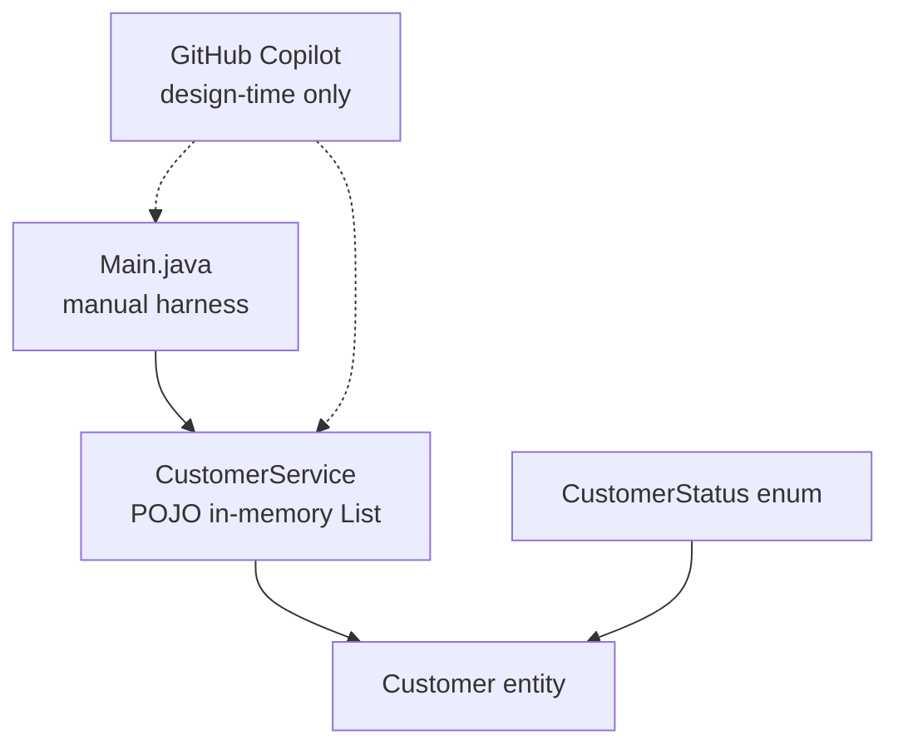
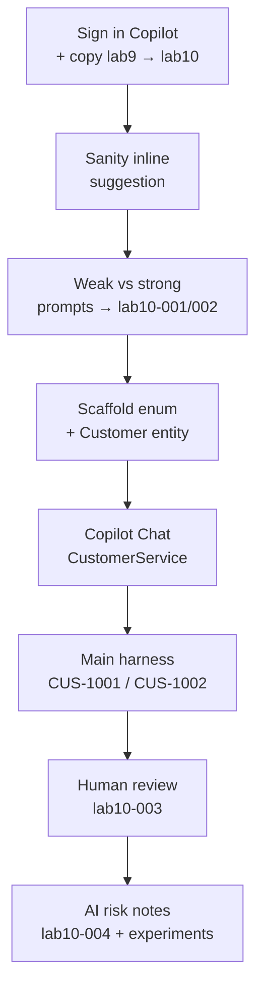

# Lab 10: GitHub Copilot Fundamentals for Java Developers — Northstar CRM

**Module:** 10 — GitHub Copilot Fundamentals for Java Developers  
**Lab folder:** `labs/Week 2 - Backend, AI Tools and Testing/module-10/lab10/`  
**Difficulty:** Beginner–Intermediate  
**Duration:** 3–4 Hours

**Primary IDE:** IntelliJ IDEA Community Edition · **Optional IDE:** VS Code

| OS | How-to for this lab |
| -- | ------------------- |
| Windows | [LAB-10-WINDOWS.md](LAB-10-WINDOWS.md) |
| macOS | [LAB-10-MACOS.md](LAB-10-MACOS.md) |

> **Environment reminder:** Finish [Lab 0](../../../Week%201%20-%20Java%20and%20JVM%20Foundations/module-00/lab0/LAB-0-GUIDE.md). Use **IntelliJ IDEA Community** (primary; optional VS Code) on your laptop with **JDK 21**, **Maven 3.9+**, and **GitHub Copilot** signed in. Work under `~/java-bootcamp` (Windows: `%USERPROFILE%\java-bootcamp`).

---

## How to follow this lab

1. Open the **Windows** or **macOS** how-to (links above) in a second tab.
2. Create/work only under your `java-bootcamp/examples/…` folder from the steps (not inside this `labs/` git clone unless a step says otherwise).
3. For each **Step N**: read **Why** (if present) → do the actions → confirm **Expected** / **Expected result** → then continue.
4. When stuck, use **Failure Experiments** / troubleshooting in this guide before asking for help.
5. Capture evidence under `notes/screenshots/` (redact secrets). Use the **Pass criteria** tables — write **Pass** or **Fail** in your notes. GitHub file view does not support clickable checkboxes.

## Lab Overview

This Module 10 lab continues the **Northstar Customer Service Platform** into `lab10-crm/`, picking up the Maven project (`com.northstar:customer-service`) from Lab 9. There is still **no Spring Framework** in application code — Week 2 (Labs 8–21) stays plain Java and Maven. What is new is the tool you write that plain Java with: **GitHub Copilot**.

**Purpose.** Copilot can accelerate boilerplate, but unreviewed AI code is a production risk. Enterprise teams treat suggestions like work from a junior teammate: useful, never trusted blindly. This lab trains **deliberate prompting** and a **mandatory human-review log** before anything merges.

**What you build (exercise).** Install/sign in to Copilot in VS Code; practice weak vs strong prompts; scaffold `CustomerStatus` and `Customer` with inline completions; draft `CustomerService` with Copilot Chat; prove behavior with `Main` using `CUS-1001` / `CUS-1002`; complete review-log entries `lab10-001`–`lab10-004`. Still no JPA, no Spring annotations, no REST.

**What success looks like.** Under `~/java-bootcamp/examples/lab10-crm/` you compile with `mvn -q compile`, run `Main` showing both sample customers and a status change, and hand graders an `ai-review-notes.md` that proves you rejected at least one bad suggestion (commonly phantom JPA annotations).

**Depends on Lab 9.** If Lab 9 packages or `mvn verify` failed, stop and fix [Lab 9](../../module-09/lab9/LAB-9-GUIDE.md). If VS Code / JDK / Maven fail, fix [Lab 0](../../../Week%201%20-%20Java%20and%20JVM%20Foundations/module-00/lab0/LAB-0-GUIDE.md) / [SETUP](../../../SETUP-INSTRUCTIONS.md).

**CRM connection (domain flesh-out).** Labs 8–9 built structure and build truth. Lab 10 implements the first real in-memory customer domain operations. Lab 11 will add Copilot-assisted tests; Labs 12+ deepen standards and APIs. React, Kafka, PostgreSQL, and Spring Boot remain **future**.

---

## Learning Objectives

After completing this lab, you will be able to:

* Install, sign in to, and verify GitHub Copilot in VS Code against a Java project
* Distinguish weak prompts from strong prompts and explain why specificity changes output
* Use inline completions and Copilot Chat to scaffold a JavaBean-style entity class
* Use Copilot Chat to draft a first-pass service layer with business validation
* Apply a mandatory human-review checklist before accepting any AI-generated code
* Recognize and correct a common Copilot mistake: suggesting frameworks not on the classpath (JPA/Spring)
* Explain licensing, intellectual-property, and data-leakage risks of AI assistants and how to mitigate them
* Compile and run the CRM harness with Maven on your laptop after AI-assisted edits

---

## Business Scenario

Northstar’s engineering lead wants the customer-service backend built faster without sacrificing correctness. The team approved GitHub Copilot for all developers, but only under a documented review policy:

**No AI-generated code merges without a human explaining, in writing, what it does and why it is correct.**

You flesh out the `Customer` domain object and the first `CustomerService` operations (add, look up, list by status, change status) on top of the Lab 9 Maven skeleton. You use Copilot to go faster, and you prove—with a written review log—that you understood and verified every line.

Use these examples consistently:

| ID | Name | Status | Email |
| -- | ---- | ------ | ----- |
| `CUS-1001` | Amina Khan | `ACTIVE` | `amina.khan@example.com` |
| `CUS-1002` | Ravi Singh | `PROSPECT` | `ravi.singh@example.com` |

* Review-log entry IDs: `lab10-001`, `lab10-002`, `lab10-003`, `lab10-004`
* Do **not** invent real SSNs, passwords, or production emails in prompts

**Security note for evidence.** Screenshots may show Copilot UI, but never paste GitHub credentialss, org tokens, or real customer PII into Chat.

---

## Architecture Context

### NOW (this lab)



### Lab flow (mermaid)



### Architecture NOW vs LATER

| Aspect | Lab 10 (NOW) | Later CRM labs |
| ------ | ------------ | -------------- |
| Authoring | Copilot + human review | Same discipline + more frameworks |
| Domain | In-memory `CustomerService` | Repository → JPA/PostgreSQL |
| Annotations | None from JPA/Spring | Arrive when dependencies do |
| Tests | Manual `Main` | Lab 11 Copilot-assisted tests |
| Transport | None | SOAP/REST later |

**Lab focus:** Copilot setup, prompting strategy for Java, scaffolding, and mandatory human-review discipline—not Spring or HTTP.

---

## Prerequisites

Complete [SETUP-INSTRUCTIONS](../../../SETUP-INSTRUCTIONS.md), [Lab 0](../../../Week%201%20-%20Java%20and%20JVM%20Foundations/module-00/lab0/LAB-0-GUIDE.md), and [Lab 9](../../module-09/lab9/LAB-9-GUIDE.md). Confirm:

* Maven project from **Lab 9** (`lab9-crm/`) — `com.northstar:customer-service`, package `com.northstar.crm` with layered packages
* JDK 21 + Maven working
* GitHub account with an active **GitHub Copilot** license
* **VS Code** with **GitHub Copilot** and **GitHub Copilot Chat** installed and signed in (see [Setup § Week 2](../../../SETUP-INSTRUCTIONS.md)) — Connected via VS Code as in Lab 0
* No secrets committed to Git

> If your instructor prefers IntelliJ IDEA with the Copilot plugin, steps map one-to-one. Use whichever IDE is connected to `~/java-bootcamp`; do not switch tools mid-lab.

### Pre-flight

```bash
java -version
mvn -version
git --version
pwd
ls ~/java-bootcamp/examples
```

In VS Code:

1. Command Palette (`Ctrl+Shift+P`) → `GitHub Copilot: Check Status` → **signed in** / **active**
2. Open any `.java` file under Lab 9/10 and confirm the Copilot status-bar icon is not crossed out

Fix environment/Copilot failures before changing application code. Record tool versions and Copilot status in evidence if asked.

---

## Suggested Project Files

```text
~/java-bootcamp/examples/lab10-crm/
├── src/
│   ├── main/
│   │   └── java/
│   │       └── com/northstar/crm/
│   │           ├── Main.java
│   │           ├── entity/
│   │           │   ├── Customer.java
│   │           │   └── CustomerStatus.java
│   │           ├── service/
│   │           │   └── CustomerService.java
│   │           ├── controller/ ...   (stubs from Lab 8/9 — leave for now)
│   │           ├── repository/ ...
│   │           ├── dto/ ...
│   │           ├── config/ ...
│   │           └── exception/ ...
│   └── test/
│       └── java/com/northstar/crm/   (Lab 11 adds tests; keep PlaceholderTest if present)
├── copilot-notes/
│   └── ai-review-notes.md
├── docs/                             (from Labs 8–9)
├── notes/
│   └── screenshots/
├── pom.xml
├── .gitignore
└── README.md
```

Ignore `target/`, IDE metadata, and local env files.

---

## Concepts to Discuss

Write 2–3 sentences each in `copilot-notes/ai-review-notes.md` (or `notes/lab10-answers.md`) before or during the steps:

1. Difference between a Copilot **inline completion** and a **Copilot Chat** request—when is each better?
2. Why prompt specificity (fields, types, rules) changes enterprise Java output quality vs a vague comment?
3. What is the “trust boundary” between an AI suggestion and code allowed to touch real customer data?
4. Which business rule protects integrity in `Customer` (fixed `CustomerStatus` enum vs free-text `String`)?
5. What happens if Copilot suggests a class/annotation/library not on this project’s classpath?
6. Why must every accepted suggestion be reviewed line-by-line, not only “does it compile”?
7. What is the risk of pasting real customer data or credentials into Copilot Chat?
8. How does license/provenance risk apply to a multi-line AI block, and what if it looks copied from a known OSS project?
9. Why is Copilot **not** a runtime dependency of `customer-service`?
10. How will Lab 11 reuse today’s review discipline when generating tests?

---

## Implementation Steps

Complete each step in order. Commands assume `~/java-bootcamp/examples/lab10-crm` (Windows: `%USERPROFILE%\java-bootcamp\examples\lab10-crm`) unless noted. Prefer the **IntelliJ IDEA Community (primary; optional VS Code)** terminal for Maven; use Copilot in the IDE editor/Chat panels.

---

### Step 1 — Install and sign in to GitHub Copilot; copy Lab 9 → Lab 10

**Why:** Copilot must be authenticated and the workspace must be a clean copy of the Lab 9 tree so Maven coordinates and packages stay consistent.

**Do this:**

1. Extensions (`Ctrl+Shift+X`) → install **GitHub Copilot** and **GitHub Copilot Chat**.
2. Sign in (`GitHub Copilot: Sign In` / browser authorize).
3. Copy the project:

```bash
cd ~/java-bootcamp/examples
cp -r lab9-crm lab10-crm
cd lab10-crm
mkdir -p copilot-notes notes/screenshots
code .   # or: open folder in already-connected VS Code window
```

Windows PowerShell (local mode only):

```powershell
Copy-Item -Recurse lab9-crm lab10-crm
cd lab10-crm
```

**Expected result:**

```text
Command Palette > GitHub Copilot: Check Status
GitHub.copilot: Ready
GitHub.copilot-chat: Ready
Status bar Copilot icon shows no slash/error badge.
```

**If it fails:** No Copilot license → request/enable in GitHub settings. Sign-in loops → Sign Out then Sign In; check Output → GitHub Copilot. Missing `lab9-crm` → finish Lab 9 first. Wrong path → use `examples/` as in Labs 8–9.

---

### Step 2 — Sanity-check Copilot against this Java project

**Why:** Before scaffolding domain types, prove the extension can see `.java` files in this workspace (language mode + VS Code).

**Do this:** Open `src/main/java/com/northstar/crm/Main.java` and type a comment-only prompt; wait for ghost text (**do not** accept yet if you only want to observe):

```java
// TODO: print "Northstar customer service booting" to standard out
```

**Expected result:** Gray ghost text proposes something equivalent to `System.out.println("Northstar customer service booting");`. `Tab` accepts; `Esc` dismisses.

**If it fails:** Confirm language mode is Java (status bar). `GitHub Copilot: Check Status`. Reload Window. Ensure file ends in `.java` and is under the opened folder.

---

### Step 3 — Practice weak vs strong prompting

**Why:** Prompting quality is the actual skill this lab teaches. Vague prompts invent structure; strong prompts encode enterprise rules.

**Do this:** Try both prompts as comments above an empty class body in a scratch file (or temporary section), and record results.

| # | Weak prompt | Strong prompt | Why it matters |
| - | ------------ | -------------- | --------------- |
| 1 | `// customer class` | `// Java entity class Customer in package com.northstar.crm.entity representing a Northstar CRM customer. Fields: customerId (String, format "CUS-1001"), fullName (String), email (String), phone (String), status (CustomerStatus enum: PROSPECT, ACTIVE, SUSPENDED, CLOSED), createdAt (LocalDateTime). No-args constructor, all-args constructor, getters and setters, equals/hashCode based only on customerId, toString.` | Naming every field/type/format stops invented structure. |
| 2 | `// add a customer` | `// Method addCustomer(Customer customer) on CustomerService: reject if customerId is null/blank, reject if a customer with the same customerId already exists (throw IllegalStateException), otherwise store it in the in-memory list and return it.` | Rules up front → guard clauses, not only happy path. |

Create `copilot-notes/ai-review-notes.md` with entries `lab10-001` and `lab10-002`:

```markdown
## lab10-001 — weak vs strong (entity)
- Date:
- Weak prompt used:
- Output summary:
- Strong prompt used:
- Output summary:
- Decision: accept / reject / partial
- Reason (1 sentence):

## lab10-002 — weak vs strong (addCustomer)
- ...
```

**Expected result:** Notes contain two dated entries comparing vague vs correctly scoped output with explicit accept/reject decisions.

**If it fails:** If Chat is clearer than inline for this comparison, use Chat—but still log prompts and decisions. Do not skip the write-up.

---

### Step 4 — Scaffold `CustomerStatus` and `Customer` with Copilot

**Why:** Domain types are the foundation for service methods and later APIs. You must catch Copilot’s JPA-annotation habit before it breaks the plain-Java classpath.

**Do this:** Use the **strong prompt** from Step 3 (row 1) as a comment at the top of `Customer.java`, and:

```java
// Java enum CustomerStatus in package com.northstar.crm.entity with exactly
// four constants representing a Northstar CRM customer lifecycle:
// PROSPECT, ACTIVE, SUSPENDED, CLOSED.
```

Let Copilot draft both files, then compare against this reference shape **before** accepting:

```java
package com.northstar.crm.entity;

public enum CustomerStatus {
    PROSPECT,
    ACTIVE,
    SUSPENDED,
    CLOSED
}
```

```java
package com.northstar.crm.entity;

import java.time.LocalDateTime;
import java.util.Objects;

public class Customer {

    private String customerId;
    private String fullName;
    private String email;
    private String phone;
    private CustomerStatus status;
    private LocalDateTime createdAt;

    public Customer() {
    }

    public Customer(String customerId, String fullName, String email, String phone,
                     CustomerStatus status, LocalDateTime createdAt) {
        this.customerId = customerId;
        this.fullName = fullName;
        this.email = email;
        this.phone = phone;
        this.status = status;
        this.createdAt = createdAt;
    }

    // getters and setters for all fields

    @Override
    public boolean equals(Object o) {
        if (this == o) return true;
        if (!(o instanceof Customer)) return false;
        Customer other = (Customer) o;
        return Objects.equals(customerId, other.customerId);
    }

    @Override
    public int hashCode() {
        return Objects.hash(customerId);
    }

    @Override
    public String toString() {
        return "Customer{customerId='" + customerId + "', fullName='" + fullName
                + "', status=" + status + "}";
    }
}
```

**Watch for this common Copilot mistake:** “entity” often triggers `@Entity`, `@Id`, `@Column` from `jakarta.persistence` / `javax.persistence`. **This project has no JPA in `pom.xml` and no Spring until Lab 22.** Reject those annotations—this is the review discipline Step 7 formalizes.

```bash
mvn -q compile
```

**Expected result:** `BUILD SUCCESS`; `Customer.java` / `CustomerStatus.java` compile with **zero** framework imports.

**If it fails:** Delete JPA/Spring imports and annotations manually. Package must be `com.northstar.crm.entity` under matching folders. Re-prompt with “plain Java POJO, no JPA, no Spring.”

---

### Step 5 — Draft `CustomerService` with Copilot Chat

**Why:** Chat is better for multi-method classes with explicit business rules. Keep the request scoped—do not ask for “the entire CRM.”

**Do this:** Open Copilot Chat (`Ctrl+Alt+I`) and ask:

```text
In com.northstar.crm.service, write a plain Java class CustomerService
(no Spring annotations — this project has no Spring dependency yet).
It should hold customers in an in-memory List<Customer>. Methods:
addCustomer(Customer) — reject blank customerId, reject duplicate customerId
  with IllegalStateException, otherwise store and return the customer;
findByCustomerId(String) — return Optional<Customer>;
findByStatus(CustomerStatus) — return List<Customer>;
updateStatus(String customerId, CustomerStatus newStatus) — throw
  IllegalArgumentException if the customer does not exist, otherwise
  update and return it;
listAll() — return an unmodifiable copy of all customers.
```

Reference shape to compare against:

```java
package com.northstar.crm.service;

import com.northstar.crm.entity.Customer;
import com.northstar.crm.entity.CustomerStatus;

import java.util.ArrayList;
import java.util.List;
import java.util.Optional;

public class CustomerService {

    private final List<Customer> customers = new ArrayList<>();

    public Customer addCustomer(Customer customer) {
        if (customer.getCustomerId() == null || customer.getCustomerId().isBlank()) {
            throw new IllegalArgumentException("customerId must not be blank");
        }
        if (findByCustomerId(customer.getCustomerId()).isPresent()) {
            throw new IllegalStateException("Customer already exists: " + customer.getCustomerId());
        }
        customers.add(customer);
        return customer;
    }

    public Optional<Customer> findByCustomerId(String customerId) {
        return customers.stream()
                .filter(c -> c.getCustomerId().equals(customerId))
                .findFirst();
    }

    public List<Customer> findByStatus(CustomerStatus status) {
        return customers.stream()
                .filter(c -> c.getStatus() == status)
                .toList();
    }

    public Customer updateStatus(String customerId, CustomerStatus newStatus) {
        Customer customer = findByCustomerId(customerId)
                .orElseThrow(() -> new IllegalArgumentException("No such customer: " + customerId));
        customer.setStatus(newStatus);
        return customer;
    }

    public List<Customer> listAll() {
        return List.copyOf(customers);
    }
}
```

```bash
mvn -q compile
```

**Expected result:** `BUILD SUCCESS`; service depends only on entity classes (and JDK), no Spring stereotypes.

**If it fails:** Reject `@Service` / `@Component` / repository injections. Ensure `Optional` and streams match Java 21. Fix missing imports from Chat paste carefully.

---

### Step 6 — Prove it manually with `Main`

**Why:** Compiles ≠ correct behavior. A harness with the canonical sample IDs is evidence graders can re-run without Copilot.

**Do this:** Update `Main.java`:

```java
package com.northstar.crm;

import com.northstar.crm.entity.Customer;
import com.northstar.crm.entity.CustomerStatus;
import com.northstar.crm.service.CustomerService;

import java.time.LocalDateTime;

public class Main {
    public static void main(String[] args) {
        CustomerService service = new CustomerService();

        service.addCustomer(new Customer("CUS-1001", "Amina Khan", "amina.khan@example.com",
                "555-0101", CustomerStatus.ACTIVE, LocalDateTime.now()));
        service.addCustomer(new Customer("CUS-1002", "Ravi Singh", "ravi.singh@example.com",
                "555-0102", CustomerStatus.PROSPECT, LocalDateTime.now()));

        System.out.println("All customers: " + service.listAll());
        System.out.println("PROSPECT customers: " + service.findByStatus(CustomerStatus.PROSPECT));

        service.updateStatus("CUS-1002", CustomerStatus.ACTIVE);
        System.out.println("After activation: " + service.findByCustomerId("CUS-1002"));
    }
}
```

Run (pick one):

```bash
mvn -q compile
java -cp target/classes com.northstar.crm.Main

# or, if exec plugin is available from Lab 9 exploration:
mvn -q compile exec:java -Dexec.mainClass=com.northstar.crm.Main
```

**Expected result (theme):**

```text
All customers: [Customer{customerId='CUS-1001', ...}, Customer{customerId='CUS-1002', ...}]
PROSPECT customers: [Customer{customerId='CUS-1002', fullName='Ravi Singh', status=PROSPECT}]
After activation: Optional[Customer{customerId='CUS-1002', ..., status=ACTIVE}]
```

**If it fails:** Confirm constructors match field order. If jar-based run was used, prefer `-cp target/classes` for this lab. Duplicate add throws if re-run logic incorrectly—create a fresh `CustomerService` each run (as above).

---

### Step 7 — Mandatory human-review pass

**Why:** Policy: no AI code without written human verification. This entry is graded as heavily as the Java sources.

**Do this:** Walk every accepted suggestion from Steps 4–5 through this checklist; log as `lab10-003`:

_Mark each row **Pass** or **Fail** in your lab notes (GitHub markdown files are not interactive checklists)._

| # | Confirm | Your notes |
| - | ------- | ---------- |
| 1 | Every import resolves against `pom.xml` deps actually present (no phantom JPA/Spring imports) | Pass / Fail |
| 2 | Business rules from the prompt appear in code (blank ID rejected, duplicate ID rejected, unknown ID rejected)—not only in comments | Pass / Fail |
| 3 | `equals` / `hashCode` based on `customerId` only | Pass / Fail |
| 4 | You could explain every line to a reviewer with Copilot turned off | Pass / Fail |
| 5 | No hardcoded secrets, real customer PII, or inappropriate test data committed | Pass / Fail |

If you deliberately let the JPA-annotation mistake through, document catching and removing it here as a worked example.

**Expected result:** `lab10-003` lists each checklist item pass/fail; fails note the exact fix.

**If it fails:** Incomplete checklist → go back and re-read the generated files line by line. Superficial “looks fine” entries will lose rubric marks.

---

### Step 8 — Document AI risk awareness

**Why:** Copilot’s risk surface is not only correctness—it includes leakage, provenance, and accountability.

**Do this:** Add entry `lab10-004` answering in your own words:

1. What real customer data did you avoid typing into Chat, and what did you use instead (`CUS-1001` / `CUS-1002`)?
2. If Copilot suggests a block that looks copied verbatim from a known library/article, what do you do before accepting?
3. What is your team’s rule for code Copilot generates that you do not fully understand?

**Expected result:** `lab10-004` answers all three in prose, referencing this lab’s prompts and decisions.

**If it fails:** Generic answers without lab references → rewrite with specific examples from your session.

---

### Step 9 — Failure experiments + evidence pack

**Why:** Graders want proof you can recover when Copilot is wrong or unavailable.

**Do this:** Complete the experiments in [Failure Experiments](#failure-experiments). Capture compile/`Main` output and review-log screenshots under `notes/screenshots/` (no secrets). Re-run:

```bash
mvn -q clean compile
java -cp target/classes com.northstar.crm.Main
git status
```

**Expected result:** Three+ experiments documented; build green; review log complete; tree clean of `target/` and secrets.

**If it fails:** See Troubleshooting. Restore from Lab 9 copy if the tree is corrupted, then re-apply only reviewed domain files.

---

## Implementation Checkpoints

### Checkpoint A — Environment + Copilot ready

_Mark each row **Pass** or **Fail** in your lab notes (GitHub markdown files are not interactive checklists)._

| # | Confirm | Your notes |
| - | ------- | ---------- |
| 1 | `lab10-crm` copied from Lab 9 under `~/java-bootcamp/examples/` | Pass / Fail |
| 2 | Copilot + Chat signed in (`Check Status` Ready) | Pass / Fail |
| 3 | Sanity ghost-text suggestion observed in a `.java` file | Pass / Fail |

### Checkpoint B — Domain + service compile

_Mark each row **Pass** or **Fail** in your lab notes (GitHub markdown files are not interactive checklists)._

| # | Confirm | Your notes |
| - | ------- | ---------- |
| 1 | `CustomerStatus`, `Customer`, `CustomerService` present under correct packages | Pass / Fail |
| 2 | No JPA/Spring annotations/imports in those files | Pass / Fail |
| 3 | `mvn -q compile` succeeds | Pass / Fail |

### Checkpoint C — Behavior + sample IDs

_Mark each row **Pass** or **Fail** in your lab notes (GitHub markdown files are not interactive checklists)._

| # | Confirm | Your notes |
| - | ------- | ---------- |
| 1 | `Main` creates `CUS-1001` (ACTIVE) and `CUS-1002` (PROSPECT) | Pass / Fail |
| 2 | Status filter and `updateStatus` demonstrated | Pass / Fail |
| 3 | Blank/duplicate/unknown ID rules exist in service code | Pass / Fail |

### Checkpoint D — Review log + risks + experiments

_Mark each row **Pass** or **Fail** in your lab notes (GitHub markdown files are not interactive checklists)._

| # | Confirm | Your notes |
| - | ------- | ---------- |
| 1 | Entries `lab10-001`–`lab10-004` complete | Pass / Fail |
| 2 | At least one caught/corrected Copilot mistake documented | Pass / Fail |
| 3 | Failure experiments recorded; no secrets in prompts or Git | Pass / Fail |

---

## Reference Commands, Configuration, and Code

### Maven / run

```bash
cd ~/java-bootcamp/examples/lab10-crm
mvn -q clean compile
java -cp target/classes com.northstar.crm.Main
git status
```

### POM note

No **new** dependencies are required for this lab—keep Lab 9 POM. Do not add JPA or Spring Boot starters to “make Copilot happy.”

```xml
<groupId>com.northstar</groupId>
<artifactId>customer-service</artifactId>
```

### Copilot keyboard reference (VS Code)

| Action | Shortcut |
| ------ | -------- |
| Open Copilot Chat | `Ctrl+Alt+I` |
| Accept inline suggestion | `Tab` |
| Dismiss inline suggestion | `Esc` |
| Next/previous suggestion | `Alt+]` / `Alt+[` |
| Open suggestions panel | `Ctrl+Enter` |

### Class map

| Class | Responsibility |
| ----- | -------------- |
| `CustomerStatus` | Lifecycle enum |
| `Customer` | Domain bean; identity = `customerId` |
| `CustomerService` | In-memory rules + queries |
| `Main` | Manual proof for sample customers |
| `ai-review-notes.md` | Audit trail of prompts and human decisions |

---

## Manual Verification

1. Copilot status Ready; workspace is `lab10-crm`.
2. `Customer` / `CustomerStatus` compile with zero JPA/Spring imports.
3. `CustomerService` rejects blank ID, duplicate ID, unknown ID on update.
4. `Main` prints both sample customers; PROSPECT list includes `CUS-1002`; after activation status is ACTIVE.
5. `ai-review-notes.md` has `lab10-001`–`lab10-004`.
6. At least one deliberately caught Copilot mistake documented.
7. No real PII/secrets in prompts or committed files.
8. `git status` shows no staged `target/` or IDE junk.
9. `mvn -q clean compile` succeeds.
10. You can explain accepted AI lines without reopening Chat.

Record pass/fail in the review log.

---

## Failure Experiments

Perform deliberately; document in `ai-review-notes.md`.

| # | Experiment | Observe | Restore / conclude |
| - | ---------- | ------- | ------------------ |
| 1 | Ask Chat to “add a `save` method to `Customer`” with no context | Invented DB/`@Entity`/wrong signature | Reject; record wrong suggestion |
| 2 | Disable Copilot (or briefly disconnect) and add `deleteCustomer(String)` by hand | You can still finish without AI | Note time vs AI-assisted steps |
| 3 | Draft (do **not** send) a Chat prompt with a fake SSN/password as “example” | Why unsafe even if fake | Rewrite using only `CUS-1001`/`CUS-1002` |
| 4 | Ask Chat to “build the entire CRM service layer” in one shot | Oversized, hard-to-review dump | Prefer scoped prompts from Steps 4–5 |

---

## Troubleshooting

| Symptom | Likely cause | Fix |
| ------- | ------------ | --- |
| Copilot will not sign in | License / auth stuck | Confirm license; Sign Out/In; check Output channel |
| No suggestions | Wrong language mode / disabled | Set Java mode; Check Status; Reload Window |
| Suggestions assume Spring/JPA | Prompt underspecified | Restate “Java 21, no Spring, no JPA” every time |
| VS Code drops mid-edit | Network | Reconnect; Check Status; save often |
| Compile fails on jakarta.persistence | Accepted phantom imports | Remove annotations/imports; do not add JPA to POM |
| `Main` ClassNotFound | Wrong `-cp` / not compiled | `mvn compile` then `java -cp target/classes ...` |
| Review log empty | Skipped writing | Entries are required deliverables |
| Edited Lab 9 by mistake | Wrong folder | Work only in `lab10-crm` |

### Suggestions target wrong Java version

Re-state constraints in every prompt, or use bonus `.github/copilot-instructions.md`. Reject and correct rather than infinite re-prompt loops on the same wrong pattern.

---

## Security and Production Review

Answer in project README or review-log closing section:

1. Which parts of a Copilot prompt are untrusted from the model’s perspective, and which are trusted (your business rules)?
2. Where is human review formally enforced before AI code reaches the shared repo?
3. Which values must never appear in Chat, even as examples?
4. What can be safely regenerated if rejected, and what must a human write from scratch?
5. What if an AI-suggested dependency only fails in CI `mvn compile`, not locally?
6. What would a tech lead audit to confirm AI-assisted code met the same bar as hand-written code?
7. Which licensing/IP concern applies to large verbatim-looking suggestions, and how do you mitigate it?
8. How do you keep an audit trail of what a human verified vs what the AI produced?

---

## Cleanup

```bash
cd ~/java-bootcamp/examples/lab10-crm
mvn -q clean
git status
```

No containers or cloud services were started. Remove scratch prompt files that contained example-only sensitive data before committing. Keep `copilot-notes/` and domain sources.

**Keep `lab10-crm`**—Lab 11 builds tests on this service.

---

## Expected Deliverables

* `Customer` entity (`com.northstar.crm.entity.Customer`)
* `CustomerStatus` enum (`com.northstar.crm.entity.CustomerStatus`)
* `CustomerService` (`com.northstar.crm.service.CustomerService`)
* `Main.java` harness demonstrating `CUS-1001` and `CUS-1002`
* `copilot-notes/ai-review-notes.md` with entries `lab10-001`–`lab10-004`
* Failure-experiment notes and compile/`Main` evidence
* No secrets or generated `target/` committed

---

## Evaluation Rubric (100 Marks)

| Criteria | Marks |
| -------- | ----: |
| Environment and project structure | 10 |
| Core implementation (`Customer`, `CustomerStatus`, `CustomerService`, `Main`) | 30 |
| Prompting technique and AI review discipline (weak/strong, review log) | 20 |
| Failure handling (experiments documented) | 10 |
| Manual verification | 10 |
| Security and production awareness | 10 |
| Documentation and evidence | 10 |

**Notes:** Copilot Ready; plain-Java domain; sample IDs work; review log authentic (including at least one rejection/correction); no phantom framework deps. Blind-accept first suggestions without log → lose prompting/review marks even if code “works.”

---

## Reflection Questions

Write short answers (3–6 sentences) in the review log or `notes/lab10-answers.md`:

1. Which prompt changed most between first attempt and final accepted version?
2. What was the most dangerous Copilot suggestion you saw, and how did you catch it?
3. What evidence would convince a skeptical tech lead you did not blindly accept AI output?
4. How would review change if this code touched real (non-fictional) customer PII?
5. Which task was faster with Copilot, and which was slower once review time counted?
6. How does this lab connect to the Northstar CRM platform across Weeks 2–6?
7. What would you put in `.github/copilot-instructions.md` to prevent the JPA-annotation mistake?
8. What is the difference between “Copilot wrote this” and “I am responsible for this” professionally?
9. (Forward look) How should Lab 11 treat AI-generated tests differently from AI-generated production code?

---

## Bonus Challenges

1. Add `.github/copilot-instructions.md` stating constraints (Java 21, no Spring, no JPA until Lab 22) and re-run Step 4’s prompt.
2. Use Copilot Chat `/explain` on generated `equals`/`hashCode` and summarize in your own words.
3. Ask Copilot for Javadoc on `CustomerService` and review accuracy against behavior.
4. Compare VS Code vs IntelliJ Copilot outputs for Step 5 in the review log (if IntelliJ is available).
5. Ask Chat `/tests` on `CustomerService` and save (do not yet trust/run as final)—evaluate formally in Lab 11.

---

## Success Criteria

You are finished when:

* GitHub Copilot is signed in and producing suggestions inside `lab10-crm/`
* `Customer`, `CustomerStatus`, and `CustomerService` compile and behave correctly for `CUS-1001` and `CUS-1002`
* Review log shows weak-vs-strong comparison and at least one caught/corrected AI mistake
* Three failure experiments are documented
* No production secret or real customer data was placed in a prompt
* You can explain, unaided, every accepted Copilot line

---

## Instructor Notes

* **Pedagogy:** Score prompting discipline as much as working code. A student who pastes the first suggestion unreviewed should score lower than one who rejected a flawed suggestion and explained why—even if finals look similar.
* **JPA trap:** Specifically check Step 4 for phantom persistence annotations or a clear explanation of how the prompt avoided them.
* **Unaided check:** Ask the student to reproduce “Copilot unavailable” live and complete a small task without AI.
* **Continuity:** Keep packages `com.northstar.crm.*` and sample IDs for Lab 11. Do not allow Spring Boot starters “to silence Copilot.”
* **Paths:** Prefer `~/java-bootcamp/examples/lab10-crm` for parity with Labs 8–9.
* **Common pitfalls:** Committing Chat transcripts with secrets; accepting `@Service`; skipping the review log; treating `Main` as optional.
* **Timing:** 3–4 hours including review writing. License/auth issues dominate early failures on shared machines—budget sign-in help.

---

*End of Lab 10 — GitHub Copilot Fundamentals for Java Developers. Keep `lab10-crm` and `copilot-notes/` for Lab 11 and portfolio evidence.*
