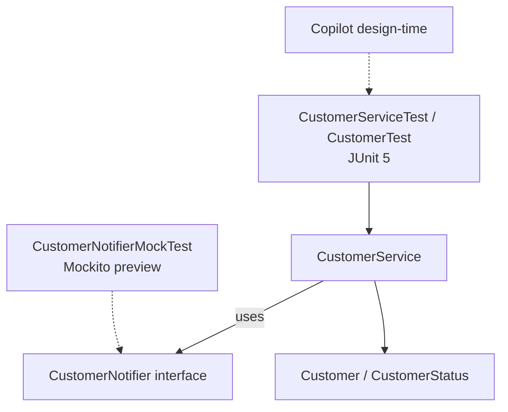
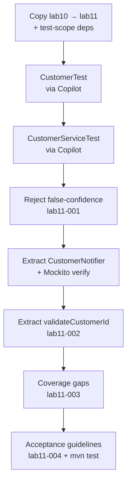

# Lab 11: GitHub Copilot for Testing and Refactoring — Northstar CRM

**Module:** 11 — GitHub Copilot for Testing and Refactoring  
**Lab folder:** `labs/Week 2 - Backend, AI Tools and Testing/module-11/lab11/`  
**Difficulty:** Beginner–Intermediate  
**Duration:** 3–4 Hours

**Primary IDE:** IntelliJ IDEA Community Edition · **Optional IDE:** VS Code

| OS | How-to for this lab |
| -- | ------------------- |
| Windows | [LAB-11-WINDOWS.md](LAB-11-WINDOWS.md) |
| macOS | [LAB-11-MACOS.md](LAB-11-MACOS.md) |

> **Environment reminder:** Finish [Lab 0](../../../Week%201%20-%20Java%20and%20JVM%20Foundations/module-00/lab0/LAB-0-GUIDE.md). Use **IntelliJ IDEA Community** (primary; optional VS Code) on your laptop with **JDK 21**, **Maven 3.9+**, and **GitHub Copilot** signed in. Work under `~/java-bootcamp` (Windows: `%USERPROFILE%\java-bootcamp`).

---

## How to follow this lab

1. Open the **Windows** or **macOS** how-to (links above) in a second tab.
2. Create/work only under your `java-bootcamp/examples/…` folder from the steps (not inside this `labs/` git clone unless a step says otherwise).
3. For each **Step N**: read **Why** (if present) → do the actions → confirm **Expected** / **Expected result** → then continue.
4. When stuck, use **Failure Experiments** / troubleshooting in this guide before asking for help.
5. Capture evidence under `notes/screenshots/lab-11/` (workspace root under `java-bootcamp`; redact secrets). Use the **Pass criteria** tables — write **Pass** or **Fail** in your notes. GitHub file view does not support clickable checkboxes.

## Lab Overview

This Module 11 lab continues the **Northstar Customer Service Platform** from `lab10-crm/` into `lab11-crm/`. You still write **plain Java with Maven — no Spring Framework** anywhere in Week 2. What’s new is using GitHub Copilot for two jobs: **generating a first exploratory test class** for Lab 10’s domain/service code, and **generating refactoring suggestions** that clean that code up.

**Purpose.** AI can emit tests and refactors quickly—and also emit **false-confidence assertions**, invented APIs, and refactors that silently skip collaborators. Lab 11 extends Lab 10’s review discipline to **test quality** and **safe change**.

**What you build (exercise).** Copy Lab 10 → Lab 11; add test-scope JUnit 5 + Mockito; generate `CustomerTest` and `CustomerServiceTest` with Copilot; reject a weak assertion; extract `CustomerNotifier` and verify it with a Mockito mock; extract duplicated validation; review coverage gaps; write acceptance guidelines; run `mvn test`.

**What success looks like.** Under `~/java-bootcamp/examples/lab11-crm/` you get ~7 green tests, a real collaborator interface (not a JPA guess), notes `lab11-001`–`lab11-004`, and evidence of at least one rejected trivial test.

**Depends on Lab 10.** If `CustomerService` / review notes from Lab 10 are missing, stop and finish [Lab 10](../../module-10/lab10/LAB-10-GUIDE.md). Formal JUnit/Mockito depth arrives in **Labs 17–18**—this lab is a guided **preview**.

**CRM connection.** Sample IDs stay `CUS-1001` / `CUS-1002`. Tests and notifier hooks prepare later DTO/API labs without introducing Spring Boot yet.

---

## Learning Objectives

After completing this lab, you will be able to:

* Use Copilot Chat to generate a first JUnit 5 test class for a plain Java entity and service (preview of Labs 17–18)
* Distinguish a meaningful assertion from a “false confidence” assertion Copilot sometimes generates
* Extract a collaborator interface and write one Mockito-based test against it
* Use Copilot to detect and fix a code smell (duplicated validation / long method) in `CustomerService`
* Review AI-generated tests and refactors against a coverage-and-correctness checklist before accepting them
* Apply written acceptance guidelines consistent with Lab 10’s review discipline
* Run a deterministic `mvn test` suite on the CRM project

---

## Business Scenario

The Lab 10 review log caught one dangerous Copilot habit (phantom JPA annotations), but the team still lacks an automated safety net around `CustomerService`, and duplicated validation is creeping in. Before Week 2 piles on DTOs (Lab 14) and more behavior, your lead wants:

1. A first, lightweight test class—not full coverage, just proof the core rules hold—as a preview of formal testing labs.
2. A cleaned-up `CustomerService` with duplicated validation extracted, plus a useful collaborator interface unit-tested with a mock.

Use these examples consistently:

| ID | Name | Status | Email |
| -- | ---- | ------ | ----- |
| `CUS-1001` | Amina Khan | `ACTIVE` | `amina.khan@example.com` |
| `CUS-1002` | Ravi Singh | `PROSPECT` | `ravi.singh@example.com` |

* Review-log entry IDs: `lab11-001`, `lab11-002`, `lab11-003`, `lab11-004`
* Do not invent real SSNs, passwords, or production emails in tests or Chat

**Security note for evidence.** Screenshots of green Surefire output are fine; never paste secrets into prompts or commit real PII.

---

## Architecture Context

### NOW (this lab)



### Lab flow (mermaid)



### Architecture NOW vs LATER

| Aspect | Lab 11 (NOW) | Later (Labs 17–18 / 22+) |
| ------ | ------------ | ------------------------ |
| Tests | Exploratory JUnit 5 + one mock | Full methodology, deeper Mockito |
| Refactors | Extract method + interface | Ongoing with broader suites |
| Framework | No Spring | Spring Boot / DI later |
| Coverage | Gaps documented intentionally | Expanded as features grow |

**Lab focus:** Copilot-assisted JUnit preview, first Mockito mock, smell detection, coverage-gap review, acceptance guidelines—not Spring or HTTP.

---

## Prerequisites

Complete [SETUP](../../../SETUP-INSTRUCTIONS.md), [Lab 0](../../../Week%201%20-%20Java%20and%20JVM%20Foundations/module-00/lab0/LAB-0-GUIDE.md), and [Lab 10](../../module-10/lab10/LAB-10-GUIDE.md). Confirm:

* `Customer`, `CustomerStatus`, and `CustomerService` from **Lab 10** (`lab10-crm/`), including `copilot-notes/ai-review-notes.md`
* JDK 21 + Maven; Copilot signed in (VS Code or IntelliJ), same as Lab 10
* No secrets committed to Git

> This lab adds/confirm `junit-jupiter` and Mockito as **test-scope** Maven dependencies. Treat coverage as a guided preview—Labs 17–18 go deep. Do not chase 100% coverage here.

### Pre-flight

```bash
java -version
mvn -version
git --version
pwd
ls ~/java-bootcamp/examples
```

In VS Code: `GitHub Copilot: Check Status` → Ready. Confirm `lab10-crm` still builds:

```bash
cd ~/java-bootcamp/examples/lab10-crm && mvn -q -DskipTests compile
```

Fix environment failures before changing application code.

---

## Suggested Project Files

```text
~/java-bootcamp/examples/lab11-crm/
├── src/
│   ├── main/
│   │   └── java/com/northstar/crm/
│   │       ├── Main.java
│   │       ├── entity/
│   │       │   ├── Customer.java
│   │       │   └── CustomerStatus.java
│   │       └── service/
│   │           ├── CustomerService.java        (refactored)
│   │           └── CustomerNotifier.java       (new)
│   └── test/
│       └── java/com/northstar/crm/
│           ├── entity/
│           │   └── CustomerTest.java
│           └── service/
│               ├── CustomerServiceTest.java
│               └── CustomerNotifierMockTest.java
├── copilot-notes/
│   ├── ai-review-notes.md              (from Lab 10 — keep)
│   └── ai-test-refactor-notes.md       (this lab)
├── notes/screenshots/
├── pom.xml
├── .gitignore
└── README.md
```

Ignore `target/`, IDE metadata, and env files with secrets.

---

## Concepts to Discuss

Write 2–3 sentences each in `copilot-notes/ai-test-refactor-notes.md` (or `notes/lab11-answers.md`):

1. Difference between an exploratory Copilot-generated test and a deliberately designed suite?
2. What makes an assertion “false confidence”?
3. Why extract `CustomerNotifier` before mocking, instead of mocking concrete `CustomerService`?
4. What is a code smell, and which Lab 10 smell is the clearest refactor candidate?
5. Why is high coverage % not the same as meaningful coverage?
6. What regression risk exists when refactoring without a full suite—and how do today’s tests help?
7. When should you trust a Copilot extract-method vs verify manually?
8. What acceptance criteria should a reviewer apply before merging an AI-generated test or refactor?
9. Why keep JUnit/Mockito at `test` scope?
10. How does this preview set up Labs 17–18 without replacing them?

---

## Implementation Steps

Complete each step in order. Commands assume `~/java-bootcamp/examples/lab11-crm` (Windows: `%USERPROFILE%\java-bootcamp\examples\lab11-crm`) unless noted. Prefer IntelliJ for Maven (optional VS Code); use Copilot in the IDE.

---

### Step 1 — Branch the project and add test-scope dependencies

**Why:** Isolate Lab 11 work from Lab 10. Test-scope dependencies belong on the test classpath only—same Maven lesson as Lab 9 scopes.

**Do this:**

```bash
cd ~/java-bootcamp/examples
cp -r lab10-crm lab11-crm
cd lab11-crm
mkdir -p copilot-notes ~/java-bootcamp/notes/screenshots/lab-11
```

Ensure `pom.xml` includes (merge with existing Lab 9 deps; do not remove Spring placeholders if present—keep them test-agnostic):

```xml
<dependencies>
    <!-- existing compile deps from Lab 9, if any -->

    <dependency>
        <groupId>org.junit.jupiter</groupId>
        <artifactId>junit-jupiter</artifactId>
        <version>5.10.2</version>
        <scope>test</scope>
    </dependency>
    <dependency>
        <groupId>org.mockito</groupId>
        <artifactId>mockito-core</artifactId>
        <version>5.11.0</version>
        <scope>test</scope>
    </dependency>
    <dependency>
        <groupId>org.mockito</groupId>
        <artifactId>mockito-junit-jupiter</artifactId>
        <version>5.11.0</version>
        <scope>test</scope>
    </dependency>
</dependencies>

<build>
  <plugins>
    <plugin>
      <groupId>org.apache.maven.plugins</groupId>
      <artifactId>maven-surefire-plugin</artifactId>
      <version>3.2.5</version>
    </plugin>
    <!-- keep compiler/jar plugins from Lab 9 -->
  </plugins>
</build>
```

```bash
mvn -q dependency:resolve
mvn -q dependency:tree -Dincludes=org.junit.jupiter,org.mockito
```

**Expected result:** `BUILD SUCCESS`; JUnit/Mockito resolve at **test** scope only.

**If it fails:** Network/proxy for Central → SETUP. Duplicate JUnit versions from Lab 9 → keep one consistent `junit-jupiter` entry with `test` scope. Wrong folder → confirm `lab11-crm`.

---

### Step 2 — Generate a first JUnit test for `Customer`

**Why:** Entity identity (`equals` on `customerId`) is a common bug source. Prove it with assertions that can fail.

**Do this:** Prompt Copilot Chat with specific behavior (not “write tests”):

```text
Write a JUnit 5 test class CustomerTest in com.northstar.crm.entity.
Test 1: two Customer instances with the same customerId but different
other fields must be equal() (identity is based on customerId only).
Test 2: toString() output must contain the customerId.
Use assertEquals/assertTrue from org.junit.jupiter.api.Assertions.
```

Create `src/test/java/com/northstar/crm/entity/CustomerTest.java` matching this shape (edit Copilot output as needed):

```java
package com.northstar.crm.entity;

import org.junit.jupiter.api.Test;

import java.time.LocalDateTime;

import static org.junit.jupiter.api.Assertions.assertEquals;
import static org.junit.jupiter.api.Assertions.assertTrue;

class CustomerTest {

    @Test
    void equalsIsBasedOnCustomerIdOnly() {
        Customer a = new Customer("CUS-1001", "Amina Khan", "amina.khan@example.com",
                "555-0101", CustomerStatus.ACTIVE, LocalDateTime.now());
        Customer b = new Customer("CUS-1001", "Different Name", "other@example.com",
                "555-0199", CustomerStatus.CLOSED, LocalDateTime.now());

        assertEquals(a, b, "Customers with the same customerId must be considered equal");
    }

    @Test
    void toStringIncludesCustomerId() {
        Customer ravi = new Customer("CUS-1002", "Ravi Singh", "ravi.singh@example.com",
                "555-0102", CustomerStatus.PROSPECT, LocalDateTime.now());

        assertTrue(ravi.toString().contains("CUS-1002"));
    }
}
```

```bash
mvn -q test -Dtest=CustomerTest
```

**Expected result:** `Tests run: 2, Failures: 0, Errors: 0, Skipped: 0`

**If it fails:** Reject JUnit 4 (`org.junit.Test`, `@RunWith`). Fix constructor argument order to match Lab 10 `Customer`. Ensure path is `src/test/java/...`.

---

### Step 3 — Generate tests for `CustomerService`

**Why:** Core business rules (add, duplicate, update, unknown ID) need a safety net before refactoring.

**Do this:** Prompt:

```text
Write a JUnit 5 test class CustomerServiceTest for com.northstar.crm.service.CustomerService.
Use @BeforeEach to create a fresh CustomerService. Cover: addCustomer stores a
new customer; addCustomer with a duplicate customerId throws IllegalStateException;
updateStatus changes an existing customer's status; updateStatus on an unknown
customerId throws IllegalArgumentException. Use CUS-1001/CUS-1002 style test data.
```

Reference shape:

```java
package com.northstar.crm.service;

import com.northstar.crm.entity.Customer;
import com.northstar.crm.entity.CustomerStatus;
import org.junit.jupiter.api.BeforeEach;
import org.junit.jupiter.api.Test;

import java.time.LocalDateTime;

import static org.junit.jupiter.api.Assertions.*;

class CustomerServiceTest {

    private CustomerService service;

    @BeforeEach
    void setUp() {
        service = new CustomerService();
    }

    @Test
    void addCustomerStoresNewCustomer() {
        Customer amina = new Customer("CUS-1001", "Amina Khan", "amina.khan@example.com",
                "555-0101", CustomerStatus.ACTIVE, LocalDateTime.now());
        service.addCustomer(amina);
        assertEquals(1, service.listAll().size());
        assertEquals("CUS-1001", service.listAll().get(0).getCustomerId());
    }

    @Test
    void addCustomerRejectsDuplicateId() {
        Customer amina = new Customer("CUS-1001", "Amina Khan", "amina.khan@example.com",
                "555-0101", CustomerStatus.ACTIVE, LocalDateTime.now());
        service.addCustomer(amina);
        Customer duplicate = new Customer("CUS-1001", "Someone Else", "x@example.com",
                "555-0000", CustomerStatus.PROSPECT, LocalDateTime.now());
        assertThrows(IllegalStateException.class, () -> service.addCustomer(duplicate));
    }

    @Test
    void updateStatusChangesExistingCustomer() {
        Customer ravi = new Customer("CUS-1002", "Ravi Singh", "ravi.singh@example.com",
                "555-0102", CustomerStatus.PROSPECT, LocalDateTime.now());
        service.addCustomer(ravi);
        service.updateStatus("CUS-1002", CustomerStatus.ACTIVE);
        assertEquals(CustomerStatus.ACTIVE,
                service.findByCustomerId("CUS-1002").orElseThrow().getStatus());
    }

    @Test
    void updateStatusThrowsForUnknownCustomer() {
        assertThrows(IllegalArgumentException.class,
                () -> service.updateStatus("CUS-9999", CustomerStatus.ACTIVE));
    }
}
```

```bash
mvn -q test -Dtest=CustomerServiceTest
```

**Expected result:** `Tests run: 4, Failures: 0`

**If it fails:** After Step 5’s constructor change, no-arg constructor must still work (no-op notifier). Re-run full suite after refactors.

---

### Step 4 — Reject false-confidence assertions

**Why:** Copilot often pads suites with tests that cannot fail. Catching them is a core Lab 11 skill.

**Do this:** Ask Copilot Chat, without extra guidance, to “add one more test to `CustomerServiceTest`.” It may produce:

```java
@Test
void serviceIsNotNull() {
    assertNotNull(service);
}
```

That never fails while `@BeforeEach` runs—proves nothing about business behavior.

Create/update `copilot-notes/ai-test-refactor-notes.md` entry `lab11-001`: paste the weak test, explain why it is false confidence, and delete it **or** replace it with a real assertion (e.g. `findByStatus` filter for `PROSPECT`).

**Expected result:** `lab11-001` shows rejected weak test + replacement/deletion + one-sentence justification.

**If it fails:** If Copilot produces a surprisingly good test, still invent/demonstrate a trivial one yourself and reject it—graders need evidence you know the pattern.

---

### Step 5 — Extract `CustomerNotifier` and mock it

**Why:** Collaboration via an interface enables verifying side effects without real email/Kafka. Preview of test isolation (Labs 17–18).

**Do this:** Prompt:

```text
Extract a CustomerNotifier interface in com.northstar.crm.service with one
method notifyStatusChange(String customerId, CustomerStatus oldStatus,
CustomerStatus newStatus). Give CustomerService a constructor that accepts a
CustomerNotifier, and call it from updateStatus after the status changes.
Keep the existing no-arg constructor working with a no-op notifier.
Also extract duplicated blank customerId validation into validateCustomerId().
```

```java
package com.northstar.crm.service;

import com.northstar.crm.entity.CustomerStatus;

public interface CustomerNotifier {
    void notifyStatusChange(String customerId, CustomerStatus oldStatus, CustomerStatus newStatus);
}
```

Refactor `CustomerService` toward:

```java
package com.northstar.crm.service;

import com.northstar.crm.entity.Customer;
import com.northstar.crm.entity.CustomerStatus;

import java.util.ArrayList;
import java.util.List;
import java.util.Optional;

public class CustomerService {

    private final List<Customer> customers = new ArrayList<>();
    private final CustomerNotifier notifier;

    public CustomerService() {
        this((customerId, oldStatus, newStatus) -> { /* no-op */ });
    }

    public CustomerService(CustomerNotifier notifier) {
        this.notifier = notifier;
    }

    public Customer addCustomer(Customer customer) {
        validateCustomerId(customer.getCustomerId());
        if (findByCustomerId(customer.getCustomerId()).isPresent()) {
            throw new IllegalStateException("Customer already exists: " + customer.getCustomerId());
        }
        customers.add(customer);
        return customer;
    }

    public Optional<Customer> findByCustomerId(String customerId) {
        return customers.stream()
                .filter(c -> c.getCustomerId().equals(customerId))
                .findFirst();
    }

    public List<Customer> findByStatus(CustomerStatus status) {
        return customers.stream()
                .filter(c -> c.getStatus() == status)
                .toList();
    }

    public Customer updateStatus(String customerId, CustomerStatus newStatus) {
        validateCustomerId(customerId);
        Customer customer = findByCustomerId(customerId)
                .orElseThrow(() -> new IllegalArgumentException("No such customer: " + customerId));
        CustomerStatus oldStatus = customer.getStatus();
        customer.setStatus(newStatus);
        notifier.notifyStatusChange(customerId, oldStatus, newStatus);
        return customer;
    }

    public List<Customer> listAll() {
        return List.copyOf(customers);
    }

    private void validateCustomerId(String customerId) {
        if (customerId == null || customerId.isBlank()) {
            throw new IllegalArgumentException("customerId must not be blank");
        }
    }
}
```

Mockito preview test:

```java
package com.northstar.crm.service;

import com.northstar.crm.entity.Customer;
import com.northstar.crm.entity.CustomerStatus;
import org.junit.jupiter.api.Test;
import org.junit.jupiter.api.extension.ExtendWith;
import org.mockito.Mock;
import org.mockito.junit.jupiter.MockitoExtension;

import java.time.LocalDateTime;

import static org.mockito.Mockito.verify;

@ExtendWith(MockitoExtension.class)
class CustomerNotifierMockTest {

    @Mock
    private CustomerNotifier notifier;

    @Test
    void updateStatusInvokesNotifierWithOldAndNewStatus() {
        CustomerService service = new CustomerService(notifier);
        Customer ravi = new Customer("CUS-1002", "Ravi Singh", "ravi.singh@example.com",
                "555-0102", CustomerStatus.PROSPECT, LocalDateTime.now());
        service.addCustomer(ravi);

        service.updateStatus("CUS-1002", CustomerStatus.ACTIVE);

        verify(notifier).notifyStatusChange("CUS-1002", CustomerStatus.PROSPECT, CustomerStatus.ACTIVE);
    }
}
```

```bash
mvn -q test -Dtest=CustomerNotifierMockTest
```

**Expected result:** 1 test green; Mockito verifies `PROSPECT → ACTIVE` once.

**If it fails:** Reject JPA/`@Autowired` guesses. Missing `mockito-junit-jupiter` → Step 1. If Copilot invents `notifyCreated`, reject—stick to declared interface methods.

---

### Step 6 — Confirm code-smell fix with Copilot review notes

**Why:** Extracting `validateCustomerId` removes duplicated blank-ID checks. Document the smell → refactor → proving tests.

**Do this:** Ask Copilot Chat:

```text
Review CustomerService for code smells: duplicated logic, long methods,
unclear names. Suggest one specific refactor.
```

Confirm blank-ID validation exists in **exactly one** place: `validateCustomerId()`. Record `lab11-002`: smell name, refactor applied, tests proving behavior unchanged (`CustomerServiceTest`, and mock test).

```bash
mvn -q test -Dtest=CustomerServiceTest,CustomerNotifierMockTest
```

**Expected result:** 5 tests green; notes cite duplication removal.

**If it fails:** If tests fail after rename, restore from git and re-apply extract carefully. Run tests **before and after**.

---

### Step 7 — Review coverage gaps

**Why:** Knowing what you do *not* cover prevents fake confidence from “we have tests.”

**Do this:** List every public method on `Customer` and `CustomerService`; mark covered / not. Ask Copilot: “What CustomerService behavior is not covered by CustomerServiceTest and CustomerNotifierMockTest?” Record answer + your assessment as `lab11-003`. At minimum note `findByStatus` / `listAll` may be only indirectly covered—decide in writing if that gap is acceptable **now**.

**Expected result:** `lab11-003` method matrix + gap decisions.

**If it fails:** Empty “100% covered” claims without listing methods → redo honestly.

---

### Step 8 — Acceptance guidelines and full suite

**Why:** Turn review habits into a reusable team checklist before Week 2 continues.

**Do this:** Add `lab11-004`:

```text
Acceptance guidelines for AI-generated tests and refactors:
1. Every assertion must be able to fail — if I can't describe an input that
   breaks it, it isn't a real test.
2. Every refactor must be backed by a passing test suite run before and after.
3. No accepted suggestion may introduce a dependency not already in pom.xml.
4. I can explain, without re-reading Copilot's explanation, why the code
   is correct.
5. Coverage gaps are documented, not silently ignored.
```

```bash
mvn -q clean test
```

**Expected result:** About **7** tests total (`CustomerTest` 2 + `CustomerServiceTest` 4 + mock 1, unless you added a real extra test in Step 4); `BUILD SUCCESS`; checklist in notes.

**If it fails:** Count mismatches if you replaced the weak test with an extra real one—document actual count. Stale classes → always `clean test`.

---

### Step 9 — Failure experiments + evidence

**Why:** Graders need to see you can read a Mockito verification failure and refuse invented APIs.

**Do this:** Complete [Failure Experiments](#failure-experiments). Capture Surefire excerpts under `notes/screenshots/lab-11/`. Confirm `Main` still runs if present:

```bash
mvn -q -DskipTests compile
java -cp target/classes com.northstar.crm.Main
git status
```

**Expected result:** Experiments documented; suite green after restores; no secrets staged.

**If it fails:** See Troubleshooting. Revert bad refactors with git; do not “fix” by deleting the mock test.

---

## Implementation Checkpoints

### Checkpoint A — Project + test deps

_Mark each row **Pass** or **Fail** in your lab notes (GitHub markdown files are not interactive checklists)._

| # | Confirm | Your notes |
| - | ------- | ---------- |
| 1 | `lab11-crm` copied from Lab 10 under `examples/` | Pass / Fail |
| 2 | JUnit 5 + Mockito on **test** scope; Surefire present | Pass / Fail |
| 3 | Copilot still Ready | Pass / Fail |

### Checkpoint B — Core tests green

_Mark each row **Pass** or **Fail** in your lab notes (GitHub markdown files are not interactive checklists)._

| # | Confirm | Your notes |
| - | ------- | ---------- |
| 1 | `CustomerTest` (2) and `CustomerServiceTest` (4) pass | Pass / Fail |
| 2 | Sample IDs `CUS-1001` / `CUS-1002` used in tests | Pass / Fail |
| 3 | No JUnit 4 imports | Pass / Fail |

### Checkpoint C — Refactor + mock

_Mark each row **Pass** or **Fail** in your lab notes (GitHub markdown files are not interactive checklists)._

| # | Confirm | Your notes |
| - | ------- | ---------- |
| 1 | `CustomerNotifier` extracted and called from `updateStatus` | Pass / Fail |
| 2 | No-arg `CustomerService()` still works (no-op notifier) | Pass / Fail |
| 3 | `CustomerNotifierMockTest` verifies PROSPECT → ACTIVE | Pass / Fail |
| 4 | `validateCustomerId` is the single blank-ID check | Pass / Fail |

### Checkpoint D — Notes + guidelines + experiments

_Mark each row **Pass** or **Fail** in your lab notes (GitHub markdown files are not interactive checklists)._

| # | Confirm | Your notes |
| - | ------- | ---------- |
| 1 | Entries `lab11-001`–`lab11-004` complete | Pass / Fail |
| 2 | False-confidence rejection documented | Pass / Fail |
| 3 | Coverage gaps documented; acceptance checklist present | Pass / Fail |
| 4 | Failure experiments recorded; `mvn clean test` green | Pass / Fail |

---

## Reference Commands, Configuration, and Code

### Test runs

```bash
cd ~/java-bootcamp/examples/lab11-crm
mvn -q test
mvn -q test -Dtest=CustomerServiceTest
mvn -q test -Dtest=CustomerNotifierMockTest
mvn -q clean test
git status
```

### Test-scope deps (minimum)

```xml
<dependency>
  <groupId>org.junit.jupiter</groupId>
  <artifactId>junit-jupiter</artifactId>
  <version>5.10.2</version>
  <scope>test</scope>
</dependency>
<dependency>
  <groupId>org.mockito</groupId>
  <artifactId>mockito-junit-jupiter</artifactId>
  <version>5.11.0</version>
  <scope>test</scope>
</dependency>
```

### Class map

| Class | Role |
| ----- | ---- |
| `CustomerTest` | Entity equals/toString |
| `CustomerServiceTest` | Core service rules |
| `CustomerNotifier` | Status-change collaborator |
| `CustomerNotifierMockTest` | Verify notifier interaction |
| `CustomerService` | Refactored production code |
| `ai-test-refactor-notes.md` | AI decisions audit trail |

---

## Manual Verification

1. `mvn -q clean test` passes (≈7 tests, document exact count).
2. `CustomerTest` proves equals/toString with real assertions.
3. `CustomerServiceTest` covers add / duplicate / update / unknown-ID.
4. Mock test verifies notifier args for `CUS-1002`.
5. `CustomerNotifier` is a useful extraction—not a Spring/JPA paste.
6. Notes `lab11-001`–`lab11-004` present.
7. At least one false-confidence assertion rejected.
8. No secrets / real PII in tests or prompts.
9. `git status` clean of `target/` junk.
10. You can explain every accepted AI test/refactor without reopening Chat.

---

## Failure Experiments

| # | Experiment | Observe | Restore |
| - | ---------- | ------- | ------- |
| 1 | Ask for “one more test” with no constraints | Trivial assertion that cannot fail | Reject; document in `lab11-001` |
| 2 | Refactor `updateStatus` to skip `notifier.notifyStatusChange` | Mock test fails on `verify` | Revert; suite green |
| 3 | Ask Copilot for Mockito test of `notifyCreated(Customer)` (not on interface) | Compile failure / invented API | Reject; stick to real methods |
| 4 | Run `mvn -q test` twice unchanged | Identical deterministic results | Note no flake |

---

## Troubleshooting

| Symptom | Likely cause | Fix |
| ------- | ------------ | --- |
| Tests not discovered | Wrong path / naming | `src/test/java`; class name `*Test` |
| JUnit 4 syntax from Copilot | Underspecified prompt | Reject; insist JUnit 5 / Jupiter |
| Mockito extension errors | Missing dependency | Add `mockito-junit-jupiter` test scope |
| `UnnecessaryStubbingException` | Unused `when(...)` | Remove stubs; prefer `verify` |
| Suite fails only after refactor | Skipped notifier / signature change | `clean test`; restore then re-apply |
| CustomerServiceTest breaks after ctor change | Lost no-arg ctor | Restore no-op notifier ctor |
| Suggestions add Spring Test | Pattern match | Reject; plain Java + JUnit only |

### Build passes locally but fails later

Always prefer `mvn -q clean test` before submitting. Check Surefire reports under `target/surefire-reports/` if a single test fails opaquely.

---

## Security and Production Review

Answer in README or notes:

1. Which test data is safe to commit, and why (`CUS-1001` / `CUS-1002`)?
2. Where is human review enforced before AI tests/refactors merge?
3. What risk does an always-green trivial test create?
4. What is the risk of accepting a refactor without before/after suite runs?
5. Which values must never appear in tests or mocks?
6. What would a tech lead audit for *meaningful* coverage?
7. How does mocking `CustomerNotifier` reduce coupling vs concrete implementations?
8. How do you keep an audit trail of AI-suggested vs human-verified test code?

---

## Cleanup

```bash
cd ~/java-bootcamp/examples/lab11-crm
mvn -q clean
git status
```

No containers started. Keep notes and sources. **Keep `lab11-crm`** for Lab 12+ and the later formal testing labs.

---

## Expected Deliverables

* `CustomerTest`, `CustomerServiceTest`, `CustomerNotifierMockTest`
* `CustomerNotifier` + refactored `CustomerService` (`validateCustomerId`, notifier hook)
* `copilot-notes/ai-test-refactor-notes.md` entries `lab11-001`–`lab11-004`
* Failure-experiment evidence and green `mvn clean test` output
* No secrets or `target/` committed

---

## Evaluation Rubric (100 Marks)

| Criteria | Marks |
| -------- | ----: |
| Environment and project structure | 10 |
| Test generation (`CustomerTest`, `CustomerServiceTest`) | 20 |
| Refactoring and Mockito mock (`CustomerNotifier`, mock test) | 20 |
| AI review discipline (false confidence, gaps, acceptance guidelines) | 20 |
| Failure handling (experiments documented) | 10 |
| Manual verification | 10 |
| Documentation and evidence | 10 |

**Notes:** Preview-level depth is fine; judge assertion quality, real notifier extraction, and genuine rejection notes. Do not require JaCoCo 100% or advanced Mockito features.

---

## Reflection Questions

Write 3–6 sentence answers in notes:

1. What made a test “meaningful” vs “false confidence” here?
2. How did extracting `CustomerNotifier` change testability?
3. What would you tell a teammate who accepts every Copilot test unread?
4. Which refactor suggestion did you reject, and why?
5. How does this preview connect to Labs 17–18?
6. Which coverage gap is acceptable now, and what would change that later?
7. How does this lab connect to the wider Northstar CRM platform (Weeks 2–6)?
8. What is the cost of skipping before/after test runs on a refactor in a shared codebase?
9. (Forward look) When Spring arrives, what about today’s notifier mock pattern stays valuable?

---

## Bonus Challenges

1. Ask Copilot for a `@ParameterizedTest` across all four `CustomerStatus` values; evaluate adopting it yet.
2. Add a logging `CustomerNotifier` implementation and prove service behavior is identical with either notifier.
3. Sketch JaCoCo plugin config; record line-coverage % for `CustomerService` without chasing 100%.
4. Identify a second smell beyond validation duplication; decide fix-now vs defer in writing.
5. Compare Copilot’s invented test data vs shared `CUS-1001`/`CUS-1002` fixtures—why shared fixtures matter for later labs.

---

## Success Criteria

You are finished when:

* `mvn -q clean test` is green with entity, service, and mock tests
* `CustomerNotifier` is extracted, used, and verified via Mockito
* At least one AI-generated test was rejected as false confidence and documented
* Coverage-gap review and five-point acceptance checklist exist
* Failure experiments are documented
* You can explain why every accepted test and refactor is correct

---

## Instructor Notes

* **Scope:** Not a JUnit/Mockito deep dive—don’t penalize limited coverage or basic assertions. Formal methodology is Labs 17–18.
* **Assess:** Can the student spot trivial assertions? Is `CustomerNotifier` a real design improvement? Do acceptance guidelines sound reusable, not boilerplate?
* **Live check:** Have them reproduce the “refactor skips notifier” failure and read the Mockito verification error.
* **Continuity:** Keep `examples/lab11-crm` and sample IDs. Reject Spring Test / JPA sneaking in “for realism.”
* **Common pitfalls:** JUnit 4 imports; deleting no-arg constructor; accepting invented mock APIs; empty review notes; committing `target/`.
* **Timing:** 3–4 hours including note writing. First Mockito failures are teachable moments—budget demo time.

---

*End of Lab 11 — GitHub Copilot for Testing and Refactoring. Keep `lab11-crm` and `ai-test-refactor-notes.md` for portfolio evidence and Labs 17–18.*
