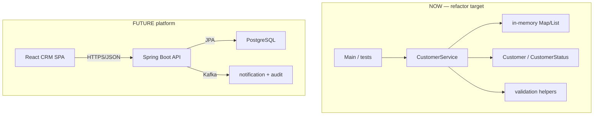
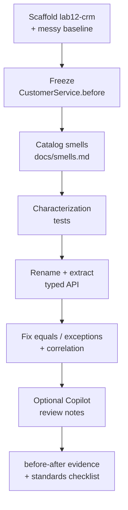

# Lab 12: Coding Standards and Refactoring — Northstar CRM Cleanup

**Module:** 12 — Java Coding Standards and Best Practices  
**Lab folder:** `labs/Week 2 - Backend, AI Tools and Testing/module-12/lab12/`  
**Difficulty:** Intermediate  
**Duration:** 3–4 Hours

**Primary IDE:** IntelliJ IDEA Community Edition · **Optional IDE:** VS Code

| OS | How-to for this lab |
| -- | ------------------- |
| Windows | [LAB-12-WINDOWS.md](LAB-12-WINDOWS.md) |
| macOS | [LAB-12-MACOS.md](LAB-12-MACOS.md) |

> **Environment reminder:** Finish [Lab 0](../../../Week%201%20-%20Java%20and%20JVM%20Foundations/module-00/lab0/LAB-0-GUIDE.md). Use **IntelliJ IDEA Community** (primary; optional VS Code) on your laptop with **JDK 21**, **Maven 3.9+**, and **GitHub Copilot** signed in. Work under `~/java-bootcamp` (Windows: `%USERPROFILE%\java-bootcamp`).

---

## How to follow this lab

1. Open the **Windows** or **macOS** how-to (links above) in a second tab.
2. Create/work only under your `java-bootcamp/examples/…` folder from the steps (not inside this `labs/` git clone unless a step says otherwise).
3. For each **Step N**: read **Why** (if present) → do the actions → confirm **Expected** / **Expected result** → then continue.
4. When stuck, use **Failure Experiments** / troubleshooting in this guide before asking for help.
5. Capture evidence under `notes/screenshots/` (redact secrets). Use the **Pass criteria** tables — write **Pass** or **Fail** in your notes. GitHub file view does not support clickable checkboxes.

## Lab Overview

This Module 12 lab improves a **deliberately poor** CRM `CustomerService` using Northstar coding standards: smell detection, renaming, method extraction, and SOLID-inspired cleanup. Optional GitHub Copilot suggestions are welcome **only** with written human review—the same discipline Labs 10–11 introduced.

**Purpose.** Readable services are a prerequisite for Lab 13 SOAP contracts and later Spring/JPA work. Messy code hides identity bugs (`==` on strings), silent `null` returns, and “magic” update paths that support cannot explain. Lab 12 forces a measurable before → after improvement with evidence.

**What you build (exercise).** Scaffold `lab12-crm` with a messy baseline (`doStuff`), freeze `CustomerService.before.java.txt`, catalog ≥8 smells, add characterization tests, refactor to a clean API (`createCustomer` / `getCustomer` / `updateStatus`), fix equality/exceptions/correlation logging, optionally review one Copilot suggestion, and ship a before/after evidence pack.

**What success looks like.** Under `~/java-bootcamp/examples/lab12-crm/` you run green tests for `CUS-1001` / `CUS-1002`, unknown/duplicate IDs throw clearly, no `doStuff` remains, and docs map each smell to a fix.

**Depends on Lab 0 + Maven habits.** Prefer copying from Lab 11 (entities + test deps already present). If packages/Maven fail, fix earlier labs / [SETUP](../../../SETUP-INSTRUCTIONS.md) first.

**CRM connection.** Same sample customers and correlation ID `lab-request-001`. Persistence stays **in-memory**; React, Kafka, and PostgreSQL remain future. No Spring required to compile.

---

## Learning Objectives

After completing this lab, you will be able to:

* Identify common code smells in a CRM service (long method, unclear names, duplicated validation, stringly types, `==` bugs)
* Refactor toward single-responsibility methods and clearer naming
* Apply coding standards consistent with Lab 8’s `CODING-STANDARDS.md`
* Improve readability without changing documented business behavior (create / get / update status / reject blanks & duplicates)
* Use optional Copilot assists with mandatory human review notes
* Capture before/after evidence (diff, line counts, narrative, test output)
* Explain which SOLID ideas you applied and which you deferred

---

## Business Scenario

A previous sprint left `CustomerService` in a state no senior engineer would merge: a long method named `doStuff`, stringly-typed statuses, duplicated null checks, `System.out` “logging” mixed with rules, and a magic `"UPDATE"` branch. Support already struggles to explain why Amina Khan (`CUS-1001`) sometimes cannot be looked up after a failed create. Your lead freezes new features until the class is refactored against Northstar standards.

You keep intended behavior: create customer, get by ID, update status (`PROSPECT` → `ACTIVE`, etc.), reject blanks/duplicates. Correlation ID `lab-request-001` should appear in a simple log/note helper after refactor—not as print spaghetti.

Use these examples consistently:

| ID | Name | Status | Email |
| -- | ---- | ------ | ----- |
| `CUS-1001` | Amina Khan | `ACTIVE` | `amina.khan@example.com` |
| `CUS-1002` | Ravi Singh | `PROSPECT` | `ravi.singh@example.com` |

* Correlation ID: `lab-request-001`
* Review entries: `lab12-001`, `lab12-002`, …

**Security note for evidence.** Keep sample emails only. No GitHub credentialss, tokens, or real PII in logs or docs.

---

## Architecture Context

### NOW vs LATER

**NOW:** Plain Java Maven CRM service with in-memory storage. Refactor inside the service (and small helpers). No Spring MVC, no JPA, no Kafka.

**LATER:** Spring Boot API, PostgreSQL, React, Kafka.



### Lab flow (mermaid)



### Architecture NOW vs LATER (table)

| Aspect | Lab 12 (NOW) | Later CRM labs |
| ------ | ------------ | -------------- |
| Focus | Smell removal + readable API | Contracts, persistence, Spring |
| Storage | In-memory | JPA/PostgreSQL |
| Errors | Exceptions (not null) | Problem details / HTTP mapping |
| Logging | Correlation in messages/notes | Structured observability |

**Lab focus:** smell detection, naming, method refactoring, readability, optional Copilot-with-review, before/after evidence.

---

## Prerequisites

Complete [SETUP](../../../SETUP-INSTRUCTIONS.md) and [Lab 0](../../../Week%201%20-%20Java%20and%20JVM%20Foundations/module-00/lab0/LAB-0-GUIDE.md). Confirm:

* JDK 21 + Maven + Git
* Familiarity with Lab 8 standards and Labs 10–11 review habits (helpful)
* Prefer starting from Lab 11 tree (JUnit already on test scope)
* GitHub Copilot optional
* No secrets committed to Git

### Pre-flight

```bash
java -version
mvn -version
git --version
pwd
ls ~/java-bootcamp/examples
```

Fix environment failures before changing application code. Record tool versions in evidence if asked.

---

## Suggested Project Files

```text
~/java-bootcamp/examples/lab12-crm/
├── src/
│   ├── main/java/com/northstar/crm/
│   │   ├── Main.java
│   │   ├── entity/
│   │   │   ├── Customer.java
│   │   │   └── CustomerStatus.java
│   │   ├── service/
│   │   │   ├── CustomerService.java              (start messy → end clean)
│   │   │   └── CustomerService.before.java.txt   (frozen snapshot — not compiled)
│   │   ├── support/
│   │   │   └── CorrelationContext.java           (optional)
│   │   └── exception/                            (optional: CustomerNotFoundException)
│   └── test/java/com/northstar/crm/service/
│       └── CustomerServiceTest.java
├── docs/
│   ├── smells.md
│   ├── before-after.md
│   ├── CODING-STANDARDS-check.md
│   └── ai-review-notes.md                        (if Copilot used)
├── notes/screenshots/
├── pom.xml
├── .gitignore
└── README.md
```

Ignore `target/`, IDE metadata, and local env files. The `.before.java.txt` suffix keeps the snapshot out of `javac` compilation.

---

## Concepts to Discuss

Write 2–3 sentences each in `notes/lab12-answers.md` or `docs/before-after.md`:

1. Main data flow after refactor (create / get / update status)
2. Trust boundary and where validation lives after cleanup
3. Success/failure contract (duplicate ID, unknown ID, blank name)
4. Stable identity (`CUS-1001`) vs mutable fields (status, email)
5. Retry/idempotency implications for `create` vs `get`
6. Local in-memory shortcut vs production persistence
7. Logs/evidence for support (`lab-request-001`)
8. Two JVM instances = independent memory (conflict risk)
9. Which SOLID ideas fit this lab’s size, and which are deferred?
10. Why freezing a before snapshot matters more than “I rewrote it cleanly”?

---

## Implementation Steps

Complete each step in order. Commands assume `~/java-bootcamp/examples/lab12-crm` (Windows: `%USERPROFILE%\java-bootcamp\examples\lab12-crm`) unless noted.

---

### Step 1 — Scaffold `lab12-crm` and freeze the messy baseline

**Why:** Without a frozen before snapshot, graders cannot tell refactor from rewrite. The messy class is the teaching artifact.

**Do this:**

```bash
cd ~/java-bootcamp/examples
# Preferred: copy Lab 11 (entities + JUnit already present)
cp -r lab11-crm lab12-crm
cd lab12-crm
mkdir -p docs notes/screenshots
```

If Lab 11 is unavailable, create a fresh Maven JDK 21 project with Lab 10-shaped `Customer` / `CustomerStatus` and JUnit test scope.

Replace `CustomerService` with this **intentionally poor** baseline (adapt if your `Customer` constructors differ—raw setters are fine here):

```java
package com.northstar.crm.service;

import com.northstar.crm.entity.Customer;
import com.northstar.crm.entity.CustomerStatus;
import java.time.LocalDateTime;
import java.util.ArrayList;
import java.util.List;

/** INTENTIONALLY MESSY — refactor in later steps. Do not submit this style. */
public class CustomerService {
    List data = new ArrayList();

    public Object doStuff(String a, String b, String c, String d, String e) {
        // a=id b=name c=email d=phone e=status-as-string
        if (a == null || a == "" || b == null || b == "") {
            System.out.println("bad");
            return null;
        }
        for (int i = 0; i < data.size(); i++) {
            Customer x = (Customer) data.get(i);
            if (x.getCustomerId().equals(a)) {
                System.out.println("dup");
                return null;
            }
        }
        Customer x = new Customer();
        x.setCustomerId(a);
        x.setFullName(b);
        x.setEmail(c);
        x.setPhone(d);
        if (e != null && e.equals("ACTIVE")) x.setStatus(CustomerStatus.ACTIVE);
        else if (e != null && e.equals("PROSPECT")) x.setStatus(CustomerStatus.PROSPECT);
        else if (e != null && e.equals("SUSPENDED")) x.setStatus(CustomerStatus.SUSPENDED);
        else if (e != null && e.equals("CLOSED")) x.setStatus(CustomerStatus.CLOSED);
        else x.setStatus(CustomerStatus.PROSPECT);
        x.setCreatedAt(LocalDateTime.now());
        data.add(x);
        System.out.println("ok " + a);
        // also update path jammed in:
        if (b != null && b.contains("UPDATE")) {
            for (int i = 0; i < data.size(); i++) {
                Customer y = (Customer) data.get(i);
                if (y.getCustomerId().equals(a)) {
                    if (e != null && e.equals("ACTIVE")) y.setStatus(CustomerStatus.ACTIVE);
                    else if (e != null && e.equals("PROSPECT")) y.setStatus(CustomerStatus.PROSPECT);
                    System.out.println("upd");
                }
            }
        }
        return x;
    }

    public Object get(String id) {
        for (int i = 0; i < data.size(); i++) {
            Customer x = (Customer) data.get(i);
            if (x.getCustomerId() == id) { // BUG: == on strings
                return x;
            }
        }
        return null;
    }
}
```

Freeze immediately:

```bash
cp src/main/java/com/northstar/crm/service/CustomerService.java \
   src/main/java/com/northstar/crm/service/CustomerService.before.java.txt
```

**Expected result:** Messy service present; `.before.java.txt` frozen; project still on JDK 21 Maven layout.

**If it fails:** Missing entities → restore from Lab 10/11. Snapshot accidentally named `.java` → Maven may try to compile two classes; keep `.txt` suffix.

---

### Step 2 — Catalog code smells

**Why:** Refactoring without naming smells becomes random rewriting. Each smell must tie to impact on support for `CUS-1001`.

**Do this:** Create `docs/smells.md` with **≥8** smells and file/line (or snippet) rationale. Include at least:

| Smell | Example in baseline |
| ----- | ------------------- |
| Poor naming | `doStuff`, `data`, `a/b/c` |
| Raw types | `List data` |
| Long method / mixed responsibilities | create + update jammed together |
| Stringly-typed status | `e.equals("ACTIVE")` chains |
| Incorrect equality | `==` for String IDs |
| Null as control flow | return `null` on errors |
| Side-effect logging | `System.out.println` |
| Magic behavior | name containing `"UPDATE"` triggers update |

**Expected result:** Every smell explains impact (e.g. `get` fails for interned/`new String` IDs; support cannot find Amina).

**If it fails:** Vague “code smells bad” without CRM impact → rewrite with `CUS-1001` scenarios.

---

### Step 3 — Add characterization / target-API tests

**Why:** Tests lock intended post-refactor behavior and document bugs you will fix (null returns, `==`).

**Do this:** Write `CustomerServiceTest` against the **target** API (will fail until Steps 4–5 finish—record that in `docs/before-after.md`):

```java
package com.northstar.crm.service;

import com.northstar.crm.entity.Customer;
import com.northstar.crm.entity.CustomerStatus;
import org.junit.jupiter.api.Test;
import static org.junit.jupiter.api.Assertions.*;

class CustomerServiceTest {

    @Test
    void createAminaKhanThenGetById() {
        CustomerService svc = new CustomerService();
        Customer created = svc.createCustomer(
                "CUS-1001", "Amina Khan", "amina.khan@example.com", null, CustomerStatus.ACTIVE);
        assertEquals("CUS-1001", created.getCustomerId());
        assertEquals(CustomerStatus.ACTIVE, created.getStatus());
        assertEquals("Amina Khan", svc.getCustomer("CUS-1001").getFullName());
    }

    @Test
    void duplicateIdRejected() {
        CustomerService svc = new CustomerService();
        svc.createCustomer("CUS-1002", "Ravi Singh", "ravi.singh@example.com", null, CustomerStatus.PROSPECT);
        assertThrows(IllegalStateException.class, () ->
                svc.createCustomer("CUS-1002", "Other", "x@example.com", null, CustomerStatus.PROSPECT));
    }

    @Test
    void unknownCustomerFailsClearly() {
        CustomerService svc = new CustomerService();
        assertThrows(IllegalArgumentException.class, () -> svc.getCustomer("CUS-9999"));
    }
}
```

Optionally add `updateStatus` and blank-ID tests. Ensure JUnit is `test` scope in `pom.xml` (from Lab 9/11).

**Expected result:** Test names document CRM scenarios; early red runs recorded briefly in before-after notes.

**If it fails:** No JUnit → copy test deps from Lab 11. Temporary adapters from `doStuff` are allowed then deleted—document if used.

---

### Step 4 — Refactor naming and method boundaries

**Why:** Intention-revealing APIs are how Lab 13+ will call this domain. Magic branches and raw lists do not survive enterprise review.

**Do this:** Replace the messy API with:

```java
private final Map<String, Customer> customersById = new HashMap<>();

public Customer createCustomer(String customerId, String fullName, String email,
                               String phone, CustomerStatus status) { ... }

public Customer getCustomer(String customerId) { ... }

public Customer updateStatus(String customerId, CustomerStatus newStatus) { ... }
```

Extract helpers such as:

```java
private void requireNonBlank(String value, String fieldName) { ... }
private void requireUniqueId(String customerId) { ... }
private Customer requireExisting(String customerId) { ... }
```

Remove the `"UPDATE"` magic branch—status changes go only through `updateStatus`. Prefer typed `CustomerStatus` at the API (no string status parameter on public methods).

**Expected result:** No `doStuff`; typed `Map` (or clear `List` + helpers); status updates explicit.

**If it fails:** Behavior drift → re-run tests after each small extract. Reject Copilot “upsert on duplicate” unless you document a deliberate contract change (not required).

---

### Step 5 — Fix equality, exceptions, and correlation logging

**Why:** The baseline’s `==` on IDs is a real production-class bug. Null returns force NPEs in callers; exceptions carry correlation for support.

**Do this:**

* Use `equals` / `Objects.equals` for IDs—never `==` for String content.
* Throw `IllegalArgumentException` / `IllegalStateException` (or `CustomerNotFoundException`) instead of returning `null` for errors.
* Include correlation ID `lab-request-001` (parameter, simple field, or tiny `CorrelationContext` helper).

```java
public Customer getCustomer(String customerId) {
    Customer found = customersById.get(customerId);
    if (found == null) {
        throw new IllegalArgumentException(
                "Customer not found: " + customerId + " correlationId=" + correlationId());
    }
    return found;
}
```

Update `Main` to demo create `CUS-1001` / `CUS-1002`, get, updateStatus, and a caught duplicate/unknown failure.

**Expected result:** `getCustomer("CUS-1001")` works after create; unknown ID throws with correlation info when set.

**If it fails:** Forgot to put customers in the `Map` by ID → fix `createCustomer`. Correlation helper optional—message string is enough.

---

### Step 6 — Optional Copilot pass with human review

**Why:** Copilot may speed extracts but can reintroduce Spring/JPA or silent upserts. Review notes keep Lab 10–11 discipline alive.

**Do this:** If Copilot is available, ask for one extract-method or rename. Record `docs/ai-review-notes.md` entry `lab12-001`:

* Prompt used
* Suggestion summary
* Accept / reject / accept-with-edits
* One risk caught (e.g. phantom Spring annotations, silent upsert)

If Copilot is unavailable, write a short note explaining a **manual** refactor choice instead—still required for documentation marks.

**Expected result:** At least one dated review entry with a human verdict sentence.

**If it fails:** Empty “used Copilot” claim without verdict → incomplete. Accept-without-edit of framework imports → reject and document.

---

### Step 7 — Run tests and capture before/after evidence

**Why:** Rubric marks evidence packaging, not only a green last command.

**Do this:**

```bash
mvn -q clean test
wc -l src/main/java/com/northstar/crm/service/CustomerService.java \
      src/main/java/com/northstar/crm/service/CustomerService.before.java.txt
git diff --stat
```

Write `docs/before-after.md` with:

1. Smell → fix mapping table (link to `smells.md`)
2. Method list before vs after
3. Test output excerpt (`BUILD SUCCESS`, tests run)
4. Manual demo transcript for `CUS-1001` / `CUS-1002`

**Expected result:** Tests green; before-after doc maps smells to concrete fixes.

**If it fails:** Missing snapshot → restore from git history or re-copy messy code into `.before.java.txt` from your notes (ideally avoid).

---

### Step 8 — Standards compliance self-check

**Why:** Closes the loop with Lab 8 standards language before SOAP (Lab 13).

**Do this:** Create `docs/CODING-STANDARDS-check.md`:

_Mark each row **Pass** or **Fail** in your lab notes (GitHub markdown files are not interactive checklists)._

| # | Confirm | Your notes |
| - | ------- | ---------- |
| 1 | Meaningful type and method names | Pass / Fail |
| 2 | No raw types in new code | Pass / Fail |
| 3 | Validation in clear helpers | Pass / Fail |
| 4 | Exceptions instead of null for errors | Pass / Fail |
| 5 | No production secrets / no PII beyond lab sample emails | Pass / Fail |
| 6 | Service still compiles without Spring/JPA/Kafka | Pass / Fail |

```bash
mvn -B verify
```

**Expected result:** Checklist completed with pass/fail notes; verify succeeds.

**If it fails:** Fix remaining raw types / `doStuff` leftovers before claiming done.

---

### Step 9 — Failure experiments + evidence pack

**Why:** Prove validation and duplicate/unknown paths intentionally.

**Do this:** Complete [Failure Experiments](#failure-experiments). Capture screenshots/logs under `notes/screenshots/`. Finalize README run instructions.

**Expected result:** ≥3 experiments documented; evidence pack complete; `git status` clean of secrets/`target/`.

**If it fails:** See Troubleshooting.

---

## Implementation Checkpoints

### Checkpoint A — Baseline frozen

_Mark each row **Pass** or **Fail** in your lab notes (GitHub markdown files are not interactive checklists)._

| # | Confirm | Your notes |
| - | ------- | ---------- |
| 1 | `lab12-crm` under `~/java-bootcamp/examples/` | Pass / Fail |
| 2 | Messy `CustomerService` + `CustomerService.before.java.txt` | Pass / Fail |
| 3 | `docs/smells.md` has ≥8 smells with CRM impact | Pass / Fail |

### Checkpoint B — Refactored API

_Mark each row **Pass** or **Fail** in your lab notes (GitHub markdown files are not interactive checklists)._

| # | Confirm | Your notes |
| - | ------- | ---------- |
| 1 | `createCustomer` / `getCustomer` / `updateStatus` present | Pass / Fail |
| 2 | No `doStuff`, no `"UPDATE"` magic branch | Pass / Fail |
| 3 | Typed store (`Map<String, Customer>` preferred) | Pass / Fail |
| 4 | `equals` used for IDs; exceptions replace null errors | Pass / Fail |

### Checkpoint C — Tests + demos

_Mark each row **Pass** or **Fail** in your lab notes (GitHub markdown files are not interactive checklists)._

| # | Confirm | Your notes |
| - | ------- | ---------- |
| 1 | `CustomerServiceTest` green for create/get, duplicate, unknown | Pass / Fail |
| 2 | Manual/`Main` demo for sample customers | Pass / Fail |
| 3 | Correlation ID appears in at least one failure/log path | Pass / Fail |

### Checkpoint D — Evidence + standards

_Mark each row **Pass** or **Fail** in your lab notes (GitHub markdown files are not interactive checklists)._

| # | Confirm | Your notes |
| - | ------- | ---------- |
| 1 | `docs/before-after.md` complete | Pass / Fail |
| 2 | AI review note or manual substitute | Pass / Fail |
| 3 | Standards checklist done; `mvn -B verify` green | Pass / Fail |
| 4 | Failure experiments recorded | Pass / Fail |

---

## Reference Commands, Configuration, and Code

### Target API shape

```java
Customer createCustomer(String customerId, String fullName, String email,
                        String phone, CustomerStatus status);
Customer getCustomer(String customerId);
Customer updateStatus(String customerId, CustomerStatus newStatus);
```

### Evidence commands

```bash
cd ~/java-bootcamp/examples/lab12-crm
mvn -B clean test
mvn -B verify
wc -l src/main/java/com/northstar/crm/service/CustomerService.java \
      src/main/java/com/northstar/crm/service/CustomerService.before.java.txt
git diff --stat
```

### Manual demo

```text
create CUS-1001 Amina Khan ACTIVE
create CUS-1002 Ravi Singh PROSPECT
get CUS-1001 -> Amina Khan
updateStatus CUS-1002 ACTIVE
duplicate CUS-1001 -> IllegalStateException
unknown CUS-9999 -> IllegalArgumentException (+ correlationId)
```

### Class map

| Artifact | Role |
| -------- | ---- |
| `CustomerService.before.java.txt` | Frozen messy baseline |
| `CustomerService.java` | Refactored implementation |
| `docs/smells.md` | Smell catalog |
| `docs/before-after.md` | Evidence narrative |
| `CustomerServiceTest` | Behavior lock |

---

## Manual Verification

1. Primary CRM workflow succeeds for `CUS-1001` / `CUS-1002`.
2. Invalid input rejected with exceptions (not null).
3. Duplicate ID fails clearly (`IllegalStateException`).
4. Unknown ID fails clearly with correlation context when configured.
5. No `doStuff` / raw `List data` / `"UPDATE"` magic remain.
6. Before snapshot + before-after + smells docs exist.
7. Restart clears in-memory data (understood and documented).
8. Second JVM does not share memory (documented).
9. No secrets in commits; `target/` ignored.
10. `mvn -B verify` passes.

---

## Failure Experiments

| # | Experiment | Observe | Restore |
| - | ---------- | ------- | ------- |
| 1 | Break entity import; compile | Compile error | Restore import |
| 2 | Blank `customerId` create | Validation in helper throws | Keep helper |
| 3 | Create `CUS-1001` twice | Second fails clearly | Keep duplicate detection |
| 4 | Lookup ID with `new String("CUS-1001")` after create | Works with `equals`/Map keying; would fail under old `==` | Keep fixed equality |
| 5 | Reintroduce `"UPDATE"` briefly | Undocumented behavior risk | Remove again; note in evidence |

---

## Troubleshooting

| Symptom | Likely cause | Fix |
| ------- | ------------ | --- |
| Two `CustomerService` compile errors | Before file named `.java` | Use `.before.java.txt` |
| Tests call `doStuff` | Forgot API rename | Update tests to target API |
| `get` still flaky | Still using `==` or List scan bugs | Use `Map` + `equals` |
| Duplicate not detected | Not keyed by ID | `put`/`containsKey` on `customerId` |
| Copilot adds Spring | Pattern match | Reject; document in ai-review-notes |
| IDE red after renames | Stale index | Reimport Maven / Reload Window |
| Verify fails | Missing Surefire/JUnit | Copy Lab 11 test plugin/deps |

### Cannot connect

No remote app services in this lab. Maven download issues → [SETUP](../../../SETUP-INSTRUCTIONS.md).

### Flaky tests

Fresh `CustomerService` per test; no static shared lists.

---

## Security and Production Review

Answer in project README:

1. Which inputs are untrusted (customer fields from callers)?
2. Where are authn/authz/validation enforced after refactor (service helpers—auth still absent)?
3. Which values are sensitive, and where stored (none beyond samples)?
4. What can be retried safely (`get`; `create` is not silently idempotent)?
5. What happens after partial failure (exceptions; no half-written silent null)?
6. What would an operator monitor later (correlation ID, error rates)?
7. Which local default is unacceptable in production (in-memory; `System.out` logging)?
8. How are contracts versioned later (Lab 13+ WSDL/OpenAPI; stable method names help)?

---

## Cleanup

```bash
cd ~/java-bootcamp/examples/lab12-crm
mvn clean
git status
```

Keep `CustomerService.before.java.txt` and docs evidence. Remove temporary credentials from the environment where practical.

**Keep `lab12-crm`**—Lab 13 designs SOAP contracts against a readable domain.

---

## Expected Deliverables

* Refactored `CustomerService` with clear methods and typed storage
* Frozen before snapshot and `docs/smells.md` + `docs/before-after.md`
* Passing `CustomerServiceTest` (or equivalent)
* AI review notes or explicit manual-review substitute
* Standards checklist + controlled-failure evidence
* Architecture note: in-memory NOW vs React/Kafka/PostgreSQL LATER
* README run/cleanup + short SOLID applied/deferred decisions
* No secrets or generated dependency directories committed

---

## Evaluation Rubric (100 Marks)

| Criteria | Marks |
| -------- | ----: |
| Environment and project structure | 10 |
| Core implementation (refactor quality) | 30 |
| Integration/configuration correctness | 15 |
| Failure handling (exceptions, duplicates) | 15 |
| Automated verification | 10 |
| Security and production awareness | 10 |
| Documentation and evidence (before/after) | 10 |

**Notes:** Missing before snapshot → documentation deductions even if after code is clean. Copilot without review verdict → incomplete docs marks. Behavior + clarity beat speculative “enterprise” frameworks.

---

## Reflection Questions

Write 3–6 sentence answers:

1. Which design decision most affected correctness?
2. Which smell was hardest to justify removing?
3. What evidence proves the refactor preserves intended behavior?
4. What breaks first at ten times method length if smells return?
5. Which concern should move to shared infrastructure (logging, IDs)?
6. What must change before real customer data is used?
7. How does this lab connect to Labs 8–11 standards and Lab 13 contracts?
8. What metric, log field, or support clue matters most after refactor?
9. (Forward look) Which deferred SOLID step (e.g. repository DIP) comes next—and why not today?

---

## Bonus Challenges

1. Add structured correlation IDs on every public method without sensitive fields.
2. Add a Checkstyle/Spotless config sketch matching Lab 8 standards.
3. Extract a `CustomerRepository` interface with an in-memory impl.
4. Note cyclomatic complexity of the worst before method vs after.
5. Document rollback if a refactor had to be reverted mid-review.
6. Parameterized tests for blank-field validation matrix.

---

## Success Criteria

You are finished when:

* You can demonstrate smell catalog, refactored service, tests, and before/after evidence
* Happy path and failure paths (duplicate/unknown/blank) are repeatable
* Another student can follow your README
* Tests/build pass (`mvn -B verify`)
* No production secret is hard-coded
* You can explain in-memory trade-offs vs future persistence
* You can name one SOLID improvement applied and one deferred on purpose

---

## Instructor Notes

* **Assess reasoning:** Equivalent clean structures are OK when behavior and clarity improve and evidence is complete.
* **Anti-pattern:** Rewrite-from-scratch with no before snapshot → deduct documentation. Ask students to walk `CUS-1001` create/get and name one deferred SOLID step (e.g. full repository DIP).
* **Copilot:** Use without review notes should not earn full documentation credit.
* **Continuity:** Keep packages `com.northstar.crm.*` and sample IDs for Lab 13. Prefer `examples/lab12-crm` path.
* **Common pitfalls:** Leaving `==` bugs; returning null; keeping `"UPDATE"`; compiling the before file; accepting silent upserts from AI.
* **Timing:** 3–4 hours. Smell catalog and evidence writing are graded—budget time beyond coding.

---

*End of Lab 12 — Coding Standards and Refactoring: Northstar CRM Cleanup. Keep `lab12-crm` and the before/after pack for Lab 13 and portfolio evidence.*
