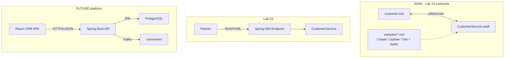
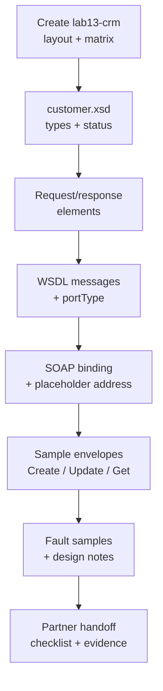

# Lab 13: SOAP API Design — Northstar Customer Contract (Contract-First)

**Module:** 13 — SOAP API Design with Java  
**Lab folder:** `labs/Week 2 - Backend, AI Tools and Testing/module-13/lab13/`  
**Difficulty:** Intermediate  
**Duration:** 3–4 Hours

**Primary IDE:** IntelliJ IDEA Community Edition · **Optional IDE:** VS Code

| OS | How-to for this lab |
| -- | ------------------- |
| Windows | [LAB-13-WINDOWS.md](LAB-13-WINDOWS.md) |
| macOS | [LAB-13-MACOS.md](LAB-13-MACOS.md) |

> **Environment reminder:** Finish [Lab 0](../../../Week%201%20-%20Java%20and%20JVM%20Foundations/module-00/lab0/LAB-0-GUIDE.md). Use **IntelliJ IDEA Community** (primary; optional VS Code) on your laptop with **JDK 21** and **Maven 3.9+**. Work under `~/java-bootcamp` (Windows: `%USERPROFILE%\java-bootcamp`).

---

## How to follow this lab

1. Open the **Windows** or **macOS** how-to (links above) in a second tab.
2. Create/work only under your `java-bootcamp/examples/…` folder from the steps (not inside this `labs/` git clone unless a step says otherwise).
3. For each **Step N**: read **Why** (if present) → do the actions → confirm **Expected** / **Expected result** → then continue.
4. When stuck, use **Failure Experiments** / troubleshooting in this guide before asking for help.
5. Capture evidence under `notes/screenshots/lab-13/` (workspace root under `java-bootcamp`; redact secrets). Use the **Pass criteria** tables — write **Pass** or **Fail** in your notes. GitHub file view does not support clickable checkboxes.

## Lab Overview

This Module 13 lab designs a **contract-first** SOAP interface for the Northstar Customer Management Platform: an XML Schema (`customer.xsd`), a WSDL (`CustomerService.wsdl`), and sample SOAP 1.1 request/response envelopes for **CreateCustomer**, **UpdateCustomer**, and **GetCustomer**.

**Purpose.** Partners integrate to published contracts, not to Java method signatures. Before Lab 24 spends time on Spring-WS, architects must freeze what XML is legal, which operations exist, and what faults mean. Contract drift later becomes expensive partner breakage.

**What you build (exercise).** Project `lab13-crm` with `contracts/customer.xsd`, `contracts/CustomerService.wsdl`, `samples/` envelopes (success + faults), and docs (`operation-matrix.md`, `soap-design-notes.md`). Namespace `http://northstar.com/crm/customer`. Samples use `CUS-1001` / `CUS-1002` and correlation `lab-request-001`.

**What success looks like.** Under `~/java-bootcamp/examples/lab13-crm/` a partner (or grader) can open the WSDL, understand three operations, copy sample envelopes into SoapUI, and see that `http://localhost:8080/ws` is a **placeholder**—not a live server in this lab.

**Depends on prior CRM domain thinking.** You do not need Lab 12 code on the classpath; you need the shared identity/status vocabulary. If XML tooling fails, fix editor extensions via [SETUP](../../../SETUP-INSTRUCTIONS.md).

**CRM connection.** Same customers and statuses as Labs 10–12. Runtime hosting, React, Kafka, and PostgreSQL remain future. Treat Lab 24 as the first implementation of *this* contract against `CustomerService`.

---

## Learning Objectives

After completing this lab, you will be able to:

* Explain contract-first SOAP design and why XSD/WSDL precede Java implementation
* Author an XSD for CRM customer types and request/response element pairs
* Author a WSDL 1.1 document that references the XSD
* Define operations CreateCustomer, UpdateCustomer, and GetCustomer
* Write sample SOAP request/response envelopes aligned with schema intent
* Document SOAP fault shapes for not-found and validation failures
* Trace how Lab 24 will host this contract with Spring-WS without rewriting business rules
* Distinguish design artifacts from running HTTP endpoints

---

## Business Scenario

Northstar’s CRM domain can create Amina Khan (`CUS-1001`, `ACTIVE`) and look up Ravi Singh (`CUS-1002`, `PROSPECT`). A regional billing partner still integrates only via SOAP/XML. Before engineers spend time on Spring-WS (Lab 24), architects must publish a stable contract.

Your job is to produce `customer.xsd`, `CustomerService.wsdl`, and a `samples/` folder a partner could use in SoapUI tomorrow—even though Northstar’s server does not speak SOAP yet.

Use these examples consistently:

| Item | Value |
| ---- | ----- |
| `CUS-1001` | Amina Khan — `ACTIVE` — `amina.khan@example.com` |
| `CUS-1002` | Ravi Singh — `PROSPECT` — `ravi.singh@example.com` |
| Correlation ID | `lab-request-001` |
| Namespace | `http://northstar.com/crm/customer` |
| Timestamps | ISO-8601 (e.g. `2026-07-14T17:00:00Z`) |
| Placeholder endpoint | `http://localhost:8080/ws` (not live in Lab 13) |

**Security note for evidence.** Keep sample emails fictional. No GitHub credentialss, tokens, or real PII in contracts or samples.

---

## Architecture Context

### NOW / SOON / LATER

**NOW:** Contract documents + sample envelopes only. No Spring-WS, no servlet, no generated JAXB required for marks (optional validation tooling welcome).

**SOON (Lab 24):** Spring-WS endpoint implements this contract against `CustomerService`.

**LATER:** React SPA + REST, JPA/PostgreSQL, Kafka.



### Lab flow (mermaid)



### Architecture NOW vs LATER (table)

| Aspect | Lab 13 (NOW) | Lab 24 / later |
| ------ | ------------ | -------------- |
| Deliverable | XSD + WSDL + samples | Live SOAP endpoint |
| Validation | Schema + docs | Schema + service rules + faults |
| Auth | None (document future WS-Security) | WS-Security / gateway later |
| Transport URL | Placeholder `localhost` | Real hosted `/ws` |

**Lab focus:** XSD + WSDL + sample envelopes for CreateCustomer, UpdateCustomer, GetCustomer — design only.

---

## Prerequisites

Complete [SETUP](../../../SETUP-INSTRUCTIONS.md) and [Lab 0](../../../Week%201%20-%20Java%20and%20JVM%20Foundations/module-00/lab0/LAB-0-GUIDE.md). Confirm:

* JDK 21 available (Maven optional—contracts can be docs-only)
* Editor support for WSDL/XSD (VS Code XML extension recommended)
* Familiarity with CRM domain IDs/statuses from Labs 10–12
* No secrets committed to Git

### Pre-flight

```bash
java -version
git --version
# optional:
mvn -version
xmllint --version   # if installed
pwd
ls ~/java-bootcamp/examples
```

Fix environment failures before changing files. Record tool versions in evidence if asked.

---

## Suggested Project Files

```text
~/java-bootcamp/examples/lab13-crm/
├── contracts/
│   ├── customer.xsd
│   └── CustomerService.wsdl
├── samples/
│   ├── createCustomerRequest.xml
│   ├── createCustomerResponse.xml
│   ├── updateCustomerRequest.xml
│   ├── updateCustomerResponse.xml
│   ├── getCustomerRequest.xml
│   ├── getCustomerResponse.xml
│   ├── fault-customerNotFound.xml
│   └── fault-validation.xml
├── docs/
│   ├── soap-design-notes.md
│   └── operation-matrix.md
├── notes/screenshots/
├── pom.xml                    (optional — packaging contracts only)
├── .gitignore
└── README.md
```

Ignore IDE metadata and any accidental early JAXB `target/` output from Lab 24 experiments.

---

## Concepts to Discuss

Write 2–3 sentences each in `docs/soap-design-notes.md` before or during authoring:

1. Main data flow (partner → SOAP contract → future endpoint → `CustomerService`)
2. Trust boundary: schema validation vs service business rules
3. Success/failure contract for GetCustomer unknown IDs
4. Stable identity (`CUS-1001`) vs display fields
5. Retry/idempotency: Create vs Get vs Update semantics
6. Static WSDL files vs generating WSDL only at runtime
7. Correlation header/field for support (`lab-request-001`)
8. Two instances serving the same WSDL version—what must stay identical?
9. Why document/literal over RPC/encoded for this lab?
10. What must **not** change between Lab 13 and Lab 24 without a version bump?

---

## Implementation Steps

Complete each step in order. Commands assume `~/java-bootcamp/examples/lab13-crm` (Windows: `%USERPROFILE%\java-bootcamp\examples\lab13-crm`) unless noted.

---

### Step 1 — Create the contract project layout

**Why:** Partners receive a predictable folder layout. An operation matrix forces scope discipline before XML proliferates.

**Do this:**

```bash
mkdir -p ~/java-bootcamp/examples/lab13-crm/contracts \
  ~/java-bootcamp/examples/lab13-crm/samples \
  ~/java-bootcamp/examples/lab13-crm/docs \
  ~/java-bootcamp/notes/screenshots/lab-13
cd ~/java-bootcamp/examples/lab13-crm
```

Write `docs/operation-matrix.md`:

| Operation | Purpose | Key inputs | Key outputs |
| --------- | ------- | ---------- | ----------- |
| CreateCustomer | Register a new CRM customer | fullName, email, phone?, status? | customer (with ID) |
| UpdateCustomer | Change mutable fields / status | customerId, optional fields | customer |
| GetCustomer | Fetch one customer by ID | customerId | customer |

**Expected result:** Tree exists; matrix defines only the three required operations (Delete/List out of scope unless documented as future).

**If it fails:** Wrong path under `examples/` → recreate dirs. Do not start Spring Boot projects “to host SOAP early.”

---

### Step 2 — Author `customer.xsd` types and CustomerStatus

**Why:** Shared types (`CustomerType`, status enum) keep WSDL and samples consistent with Java domain from Labs 10–12.

**Do this:** Create `contracts/customer.xsd`:

```xml
<?xml version="1.0" encoding="UTF-8"?>
<xs:schema xmlns:xs="http://www.w3.org/2001/XMLSchema"
           xmlns:tns="http://northstar.com/crm/customer"
           targetNamespace="http://northstar.com/crm/customer"
           elementFormDefault="qualified">

  <xs:simpleType name="CustomerStatus">
    <xs:restriction base="xs:string">
      <xs:enumeration value="PROSPECT"/>
      <xs:enumeration value="ACTIVE"/>
      <xs:enumeration value="SUSPENDED"/>
      <xs:enumeration value="CLOSED"/>
    </xs:restriction>
  </xs:simpleType>

  <xs:complexType name="CustomerType">
    <xs:sequence>
      <xs:element name="customerId" type="xs:string"/>
      <xs:element name="fullName" type="xs:string"/>
      <xs:element name="email" type="xs:string"/>
      <xs:element name="phone" type="xs:string" minOccurs="0"/>
      <xs:element name="status" type="tns:CustomerStatus"/>
      <xs:element name="createdAt" type="xs:dateTime"/>
    </xs:sequence>
  </xs:complexType>

  <!-- request/response elements added in Step 3 -->
</xs:schema>
```

**Expected result:** Well-formed XML; statuses match Java enum vocabulary from Labs 10–12.

**If it fails:** Unclosed tags → fix in editor outline. Wrong namespace string → copy exactly `http://northstar.com/crm/customer`.

---

### Step 3 — Add Create / Update / Get request and response elements

**Why:** Global elements become WSDL message parts. Optional `correlationId` supports support traces without full WS-Addressing yet.

**Do this:** Append to `customer.xsd`:

```xml
  <xs:element name="createCustomerRequest">
    <xs:complexType>
      <xs:sequence>
        <xs:element name="fullName" type="xs:string"/>
        <xs:element name="email" type="xs:string"/>
        <xs:element name="phone" type="xs:string" minOccurs="0"/>
        <xs:element name="status" type="tns:CustomerStatus" minOccurs="0"/>
        <xs:element name="correlationId" type="xs:string" minOccurs="0"/>
      </xs:sequence>
    </xs:complexType>
  </xs:element>
  <xs:element name="createCustomerResponse">
    <xs:complexType>
      <xs:sequence>
        <xs:element name="customer" type="tns:CustomerType"/>
      </xs:sequence>
    </xs:complexType>
  </xs:element>

  <xs:element name="updateCustomerRequest">
    <xs:complexType>
      <xs:sequence>
        <xs:element name="customerId" type="xs:string"/>
        <xs:element name="fullName" type="xs:string" minOccurs="0"/>
        <xs:element name="email" type="xs:string" minOccurs="0"/>
        <xs:element name="phone" type="xs:string" minOccurs="0"/>
        <xs:element name="status" type="tns:CustomerStatus" minOccurs="0"/>
        <xs:element name="correlationId" type="xs:string" minOccurs="0"/>
      </xs:sequence>
    </xs:complexType>
  </xs:element>
  <xs:element name="updateCustomerResponse">
    <xs:complexType>
      <xs:sequence>
        <xs:element name="customer" type="tns:CustomerType"/>
      </xs:sequence>
    </xs:complexType>
  </xs:element>

  <xs:element name="getCustomerRequest">
    <xs:complexType>
      <xs:sequence>
        <xs:element name="customerId" type="xs:string"/>
        <xs:element name="correlationId" type="xs:string" minOccurs="0"/>
      </xs:sequence>
    </xs:complexType>
  </xs:element>
  <xs:element name="getCustomerResponse">
    <xs:complexType>
      <xs:sequence>
        <xs:element name="customer" type="tns:CustomerType"/>
      </xs:sequence>
    </xs:complexType>
  </xs:element>
```

**Expected result:** Six global elements (3 request + 3 response); optional correlation supports `lab-request-001`.

**If it fails:** Element names must match WSDL `element="tns:..."` references in Step 4 exactly (case-sensitive).

---

### Step 4 — Author WSDL messages and portType

**Why:** WSDL abstracts operations partners call. Message parts must reference XSD elements, not invent parallel types.

**Do this:** Create `contracts/CustomerService.wsdl`:

```xml
<?xml version="1.0" encoding="UTF-8"?>
<definitions name="CustomerService"
             targetNamespace="http://northstar.com/crm/customer"
             xmlns="http://schemas.xmlsoap.org/wsdl/"
             xmlns:soap="http://schemas.xmlsoap.org/wsdl/soap/"
             xmlns:tns="http://northstar.com/crm/customer"
             xmlns:xsd="http://www.w3.org/2001/XMLSchema">

  <types>
    <xsd:schema>
      <xsd:import namespace="http://northstar.com/crm/customer"
                  schemaLocation="customer.xsd"/>
    </xsd:schema>
  </types>

  <message name="CreateCustomerRequestMessage">
    <part name="body" element="tns:createCustomerRequest"/>
  </message>
  <message name="CreateCustomerResponseMessage">
    <part name="body" element="tns:createCustomerResponse"/>
  </message>
  <message name="UpdateCustomerRequestMessage">
    <part name="body" element="tns:updateCustomerRequest"/>
  </message>
  <message name="UpdateCustomerResponseMessage">
    <part name="body" element="tns:updateCustomerResponse"/>
  </message>
  <message name="GetCustomerRequestMessage">
    <part name="body" element="tns:getCustomerRequest"/>
  </message>
  <message name="GetCustomerResponseMessage">
    <part name="body" element="tns:getCustomerResponse"/>
  </message>

  <portType name="CustomerPortType">
    <operation name="CreateCustomer">
      <input message="tns:CreateCustomerRequestMessage"/>
      <output message="tns:CreateCustomerResponseMessage"/>
    </operation>
    <operation name="UpdateCustomer">
      <input message="tns:UpdateCustomerRequestMessage"/>
      <output message="tns:UpdateCustomerResponseMessage"/>
    </operation>
    <operation name="GetCustomer">
      <input message="tns:GetCustomerRequestMessage"/>
      <output message="tns:GetCustomerResponseMessage"/>
    </operation>
  </portType>

  <!-- binding + service in Step 5 -->
</definitions>
```

**Expected result:** portType lists CreateCustomer, UpdateCustomer, GetCustomer with input/output messages.

**If it fails:** Broken `schemaLocation` → keep XSD beside WSDL in `contracts/`. Wrong `element=` QName → align with XSD local names.

---

### Step 5 — Add SOAP binding and service endpoint placeholder

**Why:** document/literal + soapAction give partners a concrete wire style. The address is intentional scaffolding for Lab 24—not a promise of a live port today.

**Do this:** Complete the WSDL:

```xml
  <binding name="CustomerSoapBinding" type="tns:CustomerPortType">
    <soap:binding transport="http://schemas.xmlsoap.org/soap/http" style="document"/>
    <operation name="CreateCustomer">
      <soap:operation soapAction="http://northstar.com/crm/customer/CreateCustomer"/>
      <input><soap:body use="literal"/></input>
      <output><soap:body use="literal"/></output>
    </operation>
    <operation name="UpdateCustomer">
      <soap:operation soapAction="http://northstar.com/crm/customer/UpdateCustomer"/>
      <input><soap:body use="literal"/></input>
      <output><soap:body use="literal"/></output>
    </operation>
    <operation name="GetCustomer">
      <soap:operation soapAction="http://northstar.com/crm/customer/GetCustomer"/>
      <input><soap:body use="literal"/></input>
      <output><soap:body use="literal"/></output>
    </operation>
  </binding>

  <service name="CustomerService">
    <port name="CustomerSoapPort" binding="tns:CustomerSoapBinding">
      <!-- Placeholder only — Lab 24 hosts a real URL under /ws -->
      <soap:address location="http://localhost:8080/ws"/>
    </port>
  </service>
</definitions>
```

**Expected result:** Complete WSDL (types, messages, portType, binding, service); README states address is non-live.

**If it fails:** Missing closing `</definitions>` → well-formedness fails. Do not start Tomcat “to make the URL work” in Lab 13.

---

### Step 6 — Write sample CreateCustomer envelopes

**Why:** Samples are how partners prove they understood the contract without reading every schema annotation.

**Do this:** `samples/createCustomerRequest.xml`:

```xml
<?xml version="1.0" encoding="UTF-8"?>
<soapenv:Envelope xmlns:soapenv="http://schemas.xmlsoap.org/soap/envelope/"
                  xmlns:cus="http://northstar.com/crm/customer">
  <soapenv:Header/>
  <soapenv:Body>
    <cus:createCustomerRequest>
      <cus:fullName>Amina Khan</cus:fullName>
      <cus:email>amina.khan@example.com</cus:email>
      <cus:phone>+1-555-0101</cus:phone>
      <cus:status>ACTIVE</cus:status>
      <cus:correlationId>lab-request-001</cus:correlationId>
    </cus:createCustomerRequest>
  </soapenv:Body>
</soapenv:Envelope>
```

`samples/createCustomerResponse.xml`:

```xml
<?xml version="1.0" encoding="UTF-8"?>
<soapenv:Envelope xmlns:soapenv="http://schemas.xmlsoap.org/soap/envelope/"
                  xmlns:cus="http://northstar.com/crm/customer">
  <soapenv:Body>
    <cus:createCustomerResponse>
      <cus:customer>
        <cus:customerId>CUS-1001</cus:customerId>
        <cus:fullName>Amina Khan</cus:fullName>
        <cus:email>amina.khan@example.com</cus:email>
        <cus:phone>+1-555-0101</cus:phone>
        <cus:status>ACTIVE</cus:status>
        <cus:createdAt>2026-07-14T17:00:00Z</cus:createdAt>
      </cus:customer>
    </cus:createCustomerResponse>
  </soapenv:Body>
</soapenv:Envelope>
```

**Expected result:** Samples use CUS-1001 / Amina / ACTIVE and `lab-request-001`; namespaces match targetNamespace.

**If it fails:** Missing `xmlns:cus` or wrong URI → elements won’t match schema intent. Prefer `CUS-` prefixes as in other labs.

---

### Step 7 — Write UpdateCustomer, GetCustomer samples, and faults

**Why:** Faults are part of the contract. Partners must know Client vs Server meaning and correlation in error text.

**Do this:**

GetCustomer request for `CUS-1002` (`samples/getCustomerRequest.xml` inside Envelope/Body):

```xml
<cus:getCustomerRequest>
  <cus:customerId>CUS-1002</cus:customerId>
  <cus:correlationId>lab-request-001</cus:correlationId>
</cus:getCustomerRequest>
```

Add matching `getCustomerResponse.xml` with Ravi / PROSPECT fields.

UpdateCustomer elevating Ravi to ACTIVE (`updateCustomerRequest.xml` + response with full `CustomerType`).

**Fault — not found** (`fault-customerNotFound.xml`):

```xml
<?xml version="1.0" encoding="UTF-8"?>
<soapenv:Envelope xmlns:soapenv="http://schemas.xmlsoap.org/soap/envelope/">
  <soapenv:Body>
    <soapenv:Fault>
      <faultcode>soapenv:Client</faultcode>
      <faultstring>Customer not found: CUS-9999 (correlationId=lab-request-001)</faultstring>
      <detail>
        <errorCode>CUSTOMER_NOT_FOUND</errorCode>
      </detail>
    </soapenv:Fault>
  </soapenv:Body>
</soapenv:Envelope>
```

**Fault — validation** (`fault-validation.xml`): blank `fullName` message including `lab-request-001`.

In `docs/soap-design-notes.md`, state that Lab 24 maps these ideas to Spring-WS faults—do **not** implement endpoints now. Cross-walk UpdateCustomer ↔ Lab 12 `updateStatus` briefly.

**Expected result:** Samples cover all three operations + ≥2 faults; README says no Spring-WS server in Lab 13.

**If it fails:** Incomplete Envelope wrappers → fix structure. Do not invent WS-Security headers as required for this lab.

---

### Step 8 — Partner handoff checklist and well-formedness

**Why:** A partner must use your pack tomorrow without Slack access to you.

**Do this:** Complete README checklist:

_Mark each row **Pass** or **Fail** in your lab notes (GitHub markdown files are not interactive checklists)._

| # | Confirm | Your notes |
| - | ------- | ---------- |
| 1 | Namespace URI published | Pass / Fail |
| 2 | WSDL location placeholder documented | Pass / Fail |
| 3 | Three operations named and described | Pass / Fail |
| 4 | Sample success envelopes for CUS-1001 / CUS-1002 | Pass / Fail |
| 5 | Fault examples for not-found and validation | Pass / Fail |
| 6 | Correlation ID convention (`lab-request-001` style) | Pass / Fail |
| 7 | Explicit note: implementation arrives in Lab 24 | Pass / Fail |
| 8 | Optional: screenshot of VS Code XSD/WSDL outline | Pass / Fail |

```bash
# if xmllint is installed
xmllint --noout contracts/customer.xsd
xmllint --noout contracts/CustomerService.wsdl
ls -R contracts samples docs
```

**Expected result:** Checklist complete; contracts well-formed; no `@Endpoint` classes required or graded.

**If it fails:** `xmllint` missing → IDE well-formedness / XML extension problems panel is acceptable; document the tool used.

---

### Step 9 — Failure experiments + design notes finalize

**Why:** Contract authors must know import breakage and idempotency implications before Lab 24.

**Do this:** Complete [Failure Experiments](#failure-experiments). Finish `docs/soap-design-notes.md` (retry semantics, Lab 24 forward link, security deferrals). Capture evidence under `notes/screenshots/lab-13/`.

**Expected result:** ≥3 experiments recorded; pack ready for partner handoff.

**If it fails:** See Troubleshooting.

---

## Implementation Checkpoints

### Checkpoint A — Layout + XSD core

_Mark each row **Pass** or **Fail** in your lab notes (GitHub markdown files are not interactive checklists)._

| # | Confirm | Your notes |
| - | ------- | ---------- |
| 1 | `lab13-crm` under `examples/` with contracts/samples/docs | Pass / Fail |
| 2 | `operation-matrix.md` lists three operations | Pass / Fail |
| 3 | `customer.xsd` has CustomerStatus + CustomerType | Pass / Fail |

### Checkpoint B — Full contract

_Mark each row **Pass** or **Fail** in your lab notes (GitHub markdown files are not interactive checklists)._

| # | Confirm | Your notes |
| - | ------- | ---------- |
| 1 | Six request/response elements present | Pass / Fail |
| 2 | WSDL messages + portType for Create/Update/Get | Pass / Fail |
| 3 | document/literal binding + placeholder `localhost:8080/ws` | Pass / Fail |

### Checkpoint C — Samples + faults

_Mark each row **Pass** or **Fail** in your lab notes (GitHub markdown files are not interactive checklists)._

| # | Confirm | Your notes |
| - | ------- | ---------- |
| 1 | Create/Update/Get success samples with correct namespaces | Pass / Fail |
| 2 | CUS-1001 / CUS-1002 / lab-request-001 used consistently | Pass / Fail |
| 3 | Not-found + validation fault samples present | Pass / Fail |

### Checkpoint D — Handoff + experiments

_Mark each row **Pass** or **Fail** in your lab notes (GitHub markdown files are not interactive checklists)._

| # | Confirm | Your notes |
| - | ------- | ---------- |
| 1 | README checklist complete; Lab 24 note explicit | Pass / Fail |
| 2 | Well-formedness evidence captured | Pass / Fail |
| 3 | Failure experiments documented | Pass / Fail |
| 4 | No secrets; no running SOAP server claimed | Pass / Fail |

---

## Reference Commands, Configuration, and Code

### Namespace and operations

```text
Namespace: http://northstar.com/crm/customer
Operations: CreateCustomer, UpdateCustomer, GetCustomer
Style: document/literal
Transport placeholder: http://localhost:8080/ws
```

### Minimal GetCustomer body

```xml
<cus:getCustomerRequest xmlns:cus="http://northstar.com/crm/customer">
  <cus:customerId>CUS-1001</cus:customerId>
  <cus:correlationId>lab-request-001</cus:correlationId>
</cus:getCustomerRequest>
```

### Lab 24 forward reference

```text
Lab 24 implements Spring-WS @Endpoint methods against this contract.
Do not add MessageDispatcherServlet or JAXB generation requirements in Lab 13.
```

### Artifact map

| Artifact | Role |
| -------- | ---- |
| `customer.xsd` | Types + message payloads |
| `CustomerService.wsdl` | Operations, binding, placeholder address |
| `samples/*.xml` | Partner-facing examples |
| `operation-matrix.md` | Scope table |
| `soap-design-notes.md` | Semantics, retry, Lab 24 link |

---

## Manual Verification

1. Create/get/update workflows represented in XML samples.
2. Fault samples cover not-found and validation.
3. Broken `schemaLocation` experiment recorded (and restored).
4. Identifiers and correlation remain visible in samples.
5. No server required; contracts are static files.
6. No secrets in Git.
7. Second student can open WSDL without your IDE settings.
8. Optional `xmllint` / IDE validation passes well-formedness.
9. README states Lab 24 implements runtime SOAP.
10. Namespace string matches Lab 24 continuity (`http://northstar.com/crm/customer`).

---

## Failure Experiments

| # | Experiment | Observe | Restore / conclude |
| - | ---------- | ------- | ------------------ |
| 1 | Rename/break `schemaLocation` temporarily | Unresolved schema warning in IDE | Restore path |
| 2 | Invalid empty `customerId` get sample | Well-formed XML ≠ valid business input | Document future service rejection |
| 3 | Compare Create vs Get retry safety | Create risks duplicates; Get is safe read | Capture in design notes |
| 4 | Time how long to find soapAction in WSDL | Usability note for partners | Keep soapActions consistent |
| 5 | HTTP GET placeholder URL (optional) | Connection refused expected | Do not treat as lab failure |

---

## Troubleshooting

| Symptom | Likely cause | Fix |
| ------- | ------------ | --- |
| Connection refused to `:8080/ws` | No server in Lab 13 | Expected; implement in Lab 24 |
| WSDL cannot find XSD | Wrong relative `schemaLocation` | Keep both files in `contracts/` |
| Sample “invalid” visually | Namespace/prefix mismatch | Align `xmlns:cus` with targetNamespace |
| Full envelope XSD validation hard | Tools need wrapper schemas | Document limits; insist well-formedness |
| Duplicate ops in WSDL | Copy-paste error | One CreateCustomer only |
| Added Spring Boot by accident | Scope creep | Remove; Lab 13 is contracts only |

### Configuration ignored

Confirm prefixes in samples match `xmlns:cus="http://northstar.com/crm/customer"`.

### Flaky validation

Different XML tools disagree on partial SOAP validation—grade well-formed contracts + coherent samples.

---

## Security and Production Review

Answer in README:

1. Which SOAP inputs are untrusted (body/header fields)?
2. Where will authn/authz/validation be enforced (schema + future WS-Security / service rules)?
3. Which values are sensitive—keep samples fictional?
4. What can be retried safely (Get yes; Create only with idempotency design)?
5. What happens after failure (Fault response; no half-written customer in samples)?
6. What would ops monitor later (fault rates, latency)?
7. Which local default is unacceptable in production (`http://` placeholder, no auth)?
8. How are contracts versioned (namespace / WSDL version strategy)?

---

## Cleanup

```bash
cd ~/java-bootcamp/examples/lab13-crm
git status
# remove accidental early JAXB/generated sources if any
```

No Docker stack. Keep contracts and samples. **Keep `lab13-crm`**—Lab 24 implements it.

---

## Expected Deliverables

* `contracts/customer.xsd` and `contracts/CustomerService.wsdl`
* Sample SOAP envelopes for CreateCustomer, UpdateCustomer, GetCustomer
* Fault samples (not-found + validation)
* `docs/operation-matrix.md` and `docs/soap-design-notes.md`
* Partner handoff checklist in README
* Controlled-failure evidence (broken schemaLocation)
* Architecture note: contracts NOW vs Spring-WS Lab 24 vs React/Kafka/PostgreSQL LATER
* Design decisions (document/literal, correlation placement)
* No secrets; no requirement to commit a running SOAP server

---

## Evaluation Rubric (100 Marks)

| Criteria | Marks |
| -------- | ----: |
| Environment and project structure | 10 |
| Core implementation (XSD, WSDL, samples) | 30 |
| Integration/configuration correctness (namespaces, binding) | 15 |
| Failure handling (fault samples, broken import experiment) | 15 |
| Automated/manual verification (well-formedness, checklist) | 10 |
| Security and production awareness | 10 |
| Documentation and evidence | 10 |

**Notes:** Do **not** require Spring-WS, JAXB generation, or a listening port. Extra ops (Delete/List) only OK if the required three remain correct. XML local-name casing may vary if WSDL operations and samples stay coherent.

---

## Reflection Questions

Write 3–6 sentence answers in design notes:

1. Which design decision most affected partner usability?
2. Which failure was hardest to diagnose (namespace vs element name)?
3. What evidence proves the contract is implementable in Lab 24?
4. What breaks first at ten times the field count without versioning?
5. Which concern should move to shared infrastructure (WSDL hosting, WS-Security)?
6. What must change before real customer data is used?
7. How does this lab connect to Labs 8–12 domain work and Lab 24 SOAP hosting?
8. What metric or log field matters most once the endpoint is live?
9. (Forward look) If REST arrives later, what from this SOAP contract should stay conceptually identical?

---

## Bonus Challenges

1. Add a SOAP header element for correlation instead of (or in addition to) body field.
2. Sketch a v2 namespace (`.../customer/v2`) without breaking v1 samples.
3. Generate a one-page partner onboarding markdown from your samples.
4. Cross-walk UpdateCustomer fields to Lab 12 `updateStatus` in a table.
5. Document rollback if a breaking XSD change shipped to a partner early.
6. Optional SoapUI project file importing the WSDL (still no live endpoint required).

---

## Success Criteria

You are finished when:

* You can demonstrate XSD types, WSDL operations Create/Update/Get, and sample envelopes
* Happy-path samples and at least one fault sample are reviewable
* Another student can follow your handoff checklist without a live server
* XML is well-formed; optional validators pass
* No production secret is hard-coded
* You can explain contract-first design versus Lab 24 implementation trade-offs
* You explicitly did **not** claim a running SOAP server for Lab 13 marks

---

## Instructor Notes

* **Scope gate:** No Spring-WS, JAXB generation requirement, or listening port in Lab 13—those are Lab 24. Penalize “I started Boot to make SoapUI happy” as scope creep unless clearly labeled optional exploration.
* **Assess:** Open GetCustomer for `CUS-1002` and ask how a Client fault for `CUS-9999` should look; confirm namespace continuity for Lab 24.
* **Equivalence:** Local XML element casing may differ if operations, imports, and samples stay consistent.
* **Extras:** Accept Delete/List only when the required three remain correct and documented.
* **Continuity:** Prefer `~/java-bootcamp/examples/lab13-crm`. Keep `http://northstar.com/crm/customer`.
* **Common pitfalls:** Broken relative `schemaLocation`; RPC/encoded instead of document/literal; missing faults; treating connection refused as a lab defect; secrets in samples.
* **Timing:** 3–4 hours. Sample envelopes and handoff checklist are graded as heavily as the WSDL skeleton.

---

*End of Lab 13 — SOAP API Design: Northstar Customer Contract. Keep `lab13-crm` contracts for Lab 24 and portfolio evidence.*
